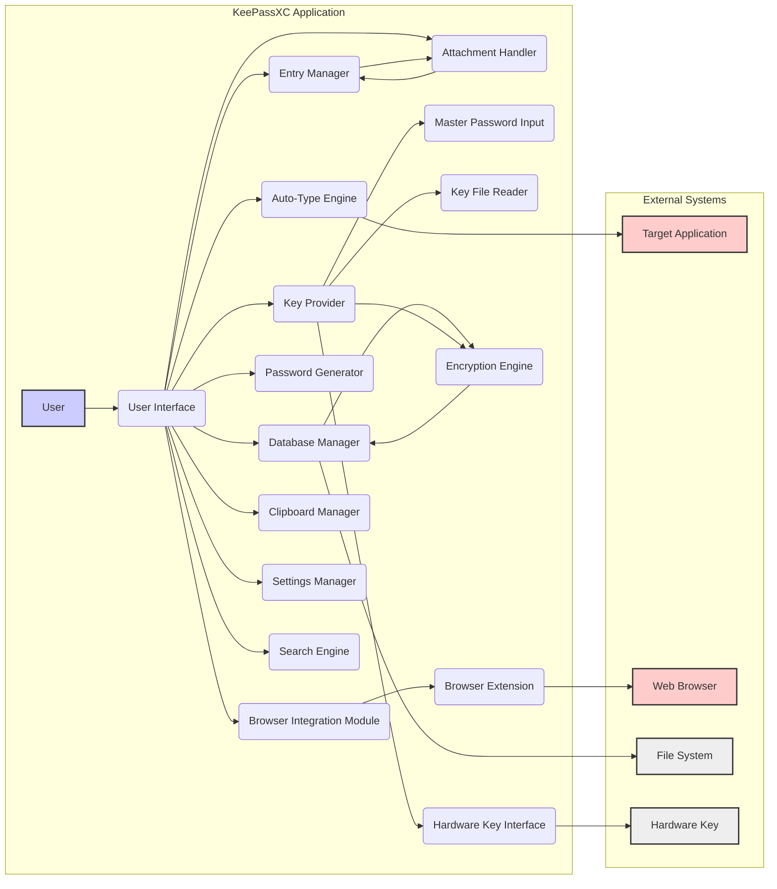

# Project Design Document: KeePassXC

**Version:** 1.1
**Date:** October 26, 2023
**Prepared By:** AI Software Architect

## 1. Introduction

This document provides an enhanced and more detailed design overview of the KeePassXC project, a free, open-source, cross-platform password manager. This revised document is specifically tailored to serve as a robust foundation for subsequent threat modeling activities. It meticulously outlines the key components, data flows, and interactions within the application, providing a deeper understanding of its internal workings.

### 1.1. Purpose

The primary purpose of this document is to furnish a comprehensive and granular architectural understanding of KeePassXC to facilitate highly effective threat modeling. It aims to precisely define the system's boundaries, internal components, and their intricate interactions, empowering security professionals to identify potential vulnerabilities, attack vectors, and areas of security concern with greater accuracy.

### 1.2. Scope

This document comprehensively covers the core functionalities and architecture of the KeePassXC desktop application. It includes detailed aspects related to database management, user interface interactions, the intricacies of auto-type functionality, the secure mechanisms of browser integration, and the critical processes of key management. While it avoids delving into extremely low-level implementation details of specific algorithms, it provides sufficient detail where such information is crucial for understanding the overall architecture and its security implications.

### 1.3. Target Audience

This document is primarily intended for:

* Security engineers and architects directly involved in performing threat modeling and security assessments of KeePassXC.
* Developers actively contributing to the KeePassXC project who require a detailed, high-level understanding of the system architecture and its security-relevant aspects.
* Security researchers and analysts seeking an in-depth understanding of the internal workings of KeePassXC for vulnerability analysis.
* Anyone requiring a thorough technical understanding of KeePassXC's architecture.

## 2. System Overview

KeePassXC is a robust desktop application meticulously designed to securely store and manage a wide range of user credentials and other sensitive information. It employs strong, industry-standard encryption algorithms to protect the confidentiality and integrity of the stored data. The application offers a rich set of features for organizing entries, generating cryptographically strong passwords, and automatically and securely filling in login credentials in other applications and web browsers. It handles sensitive information like usernames, passwords, URLs, notes, and custom fields.

### 2.1. Key Features

* **Database Management:** Secure creation, opening, saving, and merging of encrypted password databases (KDBX format).
* **Entry Management:** Comprehensive functionalities for adding, editing, deleting, organizing, and searching password entries with support for custom fields and attachments.
* **Password Generation:**  Generation of highly secure, random passwords based on customizable user-defined criteria, including length, character sets, and special characters.
* **Auto-Type:** Secure and configurable automatic typing of usernames and passwords into other desktop applications based on window matching.
* **Browser Integration:**  Securely filling in login credentials on websites through dedicated browser extensions, utilizing a secure communication channel.
* **Key File Support:**  Option to use key files in addition to or instead of a master password for enhancing database encryption security.
* **YubiKey/Hardware Key Integration:**  Robust support for hardware security keys (e.g., YubiKey) for multi-factor authentication and enhanced master key protection.
* **Clipboard Handling:** Secure copying of credentials to the clipboard with an automatic clearing mechanism after a configurable timeout.
* **Password History:**  Tracking and management of historical changes to password entries for auditing and recovery purposes.
* **Customizable Interface:**  Extensive options for customizing the application's appearance, behavior, and security settings.
* **Cross-Platform Compatibility:**  Native application available and fully functional on Windows, macOS, and Linux operating systems.
* **Attachment Handling:** Securely storing file attachments within password entries, encrypted within the database.

## 3. System Architecture

KeePassXC's architecture is modular and well-defined, consisting of several key components that interact cohesively to deliver the application's comprehensive functionality.

### 3.1. Components

* **User Interface (UI):**
    * The primary point of interaction for the user, responsible for rendering information and capturing user input.
    * Built using the Qt framework, ensuring a consistent and native user experience across different operating systems.
    * Comprises various windows and dialogs for database management, entry editing, application settings, and other functionalities.
* **Database Manager:**
    * Core component responsible for all operations related to the password database file (KDBX).
    * Handles loading, saving, merging, and managing the integrity of the encrypted database file.
    * Maintains the in-memory representation of the decrypted database structure and its entries.
* **Encryption Engine:**
    * The central component responsible for all cryptographic operations within the application.
    * Implements strong encryption algorithms (e.g., AES-256, ChaCha20) for database encryption.
    * Utilizes robust key derivation functions (e.g., Argon2id, PBKDF2) to derive the encryption key from the master key.
    * Manages the master key lifecycle, including its derivation and secure storage in memory.
* **Entry Manager:**
    * Provides functionalities for managing individual password entries within the database.
    * Handles the creation, editing, deletion, searching, and organization of password entries and their associated data (usernames, passwords, URLs, notes, custom fields, attachments).
* **Auto-Type Engine:**
    * Implements the auto-type functionality, enabling the automatic and secure entry of credentials into other applications.
    * Relies on sophisticated window title matching algorithms and secure keyboard input simulation techniques.
    * Includes features to mitigate risks associated with typing credentials into unintended applications.
* **Browser Integration Module:**
    * Facilitates secure communication and data exchange with KeePassXC browser extensions.
    * Employs a native messaging protocol to establish a secure channel with browser extensions.
    * Handles requests from browser extensions to retrieve credentials for specific websites based on URL matching.
* **Password Generator:**
    * Generates cryptographically strong, random passwords based on user-defined criteria and entropy considerations.
    * Offers various customization options for password complexity and character sets.
* **Key Provider:**
    * Manages the acquisition, verification, and secure handling of the master key.
    * Handles user input for the master password, reading and validating key files, and interacting with hardware security keys.
    * Derives the final master key used for database encryption and decryption.
* **Clipboard Manager:**
    * Responsible for securely copying credentials to the system clipboard when requested by the user.
    * Implements an automatic clipboard clearing mechanism after a configurable timeout to prevent accidental exposure of sensitive data.
* **Settings Manager:**
    * Manages application-wide settings and user preferences, including security settings, interface customizations, and behavior options.
    * Persists configuration data securely.
* **Search Engine:**
    * Provides efficient searching capabilities within the password database based on various criteria (e.g., title, username, URL).
    * Operates on the decrypted in-memory representation of the database.
* **Attachment Handler:**
    * Manages the secure storage and retrieval of file attachments associated with password entries.
    * Ensures that attachments are encrypted along with the rest of the entry data.
* **Hardware Key Interface:**
    * Specifically handles communication with hardware security keys (e.g., YubiKey) using protocols like HID.
    * Manages the authentication and key derivation processes involving hardware keys.

### 3.2. Data Flow

The following diagram illustrates the detailed data flow within KeePassXC for critical operations, highlighting the movement of sensitive data:

**Detailed Data Flow Descriptions:**

* **Opening a Database:**
    * User provides master password to "Master Password Input" (H1), selects a key file for "Key File Reader" (H2), or interacts with "Hardware Key Interface" (H3).
    * "Key Provider" (H) receives and validates these credentials.
    * "Key Provider" derives the master key using configured key derivation function.
    * "Database Manager" (C) attempts to load the database file from the "File System" (O).
    * "Encryption Engine" (K) uses the derived master key to decrypt the database content.
    * Decrypted database structure and entries are loaded into the "Database Manager" (C) and "Entry Manager" (D).
* **Accessing a Password Entry:**
    * User selects an entry in the "User Interface" (B).
    * "User Interface" requests the decrypted entry data from the "Entry Manager" (D).
    * "Entry Manager" retrieves the requested data from its in-memory store.
* **Auto-Typing Credentials:**
    * User initiates auto-type for a specific entry in the "User Interface" (B).
    * "Auto-Type Engine" (E) identifies the "Target Application" (M) window.
    * "Auto-Type Engine" securely simulates keyboard input of username and password into the "Target Application" (M).
* **Browser Integration:**
    * User interacts with the KeePassXC "Browser Extension" (L) within the "Web Browser" (N).
    * "Browser Extension" sends a request to the "Browser Integration Module" (F) via native messaging.
    * "Browser Integration Module" queries the "Entry Manager" (D) for matching credentials based on the website URL.
    * Retrieved credentials are sent back to the "Browser Extension" (L).
* **Saving the Database:**
    * User initiates a save operation in the "User Interface" (B).
    * "Database Manager" (C) retrieves the current state of the database from its in-memory representation and the "Entry Manager" (D).
    * "Encryption Engine" (K) encrypts the database content using the current master key.
    * "Database Manager" (C) writes the encrypted database to the "File System" (O).
* **Searching the Database:**
    * User enters search criteria in the "User Interface" (B).
    * "User Interface" passes the criteria to the "Search Engine" (P).
    * "Search Engine" searches the decrypted in-memory database managed by the "Entry Manager" (D).
    * Search results are returned to the "User Interface" (B).
* **Handling Attachments:**
    * When adding or editing an entry with an attachment, the "User Interface" (B) interacts with the "Attachment Handler" (Q).
    * "Attachment Handler" encrypts the attachment data and stores it within the entry data managed by the "Entry Manager" (D).
    * During database saving, the encrypted attachment data is persisted along with the rest of the entry.
    * When retrieving an attachment, the "Attachment Handler" decrypts the data before presenting it to the user.

### 3.3. Interactions

* **User - KeePassXC:**  The user interacts with the application primarily through the "User Interface" to perform all functionalities.
* **KeePassXC Components:**  Internal components communicate through well-defined function calls and data passing within the application's process.
* **KeePassXC - Browser Extension:** Secure communication occurs via the operating system's native messaging API, typically using JSON-based messages.
* **KeePassXC - Target Applications (Auto-Type):** Interaction is achieved through operating system-level APIs for window management (e.g., `FindWindow`) and keyboard input simulation (e.g., `SendInput`).
* **KeePassXC - Operating System:** The application interacts with the OS for file system access, clipboard operations, inter-process communication (for native messaging), and hardware device communication (HID).
* **KeePassXC - Hardware Key:** Communication with hardware keys occurs through specific device drivers and APIs provided by the operating system or libraries like `hidapi`.

## 4. Security Considerations

This section provides a detailed overview of the key security considerations embedded within KeePassXC's design, highlighting potential threats and mitigation strategies.

* **Database Encryption:**
    * **Algorithm Strength:** The password database is encrypted using robust and industry-vetted encryption algorithms such as AES-256 in CBC mode with a unique initialization vector per block, or ChaCha20 with Poly1305 for authenticated encryption.
    * **Key Derivation:** Strong key derivation functions like Argon2id with configurable parameters (memory cost, iterations, parallelism) or PBKDF2 with a high number of iterations are used to derive the encryption key from the master password, providing significant resistance against brute-force attacks and rainbow table attacks.
    * **Full Database Encryption:** The entire database, including entry data, metadata (titles, timestamps), and even custom field names, is encrypted, ensuring comprehensive data protection.
    * **Integrity Protection:** The KDBX format includes mechanisms to detect tampering and ensure the integrity of the encrypted database.
    * **Threats Mitigated:** Unauthorized access to sensitive data, data breaches, offline brute-force attacks on the database file.
* **Master Key Management:**
    * **Multiple Factors:** Users can enhance security by combining a strong master password with a key file and/or a hardware security key, implementing multi-factor authentication.
    * **Key File Security:** Key files can be stored securely offline, adding a physical security layer.
    * **Hardware Key Protection:** Integration with hardware security keys leverages the key's secure element, making it extremely difficult to extract the master key.
    * **Memory Handling:** The master key is handled carefully in memory, with attempts to prevent swapping to disk and clearing it from memory when no longer needed.
    * **Threats Mitigated:** Weak master passwords, keylogging, unauthorized access if the database file is compromised.
* **Memory Protection:**
    * **Sensitive Data Handling:** KeePassXC attempts to handle sensitive data (decrypted database, master key) in a way that minimizes the risk of exposure through memory dumps or other memory access vulnerabilities. This includes using secure memory allocation where available and clearing sensitive data promptly.
    * **Stack Smashing Protection:** Compiler-level protections are used to mitigate stack-based buffer overflows.
    * **Address Space Layout Randomization (ASLR):**  Leveraging OS-level ASLR to make memory addresses unpredictable, hindering exploitation of memory corruption vulnerabilities.
    * **Threats Mitigated:** Memory dumping attacks, cold boot attacks, exploitation of buffer overflows.
* **Auto-Type Security:**
    * **Window Association:** Auto-type relies on matching the target application's window title to ensure credentials are typed into the correct application. Advanced matching algorithms and options are available to improve accuracy and reduce the risk of typing into unintended windows.
    * **Keystroke Injection:** Secure operating system APIs are used for simulating keyboard input.
    * **Sequence Obfuscation:**  Options to randomize the typing speed and introduce delays can help mitigate keylogging risks during auto-type.
    * **Threats Mitigated:** Typing credentials into the wrong application, keylogging during auto-type.
* **Browser Integration Security:**
    * **Native Messaging Security:** The communication channel between KeePassXC and browser extensions uses the browser's native messaging API, which provides a more secure communication path compared to older methods.
    * **Origin Validation:**  KeePassXC validates the origin of messages from browser extensions to prevent malicious extensions from accessing credentials.
    * **Content Security Policy (CSP):** Browser extensions should adhere to CSP to mitigate cross-site scripting (XSS) attacks.
    * **Threats Mitigated:** Malicious browser extensions accessing credentials, eavesdropping on communication between KeePassXC and the browser.
* **Clipboard Security:**
    * **Automatic Clearing:** The automatic clipboard clearing mechanism reduces the window of opportunity for sensitive data to be exposed if the clipboard is compromised. The timeout for clearing is configurable.
    * **Threats Mitigated:** Accidental exposure of copied credentials, clipboard history vulnerabilities.
* **Protection Against Keyloggers:**
    * **Auto-Type as Mitigation:** While KeePassXC cannot directly prevent keyloggers, using auto-type reduces the need to manually type the master password and entry passwords, limiting the information a keylogger can capture.
* **Protection Against Brute-Force Attacks:**
    * **Strong Key Derivation:** The use of Argon2id or PBKDF2 with high iteration counts makes brute-forcing the master password computationally very expensive.
    * **Account Lockout (OS Dependent):**  Operating system features might provide some level of protection against repeated failed login attempts at the OS level.
    * **Threats Mitigated:** Brute-force attacks on the master password.

## 5. Deployment

KeePassXC is primarily deployed as a standalone desktop application on individual user machines. Different deployment scenarios have varying security implications.

* **Local Installation:** The most common deployment, where KeePassXC and the database file are stored locally on the user's computer. Security relies heavily on the security of the user's machine.
* **Database on Network Share:** Users might store their database on a network share for accessibility across multiple devices. This introduces risks related to the security of the network share and access controls.
* **Database in Cloud Storage:** Storing the database in cloud storage services (e.g., Dropbox, Google Drive) allows for synchronization but introduces risks related to the security and privacy policies of the cloud provider. Encryption by KeePassXC is crucial in this scenario.
* **Portable Version:** KeePassXC can be run from a USB drive, offering portability but requiring careful management of the USB drive's security.
* **Enterprise Deployment:** In enterprise environments, deployment might involve centralized configuration management and policies to enforce security standards.

## 6. Dependencies

KeePassXC relies on the following key external libraries and frameworks, which are potential points of vulnerability if not properly maintained:

* **Qt Framework (>= 5.15):** Provides the foundation for the user interface, cross-platform compatibility, and network communication.
* **libsodium (>= 1.0.18):** A modern cryptography library used for encryption, decryption, hashing, and other cryptographic operations.
* **zlib:** Used for data compression within the KDBX database format.
* **minizip:** A lightweight library for handling ZIP archives, used for attachment handling.
* **pugixml:** A lightweight XML processing library used for parsing the KDBX database structure.
* **hidapi:** A library for communicating with USB and Bluetooth HID devices, essential for hardware key support.
* **OpenSSL (Optional):** May be used for certain cryptographic operations depending on the build configuration.

## 7. Future Considerations

Potential future developments that could significantly impact the architecture and security landscape of KeePassXC include:

* **Built-in Secure Synchronization:** Implementing a secure and user-friendly built-in database synchronization mechanism across multiple devices, potentially using end-to-end encryption.
* **Enhanced Auto-Type Security:** Exploring more robust and context-aware auto-type mechanisms to further mitigate risks associated with typing credentials into unintended applications.
* **Improved Browser Integration Security:** Continuously enhancing the security of the browser integration module to address emerging threats and browser security changes.
* **Web Version or Mobile Applications:** Development of official web or mobile applications would introduce new architectural components and security challenges that would need careful consideration.
* **Formal Security Audits:** Regular independent security audits to identify and address potential vulnerabilities in the codebase.

This enhanced document provides a more detailed and comprehensive overview of the KeePassXC project's design, specifically tailored for effective threat modeling. The detailed descriptions of components, data flows, and security considerations should enable security professionals to conduct thorough analyses and identify potential areas of risk.