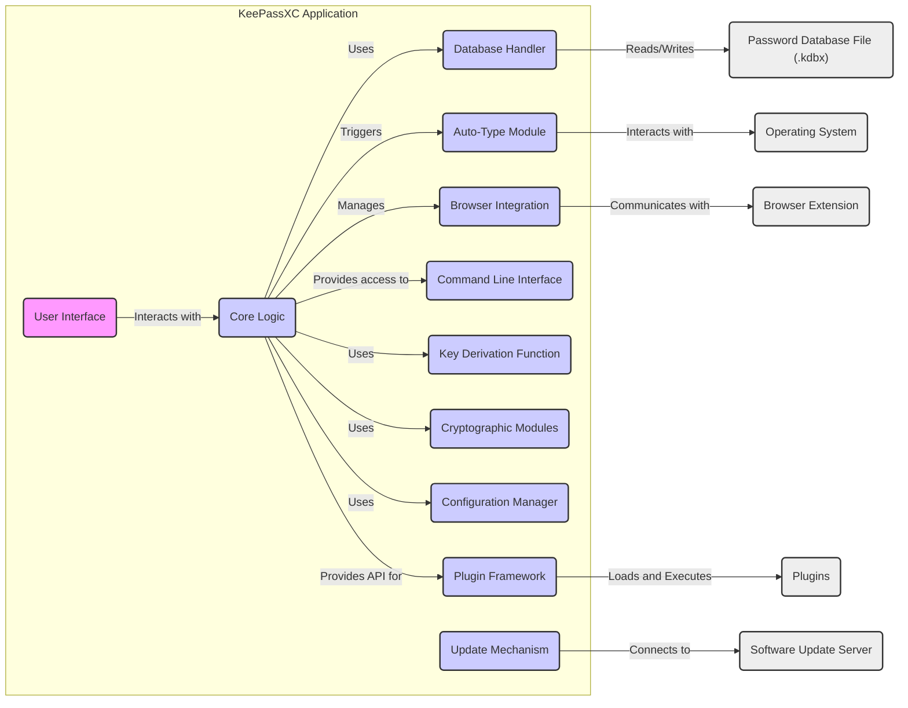

## Project Design Document: KeePassXC (Improved)

**1. Introduction**

This document provides a detailed architectural design of the KeePassXC password manager application, focusing on aspects relevant to security analysis and threat modeling. It elaborates on the key components, their interactions, and the flow of sensitive data within the system. This document serves as a comprehensive foundation for identifying potential vulnerabilities and designing effective security mitigations.

**2. Goals and Objectives**

The core goal of KeePassXC is to offer users a robust and user-friendly solution for managing sensitive credentials and information securely. Specific objectives include:

* **Robust Secure Storage:** Employing strong, industry-standard cryptographic algorithms to protect user credentials and database contents.
* **Intuitive User Experience:** Providing a clear and efficient graphical user interface for managing password databases, entries, and settings.
* **Cross-Platform Functionality:** Ensuring consistent operation and feature parity across major desktop operating systems (Windows, macOS, Linux).
* **Extensible Architecture:** Supporting the addition of new functionalities and integrations through a plugin framework.
* **Open Source Transparency and Auditability:** Maintaining a publicly accessible and auditable codebase to foster community trust and scrutiny.
* **Secure Data Handling:** Minimizing the exposure of sensitive data in memory and during processing.

**3. Target Audience**

This document is primarily intended for individuals and teams involved in the security assessment and development lifecycle of KeePassXC:

* Security Engineers and Architects: Conducting threat modeling, penetration testing, and security audits.
* Software Developers: Understanding the system architecture for secure development and maintenance.
* Quality Assurance Engineers: Designing and executing security-focused test cases.
* Technical Users and Security Researchers: Gaining a deeper understanding of the application's internal workings and security mechanisms.

**4. System Architecture**

KeePassXC features a modular design, allowing for clear separation of concerns. The key components and their interactions are detailed below:

* **User Interface (UI):**  The graphical front-end of the application, built using Qt framework. It handles user input, displays information, and interacts with the Core Logic.
    * Responsibilities: Rendering windows, menus, dialogs, and controls; handling user events (clicks, keyboard input); displaying password entries and database information.
    * Security Relevance: Potential attack surface for UI-based exploits; responsible for securely capturing and displaying sensitive information.
* **Core Logic:** The central engine of KeePassXC, managing the application's core functionalities.
    * Responsibilities: Database management (creation, opening, saving, merging); password generation with configurable policies; entry management (creation, editing, deletion, searching, sorting); implementing Auto-Type functionality; managing browser integration communication; providing the API for the CLI.
    * Security Relevance: Contains the core encryption and decryption logic; manages access to sensitive data; orchestrates interactions between other components.
* **Database Handler:** Responsible for all interactions with the password database file (.kdbx).
    * Responsibilities: Reading and writing the KDBX file format; handling file locking and concurrency; implementing encryption and decryption of the database content using the Cryptographic Modules; managing database integrity checks.
    * Security Relevance: Direct access to the encrypted password database; critical for ensuring data confidentiality and integrity.
* **Auto-Type Module:** Enables the secure automation of filling credentials into application windows or web forms.
    * Responsibilities: Interacting with the operating system's accessibility APIs to identify target windows and simulate keyboard input; securely retrieving credentials from the Core Logic; implementing configurable auto-type sequences.
    * Security Relevance: Potential attack surface for credential injection and interception; requires careful handling of sensitive data during the auto-type process.
* **Browser Integration:** Facilitates secure communication with web browsers through dedicated browser extensions.
    * Responsibilities: Establishing secure communication channels with browser extensions; receiving requests from extensions for credentials; securely transmitting credentials to extensions; managing association between database entries and websites.
    * Security Relevance: Critical for secure credential delivery to browsers; potential attack vector if communication is compromised.
* **Command Line Interface (CLI):** Provides a text-based interface for interacting with KeePassXC, enabling scripting and automation.
    * Responsibilities: Exposing core functionalities through command-line arguments; allowing for batch processing of database operations; providing an alternative interface for users and scripts.
    * Security Relevance: Requires careful input validation to prevent command injection vulnerabilities; access control is crucial.
* **Key Derivation Function (KDF):** Implements the algorithms used to derive the main encryption key from the user's master password or key file.
    * Responsibilities: Applying computationally intensive algorithms (e.g., Argon2, Scrypt) to the user-provided input to generate a strong encryption key; managing KDF parameters (iterations, memory usage).
    * Security Relevance: Directly impacts the resistance of the database to brute-force attacks; proper KDF selection and configuration are essential.
* **Cryptographic Modules:** Provides the underlying cryptographic primitives for encryption, decryption, hashing, and random number generation.
    * Responsibilities: Implementing cryptographic algorithms (e.g., AES-256, ChaCha20, SHA-256); providing secure random number generation; managing cryptographic key material.
    * Security Relevance: The foundation of KeePassXC's security; vulnerabilities in these modules can have catastrophic consequences.
* **Configuration Manager:** Handles the loading, saving, and management of application settings and user preferences.
    * Responsibilities: Storing and retrieving application settings (e.g., auto-type settings, browser integration preferences); managing user interface customizations; securely storing sensitive configuration data if necessary.
    * Security Relevance: Improperly secured configuration data could reveal sensitive information or weaken security settings.
* **Update Mechanism:** Checks for and facilitates the installation of new versions of KeePassXC.
    * Responsibilities: Periodically checking for updates from a trusted source; verifying the integrity and authenticity of downloaded updates; prompting the user to install updates.
    * Security Relevance: Crucial for patching vulnerabilities; a compromised update mechanism could lead to the installation of malware.
* **Plugin Framework:** Allows developers to extend KeePassXC's functionality through external plugins.
    * Responsibilities: Providing an API for plugins to interact with KeePassXC's core functionalities; managing the loading and unloading of plugins.
    * Security Relevance: Plugins operate with the same privileges as KeePassXC; vulnerabilities in plugins can compromise the entire application.

**5. Data Flow (Detailed)**

This section provides a more granular view of data flow for critical operations, highlighting potential security considerations at each step:

* **Database Creation:**
    * User provides a master password or selects a key file through the User Interface (A).
    * The UI (A) securely transmits the master password/key file path to the Core Logic (B).
    * The Core Logic (B) invokes the Key Derivation Function (G) with the user's input and configured parameters (salt, iterations, memory).
    * The KDF (G) generates the master key and encryption key.
    * The Core Logic (B) creates a new, empty database structure in memory.
    * The Database Handler (C) receives the encryption key and the in-memory database structure from the Core Logic (B).
    * The Cryptographic Modules (H) are used by the Database Handler (C) to encrypt the database content.
    * The Database Handler (C) writes the encrypted database to a new file (K), ensuring proper file permissions.
    * **Security Considerations:** Master password entropy, KDF strength, secure handling of the master key in memory.
* **Opening a Database:**
    * User provides the master password or key file path through the User Interface (A).
    * The UI (A) securely transmits the input to the Core Logic (B).
    * The Core Logic (B) invokes the Key Derivation Function (G) to attempt to derive the master key.
    * The Database Handler (C) reads the database file (K).
    * The Cryptographic Modules (H) are used by the Database Handler (C) to attempt decryption using the derived key.
    * If decryption is successful, the Database Handler (C) provides the decrypted data to the Core Logic (B).
    * The Core Logic (B) loads the decrypted data into secure memory.
    * The User Interface (A) receives and displays the password entries.
    * **Security Considerations:** Protection against brute-force attacks, secure storage of the key file (if used), preventing unauthorized access to decrypted data in memory.
* **Adding a New Entry:**
    * User enters entry details (title, username, password, etc.) through the User Interface (A).
    * The UI (A) transmits the new entry data to the Core Logic (B).
    * The Core Logic (B) encrypts the sensitive fields of the entry using the encryption key obtained during database opening, leveraging the Cryptographic Modules (H).
    * The Core Logic (B) updates the in-memory representation of the database.
    * When the user saves the database, the Database Handler (C) receives the updated, encrypted data from the Core Logic (B).
    * The Database Handler (C) writes the encrypted changes to the database file (K).
    * **Security Considerations:** Secure handling of passwords in memory, ensuring encryption is applied correctly, preventing data leaks during the saving process.
* **Retrieving a Password (Manual Copy):**
    * User selects an entry in the User Interface (A).
    * The Core Logic (B) retrieves the encrypted password from secure memory.
    * The Cryptographic Modules (H) are used by the Core Logic (B) to decrypt the password.
    * The User Interface (A) displays the decrypted password (often with a temporary clipboard copy function).
    * **Security Considerations:** Minimizing the time the decrypted password is in memory, securely clearing the clipboard, protecting against screen capture or shoulder surfing.
* **Auto-Typing:**
    * User selects an entry and triggers auto-type through the User Interface (A).
    * The Core Logic (B) retrieves the username and password for the selected entry.
    * The Auto-Type Module (D) interacts with the Operating System (M) to identify the target window.
    * The Auto-Type Module (D) simulates keyboard input to enter the username and password into the target window.
    * **Security Considerations:** Protection against keyloggers, ensuring credentials are typed into the correct window, potential for credential leakage if the target window is compromised.
* **Browser Integration (Filling Credentials):**
    * The Browser Extension (L) on a webpage sends a request to the KeePassXC application (E) through a secure communication channel.
    * The Browser Integration (E) forwards the request to the Core Logic (B).
    * The Core Logic (B) searches for matching credentials based on the website URL or other criteria.
    * If a match is found, the Core Logic (B) retrieves the encrypted credentials.
    * The Cryptographic Modules (H) are used by the Core Logic (B) to decrypt the credentials.
    * The Core Logic (B) sends the decrypted credentials back to the Browser Integration (E).
    * The Browser Integration (E) securely transmits the credentials to the Browser Extension (L).
    * The Browser Extension (L) fills the login form on the webpage.
    * **Security Considerations:** Secure communication between the browser and the application, preventing unauthorized access to credentials by malicious websites or browser extensions.

**6. Security Considerations (Detailed)**

This section expands on the security considerations, providing more specific examples of potential threats and mitigation strategies:

* **Master Password/Key File Security:**
    * **Threats:** Brute-force attacks, dictionary attacks, keyloggers, phishing for master passwords, theft of key files.
    * **Mitigations:** Encouraging strong, unique master passwords; supporting key files and hardware keys; implementing account lockout policies; warning users about phishing attempts.
* **Encryption Algorithm Strength:**
    * **Threats:** Cryptanalysis of the encryption algorithm, vulnerabilities in the implementation.
    * **Mitigations:** Using well-vetted, industry-standard algorithms (e.g., AES-256, ChaCha20); regularly reviewing and updating cryptographic libraries.
* **Key Derivation Function Strength:**
    * **Threats:** Brute-force attacks on the master password.
    * **Mitigations:** Using strong KDFs like Argon2 or Scrypt with appropriate parameters (iterations, memory usage); allowing users to configure KDF parameters.
* **Secure Memory Handling:**
    * **Threats:** Memory scraping attacks, vulnerabilities leading to memory leaks.
    * **Mitigations:** Zeroing out sensitive data in memory when no longer needed; using memory protection mechanisms provided by the operating system; careful coding practices to prevent memory leaks.
* **Protection against Keylogging:**
    * **Threats:** Capture of the master password or decrypted credentials by keyloggers.
    * **Mitigations:** Auto-Type functionality to bypass direct keyboard input; recommending use of secure input methods; warning users about the risks of malware.
* **Secure File Handling:**
    * **Threats:** Unauthorized access to the database file, data corruption.
    * **Mitigations:** Encrypting the database file; using appropriate file permissions; implementing database integrity checks; supporting backups.
* **Vulnerability Management:**
    * **Threats:** Exploitation of known vulnerabilities in KeePassXC or its dependencies.
    * **Mitigations:** Regularly releasing updates and patches; having a clear process for reporting and addressing vulnerabilities; encouraging users to update to the latest version.
* **Secure Communication (Browser Integration):**
    * **Threats:** Man-in-the-middle attacks, eavesdropping on communication between the browser and the application.
    * **Mitigations:** Using secure communication protocols; verifying the authenticity of the browser extension; implementing proper authorization mechanisms.
* **Plugin Security:**
    * **Threats:** Malicious or vulnerable plugins compromising the application.
    * **Mitigations:** Implementing a plugin signing mechanism; providing clear warnings about the risks of installing untrusted plugins; sandboxing plugins (if feasible).
* **Update Mechanism Security:**
    * **Threats:** Attackers distributing malware through a compromised update channel.
    * **Mitigations:** Signing software updates; using HTTPS for update downloads; verifying the integrity of downloaded updates.

**7. Assumptions and Constraints (Security Focused)**

This section outlines assumptions and constraints specifically relevant to the security of KeePassXC:

* **Trusted User Environment (with caveats):** While a completely trusted environment is unrealistic, it's assumed that the user's operating system is not already heavily compromised by sophisticated malware at the kernel level. KeePassXC can mitigate some threats, but cannot guarantee security in a fully hostile environment.
* **Responsible User Behavior:** Users are expected to choose strong master passwords, store key files securely, and be cautious about installing untrusted plugins.
* **Security of Dependencies:** The security of KeePassXC relies on the security of its dependencies, including the Qt framework and cryptographic libraries. Vulnerabilities in these dependencies could impact KeePassXC.
* **Platform Limitations:** Security features and capabilities may vary across different operating systems.
* **Open Source Security Model:** The open-source nature allows for community scrutiny but also means that vulnerabilities are publicly known once discovered. Rapid patching is crucial.
* **No Inherent Protection Against All Attacks:** KeePassXC aims to mitigate common password management threats but cannot protect against all possible attack vectors (e.g., advanced persistent threats targeting specific users).

This improved design document provides a more comprehensive and detailed understanding of KeePassXC's architecture, specifically tailored for threat modeling and security analysis. It highlights key components, data flows, and security considerations, enabling a more thorough assessment of potential vulnerabilities.