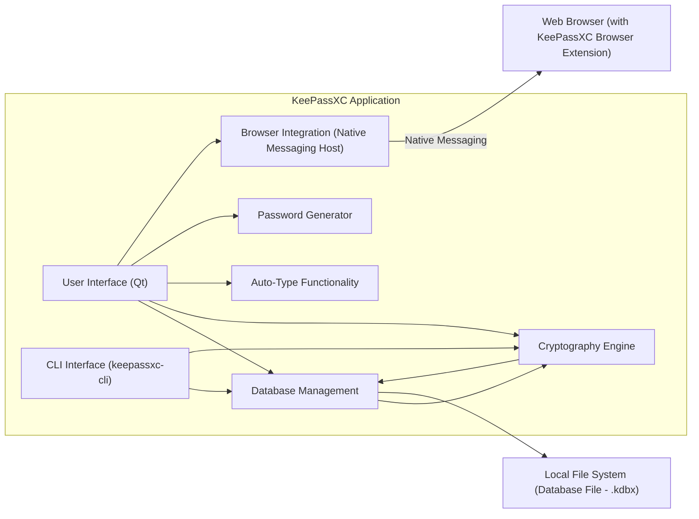
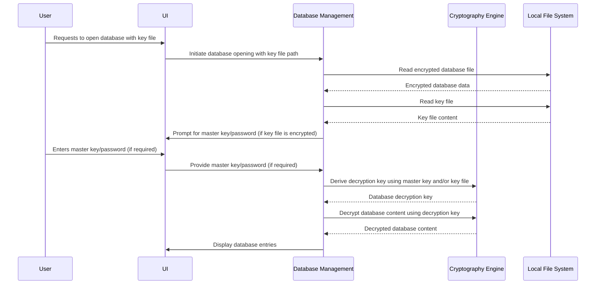
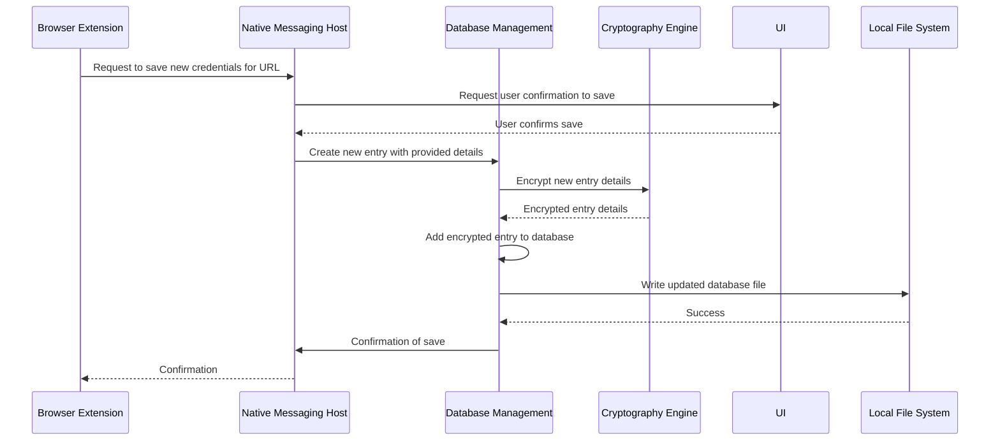
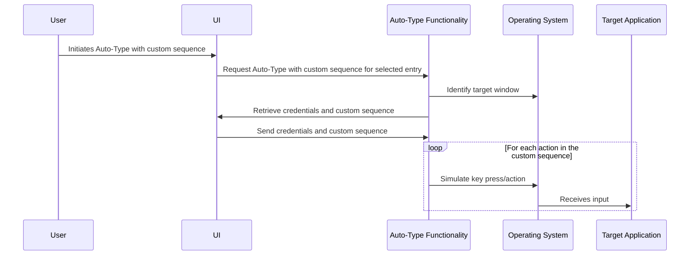

# Project Design Document: KeePassXC

**Version:** 1.1
**Date:** October 26, 2023
**Author:** AI Software Architect

## 1. Introduction

This document provides a detailed architectural design of the KeePassXC project, a free, open-source, cross-platform password manager. This document aims to provide a comprehensive understanding of the system's components, interactions, and data flow, which will be crucial for subsequent threat modeling activities. This revision includes more granular detail and expands on security considerations.

## 2. Goals and Objectives

The primary goals of KeePassXC are:

*   Securely store user credentials and other sensitive information using strong encryption.
*   Provide a user-friendly and intuitive interface for managing these credentials across various platforms.
*   Offer seamless cross-platform compatibility (Windows, macOS, Linux) with consistent functionality.
*   Integrate securely with web browsers to facilitate automatic form filling and password management.
*   Generate strong, cryptographically secure random passwords based on customizable criteria.
*   Maintain a high level of security and user privacy through robust design and implementation.
*   Remain open-source and community-driven, allowing for transparency and scrutiny.

## 3. High-Level Architecture

KeePassXC is a desktop application with a modular design, featuring a core application responsible for database management and a separate component for browser integration.

## 4. Detailed Component Description

This section provides a more detailed breakdown of the key components of the KeePassXC application.

### 4.1. User Interface (Qt)

*   **Description:** The primary interface for user interaction, built using the cross-platform Qt framework.
*   **Responsibilities:**
    *   Rendering the main application window and dialogs.
    *   Handling user input events (keyboard, mouse).
    *   Displaying the password database in a structured format (groups, entries).
    *   Providing functionalities for adding, editing, deleting, and searching entries.
    *   Managing application settings and preferences through configuration dialogs.
    *   Initiating core actions such as database operations, auto-type, and password generation.
    *   Displaying security warnings and prompts.
*   **Key Technologies:** Qt Framework (C++), Qt Widgets, Qt Signals and Slots.
*   **Security Considerations:**  Susceptible to UI-based attacks if input is not sanitized. Vulnerabilities in the Qt framework itself could be exploited. Improper handling of sensitive data within UI elements could lead to exposure.

### 4.2. Database Management

*   **Description:** The core component responsible for all operations related to the password database file.
*   **Responsibilities:**
    *   Reading and writing the encrypted database file (`.kdbx`) to the local file system.
    *   Implementing database locking mechanisms to prevent concurrent access and data corruption.
    *   Managing the database schema and structure, including groups, entries, and custom fields.
    *   Performing efficient search and filtering operations on database entries based on various criteria.
    *   Handling database backup and restore functionalities, including auto-backup options.
    *   Managing database import and export in various formats.
    *   Implementing database integrity checks.
*   **Key Technologies:** C++, KDBX file format specification (XML-based structure with binary attachments), potentially SQLite for internal metadata.
*   **Security Considerations:**  The primary point of interaction with the encrypted data. Vulnerabilities here could lead to database corruption or unauthorized access if encryption is bypassed or compromised. File permission issues on the database file are a concern.

### 4.3. Cryptography Engine

*   **Description:**  Encapsulates all cryptographic operations, providing a consistent and secure interface for other components.
*   **Responsibilities:**
    *   Encrypting and decrypting the entire password database using authenticated encryption modes (e.g., AES-GCM, ChaCha20-Poly1305).
    *   Generating cryptographically secure random numbers for key generation, initialization vectors (IVs), and password generation.
    *   Implementing key derivation functions (KDFs) such as Argon2id and PBKDF2-HMAC-SHA256 to derive encryption keys from the master key.
    *   Handling password hashing and comparison for internal authentication purposes.
    *   Potentially managing secure memory allocation for sensitive cryptographic keys.
*   **Key Technologies:**  Crypto++ library (or a similar robust cryptographic library), specific implementations of AES, ChaCha20, SHA-256, Argon2id, PBKDF2.
*   **Security Considerations:**  The most critical component from a security perspective. Any vulnerabilities in the implementation or usage of cryptographic algorithms can have severe consequences. Side-channel attacks targeting cryptographic operations are a potential threat.

### 4.4. Auto-Type Functionality

*   **Description:**  Enables users to automatically enter credentials into application windows or web forms by simulating keyboard input.
*   **Responsibilities:**
    *   Identifying the target window or web page based on window titles or other criteria.
    *   Retrieving the relevant username and password from the currently open database.
    *   Simulating keyboard events to type the username, a separator (e.g., Tab), and the password into the target application.
    *   Supporting custom auto-type sequences for complex login scenarios.
    *   Implementing safeguards to prevent accidental typing into unintended windows.
*   **Key Technologies:** Operating system-specific APIs for window enumeration and manipulation (e.g., Windows API, X11, macOS Accessibility API), keyboard input simulation APIs.
*   **Security Considerations:**  Inherently risky due to the simulation of keyboard input. Vulnerable to keystroke logging if the target application or OS is compromised. Incorrect window identification could lead to credentials being typed into the wrong application.

### 4.5. Password Generator

*   **Description:**  Provides a mechanism for generating strong, random passwords based on user-defined parameters.
*   **Responsibilities:**
    *   Offering options to customize password length, character sets (uppercase, lowercase, digits, symbols), and exclude ambiguous characters.
    *   Generating passwords using cryptographically secure random number generators (CSPRNGs) provided by the operating system or cryptographic library.
    *   Allowing users to define custom password generation patterns.
*   **Key Technologies:**  Operating system's CSPRNG (e.g., `/dev/urandom` on Linux, `CryptGenRandom` on Windows), potentially functions from the cryptographic library.
*   **Security Considerations:**  The strength of generated passwords depends entirely on the quality of the underlying random number generator. Predictable or weak random number generation would severely compromise security.

### 4.6. Browser Integration (Native Messaging Host)

*   **Description:**  Acts as a bridge between the KeePassXC application and browser extensions, enabling secure communication and credential sharing.
*   **Responsibilities:**
    *   Registering as a native messaging host with the operating system, allowing authorized browser extensions to communicate with it.
    *   Receiving requests from browser extensions (e.g., to find logins for the current website).
    *   Authenticating and authorizing incoming requests to ensure they originate from a trusted browser extension.
    *   Retrieving matching credentials from the open database.
    *   Encrypting and securely transmitting the requested credentials back to the browser extension.
    *   Handling password saving requests from the browser extension.
*   **Key Technologies:**  Operating system-specific native messaging APIs (e.g., Chrome Native Messaging, Firefox Native Messaging), JSON for message serialization.
*   **Security Considerations:**  A critical attack surface. Compromise of the native messaging host could allow malicious browser extensions to access the entire password database. Secure authentication and authorization of browser extensions are paramount. The communication channel should be encrypted and protected against eavesdropping.

### 4.7. CLI Interface (keepassxc-cli)

*   **Description:** A command-line interface providing access to core KeePassXC functionalities.
*   **Responsibilities:**
    *   Allowing users to perform database operations (e.g., opening, unlocking, searching, adding entries) from the command line.
    *   Enabling scripting and automation of password management tasks.
    *   Providing a headless interface for environments without a graphical user interface.
*   **Key Technologies:** C++, command-line argument parsing libraries.
*   **Security Considerations:**  Care must be taken to avoid exposing sensitive information in command-line arguments or output. Secure handling of the master key when used via the CLI is crucial.

## 5. Data Flow Diagrams

This section illustrates the flow of data within the system for key operations, providing more detail than the previous version.

### 5.1. Opening and Accessing the Database with Key File

### 5.2. Browser Integration - Saving New Credentials

### 5.3. Auto-Type with Custom Sequence

## 6. Security Considerations

This section expands on the security considerations for the KeePassXC project, highlighting potential threats and mitigation strategies.

*   **Master Key Security:** The single most critical security factor.
    *   **Threat:** Brute-force attacks, keyloggers, shoulder surfing.
    *   **Mitigation:** Strong password enforcement, use of key files, hardware key support, KDFs (Argon2id) with high work factors, warnings against weak passwords.
*   **Database Encryption:** Protection of the stored data at rest.
    *   **Threat:** Unauthorized access to the database file, offline attacks.
    *   **Mitigation:** Strong encryption algorithms (AES-GCM, ChaCha20-Poly1305), authenticated encryption to prevent tampering.
*   **Memory Protection:** Preventing sensitive data from being leaked from memory.
    *   **Threat:** Memory dumps, cold boot attacks, malware accessing process memory.
    *   **Mitigation:** Secure memory allocation (where available), clearing sensitive data from memory after use, avoiding storing sensitive data longer than necessary.
*   **Input Validation:** Preventing injection attacks and other vulnerabilities.
    *   **Threat:** SQL injection (less likely in this architecture but relevant for potential future features), cross-site scripting (if web components are added), buffer overflows.
    *   **Mitigation:** Strict input validation and sanitization for all user-provided data.
*   **Browser Integration Security:** Securing the communication channel with browser extensions.
    *   **Threat:** Malicious browser extensions gaining access to the database, eavesdropping on communication.
    *   **Mitigation:** Secure authentication of browser extensions, encryption of the communication channel, user control over authorized extensions.
*   **Auto-Type Security:** Mitigating the risks associated with simulated keyboard input.
    *   **Threat:** Keystroke logging, typing credentials into unintended windows.
    *   **Mitigation:** Secure window identification, warnings about the risks of auto-type, user control over auto-type settings.
*   **Software Updates:** Ensuring timely patching of vulnerabilities.
    *   **Threat:** Exploitation of known vulnerabilities in older versions.
    *   **Mitigation:** Automatic update checks, clear communication about security updates.
*   **Side-Channel Attacks:** Protecting against attacks that exploit information leaked through physical measurements.
    *   **Threat:** Timing attacks on cryptographic operations.
    *   **Mitigation:** Careful implementation of cryptographic algorithms to minimize timing variations.
*   **Platform Security:** Reliance on the security of the underlying operating system.
    *   **Threat:** Malware on the user's system compromising KeePassXC.
    *   **Mitigation:** User education about OS security best practices.
*   **Code Security:** Ensuring the codebase is free of vulnerabilities.
    *   **Threat:** Bugs and vulnerabilities introduced during development.
    *   **Mitigation:** Secure coding practices, code reviews, static and dynamic analysis, penetration testing.

## 7. Deployment Considerations

*   **Installation:** Distributed as platform-specific packages (e.g., `.exe`, `.dmg`, `.AppImage`, `.deb`, `.rpm`). Verification of package integrity through signatures is crucial.
*   **Browser Extension Installation:** Typically installed through official browser extension stores. Users should be warned against installing extensions from untrusted sources.
*   **Configuration:** Settings are stored locally, potentially in plain text or a minimally obfuscated format. Secure storage of sensitive configuration data should be considered.
*   **Updates:** Utilizes a built-in update mechanism. Securely downloading and verifying updates is essential to prevent man-in-the-middle attacks.
*   **Key File Management:** Users need to securely store and manage key files if they are used. Loss or compromise of the key file can lead to data loss or unauthorized access.

## 8. Future Considerations

*   **Enhanced Cloud Synchronization:** Implementing end-to-end encrypted synchronization with various cloud storage providers, ensuring user control over encryption keys.
*   **Advanced Hardware Key Support:** Expanding support for different types of hardware security keys and integrating them more deeply into the authentication process.
*   **Improved Browser Integration Security:** Exploring more robust and secure methods for communication with browser extensions, potentially leveraging more modern browser APIs.
*   **Official Mobile Applications:** Developing secure and feature-rich mobile applications for iOS and Android, addressing the challenges of secure data storage and input on mobile platforms.
*   **Integration with Passwordless Authentication Standards:** Exploring integration with emerging passwordless authentication standards like WebAuthn.
*   **Enhanced Security Audits:** Conducting regular third-party security audits to identify and address potential vulnerabilities.

This improved document provides a more detailed and comprehensive overview of the KeePassXC project architecture, with a stronger focus on security considerations relevant for threat modeling.