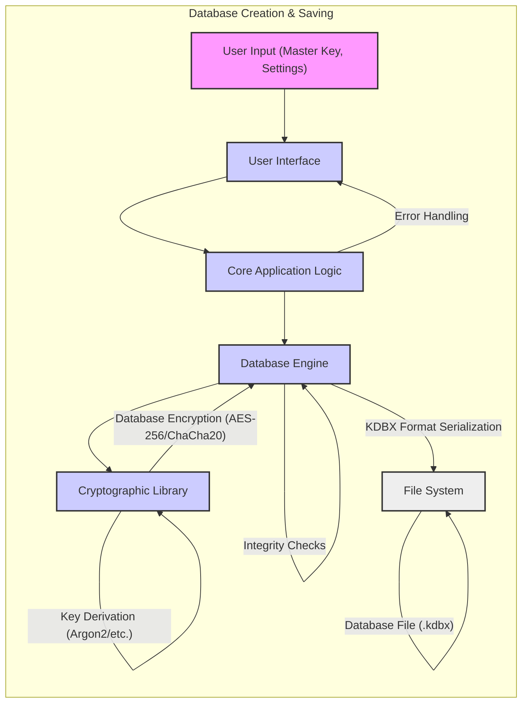
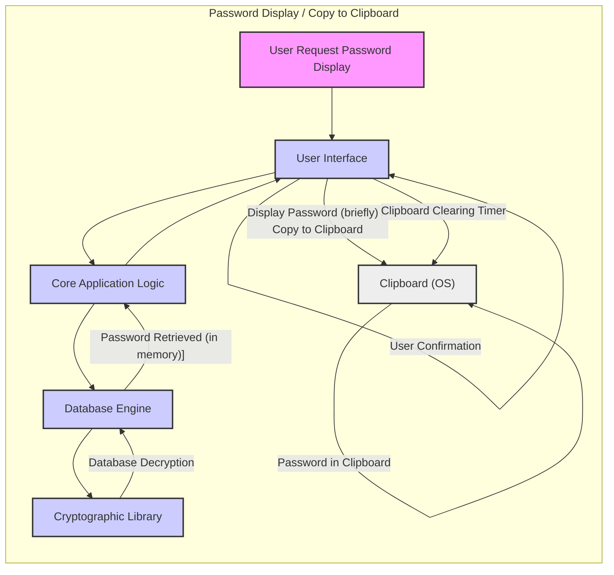
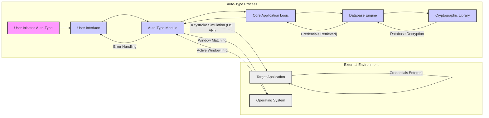
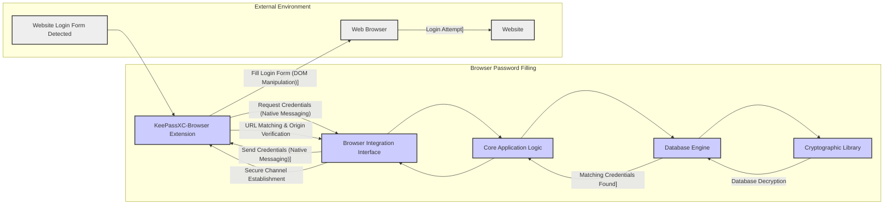
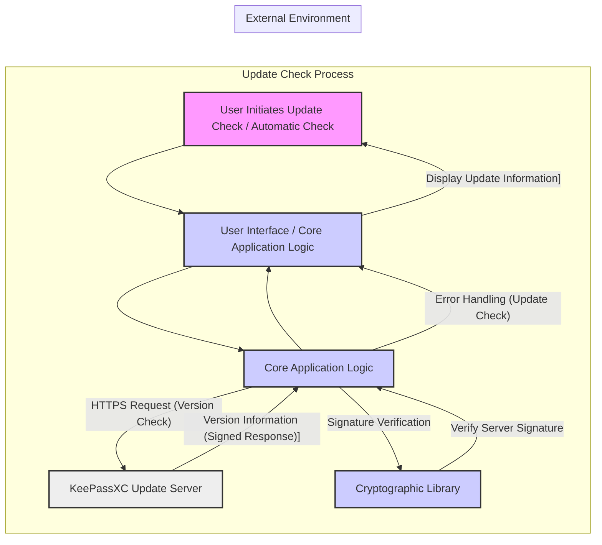
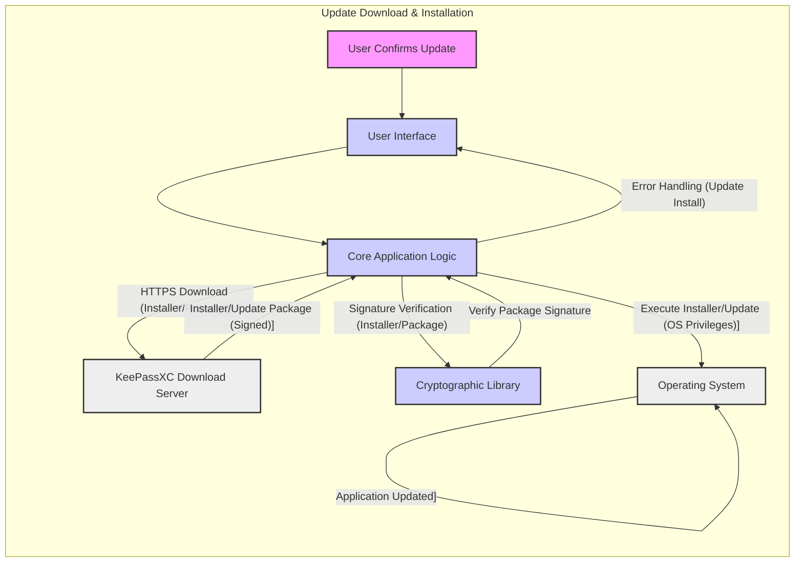
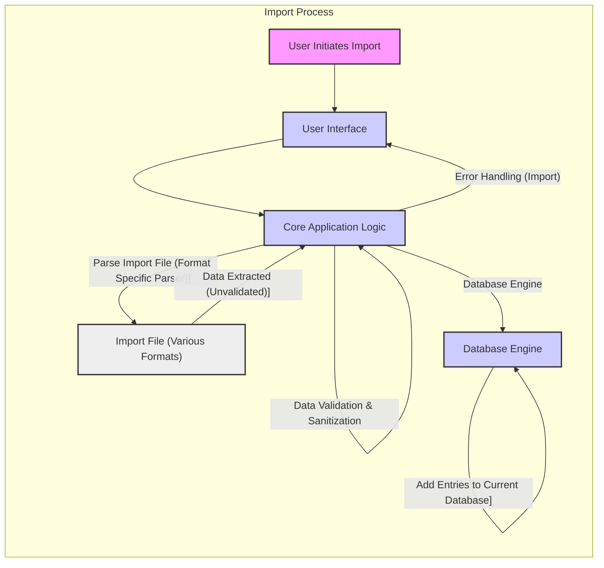
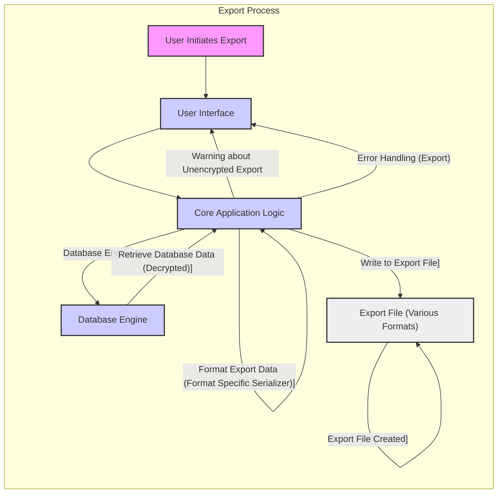
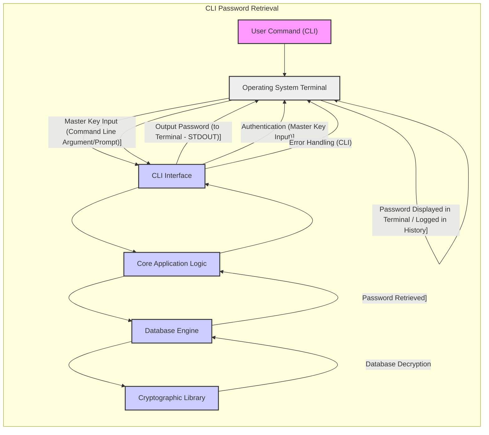

# KeePassXC Project Design Document for Threat Modeling

**Version:** 1.1
**Date:** 2023-10-27
**Author:** Gemini (AI Expert in Software, Cloud and Cybersecurity Architecture)

**Changes from Version 1.0:**

*   Enhanced security considerations for each component and data flow.
*   Added more detail to data flow descriptions, especially around error handling and edge cases.
*   Clarified the role of plugins and their security implications.
*   Improved descriptions of key derivation and encryption processes.
*   Added a section on secure configuration and defaults.
*   Minor formatting and wording improvements for clarity.

## 1. Project Overview

KeePassXC is a free, open-source, cross-platform password manager designed to securely store and manage user credentials. It utilizes strong encryption to protect password databases, offering a robust solution for individuals and teams to manage sensitive information. This document provides a detailed design overview of KeePassXC, specifically tailored for threat modeling and security analysis.

**Project Repository:** [https://github.com/keepassxreboot/keepassxc](https://github.com/keepassxreboot/keepassxc)

## 2. Target Audience

This document is intended for:

*   Cybersecurity professionals and threat modeling teams conducting security assessments of KeePassXC.
*   KeePassXC developers seeking to understand the security architecture and design principles for secure development practices.
*   Security researchers and auditors interested in the internal security mechanisms of KeePassXC.
*   Users with a technical background who want to understand the security aspects of KeePassXC in detail.

## 3. Scope

This design document focuses on the security-relevant aspects of KeePassXC's architecture and functionality. The scope includes:

*   **Core Desktop Application:** Design of the main KeePassXC application, including UI, core logic, database handling, and cryptography.
*   **Key Security Features:** Detailed description of password storage, encryption, key derivation, auto-type, and browser integration from a security perspective.
*   **Data Flow Analysis:**  Mapping of critical data flows, particularly those involving sensitive information like master keys and passwords.
*   **Security Boundaries:** Identification of security boundaries between components and external systems.
*   **Threat Modeling Context:** Providing sufficient information to facilitate the identification of potential threats, vulnerabilities, and attack vectors.

The document covers the following key functional areas:

*   Database creation, loading, saving, and locking/unlocking.
*   Entry management (creation, editing, deletion, searching, organization).
*   Password generation.
*   Auto-Type functionality and security considerations.
*   Browser integration via KeePassXC-Browser extension.
*   Import and export of databases in various formats.
*   Update mechanism and software distribution.
*   Command-line interface (CLI) operations.
*   Plugin architecture (from a security perspective).
*   Configuration management and secure defaults.

Out of scope for this document are:

*   Detailed code-level analysis.
*   Performance benchmarking.
*   User manuals or end-user documentation.
*   Specific details of every minor feature or configuration option.

## 4. Architecture Overview

KeePassXC's architecture is designed with a layered approach, separating concerns and promoting modularity. The main components and their interactions are illustrated below:

```mermaid
graph LR
    subgraph "KeePassXC Application"
        A["User Interface (Qt)"] --> B["Core Application Logic (C++)"];
        B --> C["Database Engine (KDBX Format)"];
        B --> D["Cryptographic Library (libsodium)"];
        B --> E["Auto-Type Module"];
        B --> F["Browser Integration Interface"];
        B --> G["CLI Interface"];
        C --> D;
        F --> H["KeePassXC-Browser Extension"];
        H --> I["Web Browser"];
        E --> J["Operating System"];
        G --> K["Operating System Terminal"];
        L["Configuration Files"] --> B;
        M["Plugin System (Optional)"] --> B;
        B --> N["Password Generator"];
        B --> O["TOTP Module"];
        B --> P["Attachment Handling"];
    end
    D --> Q["Random Number Generator (OS)"];
    R["User Input (Master Key, Key File)"] --> A;
    S["External Applications"] --> J;
    T["Websites"] --> I;
    U["Import Files"] --> B;
    V["Export Files"] --> B;
    W["Update Server"] --> B;

    style A fill:#f9f,stroke:#333,stroke-width:2px
    style B fill:#ccf,stroke:#333,stroke-width:2px
    style C fill:#ccf,stroke:#333,stroke-width:2px
    style D fill:#ccf,stroke:#333,stroke-width:2px
    style E fill:#ccf,stroke:#333,stroke-width:2px
    style F fill:#ccf,stroke:#333,stroke-width:2px
    style G fill:#ccf,stroke:#333,stroke-width:2px
    style H fill:#ccf,stroke:#333,stroke-width:2px
    style L fill:#eee,stroke:#333,stroke-width:2px
    style M fill:#eee,stroke:#333,stroke-width:2px
    style N fill:#ccf,stroke:#333,stroke-width:2px
    style O fill:#ccf,stroke:#333,stroke-width:2px
    style P fill:#ccf,stroke:#333,stroke-width:2px
    style Q fill:#eee,stroke:#333,stroke-width:2px
    style R fill:#f9f,stroke:#333,stroke-width:2px
    style S fill:#eee,stroke:#333,stroke-width:2px
    style T fill:#eee,stroke:#333,stroke-width:2px
    style U fill:#eee,stroke:#333,stroke-width:2px
    style V fill:#eee,stroke:#333,stroke-width:2px
    style W fill:#eee,stroke:#333,stroke-width:2px
    style I fill:#eee,stroke:#333,stroke-width:2px
    style J fill:#eee,stroke:#333,stroke-width:2px
    style K fill:#eee,stroke:#333,stroke-width:2px


    linkStyle 0,1,2,3,4,5,6,7,8,9,10,11,12,13,14,15,16,17,18,19,20,21,22,23,24,25,26,27,28,29,30,31,32,33,34,35,36,37,38,39,40,41,42,43,44,45,46,47,48,49,50,51,52,53,54,55,56,57,58,59,60,61,62,63,64,65,66,67,68,69,70,71,72,73,74,75,76,77,78,79,80,81,82,83,84,85,86,87,88,89,90,91,92,93,94,95,96,97,98,99,100,101,102,103,104,105,106,107,108,109,110,111,112,113,114,115,116,117,118,119,120,121,122,123,124,125,126,127,128,129,130,131,132,133,134,135,136,137,138,139,140,141,142,143,144,145,146,147,148,149,150,151,152,153,154,155,156,157,158,159,160,161,162,163,164,165,166,167,168,169,170,171,172,173,174,175,176,177,178,179,180,181,182,183,184,185,186,187,188,189,190,191,192,193,194,195,196,197,198,199,200,201,202,203,204,205,206,207,208,209,210,211,212,213,214,215,216,217,218,219,220,221,222,223,224,225,226,227,228,229,230,231,232,233,234,235,236,237,238,239,240,241,242,243,244,245,246,247,248,249,250,251,252,253,254,255,256,257,258,259,260,261,262,263,264,265,266,267,268,269,270,271,272,273,274,275,276,277,278,279,280,281,282,283,284,285,286,287,288,289,290,291,292,293,294,295,296,297,298,299,300,301,302,303,304,305,306,307,308,309,310,311,312,313,314,315,316,317,318,319,320,321,322,323,324,325,326,327,328,329,330,331,332,333,334,335,336,337,338,339,340,341,342,343,344,345,346,347,348,349,350,351,352,353,354,355,356,357,358,359,360,361,362,363,364,365,366,367,368,369,370,371,372,373,374,375,376,377,378,379,380,381,382,383,384,385,386,387,388,389,390,391,392,393,394,395,396,397,398,399,400,401,402,403,404,405,406,407,408,409,410,411,412,413,414,415,416,417,418,419,420,421,422,423,424,425,426,427,428,429,430,431,432,433,434,435,436,437,438,439,440,441,442,443,444,445,446,447,448,449,450,451,452,453,454,455,456,457,458,459,460,461,462,463,464,465,466,467,468,469,470,471,472,473,474,475,476,477,478,479,480,481,482,483,484,485,486,487,488,489,490,491,492,493,494,495,496,497,498,499,500,501,502,503,504,505,506,507,508,509,510,511,512,513,514,515,516,517,518,519,520,521,522,523,524,525,526,527,528,529,530,531,532,533,534,535,536,537,538,539,540,541,542,543,544,545,546,547,548,549,550,551,552,553,554,555,556,557,558,559,560,561,562,563,564,565,566,567,568,569,570,571,572,573,574,575,576,577,578,579,580,581,582,583,584,585,586,587,588,589,590,591,592,593,594,595,596,597,598,599,600,601,602,603,604,605,606,607,608,609,610,611,612,613,614,615,616,617,618,619,620,621,622,623,624,625,626,627,628,629,630,631,632,633,634,635,636,637,638,639,640,641,642,643,644,645,646,647,648,649,650,651,652,653,654,655,656,657,658,659,660,661,662,663,664,665,666,667,668,669,670,671,672,673,674,675,676,677,678,679,680,681,682,683,684,685,686,687,688,689,690,691,692,693,694,695,696,697,698,699,700,701,702,703,704,705,706,707,708,709,710,711,712,713,714,715,716,717,718,719,720,721,722,723,724,725,726,727,728,729,730,731,732,733,734,735,736,737,738,739,740,741,742,743,744,745,746,747,748,749,750,751,752,753,754,755,756,757,758,759,760,761,762,763,764,765,766,767,768,769,770,771,772,773,774,775,776,777,778,779,780,781,782,783,784,785,786,787,788,789,790,791,792,793,794,795,796,797,798,799,800,801,802,803,804,805,806,807,808,809,810,811,812,813,814,815,816,817,818,819,820,821,822,823,824,825,826,827,828,829,830,831,832,833,834,835,836,837,838,839,840,841,842,843,844,845,846,847,848,849,850,851,852,853,854,855,856,857,858,859,860,861,862,863,864,865,866,867,868,869,870,871,872,873,874,875,876,877,878,879,880,881,882,883,884,885,886,887,888,889,890,891,892,893,894,895,896,897,898,899,900,901,902,903,904,905,906,907,908,909,910,911,912,913,914,915,916,917,918,919,920,921,922,923,924,925,926,927,928,929,930,931,932,933,934,935,936,937,938,939,940,941,942,943,944,945,946,947,948,949,950,951,952,953,954,955,956,957,958,959,960,961,962,963,964,965,966,967,968,969,970,971,972,973,974,975,976,977,978,979,980,981,982,983,984,985,986,987,988,989,990,991,992,993,994,995,996,997,998,999,1000
```

## 5. Detailed Component Description and Data Flow

### 5.1. Database Engine and Cryptography

**Component:** "Database Engine (KDBX Format)" and "Cryptographic Library (libsodium)"

**Description:** These are critical components for KeePassXC's security posture. The "Database Engine" manages the KDBX file format, ensuring data integrity and structured access to password entries. The "Cryptographic Library" (libsodium) provides the essential cryptographic algorithms for encryption, decryption, hashing, and key derivation, forming the foundation of data protection.

**Data Flow - Database Creation and Saving:**



**Process:**

1.  **User Input:** The user provides a master key (password and/or key file) and database configuration settings (encryption algorithm, KDF parameters, etc.) through the "User Interface".
2.  **Input to Core Logic:** The "User Interface" securely transmits the master key and settings to the "Core Application Logic".
3.  **Database Engine Initialization:** The "Core Application Logic" instructs the "Database Engine" to initiate the database creation process, passing the user-defined settings.
4.  **Cryptographic Operations:** The "Database Engine" leverages the "Cryptographic Library" to perform security-critical operations:
    *   **Key Derivation:** A strong encryption key is derived from the user's master key using a robust Key Derivation Function (KDF) such as Argon2, PBKDF2, or Scrypt.  Salts and iteration counts are used to increase resistance to brute-force attacks.
    *   **Database Encryption:** The database content, including entries and metadata, is encrypted using a chosen symmetric encryption algorithm like AES-256 or ChaCha20.  Authenticated encryption modes (like AES-GCM or ChaCha20-Poly1305) are preferred to provide both confidentiality and integrity.
5.  **KDBX Serialization:** The "Database Engine" serializes the encrypted database content into the KDBX format. This format includes metadata about encryption settings, KDF parameters, and integrity checksums.
6.  **File System Storage:** The KDBX formatted data is written to a file in the "File System", typically with a `.kdbx` extension.
7.  **Error Handling:** Throughout the process, error handling is implemented to manage potential issues like invalid master keys, insufficient permissions, or disk errors. Errors are reported back to the "User Interface" for user feedback.
8.  **Integrity Checks:**  The "Database Engine" may perform integrity checks during serialization to ensure data consistency before saving.

**Security Considerations:**

*   **Master Key Strength and Entropy:** The security of the entire system hinges on the strength and unpredictability (entropy) of the master key.  Users must be guided to choose strong, unique master passwords or use strong key files.
*   **Key Derivation Function (KDF) Robustness:** The KDF must be resistant to brute-force attacks, dictionary attacks, and rainbow table attacks. Argon2 is recommended due to its memory-hardness, making it more resistant to hardware-accelerated attacks.  Proper configuration of KDF parameters (iterations, memory usage) is crucial.
*   **Encryption Algorithm Selection and Strength:**  Strong symmetric encryption algorithms like AES-256 and ChaCha20 are essential. The chosen algorithm should be well-vetted and resistant to known cryptanalytic attacks.  Authenticated encryption is vital to prevent tampering.
*   **Secure Random Number Generation:**  Cryptographic operations rely on high-quality random numbers.  libsodium utilizes the operating system's random number generator (RNG), which should be cryptographically secure.  The application should handle potential failures in RNG initialization or operation gracefully.
*   **Database File Integrity and Tamper Detection:** KDBX format includes mechanisms for integrity checking (e.g., checksums, MACs). These mechanisms should be robust and actively verified during database loading and saving to detect any unauthorized modifications or data corruption.
*   **Protection Against Side-Channel Attacks:** While libsodium is designed to be resistant to some side-channel attacks, developers should be mindful of potential vulnerabilities, especially in custom code or plugin implementations.
*   **Secure Memory Handling:** Master keys and decrypted data should be handled securely in memory, minimizing their exposure and securely erasing them when no longer needed to prevent memory scraping attacks.

### 5.2. User Interface and User Interaction

**Component:** "User Interface (Qt)"

**Description:** The "User Interface" is the user's primary interaction point with KeePassXC. It must be designed for usability while adhering to security best practices to prevent accidental exposure of sensitive information and protect against UI-based attacks.

**Data Flow - Password Display (Copy to Clipboard):**



**Process:**

1.  **User Action:** The user initiates a request to view or copy a password, typically by clicking a "show password" button or a "copy password" icon in the "User Interface".
2.  **Request to Core Logic:** The "User Interface" sends a secure request to the "Core Application Logic" to retrieve the decrypted password for the selected entry.
3.  **Database Access and Decryption:** The "Core Application Logic" interacts with the "Database Engine" to access the encrypted entry. The "Database Engine" uses the "Cryptographic Library" to decrypt the entry, assuming the database is already unlocked.
4.  **Password Retrieval (In Memory):** The decrypted password is retrieved and held in memory by the "Core Application Logic" for a minimal duration.
5.  **Password Delivery to UI:** The "Core Application Logic" securely transmits the decrypted password back to the "User Interface".
6.  **Display and/or Clipboard Copy:** The "User Interface" handles the password display and/or clipboard copy actions:
    *   **Display Password (Briefly):**  The password may be displayed briefly on the screen (e.g., for a few seconds) to allow the user to visually verify it. This display should be optional and configurable.
    *   **Copy to Clipboard:** If the user requests to copy the password, it is placed in the system clipboard.
7.  **User Confirmation (Optional):** For sensitive actions like copying passwords, the "User Interface" may require user confirmation to prevent accidental clipboard exposure.
8.  **Clipboard Clearing Timer:** KeePassXC implements a configurable timer to automatically clear the clipboard after a short period, mitigating the risk of passwords lingering in the clipboard history.

**Security Considerations:**

*   **Memory Security of Decrypted Passwords:** Decrypted passwords in memory are a prime target for memory scraping attacks. The application must minimize the time decrypted passwords reside in memory and use secure memory allocation and deallocation practices to prevent residual data exposure.
*   **Clipboard Security Risks:** The system clipboard is a shared resource and inherently insecure. Passwords copied to the clipboard are vulnerable to clipboard history snooping by other applications or malware.  The automatic clipboard clearing feature is crucial, and users should be educated about the risks of using the clipboard for sensitive data.
*   **Screen Capture and Shoulder Surfing:** Displaying passwords on screen, even briefly, creates a risk of screen capture by malware or visual observation (shoulder surfing).  Password display should be minimized and ideally require explicit user action and awareness of the risks.
*   **UI Redress and Clickjacking Attacks:** Malicious applications could attempt to overlay or manipulate the KeePassXC "User Interface" to trick users into revealing passwords or performing unintended actions (UI redress, clickjacking).  The UI should be designed to be robust against such attacks, potentially using techniques like window integrity checks or visual cues to ensure the user is interacting with the genuine KeePassXC interface.
*   **Input Handling Security:** The "User Interface" must handle user input securely, preventing injection attacks or other vulnerabilities that could be exploited through malicious input.
*   **Secure Communication Channels within Application:** Communication between the "User Interface" and other components (like "Core Application Logic") should be secure within the application's process space to prevent eavesdropping or tampering by malicious code running in the same process.

### 5.3. Auto-Type Functionality

**Component:** "Auto-Type Module"

**Description:** The "Auto-Type Module" provides the convenience of automatically entering credentials into applications or websites by simulating keystrokes. While highly convenient, it introduces significant security considerations due to its interaction with external applications and the operating system's input mechanisms.

**Data Flow - Auto-Type Process:**



**Process:**

1.  **User Initiation:** The user initiates Auto-Type, typically by pressing a global hotkey, right-clicking on an entry and selecting "Auto-Type", or using browser integration. The "User Interface" receives this initiation.
2.  **Auto-Type Module Activation:** The "User Interface" signals the "Auto-Type Module" to start the Auto-Type process.
3.  **Credential Retrieval:** The "Auto-Type Module" interacts with the "Core Application Logic" to retrieve the relevant entry. The "Core Application Logic" and "Database Engine" decrypt and retrieve the username and password for the selected entry using the "Cryptographic Library".
4.  **Window Matching:** The "Auto-Type Module" needs to identify the correct target application window to type the credentials into. It interacts with the "Operating System" to get information about active windows (window titles, process names). It then uses configured matching rules (e.g., window title patterns) to determine the target window.
5.  **Keystroke Simulation:** Once the target window is identified, the "Auto-Type Module" uses operating system APIs (e.g., `SendInput` on Windows, `CGEventPost` on macOS, `XSendEvent` on Linux) to simulate keystrokes. It types the username, password, and potentially other configured fields into the target application window.
6.  **Error Handling:** The "Auto-Type Module" includes error handling to manage scenarios like failure to find a matching window, issues with keystroke simulation, or database access errors. Errors are reported back to the "User Interface".

**Security Considerations:**

*   **Keystroke Logging Vulnerability:** Auto-Type inherently simulates keystrokes, making it vulnerable to keystroke loggers. If the target system is compromised by malware that includes a keystroke logger, the typed credentials can be intercepted and stolen.  Users should be aware of this risk, especially on potentially untrusted systems.
*   **Incorrect Target Window and Credential Misdirection:**  If window matching is not precise or if a malicious application spoofs window titles to resemble legitimate login windows, Auto-Type might type credentials into the wrong application. This could lead to credentials being sent to a malicious application or website, potentially resulting in account compromise. Robust window matching algorithms and user awareness are crucial to mitigate this risk.
*   **Process Injection and Tampering:** Malware could potentially inject code into KeePassXC's process or the target application's process to intercept or manipulate the Auto-Type process. This could allow attackers to steal credentials, modify the typed input, or redirect Auto-Type to malicious targets. Operating system-level security measures and application hardening are important to defend against process injection attacks.
*   **Timing Attacks (Less Likely but Possible):** In highly controlled environments, the timing of keystrokes generated by Auto-Type might theoretically be analyzed to infer information about the typed credentials. However, this is generally a less practical attack vector for typical Auto-Type usage.
*   **Credential Exposure in Memory During Auto-Type:** Decrypted credentials are briefly held in memory during the Auto-Type process. Secure memory handling practices are essential to minimize the risk of memory scraping during this time.
*   **Accessibility Features Abuse:**  Auto-Type often relies on operating system accessibility features to simulate keystrokes.  Malware could potentially abuse these same accessibility features for malicious purposes, even without directly targeting KeePassXC.  Users should be cautious about granting excessive accessibility permissions to applications.
*   **Auto-Type Sequence Security:**  Users can configure custom Auto-Type sequences.  If these sequences are not carefully designed, they could potentially introduce vulnerabilities or unintended behavior.  KeePassXC should provide guidance and warnings about creating secure Auto-Type sequences.

### 5.4. Browser Integration (KeePassXC-Browser)

**Component:** "Browser Integration Interface" and "KeePassXC-Browser Extension"

**Description:** Browser integration via the "KeePassXC-Browser Extension" provides a convenient and secure way to manage passwords within web browsers. It relies on secure communication between the browser extension and the desktop application to facilitate password filling and credential management.

**Data Flow - Browser Password Filling:**



**Process:**

1.  **Login Form Detection:** The "KeePassXC-Browser Extension" actively monitors web pages loaded in the "Web Browser" and detects login forms based on HTML structure and heuristics.
2.  **Credential Request (Native Messaging):** When a login form is detected, the extension sends a request for matching credentials to the "Browser Integration Interface" of the KeePassXC desktop application. This communication is established using the browser's Native Messaging API, which provides a secure channel for communication between browser extensions and native applications.
3.  **Request Processing and Database Access:** The "Browser Integration Interface" forwards the request to the "Core Application Logic". The "Core Application Logic" and "Database Engine" decrypt the database (if necessary) and search for entries that match the current website URL.
4.  **Credential Retrieval:** If matching credentials are found, they are retrieved from the decrypted database.
5.  **Credential Transmission (Native Messaging):** The "Core Application Logic" sends the retrieved credentials back to the "Browser Integration Interface", which then securely transmits them to the "KeePassXC-Browser Extension" via the Native Messaging channel.
6.  **Login Form Filling (DOM Manipulation):** The "KeePassXC-Browser Extension" receives the credentials and uses DOM manipulation within the "Web Browser" to fill the username and password fields of the detected login form.
7.  **Login Attempt:** The user typically submits the filled login form, initiating a login attempt to the "Website".
8.  **URL Matching and Origin Verification:**  The "Browser Integration Interface" and "KeePassXC-Browser Extension" perform URL matching and origin verification to ensure that credentials are only filled on the intended website and to prevent filling credentials on potentially malicious or spoofed websites.
9.  **Secure Channel Establishment and Authentication:** The Native Messaging channel itself provides a degree of security. KeePassXC further enhances security by establishing a secure, authenticated communication channel between the extension and the desktop application during the initial pairing process. This typically involves exchanging and verifying association keys to prevent unauthorized extensions from communicating with the KeePassXC application.

**Security Considerations:**

*   **Browser Extension Security:** The "KeePassXC-Browser Extension" itself is a critical security component. Vulnerabilities in the extension could directly expose credentials or compromise the communication channel.  Regular security audits, code reviews, and adherence to secure coding practices are essential for extension development. Browser extension security models and sandboxing mechanisms provide some level of protection, but vulnerabilities can still arise.
*   **Native Messaging Channel Security:** While Native Messaging provides a more secure communication channel than direct inter-process communication, it's still important to ensure proper origin verification and message integrity.  KeePassXC should validate the origin of messages received via Native Messaging to ensure they are indeed coming from the legitimate browser extension.
*   **URL Matching Accuracy and Phishing Prevention:**  Accurate URL matching is crucial to prevent credentials from being filled on unintended websites, especially phishing sites.  KeePassXC should use robust URL matching algorithms and potentially incorporate mechanisms to detect and warn users about suspicious or potentially malicious URLs.  User education about phishing risks is also important.
*   **Cross-Site Scripting (XSS) Vulnerabilities in Browser/Websites:** If the "Web Browser" or a website is vulnerable to XSS attacks, malicious scripts could potentially interact with the "KeePassXC-Browser Extension" or steal credentials.  Browser security features and website security practices are essential to mitigate XSS risks.
*   **Man-in-the-Browser (MitB) Attacks:** Malware running within the browser process (MitB malware) could intercept communication between the extension and the website, manipulate the login process, or steal credentials even before they are filled by the extension.  MitB attacks are a significant threat to browser-based password managers.  Operating system and browser security measures are the primary defenses against MitB malware.
*   **Extension Update Security:** The browser extension update mechanism must be secure to prevent malicious updates from being installed.  Browser extension stores typically provide some level of update security, but vulnerabilities in the update process are still possible.
*   **Secure Pairing and Association Keys:** The initial pairing process between the extension and the desktop application, and the management of association keys, must be secure to prevent unauthorized extensions from gaining access to the KeePassXC database.  Strong key exchange mechanisms and secure storage of association keys are necessary.

### 5.5. Update Mechanism

**Component:** "Core Application Logic" and potentially "User Interface"

**Description:** KeePassXC includes an update mechanism to ensure users are running the latest version, which is crucial for security as updates often contain vulnerability fixes. The update process involves checking for new versions, downloading updates, and optionally verifying their integrity before installation.

**Data Flow - Update Check:**



**Process:**

1.  **Update Check Initiation:** The update check can be initiated manually by the user through the "User Interface" or automatically by the "Core Application Logic" based on configured settings (e.g., periodic checks).
2.  **Version Check Request (HTTPS):** The "Core Application Logic" sends an HTTPS request to the "KeePassXC Update Server". This request typically includes information about the currently installed version to check for newer releases. HTTPS is essential to protect against man-in-the-middle attacks during the update check.
3.  **Version Information Response (Signed):** The "KeePassXC Update Server" responds with version information, including the latest available version number, release notes, and download URLs. This response should be digitally signed by the KeePassXC developers to ensure authenticity and integrity.
4.  **Signature Verification:** The "Core Application Logic" uses the "Cryptographic Library" to verify the digital signature of the version information response. This step is crucial to confirm that the response is genuinely from the KeePassXC project and has not been tampered with.
5.  **Update Information Display:** If the signature verification is successful and a newer version is available, the "Core Application Logic" informs the "User Interface". The "User Interface" then displays update information to the user, prompting them to download and install the update.
6.  **Error Handling (Update Check):** Error handling is implemented to manage potential issues during the update check process, such as network connectivity problems, server errors, or signature verification failures. Errors are reported back to the "User Interface".

**Data Flow - Update Download and Installation (Simplified):**



**Process:**

1.  **User Confirmation:** If an update is available and the user chooses to proceed, they confirm the update installation through the "User Interface".
2.  **Download Installer/Package (HTTPS):** The "Core Application Logic" initiates an HTTPS download of the installer or update package from the "KeePassXC Download Server". HTTPS is crucial to ensure the integrity and confidentiality of the downloaded package during transit.
3.  **Signature Verification (Installer/Package):** After downloading, the "Core Application Logic" *must* verify the digital signature of the downloaded installer or update package using the "Cryptographic Library". This is the most critical security step to ensure that the downloaded package is authentic and has not been tampered with by attackers.  The signature should be verified against a trusted public key embedded within the KeePassXC application.
4.  **Execute Installer/Update (OS Privileges):** If the signature verification is successful, the "Core Application Logic" executes the installer or update process. This typically requires elevated operating system privileges to replace application files and perform system-level changes.
5.  **Application Update:** The installer/update process updates the KeePassXC application to the new version.
6.  **Error Handling (Update Install):** Error handling is implemented to manage potential issues during download, signature verification, or installation. Errors are reported back to the "User Interface".

**Security Considerations:**

*   **Update Server Compromise:** If the "KeePassXC Update Server" is compromised, attackers could potentially distribute malicious updates to users.  Robust security measures must be in place to protect the update server infrastructure.
*   **Download Server Security:** The "KeePassXC Download Server" must also be secured to prevent unauthorized modification of update packages.
*   **Signature Verification is Mandatory:** Digital signature verification of both the version information response and the downloaded installer/update package is absolutely essential.  Failure to properly verify signatures would allow attackers to distribute malware disguised as legitimate KeePassXC updates.
*   **Secure Key Management for Signing:** The private key used to sign updates must be securely managed and protected from unauthorized access. Key compromise would have severe security implications.
*   **HTTPS for All Update Communications:** All communication with update and download servers must be over HTTPS to prevent man-in-the-middle attacks that could intercept or modify update information or packages.  Proper certificate validation is also crucial.
*   **Rollback Mechanism (Desirable):**  Ideally, the update mechanism should include a rollback capability to revert to a previous version in case an update fails or introduces unexpected issues.
*   **Local Privilege Escalation Risks:** The update installation process often requires elevated privileges. Vulnerabilities in the installer or update process could potentially be exploited for local privilege escalation attacks.  The installer should be carefully designed and tested to minimize these risks.
*   **User Education about Updates:** Users should be educated about the importance of keeping their KeePassXC installation up-to-date and to only download updates through the official KeePassXC update mechanism or website.

### 5.6. Import/Export Functionality

**Component:** "Core Application Logic" and "Database Engine"

**Description:** KeePassXC supports importing databases from various formats (e.g., KeePass 1.x, CSV, 1Password) and exporting to different formats (e.g., KDBX, CSV, HTML). While import/export provides interoperability, it also introduces security risks related to parsing untrusted data and potentially exposing sensitive information in less secure formats.

**Data Flow - Import Process (Simplified):**



**Process:**

1.  **User Initiation:** The user initiates the import process through the "User Interface", selecting an import file and specifying the file format.
2.  **Import Request to Core Logic:** The "User Interface" sends the import request, including the file path and format, to the "Core Application Logic".
3.  **File Parsing (Format-Specific):** The "Core Application Logic" uses a format-specific parser to parse the "Import File". Different parsers are needed for each supported import format (e.g., CSV parser, KeePass 1.x KDB parser, etc.).
4.  **Data Extraction (Unvalidated):** Data (entries, groups, metadata) is extracted from the import file by the parser. At this stage, the extracted data is considered unvalidated and potentially untrusted.
5.  **Data Validation and Sanitization:** The "Core Application Logic" performs data validation and sanitization on the extracted data. This is a crucial security step to prevent vulnerabilities arising from malformed or malicious import files. Validation should include checks for data type, format, length, and potentially malicious content. Sanitization may involve escaping special characters, removing invalid data, or applying other transformations to ensure data integrity and security.
6.  **Database Engine Integration:** After validation and sanitization, the "Core Application Logic" uses the "Database Engine" to add the imported entries to the currently open KeePassXC database.
7.  **Error Handling (Import):** Error handling is implemented to manage issues during file parsing, data validation, or database integration. Errors are reported back to the "User Interface".

**Data Flow - Export Process (Simplified):**



**Process:**

1.  **User Initiation:** The user initiates the export process through the "User Interface", selecting an export format and specifying the output file location.
2.  **Export Request to Core Logic:** The "User Interface" sends the export request, including the format and file path, to the "Core Application Logic".
3.  **Database Data Retrieval:** The "Core Application Logic" uses the "Database Engine" to retrieve data from the currently open KeePassXC database. The data retrieved at this stage is typically decrypted (assuming the database is unlocked).
4.  **Data Formatting (Format-Specific):** The "Core Application Logic" formats the retrieved data according to the selected export format using a format-specific serializer (e.g., CSV serializer, HTML serializer, KDBX serializer).
5.  **File Writing:** The formatted data is written to the specified "Export File".
6.  **Warning about Unencrypted Export:** If the user chooses to export to an unencrypted format (e.g., CSV, plain text, HTML), the "Core Application Logic" should warn the user about the security risks of exporting sensitive password data in an unencrypted form. The "User Interface" should display a clear warning message and potentially require user confirmation before proceeding with unencrypted export.
7.  **Error Handling (Export):** Error handling is implemented to manage issues during data retrieval, formatting, or file writing. Errors are reported back to the "User Interface".

**Security Considerations:**

*   **Import File Parsing Vulnerabilities:** Parsing import files from various formats is a significant security risk. Format string bugs, buffer overflows, integer overflows, XML External Entity (XXE) injection, and other parsing vulnerabilities could be present in the format-specific parsers.  Robust and secure parsing libraries should be used, and parsers should be thoroughly tested and audited for vulnerabilities. Input validation and sanitization are crucial after parsing.
*   **Export to Unencrypted Formats and Data Leakage:** Exporting to unencrypted formats (e.g., CSV, plain text, HTML) directly exposes sensitive password data in plaintext. This should be strongly discouraged, and users must be clearly warned about the severe security risks.  If unencrypted export is necessary, it should be implemented with extreme caution and require explicit user confirmation and understanding of the risks.  Ensure that only intended data is exported and no sensitive metadata or internal information is inadvertently included in export files.
*   **File Handling Security (Import/Export):** Secure file handling practices are essential during import and export operations to prevent file system vulnerabilities. This includes:
    *   **Path Traversal Prevention:**  Properly validate and sanitize file paths provided by the user to prevent path traversal attacks, where attackers could potentially read or write files outside of the intended directories.
    *   **File Permissions and Access Control:** Ensure that imported files are processed with appropriate file permissions and that exported files are created with secure permissions to prevent unauthorized access.
    *   **Resource Exhaustion:**  Parsing very large import files or generating very large export files could potentially lead to resource exhaustion (memory exhaustion, disk space exhaustion).  Implement appropriate resource limits and error handling to prevent denial-of-service conditions.
*   **Data Integrity during Import/Export:**  Ensure that data integrity is maintained during import and export operations.  Data should not be corrupted or modified unintentionally during format conversion or file handling.  Checksums or other integrity checks could be used to verify data integrity.

### 5.7. Command-Line Interface (CLI)

**Component:** "CLI Interface (keepassxc-cli)"

**Description:** The "CLI Interface" provides a non-graphical way to interact with KeePassXC, primarily intended for scripting, automation, and advanced users. While offering flexibility, the CLI introduces specific security considerations related to password exposure in command history and scripting vulnerabilities.

**Data Flow - CLI Password Retrieval:**



**Process:**

1.  **User Command Execution:** The user executes a command using the `keepassxc-cli` tool in the "Operating System Terminal". The command may include arguments to specify the database file, entry to retrieve, and output format.
2.  **CLI Interface Parsing:** The "CLI Interface" parses the command line arguments and options.
3.  **Authentication (Master Key Input):** To access an encrypted database, the "CLI Interface" needs to authenticate the user. It prompts the user to enter the master key. The master key can be provided as a command-line argument (less secure) or through a secure prompt (more secure). Key files can also be used for authentication.
4.  **Database Access and Decryption:** After successful authentication, the "CLI Interface" interacts with the "Core Application Logic" to access the specified database. The "Core Application Logic" and "Database Engine" decrypt the database using the provided master key and the "Cryptographic Library".
5.  **Password Retrieval:** The "Core Application Logic" retrieves the requested password or other data from the decrypted database.
6.  **Output to Terminal (STDOUT):** The "CLI Interface" formats the retrieved data and prints it to the "Operating System Terminal" (standard output - STDOUT).
7.  **Password Display in Terminal and History:** The password is displayed in the terminal window. Critically, command-line history mechanisms in most operating systems will log the commands executed, including potentially the output (if redirected or not handled carefully). This can lead to passwords being stored in plaintext in command history files.
8.  **Error Handling (CLI):** Error handling is implemented to manage issues like invalid commands, authentication failures, database access errors, or entry not found. Errors are reported to the "Operating System Terminal" (standard error - STDERR).

**Security Considerations:**

*   **Password Exposure in Terminal History:** Passwords displayed in the terminal output are highly likely to be logged in the terminal history files (e.g., `.bash_history`, `.zsh_history`, command history in Windows Command Prompt or PowerShell). This is a significant security risk as command history files are often stored in plaintext and can be accessed by other users or malware on the system.  Users *must* be strongly warned about this risk and advised against using the CLI to directly retrieve and display passwords in the terminal, especially in interactive sessions.  Secure alternatives like copying passwords to the clipboard or using Auto-Type should be preferred for most use cases.
*   **Scripting Vulnerabilities:** If CLI commands are used in scripts, vulnerabilities in the scripts themselves could expose passwords or database access.  For example, if scripts are not properly secured or if they are executed with insufficient input validation, they could be exploited to leak passwords or perform unauthorized database operations.  Script developers must follow secure scripting practices and carefully handle sensitive data.
*   **Master Key Input Security:**  Providing the master key as a command-line argument is highly insecure as it will also be logged in command history.  The CLI should strongly discourage this practice and prefer secure methods for master key input, such as prompting the user for the master key interactively (without echoing it to the screen) or using key files.
*   **Authentication for CLI Access:** The CLI must implement robust authentication mechanisms to ensure that only authorized users can access the database.  Strong master keys and key files should be enforced.  Consideration should be given to multi-factor authentication options for CLI access in high-security environments.
*   **Process Isolation and Privilege Separation:** Ensure that the CLI process is properly isolated from other processes and operates with the minimum necessary privileges. This can help to limit the impact of potential vulnerabilities in the CLI itself.
*   **Output Redirection Risks:** If the output of CLI commands is redirected to files (e.g., using `>` or `>>`), passwords could be inadvertently written to plaintext files, creating a significant security vulnerability.  Users should be warned about this risk and advised against redirecting CLI output containing passwords to files.
*   **Secure Configuration and Defaults for CLI:** The CLI should have secure default configurations and options.  For example, it should default to prompting for the master key securely rather than accepting it as a command-line argument.  Secure configuration options should be clearly documented and recommended to users.

## 6. Technology Stack

KeePassXC leverages a robust and well-established technology stack, prioritizing security and cross-platform compatibility:

*   **Programming Language:** C++ (Primarily for "Core Application Logic", "Database Engine", "Cryptographic Library" integration, "Auto-Type Module", "CLI Interface", performance-critical components). C++ is chosen for its performance, control over memory management, and suitability for security-sensitive applications.
*   **UI Framework:** Qt (For the "User Interface"). Qt is a cross-platform application framework that allows for the creation of rich, native-looking user interfaces across Windows, macOS, Linux, and other platforms. It provides good performance and a wide range of UI components.
*   **Cryptographic Library:** libsodium. libsodium is a modern, easy-to-use cryptographic library that provides a wide range of secure cryptographic primitives, including symmetric encryption, hashing, key derivation, and digital signatures. It is designed for security and ease of use, reducing the risk of cryptographic misimplementation.
*   **Database Format:** KDBX (KeePass Database eXtension) - XML-based format, encrypted. KDBX is a well-defined and widely used database format specifically designed for password managers. It supports strong encryption, key derivation, and integrity checks.
*   **Operating Systems:** Cross-platform support for Windows, macOS, Linux, and potentially other Unix-like systems.
*   **Build System:** CMake. CMake is a cross-platform build system generator used to manage the build process for KeePassXC across different operating systems and compilers.
*   **Browser Extension Technology:** WebExtension API (for "KeePassXC-Browser Extension"). The WebExtension API is a cross-browser standard for developing browser extensions, ensuring compatibility with major browsers like Chrome, Firefox, and Safari.

## 7. Secure Configuration and Defaults

KeePassXC aims to provide secure defaults and encourage users to adopt secure configurations. Key aspects of secure configuration and defaults include:

*   **Strong Default KDF:** Argon2 is the recommended and default Key Derivation Function (KDF) due to its memory-hardness and resistance to brute-force attacks.  Users are encouraged to use Argon2id for optimal security.
*   **Robust Default Encryption Algorithm:** AES-256 or ChaCha20 with authenticated encryption modes (like AES-GCM or ChaCha20-Poly1305) are used as strong default encryption algorithms.
*   **Secure Password Generation:** KeePassXC's password generator offers options to create strong, random passwords with configurable length and character sets.  It encourages users to generate and use strong, unique passwords.
*   **Clipboard Auto-Clear:**  Clipboard auto-clearing is enabled by default to mitigate the risk of passwords lingering in the clipboard. The default timeout is set to a short duration.
*   **Secure Communication Channels:**  Native Messaging is used for browser integration to provide a more secure communication channel compared to other browser extension communication methods.
*   **HTTPS for Updates:**  Update checks and downloads are performed over HTTPS to protect against man-in-the-middle attacks.
*   **Digital Signature Verification for Updates:**  Digital signature verification of updates is enabled and enforced to ensure update authenticity and integrity.
*   **Warnings for Insecure Options:**  The UI provides warnings and discourages users from choosing insecure options, such as exporting to unencrypted formats or using weak master keys.
*   **Security-Focused Documentation:**  KeePassXC documentation emphasizes security best practices and provides guidance on choosing secure configurations and using the application securely.

Users are still responsible for making informed security choices, such as selecting a strong master key and understanding the risks associated with certain features (like Auto-Type and clipboard usage). KeePassXC aims to empower users to make secure choices by providing secure defaults, clear warnings, and comprehensive security information.

## 8. Security Considerations (High-Level)

The overarching security goals of KeePassXC are to ensure:

*   **Confidentiality:** Sensitive data (passwords, notes, etc.) is protected from unauthorized disclosure. This is achieved through strong encryption of the database and secure handling of decrypted data in memory.
*   **Integrity:** The integrity of the password database and stored data is maintained.  Data should not be tampered with, corrupted, or modified without authorization. Cryptographic integrity checks and secure data handling practices are employed.
*   **Availability:** The password manager should be available to authorized users when needed. While denial-of-service attacks are less of a direct threat for a desktop application, the application should be designed to be robust and resilient to errors and unexpected conditions.
*   **Authentication:**  Access to the password database is restricted to authorized users who can provide the correct master key (password and/or key file). Strong authentication mechanisms are essential.
*   **Non-Repudiation:** (Less relevant for a password manager in the traditional sense, but logging and auditing of security-relevant events could be considered for advanced security monitoring).

Key security principles guiding KeePassXC's design and development:

*   **Defense in Depth:** Implementing multiple layers of security controls to protect sensitive data. If one layer fails, others are in place to provide continued protection.
*   **Principle of Least Privilege:** Components and users should only have the minimum necessary privileges to perform their tasks. This limits the potential damage from vulnerabilities or compromised components.
*   **Secure Defaults:**  The application should be configured with secure settings by default, minimizing the need for users to make complex security decisions.
*   **Open Source and Transparency:**  The open-source nature of KeePassXC allows for public scrutiny of the code, increasing transparency and enabling community-based security audits and vulnerability detection.
*   **Regular Security Audits and Vulnerability Management:** Proactive security measures include regular security audits, penetration testing, and vulnerability scanning to identify and address potential security weaknesses.  A responsible vulnerability disclosure process is also important.
*   **Security-Conscious Development Practices:**  Developers follow secure coding practices, perform code reviews, and utilize static and dynamic analysis tools to minimize the introduction of vulnerabilities during development.
*   **Use of Well-Vetted Cryptography:**  Reliance on established and well-vetted cryptographic libraries (libsodium) and algorithms to ensure the strength and reliability of cryptographic operations. Avoidance of custom cryptography implementation.
*   **User Education and Awareness:**  Providing users with clear and accessible information about security best practices, risks, and secure usage of KeePassXC.

## 9. Assumptions and Constraints

*   **Trusted Operating System (Relative Trust):** While KeePassXC aims to mitigate some OS-level threats, it is assumed that the underlying operating system is *reasonably* secure and not already completely compromised by advanced persistent threats or rootkits. KeePassXC cannot fully protect against a system that is already under full attacker control.
*   **User Responsibility for Master Key Security:**  Users are ultimately responsible for choosing strong, unique master keys and protecting their key files. KeePassXC provides tools and guidance to assist with this, but user behavior remains a critical factor in overall security.
*   **No Intentional Backdoors:**  As an open-source project with a strong community, it is assumed that KeePassXC does not contain intentional backdoors or malicious code. The open nature of the project and community scrutiny help to maintain trust and verify code integrity.
*   **Availability of Secure Cryptographic Libraries:**  Reliance on the security and correctness of the libsodium cryptographic library.  Regularly updating libsodium to the latest version is important to benefit from security updates and bug fixes.
*   **Cross-Platform Compatibility Challenges:**  Maintaining cross-platform compatibility can introduce complexities and potential security variations across different operating systems.  Security testing and validation should be performed on all supported platforms.
*   **Performance vs. Security Trade-offs:**  Security measures should be implemented in a way that minimizes negative impacts on performance and usability.  Balancing security and usability is an ongoing consideration in design and development.
*   **Plugin System Security (If Enabled):** If plugins are enabled, the security of the plugin system becomes a critical consideration.  Plugins can introduce new vulnerabilities or bypass security controls if not properly designed and sandboxed.  Plugin security requires careful attention and may be considered a separate threat model.

## 10. Document Structure and Conventions

This document is formatted using Markdown for readability and ease of maintenance. Mermaid syntax is used for diagrams to visually represent architecture and data flows.

*   **Heading Levels:** Sections are organized using headings (H1, H2, H3, etc.) to create a logical hierarchy and improve readability.
*   **Code Blocks:** Code snippets, configuration examples, and command-line examples are enclosed in code blocks for clarity.
*   **Mermaid Diagrams:** Mermaid diagrams are used to illustrate architectural components and data flow processes. Node names in Mermaid diagrams are enclosed in quotes as requested. No `style` or `linkStyle` attributes are used in Mermaid diagrams.
*   **Emphasis and Highlighting:** *Italics* are used for emphasis, and **bold** for stronger emphasis.
*   **Lists (Bulleted and Numbered):** Bulleted lists are used for unordered items, and numbered lists for ordered steps or sequences.
*   **Security Considerations Sections:** Each component and data flow description includes a dedicated "Security Considerations" section to highlight potential threats, vulnerabilities, and mitigation strategies.

This document is intended to be a living document and will be updated as KeePassXC evolves, new features are added, or as new security considerations emerge. It serves as a valuable resource for threat modeling, security assessments, and ongoing security analysis of the KeePassXC project.