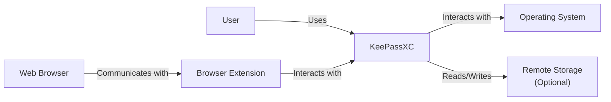
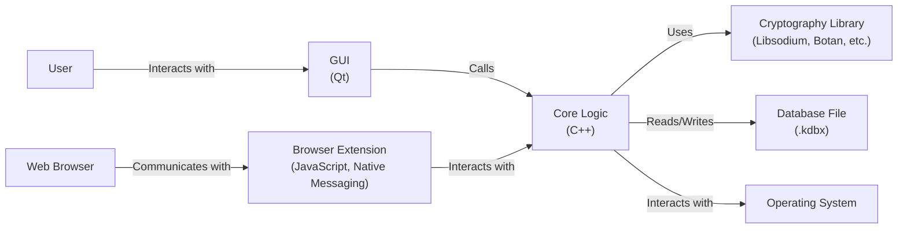
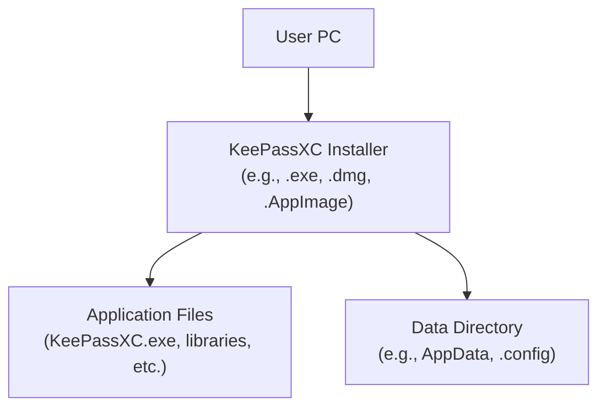
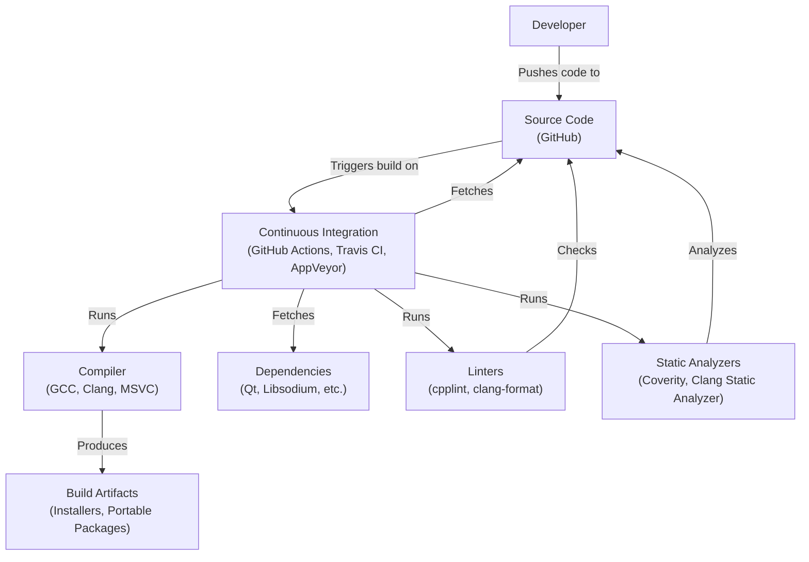

# BUSINESS POSTURE

KeePassXC is a community-driven, open-source password manager. It aims to provide a secure and user-friendly way to store and manage sensitive information like passwords, usernames, and other credentials. The project prioritizes security, privacy, and cross-platform compatibility.

Business Priorities:

-   Provide a secure and reliable password management solution.
-   Maintain user trust and confidence in the software's security.
-   Ensure cross-platform compatibility and accessibility.
-   Foster a strong and active open-source community.
-   Continuously improve the software based on user feedback and evolving security standards.

Business Goals:

-   Become a leading open-source password manager.
-   Attract and retain a large user base.
-   Maintain a high level of security and privacy.
-   Provide a user-friendly and intuitive experience.
-   Support a wide range of platforms and devices.

Most Important Business Risks:

-   Compromise of user data due to software vulnerabilities or attacks.
-   Loss of user trust due to security breaches or privacy concerns.
-   Inability to keep up with evolving security threats and standards.
-   Lack of community engagement and contributions.
-   Competition from other password managers (both open-source and commercial).

# SECURITY POSTURE

Existing Security Controls:

-   security control: Strong encryption using industry-standard algorithms (AES, Twofish, ChaCha20). Implemented in the core application logic and described in the documentation.
-   security control: Password database protection with a master password and/or key file. Implemented in the core application logic.
-   security control: Auto-lock feature to protect the database after a period of inactivity. Implemented in the application's settings and core logic.
-   security control: Password generation using cryptographically secure random number generators. Implemented in the password generator component.
-   security control: Protection against brute-force attacks through key derivation functions (Argon2, AES-KDF). Implemented in the core application logic related to database encryption.
-   security control: Regular security audits and code reviews. Documented in the project's development process and GitHub repository.
-   security control: Cross-platform compatibility to ensure consistent security across different operating systems. Implemented through the use of cross-platform frameworks and libraries.
-   security control: Use of memory protection techniques to prevent sensitive data from being leaked to swap or other memory locations. Implemented in the core application logic, specific details may vary by platform.
-   security control: Browser integration for convenient password filling and saving. Implemented through browser extensions.
-   security control: Two-factor authentication (2FA) support using TOTP and YubiKey. Implemented in the core application logic and database format.

Accepted Risks:

-   accepted risk: Potential for vulnerabilities in third-party libraries and dependencies.
-   accepted risk: Risk of user error, such as choosing weak master passwords or misplacing key files.
-   accepted risk: Potential for side-channel attacks, although mitigations are in place.
-   accepted risk: The browser extensions are separate projects and have their own security considerations.

Recommended Security Controls:

-   security control: Implement a comprehensive bug bounty program to incentivize security researchers to find and report vulnerabilities.
-   security control: Provide more detailed documentation on the specific security measures implemented, including cryptographic details and memory protection techniques.
-   security control: Consider implementing hardware security module (HSM) support for enhanced key protection.
-   security control: Explore the possibility of formal security certifications (e.g., Common Criteria, FIPS 140-2).

Security Requirements:

-   Authentication:
    -   The application must protect the password database with a strong master password and/or key file.
    -   The application must support two-factor authentication (2FA) using TOTP and hardware tokens (e.g., YubiKey).
    -   The application must securely store and manage authentication credentials.
-   Authorization:
    -   Only authenticated users should be able to access and modify the password database.
    -   The application should implement appropriate access controls to prevent unauthorized access to sensitive data.
-   Input Validation:
    -   The application must validate all user inputs to prevent injection attacks and other vulnerabilities.
    -   The application must sanitize data before displaying it to prevent cross-site scripting (XSS) attacks.
-   Cryptography:
    -   The application must use strong, industry-standard encryption algorithms (AES, Twofish, ChaCha20) to protect the password database.
    -   The application must use appropriate key derivation functions (Argon2, AES-KDF) to protect against brute-force attacks.
    -   The application must use cryptographically secure random number generators for password generation and other security-critical operations.
    -   The application must securely manage cryptographic keys.

# DESIGN

## C4 CONTEXT

Element Descriptions:

-   Element:
    -   Name: User
    -   Type: Person
    -   Description: A person who uses KeePassXC to manage their passwords and other sensitive information.
    -   Responsibilities: Provides master password, manages database, interacts with the application.
    -   Security controls: Strong master password, secure handling of key file (if used), awareness of phishing and other social engineering attacks.

-   Element:
    -   Name: KeePassXC
    -   Type: Software System
    -   Description: The KeePassXC password manager application.
    -   Responsibilities: Stores and manages passwords, provides a user interface, encrypts and decrypts data, generates passwords.
    -   Security controls: Strong encryption, password database protection, auto-lock, password generation, protection against brute-force attacks, memory protection, regular security audits.

-   Element:
    -   Name: Operating System
    -   Type: Software System
    -   Description: The operating system on which KeePassXC is running (e.g., Windows, macOS, Linux).
    -   Responsibilities: Provides the underlying platform for KeePassXC, manages system resources, handles file system access.
    -   Security controls: OS-level security features (e.g., ASLR, DEP), user account controls, file system permissions.

-   Element:
    -   Name: Web Browser
    -   Type: Software System
    -   Description: A web browser used for accessing websites and interacting with the KeePassXC browser extension.
    -   Responsibilities: Renders web pages, executes JavaScript, communicates with browser extensions.
    -   Security controls: Browser security features (e.g., sandboxing, same-origin policy), regular security updates.

-   Element:
    -   Name: Browser Extension
    -   Type: Software System
    -   Description: A browser extension that integrates KeePassXC with the web browser.
    -   Responsibilities: Communicates with KeePassXC, fills in passwords on web pages, saves new passwords.
    -   Security controls: Secure communication with KeePassXC, protection against cross-site scripting (XSS) and other web-based attacks.

-   Element:
    -   Name: Remote Storage (Optional)
    -   Type: Software System
    -   Description: Optional remote storage used to synchronize the password database across multiple devices (e.g., Dropbox, Google Drive, Nextcloud).
    -   Responsibilities: Stores the encrypted password database file.
    -   Security controls: Encryption at rest and in transit, access controls provided by the remote storage provider.

## C4 CONTAINER

Element Descriptions:

-   Element:
    -   Name: User
    -   Type: Person
    -   Description: A person who uses KeePassXC to manage their passwords.
    -   Responsibilities: Provides master password, manages database, interacts with the application.
    -   Security controls: Strong master password, secure handling of key file (if used).

-   Element:
    -   Name: GUI (Qt)
    -   Type: Container
    -   Description: The graphical user interface of KeePassXC, built using the Qt framework.
    -   Responsibilities: Provides a user-friendly interface for interacting with the application, displays data, handles user input.
    -   Security controls: Input validation, sanitization of displayed data.

-   Element:
    -   Name: Core Logic (C++)
    -   Type: Container
    -   Description: The core application logic of KeePassXC, written in C++.
    -   Responsibilities: Manages the password database, handles encryption and decryption, implements security features, interacts with the operating system.
    -   Security controls: Strong encryption, password database protection, auto-lock, password generation, protection against brute-force attacks, memory protection.

-   Element:
    -   Name: Cryptography Library (Libsodium, Botan, etc.)
    -   Type: Container
    -   Description: A library providing cryptographic primitives and algorithms.
    -   Responsibilities: Performs encryption, decryption, hashing, key derivation, random number generation.
    -   Security controls: Uses industry-standard, well-vetted cryptographic algorithms.

-   Element:
    -   Name: Database File (.kdbx)
    -   Type: Container
    -   Description: The encrypted password database file.
    -   Responsibilities: Stores user credentials and other sensitive information in an encrypted format.
    -   Security controls: Strong encryption, key derivation functions, protection against brute-force attacks.

-   Element:
    -   Name: Operating System
    -   Type: Software System
    -   Description: The operating system on which KeePassXC is running.
    -   Responsibilities: Provides file system access, memory management, and other system services.
    -   Security controls: OS-level security features.

-   Element:
    -   Name: Web Browser
    -   Type: Software System
    -   Description: A web browser used for accessing websites.
    -   Responsibilities: Renders web pages, communicates with browser extensions.
    -   Security controls: Browser security features.

-   Element:
    -   Name: Browser Extension (JavaScript, Native Messaging)
    -   Type: Container
    -   Description: A browser extension that integrates KeePassXC with the web browser.
    -   Responsibilities: Communicates with KeePassXC, fills in passwords, saves new passwords.
    -   Security controls: Secure communication with KeePassXC, protection against web-based attacks.

## DEPLOYMENT

Possible deployment solutions:

1.  Standalone application: Users download and install the application directly on their operating system (Windows, macOS, Linux).
2.  Portable application: Users run the application from a USB drive or other portable storage device without installation.
3.  Package manager: Users install the application through their operating system's package manager (e.g., apt, yum, brew).
4.  App stores: Users install the application through app stores (e.g., Microsoft Store, Snap Store).

Chosen deployment solution (Standalone application):

Element Descriptions:

-   Element:
    -   Name: User PC
    -   Type: Device
    -   Description: The user's computer where KeePassXC will be installed.
    -   Responsibilities: Runs the operating system and the KeePassXC application.
    -   Security controls: Operating system security features, user account controls.

-   Element:
    -   Name: KeePassXC Installer (e.g., .exe, .dmg, .AppImage)
    -   Type: File
    -   Description: The installer file for KeePassXC, specific to the user's operating system.
    -   Responsibilities: Extracts and installs the application files to the appropriate locations.
    -   Security controls: Code signing to verify the integrity and authenticity of the installer.

-   Element:
    -   Name: Application Files (KeePassXC.exe, libraries, etc.)
    -   Type: Files
    -   Description: The executable files and libraries required for KeePassXC to run.
    -   Responsibilities: Provide the core functionality of the application.
    -   Security controls: Code signing, regular security updates.

-   Element:
    -   Name: Data Directory (e.g., AppData, .config)
    -   Type: Directory
    -   Description: The directory where KeePassXC stores its configuration files and, optionally, the password database.
    -   Responsibilities: Stores application settings and user data.
    -   Security controls: File system permissions to restrict access to the data directory.

## BUILD

The build process for KeePassXC involves several steps, from compiling the source code to creating distributable packages. The process is automated using continuous integration (CI) systems like GitHub Actions, Travis CI, and AppVeyor.

Security Controls in the Build Process:

-   security control: Continuous Integration (CI): Automated builds and tests are triggered on every code commit, ensuring that changes are quickly verified and integrated.
-   security control: Dependency Management: Dependencies are managed using package managers and are regularly updated to address security vulnerabilities.
-   security control: Static Analysis: Static analysis tools (e.g., Coverity, Clang Static Analyzer) are used to identify potential security vulnerabilities in the code.
-   security control: Linters: Linters (e.g., cpplint, clang-format) are used to enforce coding style and identify potential errors.
-   security control: Code Signing: Build artifacts (installers and portable packages) are digitally signed to ensure their integrity and authenticity.
-   security control: Reproducible Builds: Efforts are made to ensure that builds are reproducible, meaning that the same source code and build environment will always produce the same output. This helps to verify that the build process has not been tampered with.
-   security control: Supply Chain Security: KeePassXC uses well-known and trusted libraries.

# RISK ASSESSMENT

Critical Business Processes to Protect:

-   Secure storage and retrieval of user credentials.
-   User authentication and authorization.
-   Password generation and management.
-   Data synchronization (if enabled).
-   Browser integration.

Data to Protect and Sensitivity:

-   Password database (.kdbx file): Contains user credentials, notes, and other sensitive information. Sensitivity: Extremely High.
-   Master password/key file: Used to decrypt the password database. Sensitivity: Extremely High.
-   Configuration files: Contain application settings. Sensitivity: Low to Medium.
-   Temporary files: May contain sensitive data during application operation. Sensitivity: Medium to High.

# QUESTIONS & ASSUMPTIONS

Questions:

-   Are there any specific compliance requirements (e.g., GDPR, HIPAA) that need to be considered?
-   What is the expected user base and growth rate? This will help to assess the scalability requirements.
-   What are the specific threat models that have been considered for KeePassXC?
-   What are the plans for future development and feature enhancements?
-   What level of support is provided to users?
-   Is there a formal process for handling security vulnerabilities reported by external researchers?

Assumptions:

-   BUSINESS POSTURE: The primary goal is to provide a secure and reliable password manager, prioritizing security and privacy over other features.
-   SECURITY POSTURE: Users are responsible for choosing strong master passwords and protecting their key files. The project follows secure coding practices and regularly addresses security vulnerabilities.
-   DESIGN: The application architecture is modular and well-structured, allowing for easier maintenance and security updates. The use of cross-platform frameworks ensures consistent functionality and security across different operating systems. The build process is automated and includes security checks.