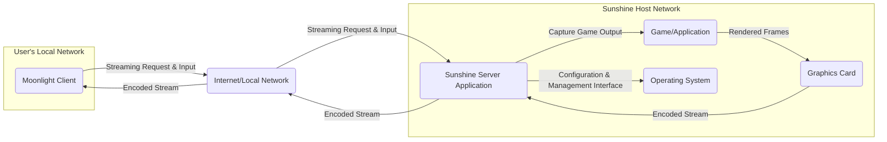
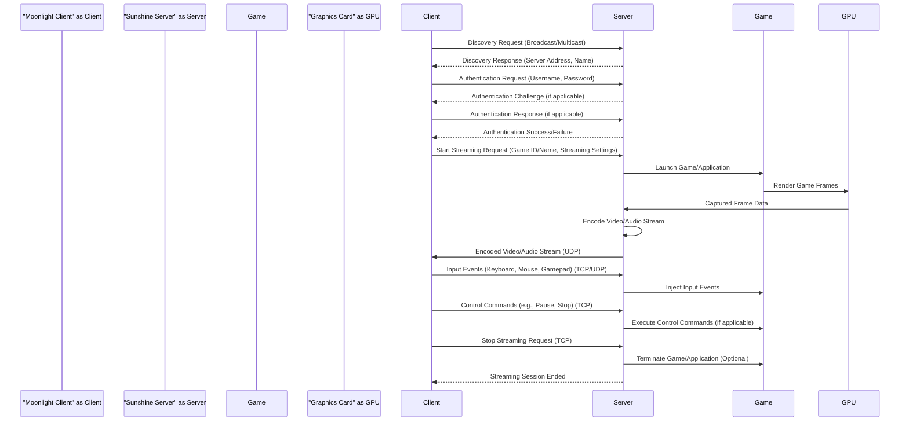

# Project Design Document: Sunshine - Self-Hosted Game Stream Relay

**Version:** 1.1
**Date:** October 26, 2023
**Author:** AI Software Architect

## 1. Introduction

This document provides an enhanced design overview of the Sunshine project, a self-hosted game stream relay application. This document serves as a foundation for understanding the system's architecture, components, and data flow, which will be crucial for subsequent threat modeling activities. The design is based on the publicly available information from the project's GitHub repository: [https://github.com/LizardByte/Sunshine](https://github.com/LizardByte/Sunshine). This revision aims to provide greater clarity and detail compared to the initial version.

## 2. Goals and Objectives

The primary goals of the Sunshine project are to:

* Provide a self-hosted alternative to cloud-based game streaming services.
* Enable users to stream games and applications from their local machines to remote clients.
* Offer compatibility with existing streaming clients like Moonlight, ensuring a seamless user experience.
* Support various streaming protocols and codecs to accommodate different network conditions and client capabilities.
* Provide a user-friendly interface (likely web-based) for configuration and management of the server.

## 3. High-Level Architecture

Sunshine operates as a server application installed on a host machine with the games or applications intended for streaming. Remote clients connect to this server to initiate and receive the stream.

**Components:**

* **"Moonlight Client":** The remote client application (e.g., Moonlight on a phone, tablet, smart TV, or another computer) that initiates the streaming session, sends user input, and renders the received stream.
* **"Internet/Local Network":** The network infrastructure facilitating communication between the client and the Sunshine server. This can be the public internet or a local area network.
* **"Sunshine Server Application":** The core application residing on the host machine. It manages streaming sessions, captures the output of the target application, encodes the stream, and relays it to connected clients.
* **"Game/Application":** The specific game or application being streamed. Sunshine needs to interact with this application to capture its output.
* **"Operating System":** The underlying operating system (e.g., Windows, Linux) on which the Sunshine server and the game/application are running. The OS provides necessary APIs for capturing and managing processes.
* **"Graphics Card":** The graphics processing unit (GPU) responsible for rendering the game/application and potentially accelerating the video encoding process.

## 4. Detailed Component Design

### 4.1. Sunshine Server Application

The Sunshine Server Application is the central orchestrator of the streaming process. Its key responsibilities are detailed below:

* **Stream Session Management:**
    * **Client Connection Handling:**  Accepting and managing incoming connection requests from clients.
    * **Authentication and Authorization:** Verifying the identity of connecting clients and ensuring they have the necessary permissions to initiate a stream. This might involve username/password authentication or other methods.
    * **Session Lifecycle Management:**  Managing the start, duration, and termination of individual streaming sessions.
    * **Concurrent Session Handling:**  Potentially supporting multiple concurrent streaming sessions (depending on resource availability).
* **Game Output Capture:**
    * **Interfacing with the OS Graphics Subsystem:** Utilizing operating system APIs (e.g., DirectX, Vulkan, X11) to capture the rendered output of the target game or application.
    * **Capture Method Selection:**  Supporting different capture methods (e.g., desktop duplication, window-specific capture) based on configuration and compatibility.
    * **Frame Rate Management:**  Controlling the rate at which frames are captured to optimize performance and bandwidth usage.
* **Stream Encoding:**
    * **Video Encoding:** Encoding the captured video frames into a suitable format for streaming (e.g., H.264, HEVC/H.265, AV1).
    * **Audio Encoding:** Encoding the game's audio output for transmission to the client.
    * **Codec Selection and Configuration:** Allowing users to configure encoding parameters such as bitrate, resolution, frame rate, and codec profiles.
    * **Hardware Encoding Utilization:** Leveraging the hardware encoding capabilities of the GPU (e.g., NVENC, AMD VCE, Intel Quick Sync Video) to improve encoding performance and reduce CPU load.
* **Input Handling:**
    * **Receiving Client Input:**  Accepting input commands from the connected client (e.g., keyboard strokes, mouse movements, gamepad inputs).
    * **Input Translation and Mapping:**  Translating client input events into a format understandable by the host operating system and the running game/application.
    * **Input Injection:**  Injecting the translated input events into the active game or application as if they were generated locally.
* **Network Communication:**
    * **Establishing Network Connections:**  Establishing and maintaining reliable network connections with clients using protocols like TCP and UDP.
    * **Data Transmission:**  Transmitting the encoded video and audio stream to the client, typically over UDP for lower latency.
    * **Receiving Input Data:** Receiving client input commands.
    * **Implementing Streaming Protocols:**  Adhering to specific streaming protocols for efficient and reliable data transfer.
* **Configuration and Management:**
    * **Configuration Interface:** Providing a user interface (likely a web interface) for configuring server settings, managing user accounts, and monitoring server status.
    * **Configuration Storage:**  Storing server configuration persistently (e.g., in configuration files).
    * **Logging and Monitoring:**  Logging server activity and providing monitoring capabilities for troubleshooting and performance analysis.
* **Security:**
    * **Authentication Mechanisms:** Implementing secure authentication methods to verify client identities and prevent unauthorized access.
    * **Authorization Policies:** Enforcing authorization policies to control which clients can access specific streaming resources.
    * **Encryption:**  Potentially supporting encryption for network communication to protect the stream and user data.

### 4.2. Communication Protocols

Sunshine likely employs a combination of network protocols for different aspects of the streaming process:

* **Discovery Protocol (e.g., mDNS/Bonjour):** Used by clients to automatically discover available Sunshine servers on the local network. This simplifies the connection process for users.
* **Control Protocol (Likely TCP):** A reliable protocol used for initial connection establishment, authentication, authorization, session negotiation, and sending control commands between the client and the server. TCP's reliability ensures that these critical control messages are delivered correctly.
* **Streaming Protocol (Likely UDP):** A low-latency protocol used for transmitting the real-time video and audio stream. UDP's lack of guaranteed delivery is acceptable for streaming, as occasional packet loss is preferable to the delays caused by retransmissions in a real-time scenario. Error correction mechanisms might be implemented on top of UDP.

### 4.3. Configuration Details

The Sunshine server requires configuration for various operational aspects. This configuration is likely managed through a web interface or configuration files:

* **Network Settings:**
    * **Listening Port:** The port on which the Sunshine server listens for incoming client connections.
    * **Interface Binding:**  Specifying the network interface(s) the server should bind to.
    * **Firewall Rules:** Guidance or automatic configuration of firewall rules to allow necessary traffic.
* **Streaming Settings:**
    * **Video Encoding Parameters:**  Codec selection (H.264, HEVC, AV1), bitrate, resolution, frame rate, encoder presets.
    * **Audio Encoding Parameters:** Codec selection, bitrate, sample rate.
    * **Frame Rate Limiting:** Options to limit the streaming frame rate.
* **Authentication Settings:**
    * **User Credentials:**  Management of user accounts and passwords for client authentication.
    * **Authentication Methods:**  Selection of authentication mechanisms.
* **Game Launching and Management:**
    * **Game Paths:**  Specifying the executable paths for the games or applications to be streamed.
    * **Launch Arguments:**  Defining command-line arguments to be passed to the launched applications.
    * **Working Directory:** Setting the working directory for launched applications.
* **Security Settings:**
    * **Encryption Options:**  Enabling or disabling encryption for network communication (e.g., using TLS).
    * **Access Control Lists (ACLs):**  Defining which clients or networks are allowed to connect.
* **Logging Settings:**
    * **Log Level:**  Configuring the verbosity of server logs.
    * **Log File Location:** Specifying where log files should be stored.

## 5. Data Flow

A typical game streaming session with Sunshine involves the following sequence of data exchange:

**Key Data Elements:**

* **Discovery Request/Response:**  Network messages exchanged for server discovery.
* **Authentication Request/Response:** Credentials and potential challenges used for client verification.
* **Start Streaming Request:**  Specifies the target game/application and desired streaming parameters.
* **Encoded Video/Audio Stream:** The compressed multimedia data transmitted from the server to the client, typically over UDP for low latency.
* **Input Events:**  User interactions captured by the client and sent to the server.
* **Control Commands:**  Instructions sent by the client to manage the streaming session.

## 6. Security Considerations (Preliminary)

This section highlights potential security considerations that will be further analyzed during a dedicated threat modeling exercise.

* **Authentication and Authorization Vulnerabilities:**
    * **Weak or Default Credentials:**  Susceptibility to brute-force attacks if default or weak passwords are used.
    * **Lack of Multi-Factor Authentication (MFA):**  Increased risk of unauthorized access if only single-factor authentication is used.
    * **Insufficient Authorization Controls:**  Potential for clients to access or control resources they are not authorized for.
* **Network Security Weaknesses:**
    * **Unencrypted Communication:**  Exposure of the stream content and user credentials if network traffic is not encrypted (e.g., using TLS).
    * **Open Ports and Firewall Misconfiguration:**  Potential attack vectors if unnecessary ports are open or firewall rules are improperly configured.
* **Input Handling Exploits:**
    * **Command Injection:**  Vulnerability if client input is not properly sanitized, potentially allowing execution of arbitrary commands on the server.
* **Configuration Security Risks:**
    * **Storage of Sensitive Information in Plaintext:**  Risk of compromise if sensitive data (e.g., passwords, API keys) is stored unencrypted in configuration files.
    * **Insecure Configuration Defaults:**  Potential vulnerabilities if default configuration settings are insecure.
* **Software Vulnerabilities:**
    * **Third-Party Dependencies:**  Vulnerabilities in libraries or components used by Sunshine.
    * **Code Vulnerabilities:**  Bugs or flaws in the Sunshine server application code itself.
* **Denial of Service (DoS) Attacks:**
    * **Resource Exhaustion:**  Potential for attackers to overwhelm the server with requests, leading to service disruption.
* **Man-in-the-Middle (MitM) Attacks:**
    * Risk if communication is not properly encrypted, allowing attackers to intercept and potentially modify data.

## 7. Deployment Considerations

Successful deployment of Sunshine requires careful consideration of the following aspects:

* **Operating System Compatibility:**  Ensuring the server application is compatible with the host operating system (typically Windows or Linux).
* **Hardware Requirements:**
    * **CPU:** Sufficient processing power for encoding and managing the streaming process.
    * **GPU:** A capable GPU with hardware encoding support is highly recommended for optimal performance.
    * **RAM:** Adequate memory for the server application and the game/application being streamed.
    * **Network Interface:** A stable and high-bandwidth network connection.
* **Network Configuration:**
    * **Port Forwarding:**  Configuring the router to forward necessary ports to the Sunshine server's internal IP address.
    * **Firewall Rules:**  Configuring the host firewall to allow incoming connections on the designated ports.
    * **Static IP Address (Recommended):** Assigning a static IP address to the server machine for consistent accessibility.
* **Installation Process:**  Providing a clear and user-friendly installation process.
* **Dependency Management:**  Handling the installation and management of any required software dependencies.

## 8. Future Considerations

Potential future enhancements and areas for improvement include:

* **Enhanced Security Features:**
    * Implementing multi-factor authentication.
    * Adding more granular access control mechanisms.
    * Supporting secure protocols for all communication channels.
* **Improved Streaming Performance and Efficiency:**
    * Optimizing encoding algorithms and parameters.
    * Implementing adaptive bitrate streaming.
    * Exploring new streaming protocols.
* **Advanced Configuration Options:**
    * Providing more fine-grained control over encoding settings.
    * Supporting advanced network configurations.
* **Plugin and Extension Support:**  Allowing developers to extend the functionality of the server through plugins.
* **User Interface Enhancements:**  Improving the user experience of the web interface for configuration and management.
* **Integration with Other Services:**  Potentially integrating with other home automation or media server platforms.

This revised design document provides a more detailed and comprehensive understanding of the Sunshine project. It will be instrumental in conducting thorough threat modeling and identifying potential security vulnerabilities.