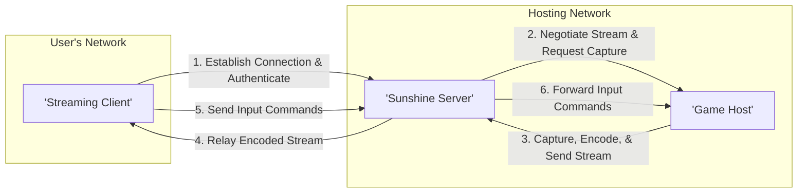
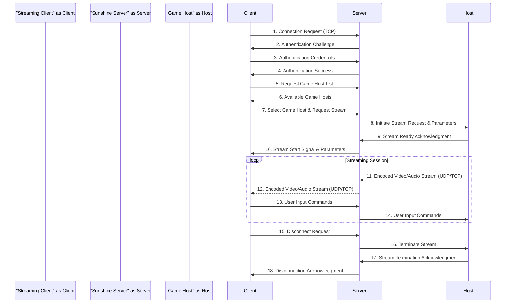

# Project Design Document: Sunshine - Self-Hosted Game Stream Relay

**Document Version:** 1.1
**Date:** October 26, 2023
**Author:** AI Architecture Expert

## 1. Introduction

This document provides an enhanced architectural design for the Sunshine project, a self-hosted game stream relay application. It aims to provide a clear and comprehensive understanding of the system's components, their interactions, data flow, and security considerations. This document serves as the foundation for future threat modeling activities. The project is based on the open-source repository found at: https://github.com/lizardbyte/sunshine. This document is intended for developers, security analysts, and anyone involved in the development and deployment of the Sunshine project.

## 2. Goals and Objectives

The primary goals of Sunshine are to:

*   Enable users to stream games from their gaming PCs to remote clients securely.
*   Provide a self-hosted and privacy-focused alternative to cloud-based game streaming services.
*   Offer low-latency and high-quality streaming capabilities adaptable to varying network conditions.
*   Support a wide range of client devices and operating systems.
*   Maintain a secure, reliable, and easily manageable streaming environment.

## 3. High-Level Architecture

Sunshine operates on a client-server model with the crucial involvement of the game host. The core components interact to establish, maintain, and terminate the streaming process.

**Key Actors and Components:**

*   **Streaming Client:** The application running on the user's device (e.g., smartphone, tablet, laptop) responsible for initiating the connection, authenticating, requesting the game stream, receiving and decoding the stream, and sending user input.
*   **Sunshine Server:** The central application responsible for managing client connections, authenticating users, managing the available Game Hosts, negotiating streaming parameters, relaying the game stream, and forwarding input commands. This typically resides on the same network as the Game Host for optimal performance.
*   **Game Host:** The computer running the game that will be streamed. Sunshine interacts with this machine to capture the screen and audio, encode the stream, and receive input commands to control the game.

## 4. Component Details

This section provides a detailed breakdown of the individual components of the Sunshine system and their functionalities, including key technologies and security considerations for each.

### 4.1. Sunshine Server Component

*   **Purpose:**
    *   Accepts and manages incoming connection requests from Streaming Clients.
    *   Authenticates users and authorizes access to streaming resources based on configured permissions.
    *   Maintains a registry or dynamically discovers available Game Hosts on the network.
    *   Facilitates the negotiation of streaming parameters (resolution, bitrate, codec, etc.) between the client and the Game Host.
    *   Acts as a relay for the encoded video and audio stream from the Game Host to the connected Streaming Client.
    *   Receives and forwards input commands from the Streaming Client to the designated Game Host.
    *   Provides a web-based or command-line interface for administrative tasks, such as user management, Game Host registration, and configuration.
*   **Key Technologies/Dependencies:**
    *   Web server (e.g., Nginx, Apache) or an embedded web server for serving the administrative interface and handling API requests.
    *   Backend application logic (likely implemented in Python, Go, or C++) for core functionality.
    *   Networking libraries (e.g., sockets, libuv) for handling TCP/UDP connections and communication.
    *   Authentication and authorization frameworks (e.g., OAuth 2.0, JWT, role-based access control).
    *   Potentially a database (e.g., SQLite, PostgreSQL) or configuration files for storing user credentials, Game Host information, and server settings.
    *   Secure communication libraries (e.g., OpenSSL, libsodium) for implementing TLS/SSL.
*   **Security Considerations:**
    *   **Authentication:** Implement strong password policies, consider multi-factor authentication, and protect against brute-force attacks.
    *   **Authorization:** Enforce the principle of least privilege, ensuring users only have access to necessary resources.
    *   **Session Management:** Securely manage user sessions to prevent hijacking.
    *   **Input Validation:** Rigorously validate all input from clients and the administrative interface to prevent injection vulnerabilities (e.g., SQL injection, command injection).
    *   **Rate Limiting:** Implement rate limiting to protect against denial-of-service attacks.
    *   **Secure Configuration:**  Ensure secure default configurations and guide users on best practices.

### 4.2. Game Host Component

*   **Purpose:**
    *   Registers its availability with the Sunshine Server, allowing clients to discover it.
    *   Captures the video and audio output of the running game using platform-specific APIs (e.g., DirectX, Vulkan, OBS Virtual Camera).
    *   Encodes the captured stream into a suitable format (e.g., H.264, H.265, AV1) using hardware or software encoders.
    *   Receives encoded stream relay requests and streaming parameters from the Sunshine Server.
    *   Transmits the encoded video and audio stream to the Sunshine Server.
    *   Receives input commands from the Sunshine Server and injects them into the active game process using operating system APIs.
*   **Key Technologies/Dependencies:**
    *   Screen capture libraries/APIs (e.g., DXGI, XCB, CoreGraphics).
    *   Video and audio encoding libraries (e.g., FFmpeg, NVENC, VA-API, libvpx).
    *   Input injection mechanisms (e.g., SendInput, XTest).
    *   Networking libraries for communication with the Sunshine Server.
    *   Potentially a lightweight agent or service running in the background.
*   **Security Considerations:**
    *   **Secure Communication:**  Establish secure communication channels with the Sunshine Server, potentially using mutual authentication.
    *   **Access Control:** Restrict access to the Game Host and its resources.
    *   **Process Isolation:**  Minimize the privileges of the streaming process to limit the impact of potential vulnerabilities.
    *   **Input Sanitization:** While the Sunshine Server handles the initial input, the Game Host should also be resilient to potentially malicious input.
    *   **Resource Management:** Protect against resource exhaustion attacks that could impact game performance.

### 4.3. Streaming Client Component

*   **Purpose:**
    *   Discovers available Sunshine Servers on the network or connects to a specified server address.
    *   Authenticates with the Sunshine Server using provided credentials.
    *   Browses and selects available Game Hosts registered with the connected server.
    *   Requests a game stream from the selected Game Host through the Sunshine Server.
    *   Negotiates streaming parameters with the Sunshine Server.
    *   Receives and decodes the encoded video and audio stream.
    *   Renders the game stream to the user's display with minimal latency.
    *   Captures user input from various input devices (keyboard, mouse, gamepad, touch).
    *   Sends captured input commands to the Sunshine Server for relaying to the Game Host.
*   **Key Technologies/Dependencies:**
    *   Networking libraries for communication with the Sunshine Server.
    *   Video and audio decoding libraries (matching the encoding formats used by the Game Host).
    *   Rendering libraries/APIs (e.g., OpenGL, DirectX, platform-specific APIs).
    *   Input handling libraries and APIs for capturing user input.
    *   User interface framework (e.g., Qt, Electron, native UI frameworks).
*   **Security Considerations:**
    *   **Secure Credential Storage:** If storing user credentials, use secure storage mechanisms provided by the operating system.
    *   **TLS/SSL Verification:**  Strictly verify the TLS/SSL certificates of the Sunshine Server to prevent man-in-the-middle attacks.
    *   **Protection Against Malicious Streams:** Implement safeguards against potentially malicious or corrupted stream data.
    *   **Code Integrity:** Ensure the integrity of the client application to prevent tampering.
    *   **Sandboxing:** Utilize operating system sandboxing features to isolate the client application.

## 5. Data Flow

This section details the sequence of interactions and data exchange between the components during a typical game streaming session.

**Data Flow Description:**

1. The Streaming Client initiates a TCP connection to the Sunshine Server.
2. The Sunshine Server sends an authentication challenge to the client.
3. The Streaming Client provides its authentication credentials.
4. The Sunshine Server authenticates the client and grants access.
5. The Streaming Client requests a list of available Game Hosts from the server.
6. The Sunshine Server responds with a list of registered Game Hosts.
7. The Streaming Client selects a Game Host and requests a stream, potentially specifying desired parameters.
8. The Sunshine Server forwards the stream request and parameters to the selected Game Host.
9. The Game Host acknowledges the stream request and indicates its readiness.
10. The Sunshine Server signals the Streaming Client to start receiving the stream and provides the negotiated parameters.
11. The Game Host captures, encodes, and sends the video and audio stream to the Sunshine Server (typically over UDP for lower latency, but TCP can be used).
12. The Sunshine Server relays the encoded video and audio stream to the Streaming Client.
13. The Streaming Client captures user input and sends it to the Sunshine Server.
14. The Sunshine Server forwards the user input commands to the Game Host.
15. The Streaming Client sends a disconnect request to the Sunshine Server.
16. The Sunshine Server instructs the Game Host to terminate the stream.
17. The Game Host acknowledges the stream termination.
18. The Sunshine Server acknowledges the disconnection to the Streaming Client.

## 6. Security Considerations

This section expands on the security considerations for the Sunshine project, providing more specific examples of potential threats and mitigation strategies.

*   **Authentication and Authorization:**
    *   **Threats:** Brute-force attacks, credential stuffing, unauthorized access.
    *   **Mitigations:** Implement strong password policies, account lockout mechanisms, multi-factor authentication, role-based access control, regular security audits.
*   **Data in Transit Protection:**
    *   **Threats:** Man-in-the-middle attacks, eavesdropping, data tampering.
    *   **Mitigations:** Enforce TLS/SSL encryption for all communication between components, use strong cipher suites, implement certificate pinning on clients.
*   **Data at Rest Protection:**
    *   **Threats:** Unauthorized access to stored credentials and configuration data.
    *   **Mitigations:** Encrypt sensitive data at rest, use secure storage mechanisms, implement access controls on configuration files and databases.
*   **Input Validation:**
    *   **Threats:** Injection attacks (SQL injection, command injection, cross-site scripting).
    *   **Mitigations:** Sanitize and validate all input data on both the server and client-side, use parameterized queries, implement context-aware output encoding.
*   **Network Security:**
    *   **Threats:** Denial-of-service attacks, unauthorized network access.
    *   **Mitigations:** Implement firewall rules to restrict access to necessary ports, use rate limiting, consider using a VPN for remote access, regularly monitor network traffic.
*   **Code Security:**
    *   **Threats:** Vulnerabilities introduced through insecure coding practices.
    *   **Mitigations:** Follow secure coding guidelines, perform regular code reviews, utilize static and dynamic code analysis tools, address identified vulnerabilities promptly.
*   **Dependency Management:**
    *   **Threats:** Exploiting known vulnerabilities in third-party libraries and dependencies.
    *   **Mitigations:** Keep all dependencies up-to-date with the latest security patches, regularly audit dependencies for known vulnerabilities, use dependency management tools to track and manage dependencies.
*   **Logging and Auditing:**
    *   **Threats:** Lack of visibility into security events and potential breaches.
    *   **Mitigations:** Implement comprehensive logging of security-related events (authentication attempts, authorization failures, etc.), regularly review logs for suspicious activity, consider using a centralized logging system.
*   **Web Interface Security:**
    *   **Threats:** Cross-site scripting (XSS), cross-site request forgery (CSRF), session hijacking.
    *   **Mitigations:** Implement proper output encoding to prevent XSS, use anti-CSRF tokens, secure session management, enforce strong password policies for web interface access, keep web server software up-to-date.
*   **Game Host Security:**
    *   **Threats:** Unauthorized access to the gaming PC, malware infections.
    *   **Mitigations:** Minimize the attack surface on the Game Host, ensure the operating system and game software are up-to-date with security patches, use anti-malware software, restrict user access.

## 7. Deployment Considerations

*   **Self-Hosting Challenges:** Users need to manage network configuration (port forwarding, firewall rules), ensure sufficient hardware resources, and handle software updates.
*   **Network Address Translation (NAT) Traversal:** Implementing techniques like STUN or TURN might be necessary for clients outside the hosting network to connect.
*   **Dynamic IP Addresses:**  Consider using dynamic DNS services to handle changing public IP addresses for the hosting network.
*   **Resource Requirements Planning:**  Adequate CPU, GPU (for encoding), memory, and network bandwidth are crucial for a smooth streaming experience.
*   **Operating System Compatibility:** Ensure compatibility of all components with the target operating systems for the server, Game Host, and clients.
*   **Containerization Benefits:** Using Docker or similar containerization technologies can simplify deployment, management, and updates.

## 8. Future Considerations

*   **Enhanced User Management:** Implementing more granular user roles and permissions.
*   **Stream Quality Adjustments:** Allowing users to dynamically adjust stream quality settings based on network conditions.
*   **Advanced Codec Support:** Exploring and integrating newer and more efficient video codecs.
*   **Performance Monitoring and Statistics:** Providing insights into streaming performance and resource utilization.
*   **Integration with Gaming Platforms:**  Potentially integrating with existing gaming platform accounts for easier authentication.
*   **Improved Error Handling and Recovery:** Implementing robust mechanisms for handling connection issues and stream interruptions.
*   **Support for Multiple Game Hosts per User:** Allowing users to stream from different gaming PCs without re-authentication.

This improved design document provides a more detailed and comprehensive overview of the Sunshine project's architecture, with a stronger focus on security considerations. It will be a valuable asset for understanding the system and conducting thorough threat modeling.