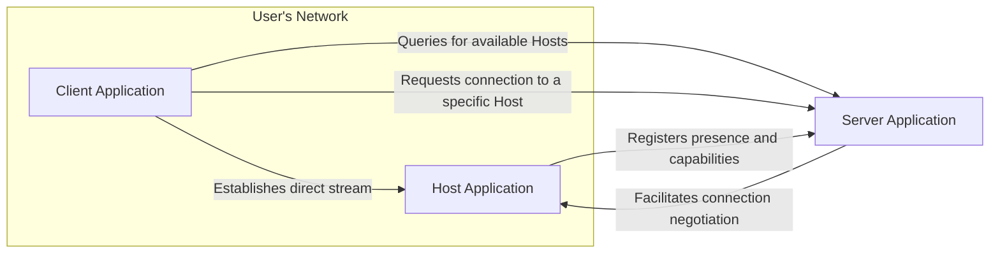
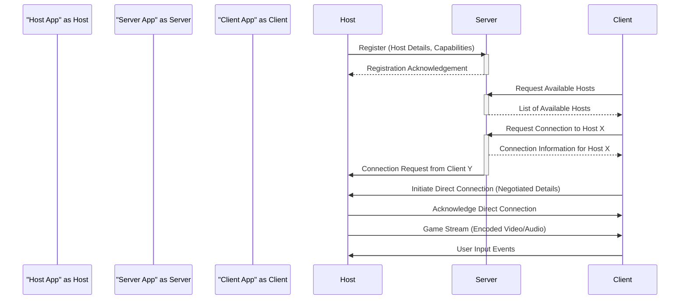

# Project Design Document: Sunshine - Self-Hosted Game Stream Relay

**Version:** 1.1
**Date:** October 26, 2023
**Author:** AI Software Architect

## 1. Introduction

This document provides an enhanced and more detailed design overview of the Sunshine project, a self-hosted game stream relay application available on GitHub at [https://github.com/lizardbyte/sunshine](https://github.com/lizardbyte/sunshine). This document aims to clearly articulate the system's architecture, components, data flow, and key considerations, providing a robust foundation for subsequent threat modeling activities. Improvements in this version focus on providing more specific examples and elaborating on key aspects of the system.

## 2. Goals and Scope

The primary goal of Sunshine is to empower users to stream games from their gaming PCs to client devices across a network. This design document focuses on the core functionalities of Sunshine as understood from the project's description and publicly available information. It comprehensively covers the major components involved in capturing, relaying, and rendering game streams, including a deeper look into potential technologies and security implications.

## 3. High-Level Architecture

Sunshine adopts a client-server architecture where a central server facilitates the crucial connection establishment phase between the game-hosting PC (the "Host") and the client device receiving the stream. Once the connection is established, the stream itself ideally flows directly between the Host and Client for optimal performance.

*   **Core Components:**
    *   Host Application: Residing on the gaming PC.
    *   Server Application: Acting as the central coordination point.
    *   Client Application: Running on the device receiving the stream.

*   **Interaction Diagram:**

## 4. Component Details

### 4.1. Host Application

*   **Purpose:**  To capture the game's visual and auditory output, encode it efficiently, and transmit it to the connected Client, while also relaying input commands back to the game.
*   **Key Features:**
    *   **Game Capture:**  Utilizes OS-specific APIs to capture the framebuffer and audio streams. Examples include DirectX's `IDXGIOutputDuplication` or Vulkan's extensions for screen capture on Windows, and similar APIs on Linux.
    *   **Encoding:**  Compresses the captured video and audio using codecs suitable for real-time streaming. Common choices include hardware-accelerated encoders like NVENC (NVIDIA), Video Coding Engine (AMD VCE), or Intel Quick Sync Video for H.264/AVC or H.265/HEVC. Audio encoding might use Opus or AAC.
    *   **Network Communication:** Manages network connections with the Server for registration and the Client for streaming, potentially using protocols like UDP for the main stream due to its lower latency. TCP might be used for control messages.
    *   **Input Handling:**  Receives and processes input events (keyboard, mouse, gamepad) from the Client, translating them into OS-level input events for the running game. This requires careful handling to avoid injection vulnerabilities.
    *   **Authentication/Authorization:** Authenticates its identity to the Server, possibly using API keys or tokens. It also needs to verify the identity of connecting Clients.
    *   **Configuration:** Allows users to customize capture resolution, frame rate, encoding bitrate, and network settings.
*   **Potential Technologies:**
    *   **Capture APIs:** DirectX (DXGI), Vulkan, platform-specific screen capture APIs.
    *   **Encoding Libraries:** libx264, libx265, NVENC, AMD VCE, Intel Quick Sync Video, libopus, libfdk-aac.
    *   **Networking Libraries:**  Boost.Asio, libuv, platform-specific socket APIs.
    *   **Streaming Protocols:**  WebRTC (for data channels and potentially media), RTP/RTCP.
*   **Security Considerations:**
    *   Securely storing and managing authentication credentials.
    *   Encrypting the game stream to prevent unauthorized interception (e.g., using DTLS if WebRTC is used, or SRTP with RTP).
    *   Thoroughly validating input commands from the Client to prevent command injection or other exploits.
    *   Implementing robust authorization checks to ensure only legitimate Clients can connect and control the Host.

### 4.2. Server Application

*   **Purpose:** To act as a central directory and connection broker, enabling Clients to discover and connect to available Hosts. It handles the initial handshake and facilitates the establishment of a direct connection between the Host and Client.
*   **Key Features:**
    *   **Host Registration:**  Receives and stores information about available Hosts, including their network addresses, capabilities, and status.
    *   **Host Discovery:** Provides an interface for Clients to query and retrieve the list of registered Hosts.
    *   **Connection Management:**  Orchestrates the connection negotiation process between the Client and the Host, potentially exchanging network information required for direct peer-to-peer connections.
    *   **Authentication/Authorization:** Authenticates both Hosts and Clients, ensuring only authorized users can participate in the streaming process. This might involve username/password authentication, API keys, or OAuth 2.0.
    *   **NAT Traversal Assistance:** May implement or integrate with technologies like STUN/TURN servers to help Clients and Hosts behind Network Address Translation (NAT) establish direct connections.
    *   **Configuration:** Allows administrators to manage user accounts, set access controls, and configure server settings.
*   **Potential Technologies:**
    *   **Backend Frameworks:** Node.js with Express.js or Socket.IO, Python with Flask or Django, Go, .NET Core.
    *   **Database:** PostgreSQL, MySQL, MongoDB, or even a simpler key-value store like Redis for managing Host registrations and user data.
    *   **Networking Libraries:**  Libraries provided by the chosen backend framework.
    *   **STUN/TURN Servers:**  coturn, Xirsys, Twilio Network Traversal Service.
*   **Security Considerations:**
    *   Securely storing user credentials (using hashing and salting).
    *   Protecting the database containing Host and user information from unauthorized access.
    *   Implementing rate limiting and other measures to prevent denial-of-service attacks.
    *   Ensuring secure communication with Hosts and Clients (e.g., using TLS/SSL for web-based APIs or secure WebSocket connections).

### 4.3. Client Application

*   **Purpose:** To discover available game Hosts, connect to a selected Host, receive and decode the game stream, render it to the display, and capture and transmit user input.
*   **Key Features:**
    *   **Host Discovery:**  Communicates with the Server to retrieve a list of available Hosts, potentially filtering based on criteria like game being played or user.
    *   **Connection Establishment:** Initiates a connection with the chosen Host, potentially using information provided by the Server. This might involve establishing a direct UDP connection for the stream.
    *   **Stream Reception:** Receives the encoded video and audio stream from the Host.
    *   **Decoding:** Decodes the received stream using appropriate codecs (matching the Host's encoding).
    *   **Rendering:**  Displays the decoded video frames on the screen and plays the audio. This requires efficient rendering techniques to minimize latency.
    *   **Input Capture:** Captures user input from various devices (keyboard, mouse, gamepads).
    *   **Input Transmission:** Sends the captured input events to the Host.
    *   **Authentication/Authorization:** Authenticates with the Server to access the list of Hosts and potentially authorizes with the Host before receiving the stream.
*   **Potential Technologies:**
    *   **UI Frameworks:** Electron, React Native, native platform UI toolkits (e.g., Qt, GTK, Cocoa, UWP).
    *   **Decoding Libraries:**  Libraries corresponding to the encoding formats used by the Host (e.g., hardware decoding APIs, software decoders like FFmpeg).
    *   **Networking Libraries:** Platform-specific socket APIs or cross-platform libraries.
    *   **Rendering APIs:**  OpenGL, DirectX, Vulkan, platform-specific rendering APIs.
*   **Security Considerations:**
    *   Securely storing any user credentials required to connect to the Server.
    *   Verifying the identity of the Host to prevent connecting to malicious endpoints.
    *   Protecting user input during transmission to the Host (encryption).
    *   Implementing safeguards against potential vulnerabilities in the decoding libraries or rendering pipeline that a malicious Host might exploit.

## 5. Data Flow

The sequence of interactions and data exchange during a typical game streaming session is outlined below:

1. **Host Initialization and Registration:** The Host application starts on the gaming PC and registers its presence and capabilities (e.g., supported encoding formats) with the Server.
2. **Client Discovery Request:** The Client application, running on the user's device, queries the Server for a list of available game Hosts.
3. **Server Responds with Host List:** The Server sends a list of currently registered Hosts to the Client.
4. **User Selects Host:** The user selects a Host from the list presented by the Client application.
5. **Client Connection Request:** The Client sends a request to the Server to connect to the selected Host.
6. **Server Facilitates Connection Negotiation:** The Server relays connection information or facilitates a direct handshake between the Client and the Host, potentially exchanging network addresses and port information for establishing a peer-to-peer connection.
7. **Direct Stream Establishment:** The Client and Host establish a direct connection, ideally using UDP for the low-latency game stream.
8. **Game Stream Transmission:** The Host captures, encodes, and transmits the real-time game stream (video and audio data) to the Client.
9. **Stream Reception and Rendering:** The Client receives the encoded stream, decodes it, and renders the game visuals and audio on the user's device.
10. **User Input Capture and Transmission:** The Client captures user input (keyboard, mouse, gamepad actions) and sends these input commands back to the Host.
11. **Input Processing on Host:** The Host receives the input commands from the Client and injects them into the running game application.

## 6. Security Considerations (Detailed)

This section expands upon the initial security considerations, providing more specific examples of potential threats and mitigation strategies.

*   **Authentication and Authorization:**
    *   **Threats:** Unauthorized Hosts registering with the Server, unauthorized Clients connecting to Hosts, eavesdropping on authentication credentials.
    *   **Mitigation:** Implementing strong authentication mechanisms for both Hosts and Clients (e.g., API keys, OAuth 2.0), using HTTPS for communication with the Server, employing mutual TLS for secure connections between components, robust password policies and secure storage (hashing and salting).
*   **Data Confidentiality and Integrity:**
    *   **Threats:** Eavesdropping on the game stream, tampering with the stream data, man-in-the-middle attacks.
    *   **Mitigation:** Encrypting the game stream using protocols like DTLS (if using WebRTC) or SRTP (with RTP), ensuring secure communication channels for control messages (TLS/SSL), implementing integrity checks to detect tampering.
*   **Availability:**
    *   **Threats:** Denial-of-service attacks on the Server, resource exhaustion on the Host, network disruptions.
    *   **Mitigation:** Implementing rate limiting and traffic shaping on the Server, using robust infrastructure for the Server, implementing connection recovery mechanisms, and potentially using a distributed server architecture for higher availability.
*   **Input Validation:**
    *   **Threats:** Malicious Clients injecting harmful input commands to exploit vulnerabilities in the game or the Host application (e.g., buffer overflows, command injection).
    *   **Mitigation:** Thoroughly validating and sanitizing all input received from Clients on the Host side, using secure coding practices to prevent input-related vulnerabilities.
*   **Secure Communication Channels:**
    *   **Threats:** Eavesdropping and tampering with communication between components.
    *   **Mitigation:** Enforcing the use of secure protocols like TLS/SSL for all communication, especially for sensitive data like authentication credentials and control messages.
*   **Code Security:**
    *   **Threats:** Vulnerabilities in the codebase that could be exploited by attackers.
    *   **Mitigation:** Regular security audits and code reviews, using static and dynamic analysis tools, keeping dependencies up-to-date with security patches, following secure development practices.
*   **Deployment Security:**
    *   **Threats:** Misconfigured servers, exposed ports, weak credentials.
    *   **Mitigation:** Providing clear documentation and best practices for secure deployment, using strong default configurations, encouraging users to change default credentials, and recommending the use of firewalls and intrusion detection systems.

## 7. Deployment Considerations

*   **Self-Hosted Responsibility:** Users bear the responsibility for deploying, configuring, and maintaining the Server application and ensuring the security of their environment.
*   **Server Deployment Options:** The Server can be deployed on various infrastructure options:
    *   **Cloud Providers:** Utilizing services like AWS EC2, Google Cloud Compute Engine, or Azure Virtual Machines for scalability and reliability.
    *   **Home Servers:** Deploying on a dedicated machine within the user's home network.
    *   **Containerization:** Using Docker and container orchestration platforms like Kubernetes for easier deployment and management.
*   **Network Configuration Complexity:**  Users often need to configure their home network to allow external access to the Server and facilitate direct connections between Hosts and Clients. This may involve:
    *   **Port Forwarding:** Configuring the router to forward specific ports to the Server and Host machines.
    *   **Firewall Rules:**  Adjusting firewall settings to allow necessary traffic.
    *   **Dynamic DNS:**  Using a dynamic DNS service if the home network has a dynamic public IP address.
*   **Client Compatibility Matrix:** Ensuring the Client application is compatible with the target operating systems (Windows, Linux, macOS, Android, iOS) and hardware.
*   **Configuration Management:** Providing clear and secure methods for configuring the Host, Server, and Client applications, potentially using configuration files, environment variables, or dedicated configuration interfaces.

## 8. Future Considerations

*   **Advanced Security Enhancements:** Implementing features like end-to-end encryption with perfect forward secrecy, multi-factor authentication, and intrusion detection/prevention systems.
*   **Improved NAT Traversal Techniques:** Exploring more advanced NAT traversal solutions to minimize reliance on TURN servers and improve connection reliability.
*   **Scalability and Load Balancing:** Designing the Server architecture to handle a growing number of concurrent users and Hosts, potentially using load balancers and distributed database systems.
*   **Broader Platform Support:** Expanding client support to more platforms and devices, including web browsers.
*   **Enhanced Features:**  Adding functionalities like remote desktop control during streaming, collaborative streaming sessions, integration with game libraries or launchers, and performance monitoring tools.
*   **Modular Architecture:** Designing the system with a modular architecture to facilitate easier development, maintenance, and the addition of new features.

This enhanced design document provides a more comprehensive understanding of the Sunshine project, offering greater detail on its components, data flow, and security considerations. This detailed information will be invaluable for conducting thorough threat modeling and identifying potential vulnerabilities.