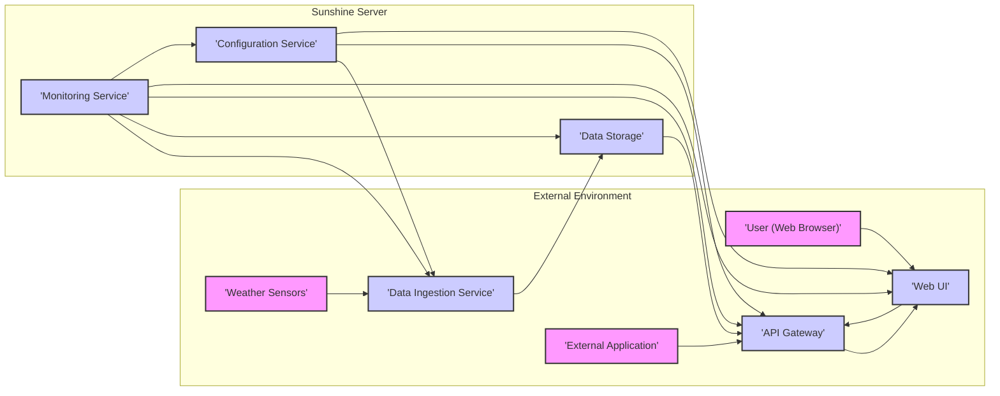
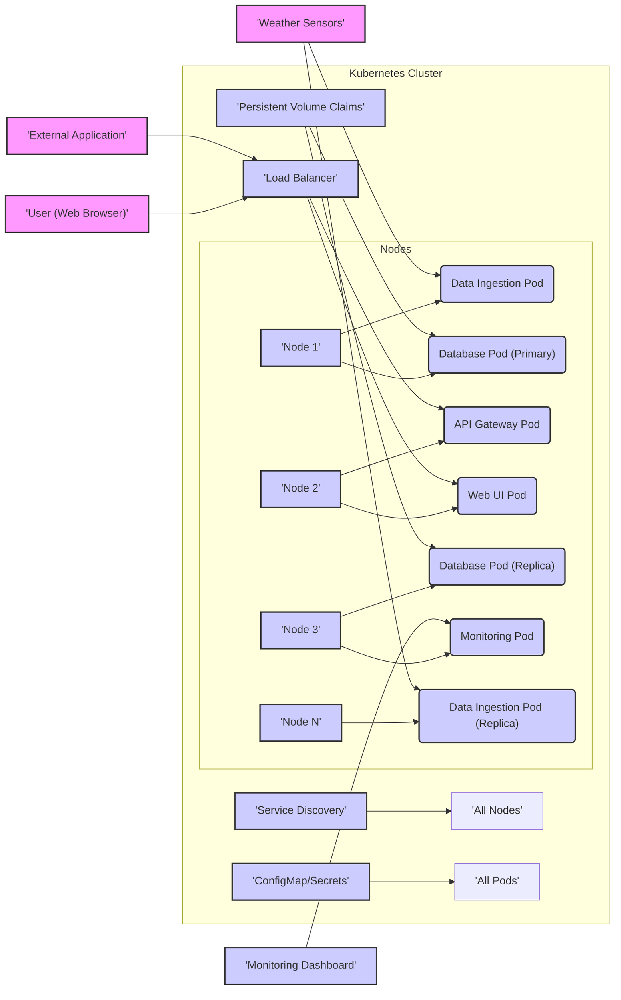

# Project Design Document: Sunshine - Personal Weather Station Server

**Version:** 1.1
**Date:** October 27, 2023
**Author:** Gemini (AI Expert in Software, Cloud, and Cybersecurity Architecture)

## 1. Project Overview

**Project Name:** Sunshine

**Project Repository:** [https://github.com/lizardbyte/sunshine](https://github.com/lizardbyte/sunshine)

**Project Description:** Sunshine is a self-hosted personal weather station server designed for privacy and control. It collects data from various weather sensors, persistently stores this information, and offers both an API and a user-friendly web interface for accessing and visualizing weather data. As an open-source alternative to commercial weather services, Sunshine empowers users to own their weather data and contribute to a community-driven project.

**Purpose of this Document:** This document provides a comprehensive design blueprint for the Sunshine project. It will guide development, deployment, and subsequent threat modelling exercises. The document details the system's architecture, individual components, data flow pathways, chosen technology stack, and deployment strategies. This is a living document, subject to updates as the project evolves and matures.

## 2. Goals and Objectives

* **Comprehensive Data Acquisition:** Support a wide range of weather sensors, capturing diverse environmental parameters (temperature, humidity, pressure, wind speed, direction, rainfall, UV index, etc.).
* **Robust Data Storage:** Implement a reliable and efficient data storage mechanism optimized for time-series data, ensuring data durability and efficient querying.
* **Versatile API Access:** Develop a well-documented and secure RESTful API to enable programmatic access to both historical and real-time weather data for various applications and integrations.
* **Intuitive Web Visualization:** Create a user-friendly and visually appealing web interface for interactive data exploration, visualization through charts, graphs, and customizable dashboards, and system configuration.
* **Simplified Self-Hosting:**  Ensure ease of deployment and self-hosting on diverse infrastructure, from resource-constrained devices like Raspberry Pi to cloud environments.
* **Community-Driven Open Source:** Foster an active open-source community, encouraging contributions, transparency, and collaborative development.
* **Privacy-Centric Design:** Prioritize user privacy by minimizing reliance on external services, providing data ownership, and implementing privacy-respecting data handling practices.
* **Flexible Configuration:** Offer extensive configuration options to accommodate diverse user needs, including sensor selection, data sampling rates, unit preferences, and system settings.
* **Scalable and Extensible Architecture:** Design a modular and extensible system to facilitate future feature additions, support for new sensor types, integration with external data sources, and scalability to handle increasing data volumes and user load.
* **Reliable Operation:** Ensure system stability, fault tolerance, and mechanisms for monitoring and alerting to maintain continuous data collection and service availability.

## 3. Target Audience

* **Home Automation Integrators:** Users seeking to integrate local weather data into their home automation systems (e.g., Home Assistant, OpenHAB).
* **DIY Weather Enthusiasts & Makers:** Hobbyists and makers interested in building, customizing, and deploying their own personal weather stations.
* **Weather Data Analysts & Hobbyists:** Individuals passionate about collecting, analyzing, and visualizing hyperlocal weather patterns for personal or research purposes.
* **Software Developers:** Developers who require access to weather data for integration into their applications, services, or research projects.
* **Privacy-Focused Individuals:** Users who are concerned about data privacy and prefer self-hosted, open-source solutions over commercial weather data providers.
* **Educational Institutions:**  Schools and universities that can use Sunshine for educational purposes in meteorology, environmental science, or computer science courses.

## 4. System Architecture

Sunshine employs a modular, service-oriented architecture to promote maintainability, scalability, and clear separation of concerns.

**Components (Expanded):**

* **Weather Sensors:** (As described previously) - The physical interface to the environment.
* **Data Ingestion Service:** (As described previously) -  The data acquisition and pre-processing layer.
* **Data Storage:** (As described previously) - The persistent and optimized time-series database.
* **API Gateway:** (As described previously) - The secure and managed API access point.
* **Web UI:** (As described previously) - The user-facing visualization and configuration interface.
* **Configuration Service:** (As described previously) - Centralized configuration management for all components.
* **Monitoring Service (New):**  Responsible for monitoring the health and performance of all Sunshine components. It collects metrics, logs, and provides alerts in case of errors or performance degradation. This service is crucial for ensuring system reliability and facilitating troubleshooting.

## 5. Component Design (Detailed)

### 5.1. Weather Sensors (Detailed)

* **Data Format:** Standardized data format (e.g., JSON, CSV-like) for sensor data transmission to ensure interoperability. Define a schema for common weather parameters.
* **Sensor Discovery (Future):** Explore mechanisms for automatic sensor discovery and configuration to simplify setup for users.
* **Calibration Support (Future):**  Consider incorporating features for sensor calibration to improve data accuracy.

### 5.2. Data Ingestion Service (Detailed)

* **Buffering and Queuing:** Implement message queues (e.g., RabbitMQ, Redis Pub/Sub, Kafka - lightweight option) to buffer incoming sensor data, especially during periods of high sensor data frequency or temporary network issues. This enhances resilience and prevents data loss.
* **Data Enrichment (Future):** Explore enriching sensor data with external data sources (e.g., geolocation data, altitude) to provide more context.
* **Data Aggregation (Initial):** Implement basic data aggregation (e.g., averaging over short intervals) within the ingestion service to reduce the volume of data written to the database, especially for high-frequency sensors.
* **Logging and Error Handling:** Comprehensive logging of data ingestion processes, including successful receptions, parsing errors, validation failures, and storage issues. Implement robust error handling and retry mechanisms.

### 5.3. Data Storage (Detailed)

* **Schema Design:** Define a robust and efficient database schema optimized for time-series weather data. Consider using tags and fields for efficient querying and indexing.
* **Data Compression:** Utilize data compression techniques within the database to minimize storage footprint, especially for long-term data retention.
* **Backup and Recovery:** Implement automated backup and recovery strategies to ensure data durability and business continuity.
* **Query Optimization:** Optimize database queries for common data access patterns (e.g., retrieving data within a specific time range, for a specific sensor type).

### 5.4. API Gateway (Detailed)

* **API Versioning:** Implement API versioning (e.g., `/api/v1/weather`) to allow for future API evolution without breaking compatibility with existing clients.
* **Input Validation and Sanitization:** Rigorous input validation and sanitization for all API endpoints to prevent injection attacks and ensure data integrity.
* **CORS (Cross-Origin Resource Sharing):** Configure CORS appropriately to allow secure access from the Web UI and authorized external applications.
* **API Documentation (Swagger/OpenAPI):** Generate and maintain comprehensive API documentation using Swagger/OpenAPI for ease of use and integration by developers.
* **Security Auditing:** Implement logging and auditing of API requests for security monitoring and analysis.

### 5.5. Web UI (Detailed)

* **User Authentication and Authorization:** Implement secure user authentication and authorization mechanisms to control access to system configuration and potentially sensitive data. Consider role-based access control (RBAC).
* **Interactive Data Visualization:** Utilize interactive charting libraries to enable users to zoom, pan, and explore weather data in detail.
* **Customizable Dashboards:** Allow users to create personalized dashboards with widgets displaying relevant weather data and visualizations.
* **Responsive Design:** Ensure the Web UI is responsive and accessible across various devices (desktops, tablets, mobile phones).
* **Accessibility Considerations:** Design the Web UI with accessibility in mind, following WCAG guidelines to ensure usability for all users.

### 5.6. Configuration Service (Detailed)

* **Centralized Configuration Management:** Store all system configurations in a centralized and accessible manner.
* **Configuration Versioning:** Implement configuration versioning to track changes and allow for rollback to previous configurations if needed.
* **Secure Configuration Storage:** Securely store sensitive configuration data (e.g., API keys, database credentials) using encryption and access control mechanisms. Consider using secrets management tools (e.g., HashiCorp Vault) for sensitive credentials in more complex deployments.
* **Dynamic Configuration Updates:** Enable dynamic reloading of configurations by components without requiring restarts, minimizing downtime during configuration changes.

### 5.7. Monitoring Service (Detailed)

* **Metrics Collection:** Collect key metrics from all components, including CPU usage, memory usage, disk I/O, network traffic, API request latency, data ingestion rates, database query performance, and application-specific metrics.
* **Logging Aggregation:** Centralized logging aggregation from all components for easier troubleshooting and analysis. Consider using tools like Elasticsearch, Fluentd, and Kibana (EFK stack) or Grafana Loki.
* **Alerting and Notifications:** Configure alerts based on predefined thresholds for critical metrics and system events. Implement notification mechanisms (e.g., email, Slack, push notifications) to inform administrators of issues.
* **Health Checks:** Implement health check endpoints for each component to allow for automated monitoring and service discovery.
* **Visualization Dashboards:** Create monitoring dashboards (e.g., using Grafana) to visualize key metrics and system health in real-time.

## 6. Data Flow (Detailed)

```mermaid
graph LR
    A["'Weather Sensors'"] --> B["'Data Ingestion Service: Receive Sensor Data'"];
    B --> C["'Data Ingestion Service: Buffer Data (Queue)'"];
    C --> D["'Data Ingestion Service: Parse & Validate Data'"];
    D --> E["'Data Ingestion Service: Transform & Aggregate Data'"];
    E --> F["'Data Ingestion Service: Store Data'"];
    F --> G["'Data Storage'"];
    H["'Web UI / External Application'"] --> I["'API Gateway: Request Data'"];
    I --> J["'API Gateway: Authenticate & Authorize'"];
    J --> K["'API Gateway: Rate Limiting'"];
    K --> L["'API Gateway: Route Request'"];
    L --> M["'Data Storage: Retrieve Data'"];
    M --> N["'API Gateway: Transform Data (if needed)'"];
    N --> O["'API Gateway: Return Data'"];
    O --> H["'Web UI / External Application: Display Data'"];
    P["'Monitoring Service'"] --> Q["'All Components: Collect Metrics & Logs'"];
    Q --> R["'Monitoring Service: Aggregate & Analyze'"];
    R --> S["'Monitoring Service: Alerting & Visualization'"];

    style A fill:#f9f,stroke:#333,stroke-width:2px
    style H fill:#f9f,stroke:#333,stroke-width:2px
    style P fill:#ccf,stroke:#333,stroke-width:2px

    style B fill:#ccf,stroke:#333,stroke-width:2px
    style C fill:#ccf,stroke:#333,stroke-width:2px
    style D fill:#ccf,stroke:#333,stroke-width:2px
    style E fill:#ccf,stroke:#333,stroke-width:2px
    style F fill:#ccf,stroke:#333,stroke-width:2px
    style G fill:#ccf,stroke:#333,stroke-width:2px
    style I fill:#ccf,stroke:#333,stroke-width:2px
    style J fill:#ccf,stroke:#333,stroke-width:2px
    style K fill:#ccf,stroke:#333,stroke-width:2px
    style L fill:#ccf,stroke:#333,stroke-width:2px
    style M fill:#ccf,stroke:#333,stroke-width:2px
    style N fill:#ccf,stroke:#333,stroke-width:2px
    style O fill:#ccf,stroke:#333,stroke-width:2px
    style Q fill:#ccf,stroke:#333,stroke-width:2px
    style R fill:#ccf,stroke:#333,stroke-width:2px
    style S fill:#ccf,stroke:#333,stroke-width:2px


    classDef external fill:#f9f,stroke:#333,stroke-width:2px;
    classDef internal fill:#ccf,stroke:#333,stroke-width:2px;

    class A,H external;
    class B,C,D,E,F,G,I,J,K,L,M,N,O,P,Q,R,S internal;
```

**Data Flow Steps (Expanded):**

1.  **Data Acquisition:** Weather sensors transmit data.
2.  **Data Ingestion (Receive):** Data Ingestion Service receives raw sensor data.
3.  **Data Buffering (Queue):** Data is buffered in a message queue for resilience.
4.  **Data Ingestion (Parse & Validate):** Data is parsed and validated against expected formats and ranges.
5.  **Data Ingestion (Transform & Aggregate):** Data is transformed (unit conversion, etc.) and potentially aggregated.
6.  **Data Ingestion (Store):** Processed data is prepared for storage.
7.  **Data Storage:** Data is persistently stored in the time-series database.
8.  **API Request:** Web UI or external applications request data via the API Gateway.
9.  **API Gateway (Authenticate & Authorize):** API Gateway authenticates and authorizes the request.
10. **API Gateway (Rate Limiting):** Rate limiting is applied to prevent abuse.
11. **API Gateway (Route Request):** Request is routed to the Data Storage component.
12. **Data Storage (Retrieve):** Data Storage retrieves the requested data.
13. **API Gateway (Transform Data):** Data is transformed if needed for API response format.
14. **API Gateway (Return Data):** Data is returned to the client.
15. **Data Visualization:** Web UI displays the received data.
16. **Monitoring (Collect Metrics & Logs):** Monitoring Service collects metrics and logs from all components.
17. **Monitoring (Aggregate & Analyze):** Monitoring data is aggregated and analyzed.
18. **Monitoring (Alerting & Visualization):** Alerts are triggered, and monitoring dashboards are updated.

## 7. Technology Stack (Detailed Example)

* **Programming Languages:**
    * Backend: Python (with type hinting for maintainability)
    * Frontend: TypeScript (for robust and maintainable frontend code)
* **Backend Framework:**
    * FastAPI (Python - for high performance, API-first development, and automatic OpenAPI documentation)
* **Database:**
    * TimescaleDB (PostgreSQL extension - for robust time-series capabilities, SQL standard compatibility, and scalability)
* **Web UI Framework:**
    * React (for component-based architecture, rich ecosystem, and performance)
    * UI Library: Material UI (for a consistent and modern user interface)
    * Charting Library: Chart.js or ApexCharts (for flexible and visually appealing data visualizations)
* **API Gateway (Optional, for larger deployments):**
    * Kong (Open-source, scalable, and feature-rich API Gateway) or Traefik (Cloud-native, easy to configure)
* **Configuration Management:**
    * YAML configuration files (for simple deployments)
    * Consul or etcd (for more complex, distributed deployments and dynamic configuration)
* **Message Queue (for data ingestion buffering):**
    * Redis Pub/Sub (lightweight and suitable for buffering sensor data) or RabbitMQ (more feature-rich and robust for larger deployments)
* **Monitoring and Logging:**
    * Prometheus (for metrics collection and alerting)
    * Grafana (for visualization dashboards)
    * Grafana Loki (for log aggregation - lightweight and integrates well with Prometheus/Grafana) or Elasticsearch, Fluentd, Kibana (EFK stack - more mature and feature-rich)
* **Operating System:**
    * Linux (Ubuntu Server LTS recommended for server deployments due to stability and community support)
* **Deployment:**
    * Docker and Docker Compose (for containerization and simplified local development/single-server deployments)
    * Kubernetes (for orchestration in cloud environments or larger on-premise deployments, using Helm for package management)
    * Infrastructure as Code (IaC): Terraform or Ansible (for automated infrastructure provisioning and configuration management)

## 8. Deployment Architecture (Expanded)

**Deployment Options (Detailed):**

* **Single Server Deployment (Raspberry Pi/VPS - Detailed):**
    * **Technology:** Docker Compose is ideal for orchestrating all containers (Data Ingestion, Database, API Gateway, Web UI, Configuration, Monitoring - lightweight versions if needed) on a single host.
    * **Use Case:** Personal weather station, home use, development/testing.
    * **Scalability:** Limited by the resources of a single server.
    * **High Availability:** No inherent high availability. Single point of failure.
    * **Diagram (Docker Compose - Revised):** (Diagram from previous version remains valid conceptually, but consider lightweight monitoring and config services for resource-constrained environments)

* **Containerized Deployment (Multi-Server - Detailed):**
    * **Technology:** Docker and Docker Swarm or Kubernetes for container orchestration across multiple servers.  Load balancer (e.g., Nginx, HAProxy) in front of API Gateway and Web UI containers for distributing traffic.
    * **Use Case:** Small to medium-sized deployments, departmental use, increased reliability and scalability.
    * **Scalability:** Horizontal scaling by adding more container instances and servers.
    * **High Availability:** Achieved through container replication and orchestration features.
    * **Diagram (Kubernetes Example):**

* **Cloud Deployment (AWS/Azure/GCP - Detailed):**
    * **Technology:** Leverage managed cloud services:
        * **Compute:** AWS ECS/EKS, Azure Container Instances/Kubernetes Service, Google Kubernetes Engine for container orchestration. AWS Lambda/Azure Functions/Google Cloud Functions for serverless Data Ingestion (for certain sensor protocols).
        * **Database:** AWS RDS (PostgreSQL with TimescaleDB), Azure Database for PostgreSQL, Google Cloud SQL for PostgreSQL (managed TimescaleDB options). Alternatively, cloud-managed InfluxDB.
        * **API Gateway:** AWS API Gateway, Azure API Management, Google Cloud API Gateway (managed API Gateway services).
        * **Monitoring:** AWS CloudWatch, Azure Monitor, Google Cloud Monitoring (integrated cloud monitoring solutions).
        * **Configuration Management:** AWS Systems Manager Parameter Store, Azure App Configuration, Google Cloud Secret Manager.
        * **Message Queue:** AWS SQS/SNS, Azure Service Bus, Google Cloud Pub/Sub (managed message queue services).
    * **Use Case:** Scalable, highly available, production-ready deployments, large user base, integration with other cloud services.
    * **Scalability:** Highly scalable and elastic, leveraging cloud infrastructure.
    * **High Availability:** Built-in high availability and fault tolerance provided by cloud services.
    * **Diagram (AWS Example - Conceptual):** (Conceptual diagram would show AWS services replacing Sunshine components, with arrows indicating data flow between services and external entities.  Too complex for Mermaid in this document, but visualize AWS API Gateway, ECS/EKS for containers, RDS for database, CloudWatch for monitoring, etc.)

## 9. Security Considerations (Detailed)

This section expands on security considerations, providing more specific measures for each component.

* **General Security Practices:**
    * **Principle of Least Privilege:** Apply least privilege to all service accounts, container permissions, and user roles.
    * **Regular Security Audits:** Conduct periodic security audits and penetration testing to identify and address vulnerabilities.
    * **Security Scanning:** Implement automated security scanning for code, dependencies, and container images.
    * **Input Validation Everywhere:**  Validate all inputs at every layer (sensors, API, Web UI, configuration).
    * **Output Encoding:** Encode outputs to prevent injection vulnerabilities (XSS, etc.).
    * **Secure Defaults:** Configure all components with secure defaults.
    * **Regular Updates and Patching:** Keep all software components, operating systems, and dependencies up-to-date with security patches.

* **Component-Specific Security:**

    * **Weather Sensors:**
        * **Data Integrity:** If using insecure communication protocols, consider signing sensor data to ensure integrity (if sensor capabilities allow).
        * **Physical Security:** Secure physical access to sensors to prevent tampering.

    * **Data Ingestion Service:**
        * **Input Validation:** Rigorously validate sensor data format, types, and ranges.
        * **Denial of Service (DoS) Prevention:** Implement rate limiting and input size limits to prevent DoS attacks.
        * **Secure Communication:** Use secure protocols (HTTPS, MQTT with TLS) for sensor data reception whenever possible.
        * **Error Handling:** Avoid exposing sensitive information in error messages.

    * **Data Storage:**
        * **Encryption at Rest:** Encrypt data at rest using database encryption features or disk encryption.
        * **Access Control:** Implement strict access control to the database, limiting access to only authorized services.
        * **Database Security Hardening:** Follow database security hardening best practices.
        * **Regular Backups:** Securely store database backups and test recovery procedures.

    * **API Gateway:**
        * **Authentication:** Implement strong authentication mechanisms (API Keys, OAuth 2.0, JWT).
        * **Authorization:** Implement fine-grained authorization to control access to API endpoints and data based on user roles or API keys.
        * **HTTPS Enforcement:** Enforce HTTPS for all API communication.
        * **Rate Limiting and Throttling:** Implement rate limiting and throttling to prevent abuse and DoS attacks.
        * **Input Validation:** Validate all API request parameters and payloads.
        * **CORS Configuration:** Configure CORS to restrict access to authorized origins.
        * **Security Headers:** Implement security headers (e.g., HSTS, X-Frame-Options, Content-Security-Policy) to enhance web security.

    * **Web UI:**
        * **Authentication and Authorization:** Implement strong user authentication and authorization.
        * **Session Management:** Secure session management practices (secure cookies, session timeouts).
        * **Protection against XSS, CSRF, and other web vulnerabilities:** Utilize frontend frameworks' built-in security features and follow secure coding practices.
        * **Content Security Policy (CSP):** Implement a strict CSP to mitigate XSS attacks.
        * **HTTPS Enforcement:** Enforce HTTPS for all Web UI communication.

    * **Configuration Service:**
        * **Secure Storage:** Securely store configuration data, especially sensitive credentials (encryption, access control).
        * **Access Control:** Restrict access to configuration management interfaces to authorized administrators.
        * **Audit Logging:** Log configuration changes for auditing purposes.

    * **Monitoring Service:**
        * **Secure Access:** Secure access to monitoring dashboards and alerting systems.
        * **Data Privacy:** Ensure monitoring data does not inadvertently expose sensitive user data.

This improved design document provides a more detailed and comprehensive blueprint for the Sunshine project, incorporating enhanced descriptions, expanded sections, and more specific security considerations. It is intended to be a valuable resource for development, deployment, and future threat modelling activities.