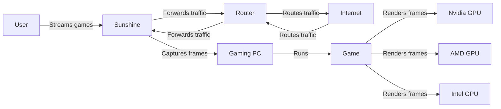
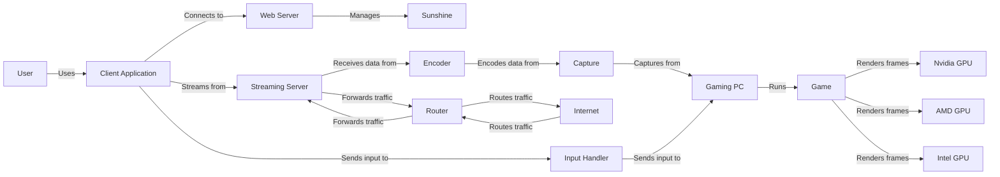
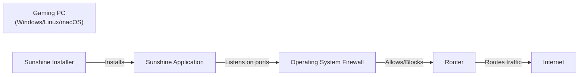
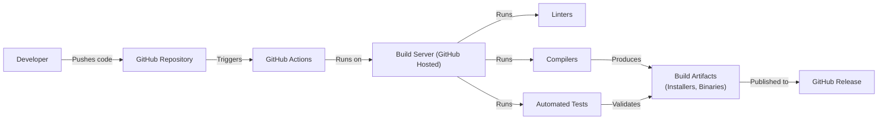

Okay, let's create a design document for the Sunshine project, focusing on aspects relevant to threat modeling.

# BUSINESS POSTURE

Sunshine is a self-hosted, open-source alternative to NVIDIA's GameStream. It aims to provide a low-latency, high-quality game streaming experience from a user's gaming PC to various client devices.  The primary business goals (even for an open-source project) are:

*   User Satisfaction: Providing a smooth, reliable, and high-performance streaming experience. This is paramount.
*   Community Growth: Attracting and retaining users and contributors.  A larger community means more testing, faster bug fixes, and more features.
*   Competitive Advantage: Offering a viable, and potentially superior, alternative to proprietary solutions like NVIDIA GameStream and cloud gaming services.
*   Accessibility: Supporting a wide range of client devices and operating systems.
*   Ease of Use: Simplifying the setup and configuration process for users.

The most important business risks that need to be addressed are:

*   Performance Degradation:  If the streaming quality is poor (high latency, low frame rate, artifacts), users will abandon the project.
*   Security Vulnerabilities:  Exploitable vulnerabilities could allow attackers to compromise the host PC or the network, leading to data breaches or system control. This is a critical risk, given the nature of the application (access to a gaming PC, potentially with sensitive data).
*   Compatibility Issues:  If Sunshine doesn't work reliably with a wide range of hardware and software configurations, its adoption will be limited.
*   Lack of Maintenance:  If the project is abandoned or development slows significantly, it will become obsolete and vulnerable.
*   Reputation Damage:  Negative reviews, security incidents, or a perception of poor quality will harm the project's reputation and discourage adoption.

# SECURITY POSTURE

Existing security controls and accepted risks (based on the GitHub repository and general knowledge of similar projects):

*   security control: Input Validation: Sunshine likely performs some input validation on client requests to prevent malformed data from causing crashes or unexpected behavior. This is crucial for preventing buffer overflows and other injection vulnerabilities. Where: Implemented in the C++ codebase handling client-server communication.
*   security control: Authentication: Sunshine uses PIN code based authentication. Where: Described in documentation and implemented in the code.
*   security control: Encryption: Communication between client and server is encrypted using TLS. Where: Described in documentation and implemented in the code.
*   security control: Web UI: Sunshine has Web UI for configuration. Where: Implemented in the code.
*   security control: UPnP: Sunshine uses UPnP to automatically configure the router. Where: Implemented in the code.
*   accepted risk: Limited Access Control: Sunshine, by its nature, grants significant access to the host PC. While it aims to restrict this access to game streaming, the inherent risk of running a remote access service is accepted.
*   accepted risk: Dependency Vulnerabilities:  Like all software, Sunshine relies on third-party libraries and dependencies.  Vulnerabilities in these dependencies could be exploited.  The project likely relies on regular updates and community vigilance to mitigate this risk.
*   accepted risk: User Configuration Errors:  The security of the system ultimately depends on the user configuring it correctly (e.g., strong passwords, firewall rules).  Misconfiguration is a significant risk.
*   accepted risk: UPnP: UPnP is known to have security issues and is often disabled by security-conscious users.

Recommended security controls (high priority):

*   Implement robust authorization mechanisms beyond simple PIN code. Consider options like per-client authorization tokens and granular permission control.
*   Integrate regular security audits and penetration testing into the development lifecycle.
*   Implement a Content Security Policy (CSP) for the Web UI to mitigate XSS vulnerabilities.
*   Provide clear security guidance and best practices to users, including recommendations for firewall configuration and network segmentation.
*   Consider implementing a mechanism for automatic updates (with user consent) to ensure timely patching of security vulnerabilities.
*   Explore sandboxing or containerization techniques to limit the potential impact of a compromised Sunshine instance.
*   Implement signed releases to prevent tampering with the distributed binaries.
*   Implement a mechanism to disable UPnP and provide clear instructions for manual port forwarding.

Security Requirements:

*   Authentication:
    *   Strong authentication mechanisms should be used to verify the identity of clients connecting to the Sunshine server.
    *   Support for multi-factor authentication (MFA) should be considered.
    *   PIN codes should be of sufficient length and complexity.
    *   Brute-force protection mechanisms should be implemented to prevent attackers from guessing PINs.

*   Authorization:
    *   Access control should be enforced to ensure that only authorized clients can access specific resources and functionalities.
    *   Granular permissions should be implemented to limit the scope of access for each client.
    *   The principle of least privilege should be followed.

*   Input Validation:
    *   All input received from clients should be strictly validated to prevent injection attacks (e.g., command injection, SQL injection, XSS).
    *   Input validation should be performed on both the client and server sides.
    *   A whitelist approach (allowing only known-good input) should be preferred over a blacklist approach (blocking known-bad input).

*   Cryptography:
    *   TLS 1.3 (or a similarly strong protocol) should be used to encrypt all communication between the client and server.
    *   Strong cryptographic algorithms and key lengths should be used.
    *   Proper key management practices should be followed.
    *   Certificates should be validated to prevent man-in-the-middle attacks.

*   Web UI:
    *   Web UI should be protected against common web vulnerabilities like XSS, CSRF, etc.

# DESIGN

## C4 CONTEXT

Element Descriptions:

*   1.  Name: User
    2.  Type: Person
    3.  Description: A person who wants to stream games from their gaming PC to a client device.
    4.  Responsibilities: Initiates the streaming session, controls the game, and views the streamed video.
    5.  Security controls: Uses a client application that implements secure communication protocols (e.g., TLS).

*   1.  Name: Sunshine
    2.  Type: Software System
    3.  Description: The core application that captures, encodes, and streams game data.
    4.  Responsibilities: Captures game frames, encodes the frames into a video stream, transmits the stream to the client, receives input from the client, and sends input to the game.
    5.  Security controls: Input validation, authentication (PIN), TLS encryption, Web UI security.

*   1.  Name: Gaming PC
    2.  Type: Hardware
    3.  Description: The user's computer that runs the game and Sunshine.
    4.  Responsibilities: Runs the game, renders frames, executes Sunshine.
    5.  Security controls: Operating system security features (firewall, user accounts), antivirus software.

*   1.  Name: Internet
    2.  Type: Infrastructure
    3.  Description: The global network that connects the client and server.
    4.  Responsibilities: Transports data between the client and server.
    5.  Security controls: Relies on lower-level network security protocols (e.g., IPsec) and the security of intermediate networks.

*   1.  Name: Game
    2.  Type: Software Application
    3.  Description: The video game being streamed.
    4.  Responsibilities: Renders the game world and responds to user input.
    5.  Security controls: Relies on its own internal security mechanisms (if any).

*   1.  Name: Nvidia GPU
    2.  Type: Hardware
    3.  Description: Nvidia graphics card.
    4.  Responsibilities: Rendering frames.
    5.  Security controls: N/A

*   1.  Name: AMD GPU
    2.  Type: Hardware
    3.  Description: AMD graphics card.
    4.  Responsibilities: Rendering frames.
    5.  Security controls: N/A

*   1.  Name: Intel GPU
    2.  Type: Hardware
    3.  Description: Intel graphics card.
    4.  Responsibilities: Rendering frames.
    5.  Security controls: N/A

*   1.  Name: Router
    2.  Type: Hardware
    3.  Description: Network device routing traffic between Gaming PC and Internet.
    4.  Responsibilities: Traffic routing.
    5.  Security controls: Firewall, NAT.

## C4 CONTAINER

Element Descriptions:

*   1.  Name: User
    2.  Type: Person
    3.  Description: A person who wants to stream games.
    4.  Responsibilities: Interacts with the client application.
    5.  Security controls: Uses a secure client.

*   1.  Name: Client Application
    2.  Type: Software Application
    3.  Description: The application running on the client device (e.g., Moonlight).
    4.  Responsibilities: Connects to Sunshine, decodes and displays the video stream, sends user input.
    5.  Security controls: TLS communication, secure input handling.

*   1.  Name: Sunshine
    2.  Type: Software System
    3.  Description: The main Sunshine application.
    4.  Responsibilities: Manages the streaming session, coordinates other components.
    5.  Security controls: Overall security management.

*   1.  Name: Web Server
    2.  Type: Container
    3.  Description: Serves the web UI for configuration.
    4.  Responsibilities: Handles HTTP requests for the configuration interface.
    5.  Security controls: Authentication, input validation, CSP, CSRF protection.

*   1.  Name: Streaming Server
    2.  Type: Container
    3.  Description: Handles the actual streaming of game data.
    4.  Responsibilities: Receives encoded data, transmits it to the client.
    5.  Security controls: TLS encryption, authentication.

*   1.  Name: Input Handler
    2.  Type: Container
    3.  Description: Processes input from the client.
    4.  Responsibilities: Receives input events, translates them into game input.
    5.  Security controls: Input validation, sanitization.

*   1.  Name: Encoder
    2.  Type: Container
    3.  Description: Encodes the captured frames into a video stream.
    4.  Responsibilities: Compresses the video data using a suitable codec (e.g., H.264, H.265, AV1).
    5.  Security controls: Uses a secure and up-to-date encoder library.

*   1.  Name: Capture
    2.  Type: Container
    3.  Description: Captures frames from the game.
    4.  Responsibilities: Interfaces with the operating system and graphics API to capture frames.
    5.  Security controls: Uses secure APIs for frame capture.

*   1.  Name: Gaming PC
    2.  Type: Hardware
    3.  Description: The user's computer.
    4.  Responsibilities: Runs the game and Sunshine components.
    5.  Security controls: OS security, firewall.

*   1.  Name: Game
    2.  Type: Software Application
    3.  Description: The video game.
    4.  Responsibilities: Renders the game.
    5.  Security controls: N/A

*   1.  Name: Nvidia GPU
    2.  Type: Hardware
    3.  Description: Nvidia graphics card.
    4.  Responsibilities: Rendering frames.
    5.  Security controls: N/A

*   1.  Name: AMD GPU
    2.  Type: Hardware
    3.  Description: AMD graphics card.
    4.  Responsibilities: Rendering frames.
    5.  Security controls: N/A

*   1.  Name: Intel GPU
    2.  Type: Hardware
    3.  Description: Intel graphics card.
    4.  Responsibilities: Rendering frames.
    5.  Security controls: N/A

*   1.  Name: Router
    2.  Type: Hardware
    3.  Description: Network device routing traffic.
    4.  Responsibilities: Traffic routing.
    5.  Security controls: Firewall, NAT.

*   1.  Name: Internet
    2.  Type: Infrastructure
    3.  Description: The global network.
    4.  Responsibilities: Transports data.
    5.  Security controls: Network protocols.

## DEPLOYMENT

Sunshine is typically deployed as a standalone application on a Windows, Linux, or macOS gaming PC. There are a few possible deployment scenarios:

1.  **Direct Installation:** The user downloads the Sunshine installer and runs it directly on their gaming PC. This is the most common scenario.
2.  **Docker Container:** Sunshine can be deployed within a Docker container. This provides some isolation and simplifies dependency management.
3.  **Headless Server:** Sunshine can be run on a headless server (without a monitor) for dedicated streaming.

We'll describe the **Direct Installation** scenario in detail, as it's the most common and presents the most direct security challenges.

Element Descriptions:

*   1.  Name: Gaming PC (Windows/Linux/macOS)
    2.  Type: Node
    3.  Description: The user's computer running the chosen operating system.
    4.  Responsibilities: Hosts the Sunshine application and the game.
    5.  Security controls: Operating system security features (user accounts, firewall, updates), antivirus software.

*   1.  Name: Sunshine Installer
    2.  Type: Software
    3.  Description: The executable that installs Sunshine.
    4.  Responsibilities: Copies files, creates configuration, sets up services (if necessary).
    5.  Security controls: Should be digitally signed to verify its authenticity.

*   1.  Name: Sunshine Application
    2.  Type: Software
    3.  Description: The running instance of Sunshine.
    4.  Responsibilities: Provides the game streaming service.
    5.  Security controls: Input validation, authentication, TLS encryption, Web UI security.

*   1.  Name: Operating System Firewall
    2.  Type: Software
    3.  Description: The built-in firewall of the operating system.
    4.  Responsibilities: Controls network access to the Sunshine application.
    5.  Security controls: Firewall rules configured by the user or automatically by Sunshine (with user consent).  Should be configured to allow inbound connections on the necessary ports for Sunshine.

*   1.  Name: Router
    2.  Type: Hardware
    3.  Description: Network device routing traffic.
    4.  Responsibilities: Traffic routing.
    5.  Security controls: Firewall, NAT.

*   1.  Name: Internet
    2.  Type: Infrastructure
    3.  Description: The global network.
    4.  Responsibilities: Transports data.
    5.  Security controls: Network protocols.

## BUILD

Sunshine uses GitHub Actions for its build process. The build process is triggered by pushes and pull requests to the repository.

Security Controls in the Build Process:

*   Source Code Management: GitHub provides access control and version history.
*   Build Automation: GitHub Actions automates the build process, ensuring consistency and reducing manual errors.
*   Linters: The build process likely includes linters to check for code style and potential errors. Where: Defined in the GitHub Actions workflow files.
*   Compilers: Compilers with appropriate security flags should be used. Where: Defined in the build scripts and CMake configuration.
*   Automated Tests: Unit tests and other automated tests help ensure code quality and prevent regressions. Where: Defined in the project's test suite and run as part of the GitHub Actions workflow.
*   Dependency Management: The project uses package managers (like vcpkg) to manage dependencies.  Regular updates are crucial to address vulnerabilities in dependencies. Where: Defined in CMakeLists.txt and vcpkg.json.
*   Signed Releases:  While not currently implemented, signing the released binaries would help prevent tampering.

# RISK ASSESSMENT

*   Critical Business Processes:
    *   Game Streaming: The core functionality of providing a low-latency, high-quality game streaming experience.
    *   User Authentication and Authorization: Ensuring that only authorized users and clients can access the streaming service.
    *   Configuration Management: Allowing users to configure Sunshine settings securely and easily.

*   Data to Protect:
    *   User Credentials (PINs):  These should be protected from unauthorized access. Sensitivity: Medium.
    *   Game Data (Video Stream):  While not typically considered highly sensitive, the video stream could reveal information about the user's gaming habits. Sensitivity: Low.
    *   System Configuration:  Information about the user's system configuration could be used to identify potential vulnerabilities. Sensitivity: Medium.
    *   Input Data: Keystrokes and mouse movements transmitted from the client to the host. Sensitivity: Low to Medium (depending on the game and potential for sensitive input).
    *   Web UI session cookies: Used to maintain authenticated session in Web UI. Sensitivity: High.

# QUESTIONS & ASSUMPTIONS

*   Questions:
    *   What is the intended user base (technical expertise)? This influences the level of security guidance needed. Assumption: Users have some technical knowledge, but not necessarily security expertise.
    *   What are the specific performance targets (latency, frame rate)? This helps prioritize performance-related security considerations. Assumption: Low latency (<50ms) and high frame rate (60fps) are critical.
    *   Are there any plans for features that might introduce new security risks (e.g., cloud storage integration, multi-user support)? Assumption: No immediate plans for features that significantly expand the attack surface.
    *   What level of support is provided for older operating systems and hardware? This impacts the choice of security technologies. Assumption: Focus is on supporting relatively recent OS versions and hardware.
    *   What is the process for handling security vulnerabilities reported by users or researchers? Assumption: There is a process for receiving and addressing vulnerability reports, but it may not be formally documented.
    *   Is there any plan to support hardware-accelerated encryption/decryption? Assumption: No.
    *   Is there any plan to support two-factor authentication? Assumption: No.

*   Assumptions (Business Posture):
    *   The project prioritizes user experience and performance over strict security measures.
    *   The project relies on community contributions for security testing and vulnerability identification.
    *   The project has limited resources for dedicated security personnel.

*   Assumptions (Security Posture):
    *   Users are responsible for securing their own networks and devices.
    *   The project assumes a relatively trusted network environment (e.g., a home network).
    *   The project relies on the security of underlying operating systems and libraries.

*   Assumptions (Design):
    *   The primary deployment model is direct installation on a Windows gaming PC.
    *   The client application (Moonlight) is considered reasonably secure.
    *   The build process is automated using GitHub Actions.
    *   UPnP is used for automatic port forwarding, despite its security risks.