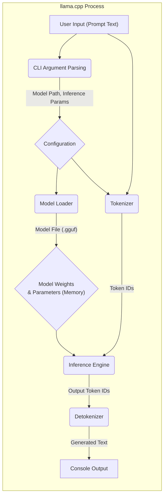
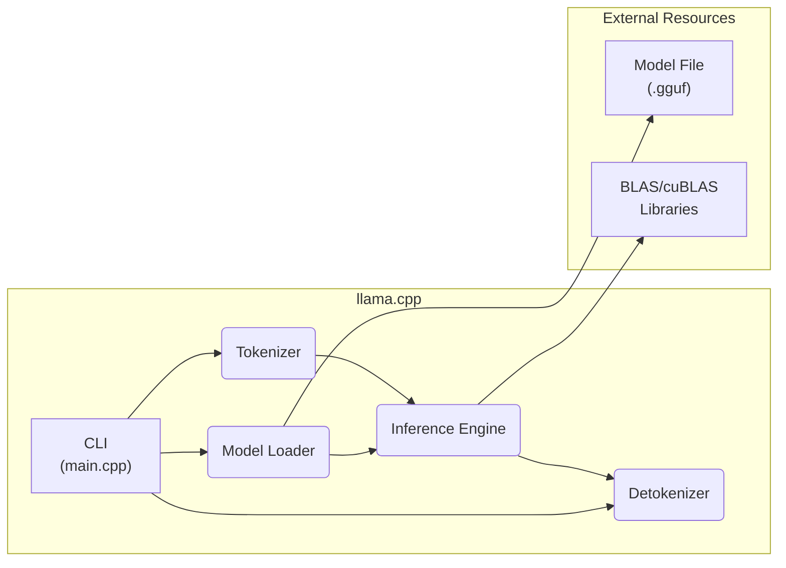

## Project Design Document: llama.cpp (Improved)

**1. Introduction**

This document provides an enhanced and more detailed design overview of the `llama.cpp` project. `llama.cpp` is a C++ based inference engine specifically designed for the LLaMA family of large language models. This document aims to provide a comprehensive understanding of the system's architecture, components, and data flow, serving as a robust foundation for subsequent threat modeling and security analysis. This document is primarily intended for security engineers, developers, and architects involved in assessing or integrating `llama.cpp`.

**2. Goals and Objectives**

The core goals driving the development of `llama.cpp` are:

* **High-Performance Inference:** Achieve optimal inference speed and efficiency for LLaMA models across diverse hardware.
* **Cross-Platform Compatibility:** Ensure seamless compilation and execution on major operating systems (Linux, macOS, Windows).
* **Developer Accessibility:** Offer a clear, well-structured, and easily understandable C++ codebase for developers.
* **Extensibility and Customization:** Facilitate modifications and extensions to the inference pipeline.
* **Minimal Resource Footprint:** Optimize memory usage and computational demands during inference.
* **Community Engagement:** Foster an active community for contributions and improvements.

**3. Architecture Overview**

`llama.cpp` operates as a command-line application, built in C++, focused on performing inference with pre-trained LLaMA models. The process involves loading model weights from files and generating text based on user-provided prompts. The architecture can be conceptually divided into the following stages:

* **Initialization Phase:**  The application loads model parameters and the substantial weight data from persistent storage (disk) into the system's memory.
* **Input Processing:** User-provided text prompts are transformed into a numerical representation suitable for the model.
* **Core Inference:** The numerical representation of the prompt is fed through the LLaMA model's neural network layers to produce output tokens.
* **Output Generation:** The generated numerical tokens are converted back into human-readable text.

**4. Component Details**

This section provides a deeper dive into the key components of the `llama.cpp` project:

* **Command Line Interface (CLI) (`main.cpp`):**
    * **Functionality:**  Parses command-line arguments provided by the user to configure the inference process.
    * **Details:**  Utilizes standard C++ mechanisms for argument parsing. Handles options such as:
        * `--model`: Path to the LLaMA model file.
        * `--prompt`: The input text prompt for the model.
        * `--n_predict`: The maximum number of tokens to generate.
        * `--temp`:  The sampling temperature for controlling randomness.
        * Various other parameters controlling decoding strategy and resource usage.
    * **Security Relevance:**  A potential entry point for malicious input that could exploit vulnerabilities if not properly validated.

* **Model Loader (`llama.h`, `llama.cpp`):**
    * **Functionality:** Reads and interprets the binary data representing the LLaMA model's weights and configuration.
    * **Details:**  Typically handles model files in formats like `.gguf`. Performs validation checks such as:
        * Magic number verification to identify the file type.
        * Schema validation to ensure the file structure matches the expected format.
        * Basic sanity checks on parameter values.
    * **Security Relevance:**  Critical component as it handles external data. Vulnerabilities here could lead to arbitrary code execution if a malicious model file is loaded.

* **Inference Engine (`llama.h`, `llama.cpp`):**
    * **Functionality:**  Implements the core logic for performing the forward pass through the LLaMA transformer network.
    * **Details:**  Contains the implementation of:
        * Attention mechanisms (Self-Attention, Multi-Head Attention).
        * Feed-forward neural network layers.
        * Layer normalization.
        * Matrix multiplication operations, often optimized using libraries like BLAS or cuBLAS.
    * **Security Relevance:**  Potential for vulnerabilities like buffer overflows or integer overflows if calculations are not handled carefully, especially when dealing with large tensors.

* **Tokenizer/Detokenizer (`llama.h`, `llama.cpp`, potentially external libraries like SentencePiece):**
    * **Tokenizer Functionality:** Converts input text strings into sequences of numerical tokens based on the model's vocabulary.
    * **Detokenizer Functionality:** Converts the generated numerical tokens back into human-readable text strings.
    * **Details:**  Often utilizes byte-pair encoding (BPE) or similar techniques. May integrate with external libraries like SentencePiece for more advanced tokenization.
    * **Security Relevance:**  Improper handling of input strings during tokenization could lead to vulnerabilities. The vocabulary itself could be a point of interest for adversarial attacks.

* **Memory Management (`llama.h`, `llama.cpp`):**
    * **Functionality:**  Manages the allocation and deallocation of memory required for storing model weights, intermediate calculations, and other data structures.
    * **Details:**  Crucial for handling the large memory footprint of LLaMA models. May involve custom allocators or leveraging standard C++ memory management.
    * **Security Relevance:**  Memory management errors (e.g., use-after-free, double-free) are common sources of security vulnerabilities.

* **Hardware Abstraction Layer (Implicit):**
    * **Functionality:**  Provides an abstraction layer to utilize different hardware acceleration options.
    * **Details:**  Often implemented through conditional compilation or runtime checks to leverage:
        * CPU with SIMD instructions (e.g., AVX2, AVX512).
        * GPU via CUDA (NVIDIA) or Metal (Apple).
        * Potentially other hardware acceleration APIs.
    * **Security Relevance:**  Interactions with hardware-specific APIs can introduce vulnerabilities if not handled securely.

**5. Data Flow (Detailed)**

The following diagram provides a more granular view of the data flow within `llama.cpp` during an inference request:

**Detailed Data Flow Steps:**

1. **User Input (Prompt Text):** The user provides a text prompt as input to the `llama.cpp` executable via the command line.
2. **CLI Argument Parsing:** The `main.cpp` component parses the command-line arguments, extracting the model path, prompt text, and various inference parameters.
3. **Configuration:** The parsed arguments are used to create a configuration object holding settings for the inference process.
4. **Model Loader:** The Model Loader component, guided by the model path in the configuration, reads the LLaMA model file from disk.
5. **Model Weights & Parameters (Memory):** The model weights and parameters are loaded into the system's memory. This is a significant data transfer.
6. **Tokenizer:** The Tokenizer component, using the model's vocabulary, converts the user's input prompt into a sequence of numerical token IDs.
7. **Inference Engine:** The Inference Engine receives the token IDs and the loaded model weights. It performs the forward pass calculations through the LLaMA network.
8. **Output Token IDs:** The Inference Engine generates a sequence of numerical token IDs representing the model's predicted output.
9. **Detokenizer:** The Detokenizer component converts the output token IDs back into human-readable text using the model's vocabulary.
10. **Console Output:** The generated text is printed to the console, providing the model's response to the user's prompt.

**6. Security Considerations (Detailed)**

This section expands on potential security risks and considerations for `llama.cpp`:

* **Input Validation Vulnerabilities:**
    * **Risk:** Maliciously crafted input prompts provided via the CLI could exploit vulnerabilities in the tokenization or inference process, potentially leading to buffer overflows, denial of service, or other unexpected behavior.
    * **Mitigation:** Implement robust input validation and sanitization techniques for all user-provided data. Limit the size of input prompts.

* **Malicious Model Files (Supply Chain Risk):**
    * **Risk:** Loading a compromised or maliciously crafted model file could lead to arbitrary code execution within the `llama.cpp` process. This could occur during the model loading phase if the file contains executable code or exploits parsing vulnerabilities.
    * **Mitigation:** Implement strong verification mechanisms for model files, including:
        * Cryptographic signatures to ensure authenticity and integrity.
        * Strict validation of the file format and contents against a known schema.
        * Consider running the model loading process in a sandboxed environment.

* **Memory Safety Issues:**
    * **Risk:**  Vulnerabilities such as buffer overflows, use-after-free errors, and double-free errors in the C++ code, particularly within memory management and tensor operations, could be exploited to gain control of the application or cause crashes.
    * **Mitigation:**
        * Employ secure coding practices and memory-safe programming techniques.
        * Utilize memory safety tools like AddressSanitizer (ASan) and MemorySanitizer (MSan) during development and testing.
        * Conduct thorough code reviews and penetration testing.

* **Dependency Vulnerabilities:**
    * **Risk:**  Vulnerabilities in third-party libraries used by `llama.cpp` (e.g., BLAS implementations) could be exploited.
    * **Mitigation:**
        * Regularly update dependencies to their latest secure versions.
        * Use dependency scanning tools to identify known vulnerabilities.
        * Consider using statically linked libraries to reduce the attack surface.

* **Information Disclosure:**
    * **Risk:**  Error messages, debugging output, or temporary files could inadvertently leak sensitive information about the model, the input prompt, or the system environment.
    * **Mitigation:**
        * Implement careful error handling and logging practices.
        * Avoid exposing sensitive information in error messages.
        * Securely manage temporary files.

* **Denial of Service (DoS):**
    * **Risk:**  Maliciously crafted input prompts or requests could consume excessive resources (CPU, memory), leading to a denial of service.
    * **Mitigation:**
        * Implement resource limits and quotas.
        * Employ rate limiting for API access (if applicable in future extensions).

* **Side-Channel Attacks:**
    * **Risk:**  Information about the model or the input could potentially be inferred by observing the execution time, power consumption, or other side channels during inference.
    * **Mitigation:**  Mitigating side-channel attacks is complex and often requires specialized techniques. This is a less immediate concern for the current command-line application but could become relevant if `llama.cpp` is used in more sensitive contexts.

**7. Deployment Considerations (Expanded)**

Deployment of `llama.cpp` typically involves:

* **Compilation:** Compiling the C++ source code for the target platform using a C++ compiler (e.g., g++, clang).
* **Model File Distribution:**  Distributing the pre-trained LLaMA model file alongside the executable. This raises security concerns about the integrity and authenticity of the model file.
* **Dependency Management:** Ensuring that any required libraries (e.g., BLAS, CUDA runtimes) are installed and accessible on the target system.
* **Execution Environment:** Running the compiled executable from the command line or integrating it into other applications.

Security considerations during deployment include:

* **Secure Distribution of Model Files:**  Using secure channels and integrity checks (e.g., checksums, signatures) when distributing model files.
* **Permissions and Access Control:**  Ensuring that the `llama.cpp` executable and model files have appropriate permissions to prevent unauthorized access or modification.
* **Sandboxing or Containerization:**  Consider deploying `llama.cpp` within a sandboxed environment (e.g., using Docker) to limit its access to system resources.

**8. Diagrams**

The data flow diagram was updated in section 5. The high-level component diagram remains similar but with more explicit connections:

**9. Future Considerations (Security Focused)**

Future development efforts should prioritize security considerations:

* **Formal Security Audits:** Conducting regular security audits and penetration testing to identify potential vulnerabilities.
* **Input Sanitization Libraries:**  Integrating robust input sanitization libraries to prevent injection attacks.
* **Memory-Safe Language Alternatives (Exploration):** While `llama.cpp` is in C++, exploring safer alternatives for certain components could be considered for long-term security.
* **Secure Model Loading Framework:** Developing a more secure framework for loading and verifying model files.
* **Sandboxing Integration:**  Providing built-in support or guidance for running `llama.cpp` in sandboxed environments.

This improved design document provides a more comprehensive and security-aware overview of the `llama.cpp` project, better equipping stakeholders for effective threat modeling and security analysis.