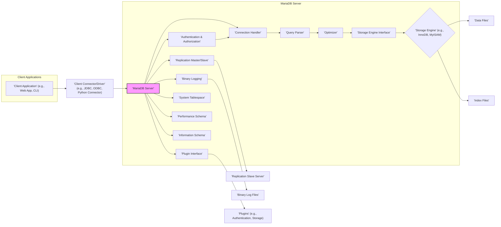
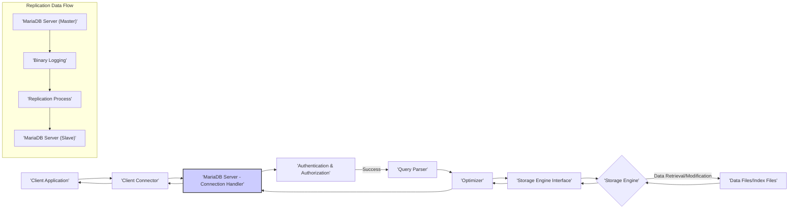

# Project Design Document: MariaDB Database System - For Threat Modeling

**Version:** 1.1
**Date:** October 26, 2023
**Author:** AI Software Architect

## 1. Introduction

This document provides a detailed architectural design of the MariaDB database system, specifically tailored for use in threat modeling activities. It is based on the project repository available at [https://github.com/mariadb/mariadb](https://github.com/mariadb/mariadb). The primary goal is to offer a clear and comprehensive understanding of the system's components, their interactions, and inherent security characteristics to facilitate the identification of potential threats and vulnerabilities.

## 2. Goals and Objectives

The primary goals of this design document, in the context of threat modeling, are to:

*   Provide a detailed architectural overview of MariaDB, highlighting security-relevant components and data flows.
*   Clearly identify the boundaries and interactions between different parts of the system to understand potential attack surfaces.
*   Describe the security mechanisms and controls implemented within MariaDB.
*   Serve as a foundation for systematically identifying potential threats, vulnerabilities, and attack vectors.
*   Enable informed decision-making regarding security mitigations and countermeasures.

## 3. System Architecture

MariaDB's architecture is designed around a client-server model with a modular structure, allowing for different storage engines and extensions. Understanding these modules and their interactions is crucial for effective threat modeling.

### 3.1. High-Level Architecture

### 3.2. Component Description

*   **Client Application:**  Any software application that initiates connections and sends requests to the MariaDB server. *Security Relevance:* Potential source of malicious input or compromised credentials.
*   **Client Connector/Driver:**  Libraries facilitating communication between client applications and the MariaDB server, handling protocol translation and data serialization. *Security Relevance:* Vulnerabilities in connectors can expose the database to attacks.
*   **MariaDB Server (mysqld):** The core process responsible for managing all database operations. *Security Relevance:* The primary target for attacks, responsible for enforcing security policies.
*   **Connection Handler:** Manages incoming client connections, including initial handshake and protocol negotiation. *Security Relevance:*  Handles authentication attempts and can be a point of denial-of-service attacks.
*   **Authentication & Authorization:** Verifies the identity of connecting clients and determines their privileges to access and manipulate database objects. *Security Relevance:* Critical for preventing unauthorized access and data breaches.
*   **Query Parser:** Analyzes SQL queries for syntax and semantics, preparing them for optimization and execution. *Security Relevance:* Vulnerable to SQL injection if not properly implemented.
*   **Optimizer:** Determines the most efficient execution plan for a given query. *Security Relevance:* While not directly a security component, inefficient plans can lead to resource exhaustion.
*   **Storage Engine Interface:** Provides an abstraction layer, allowing different storage engines to be used. *Security Relevance:* Ensures consistent interaction regardless of the underlying storage mechanism.
*   **Storage Engine (e.g., InnoDB, MyISAM):** Responsible for the physical storage, retrieval, and management of data on disk. *Security Relevance:*  Handles data encryption at rest and enforces storage-level security features.
*   **Data Files:** Physical files where the actual database data is stored. *Security Relevance:* Requires appropriate access controls and encryption to protect data confidentiality and integrity.
*   **Index Files:** Data structures used to speed up data retrieval operations. *Security Relevance:*  While not directly containing sensitive data, their integrity is important for performance and data consistency.
*   **Replication Master/Slave:**  Mechanism for replicating data changes to other MariaDB servers. *Security Relevance:* Requires secure communication and authentication to prevent unauthorized data replication or tampering.
*   **Replication Slave Server:** A MariaDB server receiving replicated data. *Security Relevance:* Needs to be secured against unauthorized access, similar to the master server.
*   **Binary Logging:** Records all data modification statements. *Security Relevance:* Crucial for point-in-time recovery and auditing, needs to be protected from tampering.
*   **Binary Log Files:** Physical files containing the binary log data. *Security Relevance:* Sensitive information about data changes, requires secure storage and access controls.
*   **Plugin Interface:** Allows extending MariaDB functionality with custom modules. *Security Relevance:* Plugins can introduce vulnerabilities if not developed and vetted properly.
*   **Plugins (e.g., Authentication, Storage):**  External modules providing additional features. *Security Relevance:*  Potential source of vulnerabilities or backdoors if not from trusted sources.
*   **System Tablespace:** Contains metadata about the database system itself. *Security Relevance:*  Compromise can lead to significant control over the database.
*   **Performance Schema:** Provides detailed runtime information about server performance. *Security Relevance:* Can reveal information about query patterns and potential bottlenecks.
*   **Information Schema:** Provides access to database metadata. *Security Relevance:* Can reveal information about database structure and user privileges.

## 4. Data Flow

Understanding how data flows through the MariaDB system is essential for identifying potential interception or manipulation points.

Detailed steps and security considerations:

*   **Client Request:** A client application initiates a request. *Security Consideration:* Ensure secure communication channels (e.g., TLS) to prevent eavesdropping.
*   **Connection Handling:** The connection handler receives the request. *Security Consideration:* Implement rate limiting and connection timeouts to mitigate denial-of-service attacks.
*   **Authentication & Authorization:** The server verifies the client's identity and permissions. *Security Consideration:* Enforce strong password policies, consider multi-factor authentication, and follow the principle of least privilege.
*   **Query Parsing:** The query is parsed and validated. *Security Consideration:* Implement robust input validation and parameterized queries to prevent SQL injection attacks.
*   **Optimization:** The query optimizer determines the execution plan. *Security Consideration:* While not directly a security concern, poorly optimized queries can be exploited for resource exhaustion.
*   **Storage Engine Interaction:** The storage engine interface interacts with the chosen storage engine. *Security Consideration:* Ensure the storage engine supports necessary security features like encryption at rest.
*   **Data Access:** The storage engine retrieves or modifies data in the data files and index files. *Security Consideration:* Implement appropriate file system permissions and encryption for data at rest.
*   **Response:** The results are sent back to the client. *Security Consideration:* Ensure secure transmission of sensitive data.
*   **Replication (Master to Slave):**
    *   Data modification events are logged in the binary logs on the master server. *Security Consideration:* Protect binary logs from unauthorized access and modification.
    *   The replication process securely transmits these events to the slave server. *Security Consideration:* Use secure protocols and authentication for replication traffic.
    *   The slave server applies the changes. *Security Consideration:* Ensure the slave server is also properly secured.

## 5. Key Security Considerations

These are critical areas to focus on during threat modeling:

*   **Authentication and Authorization Weaknesses:**
    *   Default credentials.
    *   Weak password policies.
    *   Insufficient privilege management.
    *   Bypass vulnerabilities in authentication mechanisms.
*   **SQL Injection Vulnerabilities:**
    *   Lack of input validation and sanitization.
    *   Use of dynamic SQL queries without proper parameterization.
*   **Network Security Deficiencies:**
    *   Unencrypted communication channels.
    *   Exposure of management ports to the public internet.
    *   Lack of network segmentation.
*   **Data at Rest and in Transit Encryption Issues:**
    *   Sensitive data stored without encryption.
    *   Weak encryption algorithms.
    *   Lack of key management practices.
*   **Vulnerabilities in Client Connectors:**
    *   Exploitable bugs in connector libraries.
    *   Insecure handling of connection strings.
*   **Replication Security Flaws:**
    *   Unauthenticated or unencrypted replication traffic.
    *   Compromised master or slave servers.
*   **Plugin Security Risks:**
    *   Malicious or vulnerable plugins.
    *   Insufficient plugin vetting processes.
*   **Logging and Auditing Deficiencies:**
    *   Insufficient logging of security-relevant events.
    *   Inadequate monitoring and alerting mechanisms.
    *   Tampering with audit logs.
*   **Backup and Recovery Security:**
    *   Unsecured backup storage.
    *   Lack of encryption for backups.
    *   Insufficient access controls for backup data.
*   **Denial of Service (DoS) Vulnerabilities:**
    *   Resource exhaustion through malformed queries or connection floods.
    *   Exploitable bugs leading to server crashes.
*   **Operating System and Infrastructure Security:**
    *   Outdated operating system or libraries.
    *   Misconfigured firewalls or security groups.
    *   Insufficient physical security of the server infrastructure.

## 6. Deployment Considerations

The deployment environment significantly impacts the threat landscape:

*   **On-Premise:**  Security is primarily the responsibility of the organization. *Security Implications:* Requires careful configuration of network security, physical security, and access controls.
*   **Cloud-Based (IaaS):**  Shared responsibility model. The cloud provider manages the underlying infrastructure, while the organization is responsible for securing the MariaDB instance. *Security Implications:* Leverage cloud provider security features (e.g., security groups, network ACLs) and ensure proper configuration of the MariaDB server.
*   **Managed Database Services (DBaaS):** The cloud provider handles most of the infrastructure and security management. *Security Implications:*  Reliance on the provider's security measures, but still requires careful configuration of access controls and data encryption.
*   **Containerized Environments (e.g., Docker, Kubernetes):**  Requires securing the container images, orchestration platform, and network configurations. *Security Implications:*  Implement container security best practices, including vulnerability scanning and secure image registries.

## 7. Technologies Used

*   **Core Programming Languages:** C, C++. *Security Relevance:* Understanding potential memory safety issues and common vulnerabilities in these languages is important.
*   **Client Connector Protocols:** TCP/IP, Unix sockets, Named Pipes. *Security Relevance:*  Ensure secure configuration and encryption where applicable.
*   **Data Storage Formats:** Varies depending on the storage engine (e.g., InnoDB's page-based format). *Security Relevance:* Understanding the storage format can be relevant for data recovery and forensic analysis.
*   **Security Protocols:** TLS/SSL for encrypted communication. *Security Relevance:*  Ensure strong cipher suites are used and properly configured.
*   **Operating Systems:** Linux, Windows, macOS, various Unix-like systems. *Security Relevance:* The underlying OS security is crucial for the overall security of the MariaDB instance.

## 8. Assumptions and Constraints

*   This document provides a general architectural overview and may not cover all specific features or configurations of every MariaDB version.
*   The security considerations listed are not exhaustive but represent common areas of concern.
*   Specific security configurations and best practices are not detailed here but are essential for a secure deployment.
*   The threat modeling process will utilize this document as a starting point and delve into more specific threats and vulnerabilities based on the deployment environment and configuration.

## 9. Future Considerations

*   Detailed diagrams illustrating the internal workings of specific components like the query optimizer or storage engines.
*   Inclusion of specific security features and their configuration options relevant to threat mitigation.
*   Analysis of specific attack scenarios and potential mitigation strategies.
*   Integration with threat intelligence feeds and vulnerability databases.
*   Regular updates to this document to reflect changes in the MariaDB architecture and security landscape.
