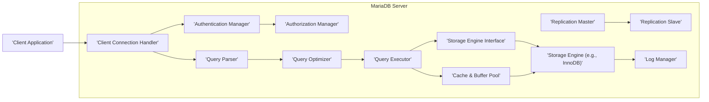

# Project Design Document: MariaDB Server

**Version:** 1.1
**Date:** October 26, 2023
**Prepared By:** AI Software Architect

## 1. Introduction

This document provides a detailed architectural design of the MariaDB Server project, based on the source code available at [https://github.com/mariadb/server](https://github.com/mariadb/server). This document aims to provide a comprehensive understanding of the system's components, their interactions, and data flows, with a specific focus on aspects relevant to security threat modeling.

## 2. Goals and Objectives

The primary goals of this design document are:

*   To clearly articulate the architecture of the MariaDB Server, emphasizing security-relevant aspects.
*   To identify key components and their specific responsibilities, including security functions.
*   To describe the detailed interactions and data flow between components, highlighting potential attack vectors.
*   To explicitly outline security features and mechanisms implemented within the design.
*   To provide a robust and detailed basis for identifying potential security threats, vulnerabilities, and attack surfaces.

## 3. Scope

This document covers the core architectural components of the MariaDB Server, focusing on the server-side aspects and their security implications. This includes:

*   Client connection establishment and management.
*   User authentication and authorization processes.
*   SQL query parsing, optimization, and execution.
*   Interaction with storage engines for data persistence and retrieval.
*   Replication mechanisms and their security considerations.
*   Internal security features such as logging and auditing.

This document does not cover:

*   Implementation details within specific storage engines beyond their interaction with the server core.
*   Client-side tools, libraries, or connectors.
*   Extensive details of configuration parameters, although key security-related configurations may be mentioned.
*   Performance tuning aspects unless directly related to security.

## 4. High-Level Architecture

The MariaDB Server employs a layered client-server architecture. The following diagram illustrates the primary components and their interactions.

## 5. Component Details

This section provides a detailed description of the key components, emphasizing their security responsibilities and potential vulnerabilities.

*   **Client Application:**
    *   Represents any external entity (application, user tool) initiating communication with the MariaDB Server.
    *   Security Relevance: A compromised client application can be a source of malicious queries or unauthorized access.

*   **Client Connection Handler:**
    *   Listens for and accepts incoming connection requests from clients.
    *   Manages network connections, including handling connection limits and timeouts.
    *   Initiates the authentication process.
    *   Security Relevance: Vulnerabilities in connection handling could lead to denial-of-service attacks or unauthorized connection establishment.

*   **Authentication Manager:**
    *   Verifies the identity of connecting clients based on provided credentials.
    *   Supports various authentication methods, including password-based authentication, socket-based authentication, and plugin-based authentication (e.g., PAM, LDAP).
    *   Manages user accounts and their associated authentication information.
    *   Security Relevance: A weak authentication mechanism or vulnerabilities in the authentication process can lead to unauthorized access. This component is critical for preventing identity theft and unauthorized database access.

*   **Authorization Manager:**
    *   Determines if an authenticated user has the necessary privileges to perform a requested action on specific database objects.
    *   Enforces access control lists (ACLs) and role-based access control (RBAC).
    *   Checks permissions at various levels (server, database, table, column).
    *   Security Relevance: Improperly configured or flawed authorization can lead to privilege escalation, data breaches, or unauthorized data modification.

*   **Query Parser:**
    *   Analyzes the syntax of incoming SQL queries.
    *   Converts the textual query into an internal representation (parse tree).
    *   Performs basic semantic checks.
    *   Security Relevance: Vulnerabilities in the parser can be exploited through SQL injection attacks if not properly sanitized later in the process.

*   **Query Optimizer:**
    *   Analyzes the parsed query and generates an efficient execution plan.
    *   Considers factors like indexes, table statistics, and query complexity to choose the optimal plan.
    *   Security Relevance: While primarily focused on performance, the optimizer's choices can indirectly impact security (e.g., choosing an index that reveals sensitive data).

*   **Query Executor:**
    *   Executes the optimized query plan.
    *   Interacts with the Storage Engine Interface to retrieve, insert, update, or delete data.
    *   Manages transactions and concurrency control.
    *   Security Relevance: This component is responsible for enforcing data access policies and ensuring data integrity. Vulnerabilities here could lead to data manipulation or leakage.

*   **Storage Engine Interface:**
    *   Provides an abstraction layer between the Query Executor and the underlying storage engines.
    *   Allows MariaDB to support different storage engines (e.g., InnoDB, MyISAM, Aria).
    *   Translates generic data access requests into storage engine-specific operations.
    *   Security Relevance: This interface must ensure that security policies are consistently enforced regardless of the underlying storage engine.

*   **Storage Engine (e.g., InnoDB):**
    *   Responsible for the physical storage and retrieval of data on disk.
    *   Manages data files, indexes, and transaction logs.
    *   Provides features like ACID properties (Atomicity, Consistency, Isolation, Durability).
    *   May implement its own security features, such as data-at-rest encryption.
    *   Security Relevance: The storage engine is critical for data confidentiality and integrity. Vulnerabilities here could lead to data breaches or corruption.

*   **Cache & Buffer Pool:**
    *   Stores frequently accessed data and metadata in memory to improve query performance.
    *   Reduces disk I/O.
    *   Security Relevance: Sensitive data may reside in the buffer pool. Proper memory management and access controls are necessary to prevent unauthorized access to cached data.

*   **Log Manager:**
    *   Handles various logging activities for auditing, recovery, and replication.
        *   **Binary Logs (binlogs):** Record data modification statements for replication and point-in-time recovery.
        *   **Error Logs:** Record server errors, warnings, and diagnostic information.
        *   **General Query Logs:** Record all executed SQL statements (can be enabled for auditing).
        *   **Slow Query Logs:** Record queries that exceed a specified execution time (useful for performance analysis and identifying potential attacks).
    *   Security Relevance: Logs are crucial for security monitoring, incident response, and forensic analysis. Secure logging practices are essential to prevent tampering or unauthorized access to log data.

*   **Replication Master:**
    *   In a replication setup, the master server records changes in its binary logs.
    *   Sends these binary log events to slave servers.
    *   Security Relevance: The replication process needs to be secured to prevent unauthorized data replication or tampering with replicated data.

*   **Replication Slave:**
    *   Connects to a master server and receives binary log events.
    *   Applies these events to its own data, replicating the changes from the master.
    *   Security Relevance: Slave servers need to authenticate with the master, and the communication channel should be secure to prevent man-in-the-middle attacks.

## 6. Data Flow (Detailed)

This section provides a more granular breakdown of the data flow for a typical client query, highlighting security checkpoints.

1. **Client Connection Request:** A client application initiates a connection to the MariaDB Server (Client Connection Handler).
2. **Connection Acceptance:** The Client Connection Handler accepts the connection and establishes a communication channel.
3. **Authentication Initiation:** The Client Connection Handler invokes the Authentication Manager.
4. **Credential Exchange:** The client provides credentials (e.g., username and password).
5. **Authentication Verification:** The Authentication Manager verifies the provided credentials against stored user information.
6. **Authentication Success/Failure:** The Authentication Manager informs the Client Connection Handler of the authentication result. On failure, the connection may be terminated.
7. **Session Establishment:** Upon successful authentication, a session is established, and the user's identity is associated with the connection.
8. **Authorization Check (Initial):** The Authorization Manager may perform initial checks based on the connected user.
9. **Query Submission:** The authenticated client sends an SQL query to the server.
10. **Query Reception:** The Client Connection Handler receives the query.
11. **Parsing:** The Query Parser analyzes the query syntax.
12. **Authorization Check (Query Level):** The Authorization Manager verifies if the authenticated user has the privileges to perform the requested operations on the specified database objects.
13. **Optimization:** The Query Optimizer generates an execution plan.
14. **Execution:** The Query Executor executes the plan, interacting with the Storage Engine Interface.
15. **Data Access Request:** The Storage Engine Interface requests data from the appropriate Storage Engine.
16. **Data Retrieval/Modification:** The Storage Engine retrieves or modifies data, potentially using the Cache & Buffer Pool.
17. **Logging (Optional):** Data modification operations may be logged by the Log Manager (e.g., in binary logs).
18. **Result Processing:** The Query Executor processes the results.
19. **Result Delivery:** The Query Executor sends the results back to the Client Connection Handler.
20. **Response to Client:** The Client Connection Handler sends the results back to the client application.

## 7. Security Considerations (Detailed)

This section expands on the security considerations, providing more specific examples and linking them to components.

*   **Authentication Security:**
    *   Strong password policies and enforcement.
    *   Support for multi-factor authentication (MFA) through plugins.
    *   Protection against brute-force attacks (e.g., account lockout mechanisms).
    *   Secure storage of authentication credentials.
    *   Secure handling of authentication protocols.

*   **Authorization Security:**
    *   Principle of least privilege: Granting only necessary permissions.
    *   Regular review of user privileges and roles.
    *   Prevention of privilege escalation vulnerabilities.
    *   Row-level security and column-level security features.

*   **Communication Security:**
    *   Support for TLS/SSL encryption for client-server communication.
    *   Configuration options for enforcing secure connections.
    *   Secure configuration of replication channels (e.g., using TLS).

*   **Data at Rest Security:**
    *   Support for storage engine-level encryption (e.g., InnoDB encryption).
    *   Secure key management practices for encryption keys.
    *   Protection of backup data.

*   **Input Validation and Sanitization:**
    *   Mechanisms to prevent SQL injection attacks by validating and sanitizing user input.
    *   Prepared statements and parameterized queries.

*   **Logging and Auditing:**
    *   Comprehensive logging of security-relevant events (e.g., login attempts, privilege changes, data modifications).
    *   Secure storage and access control for log files.
    *   Mechanisms for log rotation and retention.

*   **Replication Security:**
    *   Secure authentication between master and slave servers.
    *   Encryption of data transmitted during replication.
    *   Prevention of unauthorized access to replication logs.

*   **Vulnerability Management:**
    *   Regular security patching and updates.
    *   Monitoring for and addressing known vulnerabilities.

## 8. Deployment Considerations (Security Focused)

The deployment environment significantly impacts the security posture of the MariaDB Server.

*   **Network Segmentation:** Isolating the database server on a separate network segment with restricted access.
*   **Firewall Configuration:** Implementing strict firewall rules to allow only necessary traffic to the server.
*   **Operating System Hardening:** Securely configuring the underlying operating system, disabling unnecessary services, and applying security patches.
*   **Access Control:** Restricting physical and remote access to the server infrastructure.
*   **Regular Security Audits and Penetration Testing:** Identifying potential vulnerabilities in the deployment environment.
*   **Secure Configuration Management:** Using tools and processes to ensure consistent and secure server configurations.
*   **Intrusion Detection and Prevention Systems (IDPS):** Monitoring network traffic and system activity for malicious behavior.

## 9. Threat Landscape

Based on the architecture, potential threats to the MariaDB Server include:

*   **Unauthorized Access:** Gaining access to the database without proper authentication or authorization.
*   **Data Breaches:** Exfiltration of sensitive data by unauthorized individuals.
*   **Data Manipulation:** Unauthorized modification, deletion, or corruption of data.
*   **SQL Injection:** Exploiting vulnerabilities in query construction to execute malicious SQL code.
*   **Denial of Service (DoS):** Overwhelming the server with requests, making it unavailable to legitimate users.
*   **Privilege Escalation:** Gaining higher levels of access than initially granted.
*   **Replication Attacks:** Compromising the replication process to manipulate data on slave servers.
*   **Insider Threats:** Malicious actions by authorized users.

## 10. Future Considerations

Future architectural enhancements with potential security implications include:

*   **Enhanced Authentication Mechanisms:** Integration with more advanced authentication protocols (e.g., Kerberos).
*   **Improved Auditing Capabilities:** More granular and customizable auditing features.
*   **Automated Threat Detection and Response:** Integration with security information and event management (SIEM) systems.
*   **Blockchain Integration for Data Integrity:** Exploring the use of blockchain for verifying data integrity.

This detailed design document provides a comprehensive overview of the MariaDB Server architecture, with a strong emphasis on security considerations. It serves as a valuable resource for threat modeling and identifying potential vulnerabilities within the system.