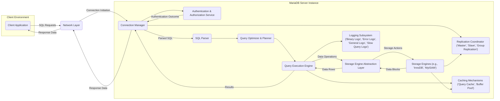
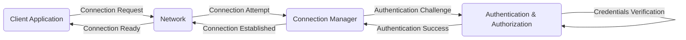
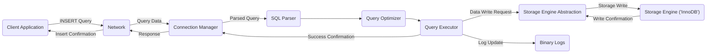

## Project Design Document: MariaDB Server (Improved)

**Version:** 1.1
**Date:** October 26, 2023
**Author:** AI Software Architect

### 1. Introduction

This document provides an enhanced architectural overview of the MariaDB Server project, building upon the information available in the GitHub repository: [https://github.com/mariadb/server](https://github.com/mariadb/server). This improved document aims to provide a more detailed foundation for subsequent threat modeling activities, offering deeper insights into the key components, data flows, and technologies involved in the MariaDB Server.

### 2. Project Overview

The MariaDB Server is a robust, community-driven, and commercially supported open-source relational database management system (RDBMS). It is a fork of the MySQL RDBMS, striving for feature parity and offering enhancements in performance, features, and open-source adherence. Its primary function is the reliable and efficient storage, management, and retrieval of structured data through the Structured Query Language (SQL).

### 3. Goals

* Provide a highly reliable and performant RDBMS solution.
* Offer scalability to accommodate growing data volumes and user loads.
* Maintain a high degree of compatibility with existing MySQL deployments.
* Introduce innovative features and improvements beyond the capabilities of MySQL.
* Uphold open-source development principles and community engagement.

### 4. Non-Goals

* This document will not delve into the internal workings of individual storage engines (e.g., InnoDB, MyISAM) beyond their general role in the architecture. The focus remains on the server's overall structure.
* Detailed specifications of client libraries, APIs, or administrative tools interacting with the MariaDB Server are outside the scope of this document.
* The intricacies of the software build process, release management, and packaging are not covered here.

### 5. Architectural Overview

The MariaDB Server employs a classic client-server model. Client applications initiate connections to the server to execute SQL commands and manipulate data. The server processes these requests, orchestrates interactions with storage engines, and returns the results to the requesting client.

#### 5.1. High-Level Architecture Diagram

#### 5.2. Component Descriptions (Enhanced)

* **Client Application:** Any software application (web server, desktop application, mobile app, etc.) that establishes a connection to the MariaDB Server to perform database operations.
* **Network Layer:** The underlying network infrastructure (typically TCP/IP) facilitating communication between clients and the server. This includes considerations for network security and protocols.
* **Connection Manager:** Responsible for handling incoming connection requests, managing active connections, and enforcing connection limits. It plays a crucial role in preventing connection flooding attacks.
* **Authentication & Authorization Service:**  Verifies the identity of connecting clients using configured authentication methods (e.g., passwords, certificates). It then enforces access control policies, determining which operations a user is permitted to perform on specific database objects.
* **SQL Parser:**  Analyzes incoming SQL statements, checking for syntactic correctness and validity against the database schema. It transforms the textual SQL into an internal representation (parse tree) for further processing.
* **Query Optimizer & Planner:**  Analyzes the parsed SQL query and develops an efficient execution plan. This involves considering available indexes, data statistics, and different query execution strategies to minimize resource consumption and execution time.
* **Query Execution Engine:** Executes the plan generated by the optimizer. It interacts with the storage engine abstraction layer to retrieve, insert, update, or delete data as specified by the query.
* **Storage Engine Abstraction Layer:** Provides a consistent interface for the query execution engine to interact with different storage engines. This allows MariaDB to support pluggable storage engines with varying characteristics (e.g., transactional support, indexing methods).
* **Storage Engines:** The core components responsible for the physical storage and retrieval of data on disk. Examples include InnoDB (known for its ACID properties and transactional integrity) and MyISAM (a legacy engine with different performance characteristics).
* **Replication Coordinator:** Manages the replication of data changes between MariaDB servers. This can be in a traditional master-slave configuration or using more advanced methods like group replication for higher availability and fault tolerance. It handles the transfer of binary logs and the application of changes on replica servers.
* **Caching Mechanisms:**  Improves performance by storing frequently accessed data in memory. The query cache stores the results of SELECT queries, while the buffer pool caches data pages from disk, reducing the need for disk I/O.
* **Logging Subsystem:** Records various server activities for auditing, recovery, and replication purposes. This includes binary logs (for replication and point-in-time recovery), error logs (for diagnosing server issues), general logs (recording connection and command activity), and slow query logs (identifying performance bottlenecks).

### 6. Data Flow (Enhanced)

Here are a few examples of data flow scenarios to illustrate different operations:

#### 6.1. Successful Client Authentication

#### 6.2. SELECT Query Execution

```mermaid
graph LR
    A("Client Application")
    B("Network")
    C("Connection Manager")
    D("SQL Parser")
    E("Query Optimizer")
    F("Query Executor")
    G("Storage Engine Abstraction")
    H("Storage Engine ('InnoDB')")

    A -- "SELECT Query" --> B
    B -- "Query Data" --> C
    C -- "Parsed Query" --> D
    D --> E
    E --> F
    F -- "Data Request" --> G
    G -- "Storage Request" --> H
    H -- "Data Rows" --> G
    G -- "Data Results" --> F
    F -- "Formatted Results" --> C
    C -- "Response Data" --> B
    B -- "Query Results" --> A
```

#### 6.3. INSERT Query Execution

### 7. Key Technologies

* **Core Programming Languages:** Primarily C and C++.
* **Networking Protocols:** TCP/IP is the standard protocol for client-server communication.
* **SQL Standard:** Adherence to SQL standards for data definition and manipulation.
* **Storage Engine Architecture:** Pluggable storage engine framework allowing for diverse data management strategies.
* **Operating System Support:** Broad compatibility across various operating systems including Linux, Windows, and macOS.
* **Build and Configuration:** Utilizes CMake for cross-platform build management.
* **Version Control:** Git, as evidenced by the project's presence on GitHub.

### 8. Deployment Model

MariaDB Server offers flexible deployment options:

* **Standalone Deployment:** A single server instance serving all client requests. Suitable for smaller applications or development environments.
* **Client-Server Model:** The fundamental architecture where multiple clients connect to a centralized MariaDB Server.
* **Master-Slave Replication:** A traditional replication setup providing read scalability and basic redundancy. Data changes are propagated from the master to one or more slaves.
* **Group Replication:** A more advanced replication technology offering higher consistency and fault tolerance through a group of servers.
* **Clustered Solutions:** Integration with clustering technologies like MariaDB Galera Cluster for high availability and distributed data management.
* **Cloud-Based Deployments:** Available as managed services (e.g., AWS RDS for MariaDB, Azure Database for MariaDB, Google Cloud SQL for MySQL) or deployed on virtual machines within cloud environments.
* **Containerization:** Popular deployment using Docker and other containerization platforms for portability and scalability.

### 9. Security Considerations (Detailed for Threat Modeling)

This section expands on potential security vulnerabilities and threats relevant to each component and data flow, providing a more granular view for threat modeling.

* **Authentication and Authorization Weaknesses:**
    * **Brute-force attacks:** Attempts to guess user credentials.
    * **Default or weak passwords:** Easily compromised credentials.
    * **SQL injection vulnerabilities:** Exploiting input validation flaws to bypass authentication.
    * **Privilege escalation:** Malicious actors gaining unauthorized administrative privileges.
    * **Insecure password storage:** Weak hashing algorithms or storing passwords in plaintext.
* **Network Security Vulnerabilities:**
    * **Man-in-the-middle (MITM) attacks:** Interception of unencrypted communication to steal credentials or data.
    * **Denial-of-service (DoS) attacks:** Flooding the server with connection requests or malicious packets to exhaust resources.
    * **Exposure of management ports:** Leaving administrative interfaces accessible to unauthorized networks.
    * **Lack of network segmentation:** Allowing lateral movement within the network after a breach.
* **SQL Injection Risks:**
    * **Unsanitized user input:** Failure to properly escape or validate user-provided data in SQL queries.
    * **Second-order SQL injection:** Malicious data stored in the database is later used in vulnerable queries.
* **Data at Rest Security Deficiencies:**
    * **Unencrypted data files:** Sensitive data stored in plaintext on disk, vulnerable to physical access breaches.
    * **Insecure key management:** Storing encryption keys in easily accessible locations or using weak key generation methods.
* **Replication Security Concerns:**
    * **Unauthorized access to replication streams:** Attackers intercepting or manipulating data being replicated.
    * **Compromised replica servers:** Attackers gaining control of replica servers and potentially influencing the master.
    * **Replication lag exploitation:** Using delays in replication to perform malicious actions before they are replicated.
* **Logging Security Issues:**
    * **Exposure of sensitive data in logs:** Logging credentials or other confidential information.
    * **Log tampering or deletion:** Attackers covering their tracks by modifying or removing log entries.
    * **Insufficient log rotation and management:** Logs consuming excessive disk space or becoming difficult to analyze.
* **Vulnerabilities in Dependencies:**
    * **Outdated libraries:** Using versions of dependent libraries with known security flaws.
    * **Unpatched operating system vulnerabilities:** Exploiting weaknesses in the underlying operating system.
* **Denial of Service (DoS) Attack Vectors:**
    * **Resource exhaustion:** Overwhelming the server with requests, consuming CPU, memory, or disk I/O.
    * **Query-based DoS:** Crafting complex or inefficient queries that consume excessive server resources.
    * **Exploiting vulnerabilities leading to crashes:** Triggering server failures through specific malicious inputs.
* **Privilege Escalation Vulnerabilities:**
    * **Exploiting bugs in stored procedures or functions:** Gaining higher privileges through vulnerable code execution paths.
    * **Weak default configurations:** Allowing users excessive privileges by default.

### 10. Assumptions and Constraints

* This document assumes a general understanding of relational database concepts and client-server architectures.
* The information presented is based on publicly available documentation and the structure observed in the MariaDB Server GitHub repository.
* Specific implementation details may vary across different versions and configurations of MariaDB Server.
* The security considerations are intended to be comprehensive but may not cover all possible threats. A thorough threat modeling exercise is crucial for identifying specific vulnerabilities.

### 11. Future Considerations

* Development of more detailed component diagrams illustrating internal interactions.
* Creation of data flow diagrams for specific administrative tasks (e.g., user creation, backup/restore).
* Analysis of the security implications of specific MariaDB Server features and extensions.
* Integration with security best practices and hardening guidelines for MariaDB deployments.
