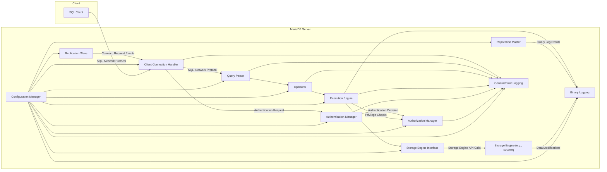
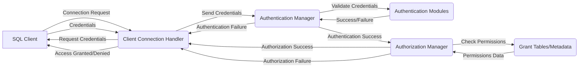

# Project Design Document: MariaDB Server (Improved)

## 1. Project Overview

This document provides an enhanced architectural design of the MariaDB Server project, based on the codebase available at [https://github.com/mariadb/server](https://github.com/mariadb/server). This design expands upon the previous version, offering more detail on component interactions and security considerations, specifically tailored for effective threat modeling. The document aims to provide a comprehensive understanding of the core functionalities and data flows within the MariaDB Server.

## 2. Goals and Objectives

The primary goal of this improved document is to provide a more detailed and actionable architectural representation of the MariaDB Server, specifically for threat modeling purposes. The specific objectives are:

*   Provide a more granular breakdown of the major components within the MariaDB Server.
*   Elaborate on the interactions and data flows between these components, including communication protocols where relevant.
*   Deepen the discussion of key security-relevant aspects of the architecture, highlighting potential vulnerabilities.
*   Offer a more robust foundation for conducting thorough and targeted threat modeling exercises.
*   Serve as an enhanced reference point for understanding the system's structure and security posture.

## 3. Target Audience

This document is intended for the same audience as the previous version, with an emphasis on providing more actionable information for security professionals:

*   Security engineers responsible for threat modeling, security assessments, and penetration testing.
*   Software architects and developers working on or with the MariaDB Server, requiring a deeper understanding of its architecture.
*   Operations teams deploying and managing MariaDB instances, with a focus on security configurations.
*   Anyone needing a detailed understanding of the MariaDB Server architecture, particularly from a security perspective.

## 4. Scope

This document maintains the focus on the core server components of MariaDB but provides more detail within that scope. It includes aspects such as:

*   Detailed client connection establishment and management.
*   In-depth query processing stages, including parsing, optimization, and execution.
*   Comprehensive interaction with storage engines, including data access and manipulation.
*   Elaborated authentication and authorization workflows and mechanisms.
*   Detailed networking and communication protocols used within the server.
*   Fundamental replication processes and their security implications.
*   Extensive logging and auditing functionalities and their configuration.

The exclusions remain similar to the previous version:

*   Specific implementation details within individual storage engines.
*   Advanced and complex replication scenarios.
*   Granular configuration parameter details.
*   The internal workings of client libraries or external tools.
*   The intricacies of the build and deployment pipelines.

## 5. High-Level Architecture

The MariaDB Server maintains its fundamental client-server architecture. This diagram provides more context on the communication pathways.

## 6. Component Breakdown

This section provides a more detailed breakdown of the key components and their responsibilities.

*   **Client Connection Handler:**
    *   Accepts incoming client connections via configured network interfaces (e.g., TCP/IP on specific ports, Unix sockets).
    *   Manages connection lifecycle, including establishing, maintaining, and closing connections.
    *   Handles initial handshake, including protocol version negotiation and capability exchange.
    *   May implement connection pooling or multiplexing to optimize resource utilization.
*   **Query Parser:**
    *   Receives SQL queries as strings from the Client Connection Handler.
    *   Performs lexical analysis and syntax validation according to the SQL standard and MariaDB dialect.
    *   Constructs an internal representation of the query, typically an Abstract Syntax Tree (AST).
    *   Identifies the type of query (e.g., SELECT, INSERT, UPDATE, DELETE).
*   **Optimizer:**
    *   Analyzes the parsed query to determine the most efficient way to execute it.
    *   Considers various execution plans based on available indexes, table statistics, join algorithms, and query complexity.
    *   May rewrite the query for better performance.
    *   Generates an optimized execution plan, which is a sequence of operations to be performed by the Execution Engine.
*   **Execution Engine:**
    *   Interprets and executes the optimized query plan.
    *   Coordinates the interaction with the Storage Engine Interface to access and manipulate data.
    *   Manages temporary tables required for query processing.
    *   Handles transaction management, including ACID properties (Atomicity, Consistency, Isolation, Durability).
    *   Applies necessary locks to ensure data consistency.
*   **Storage Engine Interface:**
    *   Provides a consistent API for the Execution Engine to interact with different storage engines.
    *   Abstracts away the specific implementation details of each storage engine.
    *   Handles requests for data retrieval, insertion, update, and deletion.
    *   Manages index access and manipulation.
*   **Storage Engine (e.g., InnoDB):**
    *   Responsible for the physical storage and retrieval of data on disk.
    *   Manages data files, index files, and transaction logs.
    *   Implements features like row-level locking, MVCC (Multi-Version Concurrency Control), and crash recovery.
    *   Ensures data persistence and durability.
*   **Authentication Manager:**
    *   Verifies the identity of connecting clients based on provided credentials.
    *   Supports various authentication methods, including password-based authentication, PAM (Pluggable Authentication Modules), and authentication plugins.
    *   Manages user accounts, passwords (often stored as hashes), and authentication-related settings.
*   **Authorization Manager:**
    *   Determines the privileges and permissions granted to authenticated users.
    *   Controls access to databases, tables, columns, and specific operations (e.g., SELECT, INSERT, UPDATE, DELETE).
    *   Enforces access control policies based on roles and grants.
*   **Replication Master:**
    *   In a master-slave replication setup, the master server records all data-modifying operations in the binary log.
    *   Maintains a record of which binary log events have been sent to each slave.
    *   Sends binary log events to connected slave servers.
*   **Replication Slave:**
    *   Connects to the replication master and requests binary log events.
    *   Receives binary log events and stores them in a relay log.
    *   Applies the events from the relay log to its own database, replicating the changes from the master.
*   **Binary Logging:**
    *   Records all data-modifying operations performed on the server.
    *   Used for replication, point-in-time recovery, and auditing purposes.
    *   Can be configured in different formats (e.g., statement-based, row-based, mixed).
*   **General/Error Logging:**
    *   Records general server activity, including connection attempts, query execution times, and administrative actions.
    *   Logs errors, warnings, and critical messages encountered by the server.
    *   Provides valuable information for monitoring, troubleshooting, and security analysis.
*   **Configuration Manager:**
    *   Loads server configuration parameters from configuration files (e.g., my.cnf).
    *   Provides access to runtime configuration settings, which can be modified dynamically in some cases.
    *   Manages settings related to security, performance, logging, and other aspects of server behavior.

## 7. Data Flow Diagrams

This section provides more detailed data flow diagrams.

### 7.1. Detailed Client Query Execution

```mermaid
graph LR
    A["SQL Client"] -- "SQL Query" --> B("Client Connection Handler");
    B -- "Connection Established" --> C("Authentication Manager");
    C -- "Credentials Verified" --> D("Authorization Manager");
    D -- "Permissions Granted" --> E("Query Parser");
    E -- "Parsed Query (AST)" --> F("Optimizer");
    F -- "Optimized Query Plan" --> G("Execution Engine");
    G -- "Data Request" --> H("Storage Engine Interface");
    H -- "API Call" --> I("Storage Engine");
    I -- "Data Retrieved" --> H;
    H -- "Data Result Set" --> G;
    G -- "Result Set" --> B;
    B -- "Result Set" --> A;
```

### 7.2. Authentication and Authorization Workflow

### 7.3. Replication Data Flow (Master to Slave)

```mermaid
graph LR
    A["Master Server"] -- "Data Modification" --> B("Execution Engine (Master)");
    B -- "Record Change" --> C("Binary Logging");
    C -- "Log Event" --> D("Replication Master I/O Thread");
    D -- "Send Events" --> E("Replication Slave I/O Thread");
    E -- "Store Events" --> F("Relay Log (Slave)");
    F -- "Notify Applier" --> G("Replication Slave SQL Thread");
    G -- "Read Event" --> F;
    G -- "Apply Change" --> H("Execution Engine (Slave)");
    H -- "Modify Data" --> I("Storage Engine (Slave)");
```

## 8. Security Considerations

This section expands on the security considerations, providing more specific examples and potential threats.

*   **Authentication and Authorization:**
    *   **Threats:** Brute-force attacks on passwords, credential stuffing, privilege escalation due to misconfigured grants, insecure default accounts.
    *   **Considerations:** Enforce strong password policies, implement multi-factor authentication, regularly review and audit user privileges, disable default accounts, secure storage of password hashes (using strong hashing algorithms).
*   **Network Security:**
    *   **Threats:** Man-in-the-middle attacks, eavesdropping on sensitive data, unauthorized access through open ports.
    *   **Considerations:** Enforce TLS/SSL encryption for all client connections, restrict access to the MariaDB port (default 3306) using firewalls, consider using secure tunnels (e.g., SSH tunneling).
*   **SQL Injection:**
    *   **Threats:** Attackers injecting malicious SQL code to bypass security checks, access unauthorized data, modify data, or execute arbitrary commands on the server.
    *   **Considerations:** Use parameterized queries or prepared statements, implement input validation and sanitization, follow the principle of least privilege for database users.
*   **Data at Rest Encryption:**
    *   **Threats:** Unauthorized access to physical storage media leading to data breaches.
    *   **Considerations:** Implement encryption at rest for database files and logs, manage encryption keys securely.
*   **Logging and Auditing:**
    *   **Threats:** Lack of visibility into security events, delayed detection of breaches, difficulty in forensic analysis.
    *   **Considerations:** Enable comprehensive logging of authentication attempts, privilege changes, data modifications, and administrative actions, securely store and regularly review logs, consider using a Security Information and Event Management (SIEM) system.
*   **Replication Security:**
    *   **Threats:** Unauthorized access to replication streams, manipulation of data during replication, compromised slave servers affecting the master.
    *   **Considerations:** Secure the communication channel between master and slave servers (e.g., using TLS), implement authentication for replication users, restrict network access between replication servers.
*   **Configuration Security:**
    *   **Threats:** Misconfigured settings leading to vulnerabilities, insecure default configurations.
    *   **Considerations:** Follow security best practices for configuring MariaDB, regularly review and audit configuration settings, disable unnecessary features or plugins, restrict access to configuration files.
*   **Access Control to Server Resources:**
    *   **Threats:** Unauthorized access to the underlying operating system, file system, or server processes.
    *   **Considerations:** Implement strong operating system security measures, restrict access to the server host, run the MariaDB server process with minimal privileges.

## 9. Assumptions and Constraints

The assumptions and constraints remain largely the same, with a slight refinement for clarity:

*   The design primarily focuses on the core server functionality and may not cover all possible extensions, plugins, or third-party integrations in detail.
*   The document assumes a standard deployment scenario and does not delve into highly customized or specialized configurations.
*   The information is based on a general understanding of the MariaDB Server architecture as represented in the public repository and may not reflect every internal implementation detail.

## 10. Future Considerations

The future considerations are also similar, with an emphasis on security enhancements:

*   Detailed analysis of the security implications of different storage engines.
*   Architectural considerations for implementing advanced security features like data masking or redaction.
*   Integration with external security services for threat detection and prevention.
*   Detailed data flow diagrams for administrative and maintenance operations, highlighting security aspects.
*   Exploration of security best practices for different deployment environments (e.g., cloud, on-premises).

This improved document provides a more comprehensive and security-focused architectural overview of the MariaDB Server, intended to be a valuable resource for threat modeling and security analysis.