# Project Design Document: MariaDB Server for Threat Modeling - Improved

**Project Name:** MariaDB Server

**Project Repository:** [https://github.com/mariadb/server](https://github.com/mariadb/server)

**Document Version:** 1.1
**Date:** 2023-10-27
**Author:** AI Expert

## 1. Introduction

This document provides an enhanced design overview of the MariaDB Server project, specifically tailored for security threat modeling. Building upon the initial design, this version offers more granular detail and explicitly highlights security-relevant aspects of the system architecture, data flow, and technology stack. The purpose is to facilitate a comprehensive threat modeling exercise by clearly defining the system's boundaries, components, and potential attack surfaces. This document is intended for security professionals and threat modelers and will be used as a basis for identifying vulnerabilities, assessing risks, and developing mitigation strategies.

## 2. Project Overview

MariaDB Server is a robust, open-source relational database management system (RDBMS) derived from MySQL. It aims to provide a feature-rich, performant, and secure database solution while adhering to open-source principles.  As a critical component in many application stacks, its security is paramount. This document focuses on the server component (`mysqld`) and its interactions with clients and the underlying operating system.

**Key Features (Security Relevant Highlights):**

*   **Strong Authentication & Authorization:** Supports various authentication methods, including native MySQL authentication, PAM, and plugin-based authentication. Granular privilege system for access control at database, table, and column levels.
*   **Data Encryption:** Supports encryption of data in transit using TLS/SSL for client connections and replication.  Offers features for data-at-rest encryption through storage engine plugins or operating system level encryption.
*   **Auditing:** Provides comprehensive audit logging capabilities to track database activities, including connection attempts, query execution, and administrative actions, crucial for security monitoring and compliance.
*   **Secure Communication Channels:** Emphasizes secure communication protocols for client connections and server-to-server replication to protect data confidentiality and integrity.
*   **Pluggable Security Features:** Architecture allows for extending security features through plugins, enabling integration with external security systems and custom security policies.

## 3. System Architecture - Detailed Security Perspective

The MariaDB Server architecture is designed with security in mind, incorporating layers of defense and access control points. The following diagram and descriptions detail the components with a focus on security implications.

```mermaid
graph LR
    subgraph "Client Layer"
    A["Client Application"] --> B("Connection Protocol (MySQL Protocol, TCP/IP or Unix Socket)");
    end

    subgraph "Server Layer ('mysqld') - Security Focus"
    B --> C("Connection Manager ('Network Listener')");
    C --> D("Authentication Handler");
    D --> E("Authorization Engine ('Privilege Manager')");
    E --> F("Query Parser ('SQL Syntax Analyzer')");
    F --> G("Query Optimizer ('Execution Plan Generator')");
    G --> H("Query Executor ('Data Access Controller')");
    H --> I("Storage Engine Interface ('Data Abstraction Layer')");
    I --> J("Storage Engine (e.g., InnoDB, MyISAM) - 'Data Storage & Retrieval'");
    J --> K("Data Files & Logs ('Persistent Storage')");
    H --> L("Cache & Buffers ('Memory Management')");
    F --> M("Metadata Manager ('Schema & Object Definitions')");
    end

    subgraph "Server Utilities & Security Services"
    N("Replication Threads ('Data Synchronization')") --> B;
    O("Backup & Restore Utilities ('Data Protection')") --> B;
    P("Admin Tools (e.g., mysqladmin, mariadb-admin) - 'Administrative Access'") --> B;
    Q("Audit Logging System ('Activity Tracking')") --> J;
    R("Encryption Modules (SSL/TLS, Storage Engine Encryption) - 'Data Protection'") --> B & J;
    S("Plugin Framework ('Extensibility & Custom Security')");
    S --> D & E & F & H & J & Q & R;
    end

    style "Server Layer ('mysqld') - Security Focus" fill:#f9f,stroke:#333,stroke-width:2px
    style "Server Utilities & Security Services" fill:#e6e6fa,stroke:#333,stroke-width:1px
```

**Detailed Component Descriptions (Security Relevant):**

*   **"Connection Manager ('Network Listener')" (C):**
    *   **Function:** Listens for incoming client connection requests on configured network interfaces (TCP/IP ports, Unix sockets). Manages connection limits and rate limiting to mitigate DoS attacks.
    *   **Security Relevance:** Entry point for all client interactions. Vulnerabilities here could allow unauthorized access or DoS attacks. Secure configuration of listening interfaces and connection limits is crucial.

*   **"Authentication Handler" (D):**
    *   **Function:** Verifies client credentials against configured authentication mechanisms. Supports various methods like native password authentication, PAM, and plugin-based authentication. Enforces password policies and account locking.
    *   **Security Relevance:** Critical for preventing unauthorized access. Weak authentication mechanisms or vulnerabilities in the authentication process can lead to identity theft and data breaches.

*   **"Authorization Engine ('Privilege Manager')" (E):**
    *   **Function:** Enforces access control based on user privileges. Determines if an authenticated user is authorized to perform requested actions on specific database objects (databases, tables, columns, procedures). Implements Role-Based Access Control (RBAC).
    *   **Security Relevance:** Ensures least privilege access. Misconfigured privileges or vulnerabilities in the authorization engine can lead to privilege escalation and unauthorized data access or modification.

*   **"Query Parser ('SQL Syntax Analyzer')" (F):**
    *   **Function:** Parses SQL queries, validates syntax, and converts them into an internal representation. Performs initial security checks, such as identifying potentially dangerous SQL constructs.
    *   **Security Relevance:** First line of defense against SQL injection attacks. Vulnerabilities in the parser could be exploited to bypass security checks and inject malicious SQL code.

*   **"Query Optimizer ('Execution Plan Generator')" (G):**
    *   **Function:** Optimizes parsed queries to generate efficient execution plans. While primarily for performance, the optimizer can also play a role in security by avoiding inefficient or resource-intensive queries that could be used for DoS.
    *   **Security Relevance:** Indirectly related to security. Inefficient query plans could be exploited for resource exhaustion attacks.

*   **"Query Executor ('Data Access Controller')" (H):**
    *   **Function:** Executes the optimized query plan. Interacts with the Storage Engine Interface to retrieve or modify data. Enforces row-level security (if implemented by the storage engine or through plugins). Performs runtime privilege checks.
    *   **Security Relevance:** Controls access to data at runtime. Vulnerabilities in the executor could lead to data breaches, data corruption, or bypass of authorization controls.

*   **"Storage Engine Interface ('Data Abstraction Layer')" (I):**
    *   **Function:** Provides an abstraction layer between the Query Executor and different Storage Engines. Ensures consistent data access regardless of the underlying storage engine.
    *   **Security Relevance:** Isolates the core server from storage engine specific vulnerabilities. However, vulnerabilities in the interface itself could affect all storage engines.

*   **"Storage Engine (e.g., InnoDB, MyISAM) - 'Data Storage & Retrieval'" (J):**
    *   **Function:** Responsible for physical data storage, indexing, transaction management, and data retrieval. Different storage engines have varying security features (e.g., InnoDB's transactional integrity, encryption capabilities).
    *   **Security Relevance:** Directly manages data at rest. Storage engine vulnerabilities could lead to data corruption, data breaches, or denial of service. Storage engine encryption is a key security feature.

*   **"Data Files & Logs ('Persistent Storage')" (K):**
    *   **Function:** Physical files on disk where database data, indexes, transaction logs, and audit logs are stored.
    *   **Security Relevance:** Physical security of these files is crucial. Unauthorized access to data files can lead to data breaches. Secure storage and access control to these files are essential.

*   **"Cache & Buffers ('Memory Management')" (L):**
    *   **Function:** Memory areas used to cache data and query results for performance. Includes buffer pool, query cache (deprecated in newer versions), and other caches.
    *   **Security Relevance:** Cached data in memory could be vulnerable to memory dumping or cold boot attacks if not properly protected.

*   **"Metadata Manager ('Schema & Object Definitions')" (M):**
    *   **Function:** Manages metadata about databases, tables, users, privileges, and server configuration.
    *   **Security Relevance:** Metadata is sensitive information. Unauthorized access or modification of metadata can compromise the entire database system.

*   **"Replication Threads ('Data Synchronization')" (N):**
    *   **Function:** Replicates data between MariaDB servers for high availability and scalability.
    *   **Security Relevance:** Replication channels need to be secured to prevent man-in-the-middle attacks, data interception, or unauthorized data injection into replica servers.

*   **"Backup & Restore Utilities ('Data Protection')" (O):**
    *   **Function:** Tools for creating backups and restoring databases.
    *   **Security Relevance:** Backups contain sensitive data and must be securely stored and accessed. Unauthorized access to backups can lead to data breaches.

*   **"Admin Tools (e.g., mysqladmin, mariadb-admin) - 'Administrative Access'" (P):**
    *   **Function:** Command-line tools for server administration and management.
    *   **Security Relevance:** Administrative tools provide privileged access to the server. Secure access control and auditing of administrative actions are critical. Vulnerabilities in these tools could lead to complete server compromise.

*   **"Audit Logging System ('Activity Tracking')" (Q):**
    *   **Function:** Logs database activities, including security-related events.
    *   **Security Relevance:** Essential for security monitoring, incident response, and compliance. Secure configuration and storage of audit logs are crucial to prevent tampering or unauthorized access.

*   **"Encryption Modules (SSL/TLS, Storage Engine Encryption) - 'Data Protection'" (R):**
    *   **Function:** Provides encryption for data in transit (SSL/TLS) and at rest (storage engine encryption).
    *   **Security Relevance:** Protects data confidentiality and integrity. Proper configuration and management of encryption keys are essential.

*   **"Plugin Framework ('Extensibility & Custom Security')" (S):**
    *   **Function:** Allows extending MariaDB Server functionality through plugins, including security features like authentication plugins, audit plugins, and storage engine plugins.
    *   **Security Relevance:** Provides flexibility to enhance security but also introduces potential risks if plugins are not developed or deployed securely. Plugin vulnerabilities can compromise the server.

## 4. Data Flow - Security Focused Analysis

The data flow diagram below highlights the security checkpoints and potential vulnerabilities at each stage of query processing.

```mermaid
graph LR
    A["Client Application"] --> B("Connection Protocol (Encrypted Channel - TLS/SSL)");
    B --> C("Connection Manager (Rate Limiting, Connection Limits)");
    C --> D("Authentication (Credential Validation, PAM, Plugins)");
    D --> E("Query Reception (Input Buffer)");
    E --> F("Query Parsing (SQL Injection Prevention, Syntax Checks)");
    F --> G("Query Optimization (Resource Management)");
    G --> H("Query Execution (Privilege Checks, Row-Level Security)");
    H --> I("Storage Engine Interface (Data Access Control)");
    I --> J("Storage Engine (Data-at-Rest Encryption, Access Control)");
    J --> K("Data Retrieval/Modification (Data Validation)");
    K --> I;
    I --> H;
    H --> L("Result Set Generation (Output Sanitization)");
    L --> C;
    C --> B;
    B --> A;

    subgraph "Security Checkpoints"
    style B fill:#ccf,stroke:#333,stroke-width:1px
    style C fill:#ccf,stroke:#333,stroke-width:1px
    style D fill:#ccf,stroke:#333,stroke-width:1px
    style F fill:#ccf,stroke:#333,stroke-width:1px
    style H fill:#ccf,stroke:#333,stroke-width:1px
    style J fill:#ccf,stroke:#333,stroke-width:1px
    style L fill:#ccf,stroke:#333,stroke-width:1px
    end

    style I fill:#e0ffe0,stroke:#333,stroke-width:1px,dasharray: 5 5
    style H fill:#e0ffe0,stroke:#333,stroke-width:1px,dasharray: 5 5
    style G fill:#e0ffe0,stroke:#333,stroke-width:1px,dasharray: 5 5
    style F fill:#e0ffe0,stroke:#333,stroke-width:1px,dasharray: 5 5
    style E fill:#e0ffe0,stroke:#333,stroke-width:1px,dasharray: 5 5
    style D fill:#e0ffe0,stroke:#333,stroke-width:1px,dasharray: 5 5
    style C fill:#e0ffe0,stroke:#333,stroke-width:1px,dasharray: 5 5
    style B fill:#e0ffe0,stroke:#333,stroke-width:1px,dasharray: 5 5
    style A fill:#e0ffe0,stroke:#333,stroke-width:1px,dasharray: 5 5
    style L fill:#e0ffe0,stroke:#333,stroke-width:1px,dasharray: 5 5
```



**Security Analysis of Data Flow Stages:**

1.  **"Connection Protocol (Encrypted Channel - TLS/SSL)" (B):**  Ensures confidentiality and integrity of data in transit. Weak TLS/SSL configurations or vulnerabilities in the protocol implementation can compromise communication security.
2.  **"Connection Manager (Rate Limiting, Connection Limits)" (C):**  Protects against DoS attacks by limiting connection rates and total connections. Misconfiguration or bypass of these limits can lead to service disruption.
3.  **"Authentication (Credential Validation, PAM, Plugins)" (D):**  Verifies client identity. Weak authentication methods, credential stuffing attacks, or authentication bypass vulnerabilities are major threats.
4.  **"Query Reception (Input Buffer)" (E):**  Receives the SQL query. Buffer overflow vulnerabilities in handling input can lead to code execution. Input validation should start at this stage.
5.  **"Query Parsing (SQL Injection Prevention, Syntax Checks)" (F):**  Analyzes the query for syntax and attempts to prevent SQL injection. Incomplete parsing or bypassable injection prevention mechanisms are critical vulnerabilities.
6.  **"Query Optimization (Resource Management)" (G):**  Optimizes query execution.  While primarily for performance, inefficient query plans can be exploited for resource exhaustion DoS attacks.
7.  **"Query Execution (Privilege Checks, Row-Level Security)" (H):**  Executes the query and enforces access control.  Bypass of privilege checks or vulnerabilities in row-level security implementations can lead to unauthorized data access.
8.  **"Storage Engine Interface (Data Access Control)" (I):**  Abstracts storage engine interactions. Vulnerabilities in this interface can affect all storage engines and potentially bypass storage engine security features.
9.  **"Storage Engine (Data-at-Rest Encryption, Access Control)" (J):**  Manages data storage and retrieval. Lack of data-at-rest encryption or weak storage engine access controls can lead to data breaches if physical storage is compromised.
10. **"Data Retrieval/Modification (Data Validation)" (K):**  Performs data operations. Data validation at this stage can prevent data corruption or injection attacks that bypass earlier stages.
11. **"Result Set Generation (Output Sanitization)" (L):**  Generates the query result. Output sanitization is important to prevent information leakage or cross-site scripting (XSS) vulnerabilities in client applications consuming the data.

## 5. Technology Stack - Security Implications

The technology stack components have direct security implications.

*   **C/C++:**  While offering performance, these languages are prone to memory safety vulnerabilities (buffer overflows, use-after-free) if not carefully coded. Secure coding practices are essential.
*   **Operating Systems (Linux, Windows, macOS, etc.):**  The underlying OS security directly impacts MariaDB Server. OS vulnerabilities, misconfigurations, and inadequate patching can be exploited to compromise the database server. OS-level security features (firewalls, SELinux/AppArmor, encryption) are crucial.
*   **OpenSSL/YaSSL/wolfSSL:**  Critical for TLS/SSL encryption. Vulnerabilities in these libraries can directly compromise the confidentiality and integrity of client-server communication and replication. Regular updates and secure configuration are vital.
*   **glibc, zlib, libevent, pcre, Boost:**  Vulnerabilities in any of these dependencies can indirectly affect MariaDB Server security. Dependency management and vulnerability scanning are important.
*   **Storage Engines (InnoDB, MyISAM, Aria, etc.):**  Each storage engine has its own security characteristics and potential vulnerabilities. The choice of storage engine and its configuration impacts data security and performance.

## 6. Deployment Environment - Security Considerations

The deployment environment significantly influences the overall security posture.

*   **On-Premise Servers:** Security is the responsibility of the organization. Physical security, network security, server hardening, and access control are crucial.
*   **Cloud Environments (AWS, Azure, GCP):**  Shared responsibility model. Cloud providers handle infrastructure security, but the user is responsible for configuring and securing the MariaDB instance, network access, and data encryption. Managed database services simplify some security aspects but still require careful configuration.
*   **Containers (Docker, Kubernetes):** Container security is critical. Image vulnerabilities, container isolation, network policies, and orchestration platform security must be addressed.
*   **Embedded Systems:** Security in embedded systems is often constrained by resources. Hardening, minimizing attack surface, and secure boot processes are important.

## 7. Attack Surface Analysis

The attack surface of MariaDB Server includes:

*   **Network Interfaces:** TCP/IP ports (default 3306), Unix sockets. Entry points for client connections and potential network-based attacks.
*   **Client Connection Protocols:** MySQL protocol. Vulnerabilities in the protocol implementation or parsing can be exploited.
*   **SQL Query Language:** SQL injection is a primary attack vector.
*   **Authentication Mechanisms:** Weak authentication methods, credential storage, and authentication bypass vulnerabilities.
*   **Authorization System:** Privilege escalation vulnerabilities, bypass of access controls.
*   **Storage Engines:** Storage engine-specific vulnerabilities, data-at-rest encryption weaknesses.
*   **Server Utilities & Admin Tools:** Vulnerabilities in administrative interfaces and tools.
*   **Replication Channels:** Unsecured replication can be intercepted or manipulated.
*   **Dependencies & Third-Party Libraries:** Vulnerabilities in external libraries.
*   **Configuration Files:** Misconfigurations can weaken security.
*   **Memory Space:** Potential for memory-based attacks (buffer overflows, memory leaks).
*   **Physical Access to Server & Backups:** Physical security breaches can lead to data theft.

## 8. Threat Landscape and Potential Threats

MariaDB Server, like any database system, faces a range of threats:

*   **SQL Injection:** Exploiting vulnerabilities in query parsing and input validation to execute malicious SQL code.
*   **Authentication Bypass:** Circumventing authentication mechanisms to gain unauthorized access.
*   **Privilege Escalation:** Gaining higher privileges than intended.
*   **Data Breaches:** Unauthorized access to sensitive data.
*   **Data Corruption:** Modifying or deleting data without authorization or due to vulnerabilities.
*   **Denial of Service (DoS):** Disrupting database service availability through resource exhaustion, network attacks, or application-level attacks.
*   **Man-in-the-Middle (MitM) Attacks:** Intercepting communication between clients and the server or between servers in replication setups.
*   **Credential Theft:** Stealing user credentials through phishing, social engineering, or exploiting vulnerabilities.
*   **Supply Chain Attacks:** Compromise through vulnerabilities in dependencies or third-party libraries.
*   **Insider Threats:** Malicious actions by authorized users.
*   **Physical Security Breaches:** Unauthorized physical access to servers or backups.

## 9. Mitigation Strategies (High-Level)

While detailed mitigation strategies are part of the threat modeling output, some high-level strategies include:

*   **Secure Configuration:** Follow security best practices for server configuration, including strong passwords, disabling unnecessary features, and limiting network exposure.
*   **Input Validation & Parameterized Queries:**  Prevent SQL injection by validating all user inputs and using parameterized queries or prepared statements.
*   **Principle of Least Privilege:** Grant users only the necessary privileges. Implement RBAC.
*   **Strong Authentication & Multi-Factor Authentication (MFA):** Enforce strong password policies and consider MFA for privileged accounts.
*   **Data Encryption (Transit & Rest):** Use TLS/SSL for client connections and replication. Implement storage engine encryption for data at rest.
*   **Regular Security Updates & Patching:** Keep MariaDB Server and its dependencies up-to-date with security patches.
*   **Security Auditing & Logging:** Enable comprehensive audit logging and regularly review logs for suspicious activity.
*   **Intrusion Detection/Prevention Systems (IDS/IPS):** Deploy network and host-based IDS/IPS to detect and prevent attacks.
*   **Web Application Firewall (WAF):** For web applications accessing MariaDB, use a WAF to filter malicious requests.
*   **Regular Vulnerability Scanning & Penetration Testing:** Proactively identify vulnerabilities through regular security assessments.
*   **Incident Response Plan:** Have a plan in place to respond to security incidents effectively.

## 10. Conclusion

This enhanced design document provides a more detailed and security-focused overview of MariaDB Server, intended to be a valuable resource for threat modeling activities. By understanding the architecture, data flow, technology stack, and potential attack surfaces, security professionals can effectively identify, analyze, and mitigate threats to MariaDB Server deployments. This document should be considered a living document and updated as the MariaDB Server project evolves and new security considerations emerge.