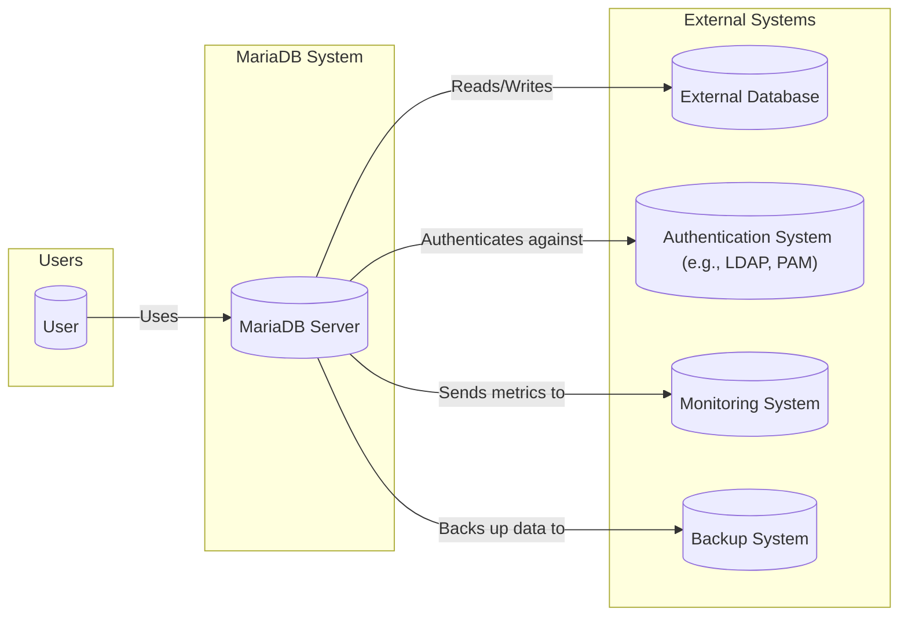
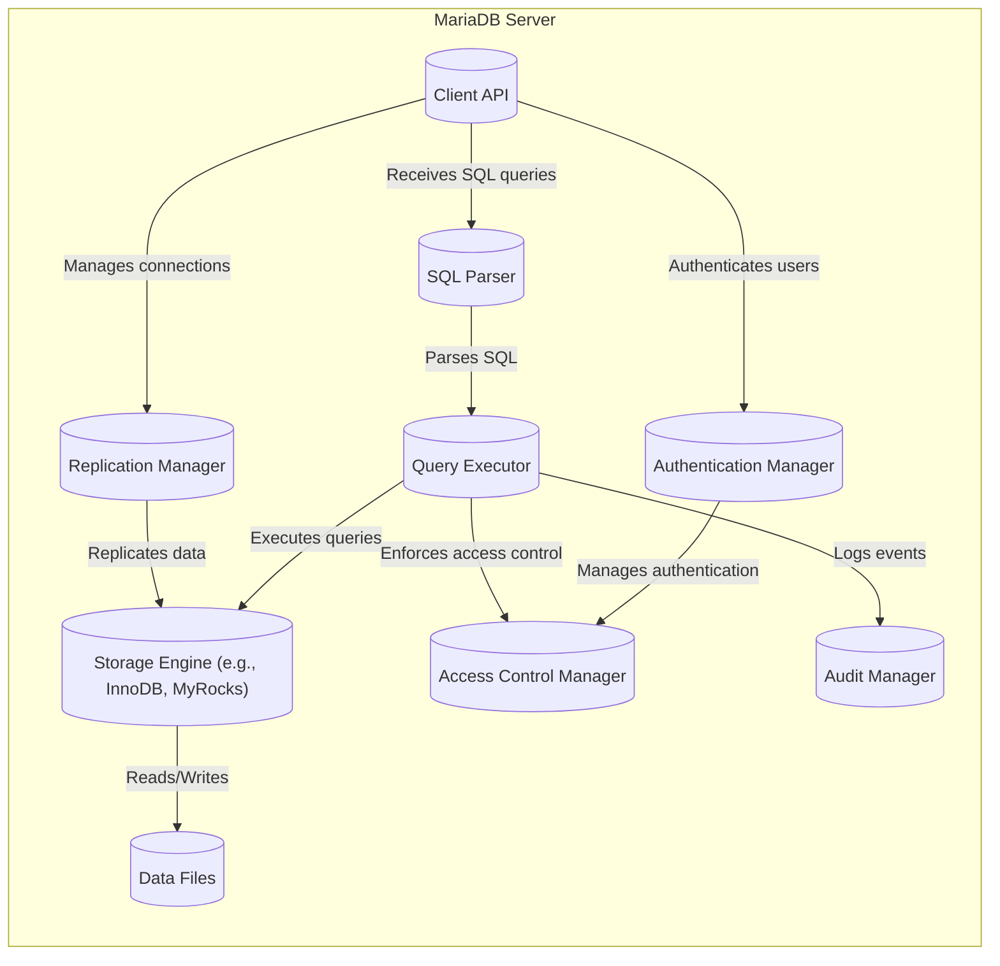
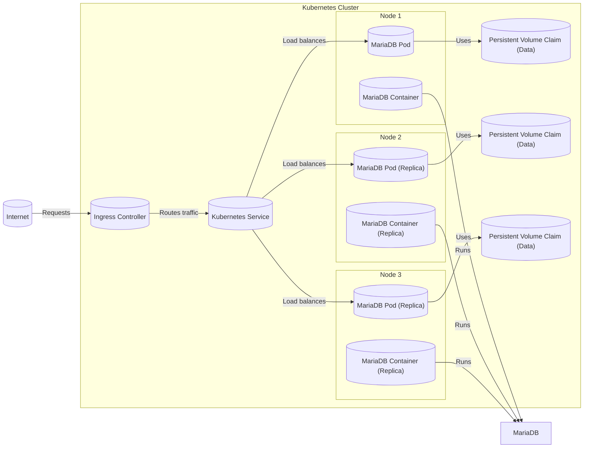
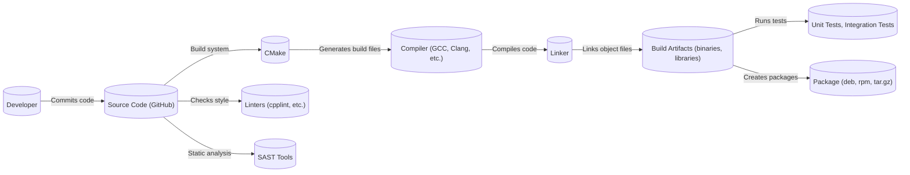

Okay, let's create a design document for the MariaDB server project, focusing on aspects relevant for threat modeling.

# BUSINESS POSTURE

MariaDB is a community-developed, commercially supported fork of MySQL, intended to remain free and open-source software under the GNU General Public License.  It's a widely used relational database management system (RDBMS).

Business Priorities:

*   Provide a robust, reliable, and performant database solution.
*   Maintain compatibility with MySQL (to a reasonable extent, allowing for divergence where improvements can be made).
*   Ensure data integrity and availability.
*   Foster a strong community and ecosystem.
*   Offer commercial support and services for enterprise users.
*   Continuously improve performance, security, and features.

Business Goals:

*   Be a leading open-source RDBMS choice for developers and organizations.
*   Attract and retain a vibrant community of contributors.
*   Grow the adoption of MariaDB in various applications and industries.
*   Generate revenue through commercial offerings to sustain development.

Most Important Business Risks:

*   Data breaches or data loss incidents affecting users.
*   Severe performance degradation or service unavailability.
*   Loss of community trust or developer engagement.
*   Inability to keep pace with evolving technology and user needs.
*   Legal challenges or licensing issues.
*   Competition from other database systems (both open-source and proprietary).
*   Vulnerabilities that could lead to remote code execution or privilege escalation.

# SECURITY POSTURE

Existing Security Controls:

*   security control: Authentication mechanisms (native MariaDB authentication, PAM, LDAP, etc.). Implemented in the server's authentication plugins and core authentication logic.
*   security control: Access control lists (ACLs) and granular permissions (GRANT/REVOKE system). Implemented in the privilege system and SQL parser.
*   security control: Encryption at rest (data file encryption, table encryption). Implemented using various encryption plugins and storage engine-specific features.
*   security control: Encryption in transit (TLS/SSL for client-server communication). Implemented using OpenSSL or yaSSL/wolfSSL libraries.
*   security control: Auditing capabilities (audit plugin). Implemented through a plugin interface that logs various database events.
*   security control: Secure coding practices (to varying degrees). Evident throughout the codebase, but continuous improvement is always needed.
*   security control: Regular security reviews and audits (internal and external). Mentioned in community documentation and release notes.
*   security control: Vulnerability disclosure program. Described on the MariaDB website.
*   security control: Use of security-focused compiler flags and build options. Evident in the build system configuration.
*   security control: Support for secure connections using TLS/SSL. Implemented in client libraries and server-side network handling.
*   security control: Input validation to prevent SQL injection. Implemented in the SQL parser and query execution engine.

Accepted Risks:

*   accepted risk: Complexity of the codebase, making it challenging to guarantee the absence of all vulnerabilities.
*   accepted risk: Reliance on third-party libraries (e.g., OpenSSL), which may introduce their own vulnerabilities.
*   accepted risk: Potential for misconfiguration by users, leading to security weaknesses.
*   accepted risk: The inherent risk of zero-day vulnerabilities.
*   accepted risk: Trade-offs between performance and security (e.g., certain security features may have a performance cost).

Recommended Security Controls (High Priority):

*   Implement a comprehensive fuzzing framework to continuously test for vulnerabilities.
*   Integrate static analysis tools (SAST) into the build process to identify potential security issues early.
*   Enhance dynamic analysis capabilities (DAST) for runtime security testing.
*   Strengthen supply chain security by verifying the integrity of third-party dependencies.
*   Consider adopting a memory-safe language (e.g., Rust) for security-critical components.
*   Improve documentation and guidance on secure configuration and deployment.

Security Requirements:

*   Authentication:
    *   Support strong password hashing algorithms.
    *   Provide options for multi-factor authentication (MFA).
    *   Enforce password complexity policies.
    *   Protect against brute-force attacks.
    *   Integrate with external authentication systems (e.g., Kerberos, OAuth).

*   Authorization:
    *   Implement fine-grained access control at the database, table, column, and row levels.
    *   Support role-based access control (RBAC).
    *   Enforce the principle of least privilege.
    *   Provide mechanisms for auditing access control decisions.

*   Input Validation:
    *   Thoroughly validate all user inputs to prevent SQL injection and other injection attacks.
    *   Use parameterized queries or prepared statements consistently.
    *   Implement output encoding to prevent cross-site scripting (XSS) vulnerabilities (in web-based management tools).

*   Cryptography:
    *   Use strong, well-vetted cryptographic algorithms and libraries.
    *   Protect cryptographic keys securely.
    *   Support encryption at rest and in transit.
    *   Implement key rotation mechanisms.
    *   Provide options for hardware security module (HSM) integration.

# DESIGN

## C4 CONTEXT

C4 Context Element List:

*   1.  Name: User
    *   Type: Person
    *   Description: A user of the MariaDB database, which could be a developer, DBA, or an application.
    *   Responsibilities: Connects to the database, executes queries, manages data.
    *   Security controls: Authentication, authorization, network security (TLS/SSL).

*   2.  Name: MariaDB Server
    *   Type: Software System
    *   Description: The core MariaDB database server.
    *   Responsibilities: Stores data, processes queries, enforces security policies, manages connections.
    *   Security controls: Authentication, authorization, access control, encryption, auditing, input validation.

*   3.  Name: External Database
    *   Type: Software System
    *   Description: Another database system that MariaDB might interact with (e.g., for replication or data federation).
    *   Responsibilities: Varies depending on the specific database.
    *   Security controls: Dependent on the external database's security mechanisms.

*   4.  Name: Authentication System (e.g., LDAP, PAM)
    *   Type: Software System
    *   Description: An external system used for user authentication.
    *   Responsibilities: Authenticates users, provides user information.
    *   Security controls: Dependent on the specific authentication system.

*   5.  Name: Monitoring System
    *   Type: Software System
    *   Description: A system used to monitor the performance and health of the MariaDB server.
    *   Responsibilities: Collects metrics, generates alerts.
    *   Security controls: Secure communication with the MariaDB server, access control to monitoring data.

*   6.  Name: Backup System
    *   Type: Software System
    *   Description: A system used to back up and restore MariaDB data.
    *   Responsibilities: Creates backups, manages backup storage, performs restores.
    *   Security controls: Secure communication with the MariaDB server, encryption of backup data, access control to backups.

## C4 CONTAINER

C4 Container Element List:

*   1.  Name: Client API
    *   Type: Container
    *   Description: The interface through which clients connect to the database server.
    *   Responsibilities: Handles network connections, manages client sessions, receives SQL queries.
    *   Security controls: TLS/SSL encryption, connection limits, authentication handoff.

*   2.  Name: SQL Parser
    *   Type: Container
    *   Description: Parses SQL queries into an internal representation.
    *   Responsibilities: Lexical analysis, syntax analysis, semantic analysis.
    *   Security controls: Input validation (to prevent SQL injection).

*   3.  Name: Query Executor
    *   Type: Container
    *   Description: Executes the parsed SQL queries.
    *   Responsibilities: Query optimization, query planning, transaction management.
    *   Security controls: Access control enforcement, privilege checking.

*   4.  Name: Storage Engine (e.g., InnoDB, MyRocks)
    *   Type: Container
    *   Description: Manages the storage and retrieval of data.
    *   Responsibilities: Data storage, data retrieval, indexing, transaction support.
    *   Security controls: Data encryption (at rest), data integrity checks.

*   5.  Name: Replication Manager
    *   Type: Container
    *   Description: Handles database replication.
    *   Responsibilities: Manages replication connections, transmits data changes, ensures consistency.
    *   Security controls: Secure communication (TLS/SSL), authentication of replication partners.

*   6.  Name: Authentication Manager
    *   Type: Container
    *   Description: Manages user authentication.
    *   Responsibilities: Verifies user credentials, interacts with authentication plugins.
    *   Security controls: Password hashing, support for various authentication methods (PAM, LDAP, etc.).

*   7.  Name: Access Control Manager
    *   Type: Container
    *   Description: Enforces access control policies.
    *   Responsibilities: Checks user permissions, grants or denies access to database objects.
    *   Security controls: Granular permissions, role-based access control.

*   8.  Name: Audit Manager
    *   Type: Container
    *   Description: Logs database events for auditing purposes.
    *   Responsibilities: Records user actions, database changes, security-related events.
    *   Security controls: Secure logging, protection of audit logs.

*   9.  Name: Data Files
    *   Type: Container
    *   Description: Physical files on disk where the data is stored.
    *   Responsibilities: Data persistence.
    *   Security controls: File system permissions, encryption at rest.

## DEPLOYMENT

Possible Deployment Solutions:

1.  Single Server Deployment: Simplest setup, suitable for development or small-scale applications.
2.  Replicated Deployment: Master-slave or multi-source replication for high availability and read scaling.
3.  Clustered Deployment: Using Galera Cluster or similar technology for high availability and write scaling.
4.  Cloud-Based Deployment: Deploying MariaDB on cloud platforms like AWS, Azure, or GCP, using managed database services or virtual machines.
5.  Containerized Deployment: Using Docker or Kubernetes to deploy MariaDB in containers.

Chosen Solution (for detailed description): Containerized Deployment using Kubernetes

Deployment Element List:

*   1.  Name: Kubernetes Cluster
    *   Type: Infrastructure
    *   Description: A cluster of nodes managed by Kubernetes.
    *   Responsibilities: Orchestrates containers, manages resources, provides networking.
    *   Security controls: Kubernetes RBAC, network policies, pod security policies, secrets management.

*   2.  Name: Node 1, Node 2, Node 3
    *   Type: Infrastructure
    *   Description: Physical or virtual machines that are part of the Kubernetes cluster.
    *   Responsibilities: Runs pods and containers.
    *   Security controls: Operating system hardening, network security, access control.

*   3.  Name: MariaDB Pod (Pod1, Pod2, Pod3)
    *   Type: Kubernetes Resource
    *   Description: A Kubernetes pod running a MariaDB container.
    *   Responsibilities: Runs the MariaDB database server.
    *   Security controls: Container security context, resource limits.

*   4.  Name: MariaDB Container (Container1, Container2, Container3)
    *   Type: Container
    *   Description: A Docker container running the MariaDB database server.
    *   Responsibilities: Executes the MariaDB process.
    *   Security controls: Minimal base image, non-root user, read-only file system (where possible).

*   5.  Name: Persistent Volume Claim (PVC1, PVC2, PVC3)
    *   Type: Kubernetes Resource
    *   Description: A request for persistent storage for the MariaDB data.
    *   Responsibilities: Provides persistent storage for the database.
    *   Security controls: Encryption at rest (if supported by the storage provider), access control to the storage.

*   6.  Name: Kubernetes Service
    *   Type: Kubernetes Resource
    *   Description: A Kubernetes service that provides a stable endpoint for accessing the MariaDB pods.
    *   Responsibilities: Load balances traffic across the MariaDB pods.
    *   Security controls: Network policies.

*   7.  Name: Ingress Controller
    *   Type: Kubernetes Resource
    *   Description: An Ingress controller that manages external access to the Kubernetes service.
    *   Responsibilities: Routes external traffic to the appropriate service.
    *   Security controls: TLS termination, access control, web application firewall (WAF).

*   8.  Name: Internet
    *   Type: External Entity
    *   Description: The external network from which users access the database.
    *   Responsibilities: N/A
    *   Security controls: Firewall, intrusion detection/prevention systems.

## BUILD

The MariaDB build process is complex and involves multiple steps, tools, and configurations.  It primarily uses CMake as its build system.

Build Process Security Controls:

*   security control: Use of CMake for build configuration, allowing for consistent and reproducible builds.
*   security control: Compilation with security-focused compiler flags (e.g., stack protection, FORTIFY_SOURCE).
*   security control: Integration of linters (e.g., cpplint) to enforce coding style and identify potential issues.
*   security control: Use of static analysis tools (SAST) to detect vulnerabilities in the source code. (This is a recommended control, and its current level of integration should be verified).
*   security control: Extensive unit and integration tests to verify the correctness and security of the code.
*   security control: Build automation using CI/CD systems (e.g., Jenkins, GitHub Actions).  This ensures that builds are performed consistently and that security checks are run automatically.
*   security control: Supply chain security: While not explicitly described in readily available documentation, efforts should be made to verify the integrity of third-party dependencies. This is an area for improvement.
*   security control: Code signing: Release packages are typically signed with a GPG key to ensure authenticity and integrity.

# RISK ASSESSMENT

Critical Business Processes to Protect:

*   Data storage and retrieval: Ensuring the confidentiality, integrity, and availability of user data.
*   Database replication: Maintaining data consistency and availability across multiple servers.
*   User authentication and authorization: Preventing unauthorized access to the database.
*   Backup and recovery: Ensuring the ability to restore data in case of failure or disaster.

Data to Protect and Sensitivity:

*   User data stored in the database: This can range from highly sensitive personal information (PII) to less sensitive application data. Sensitivity depends on the specific use case.
*   Database credentials: Usernames, passwords, and other authentication information. Highly sensitive.
*   Database configuration files: May contain sensitive information such as passwords, encryption keys, and network addresses. Highly sensitive.
*   Audit logs: Contain information about database activity, which may be sensitive depending on the context.
*   Replication logs: Contain data changes, which may be sensitive.

# QUESTIONS & ASSUMPTIONS

Questions:

*   What is the current level of integration of SAST and DAST tools in the MariaDB build process?
*   What specific mechanisms are in place to verify the integrity of third-party dependencies?
*   What are the specific procedures for handling security vulnerabilities reported by external researchers?
*   What are the performance benchmarks and targets for security-related features (e.g., encryption)?
*   What is the process for reviewing and updating security policies and procedures?
*   Are there any specific compliance requirements (e.g., GDPR, HIPAA) that need to be considered?
*   What is the current threat model for MariaDB, and how often is it updated?
*   What kind of penetration testing is regularly performed?
*   How are database schemas managed and versioned, and what security controls are in place around schema changes?

Assumptions:

*   BUSINESS POSTURE: MariaDB prioritizes security, but balances it with performance and usability.
*   BUSINESS POSTURE: The MariaDB Foundation and community are committed to addressing security vulnerabilities promptly.
*   SECURITY POSTURE: Secure coding practices are followed, but there's always room for improvement.
*   SECURITY POSTURE: Users are responsible for configuring and deploying MariaDB securely.
*   DESIGN: The provided diagrams are high-level representations and may not capture all the nuances of the MariaDB architecture.
*   DESIGN: The build process is automated and includes security checks, but the specific tools and configurations may vary.
*   DESIGN: Deployment practices vary widely depending on the user's environment and requirements.
*   DESIGN: MariaDB relies on underlying operating system and network security mechanisms.