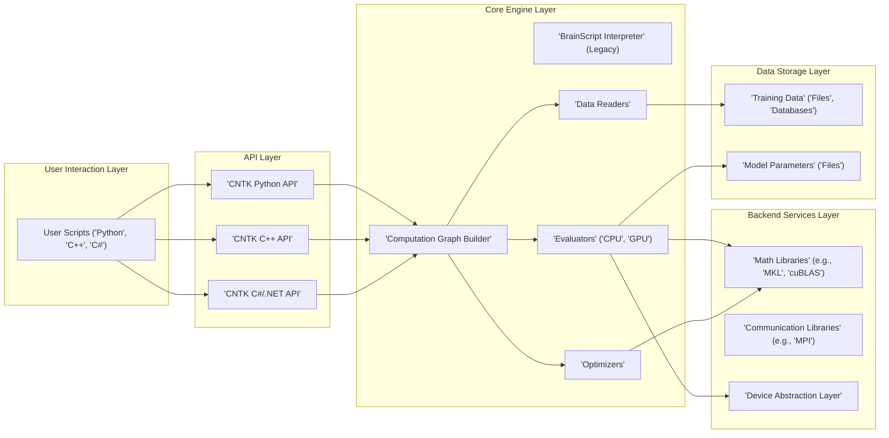
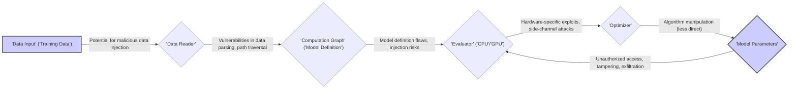

# Project Design Document: Microsoft Cognitive Toolkit (CNTK) - Threat Modeling Focus

**Version:** 1.1
**Date:** October 26, 2023
**Prepared By:** AI Software Architect

## 1. Introduction

This document provides a detailed design overview of the Microsoft Cognitive Toolkit (CNTK), an open-source deep-learning framework. It is specifically tailored to facilitate threat modeling activities by providing a clear understanding of the system's architecture, components, data flow, and potential security considerations. This document will be used as the basis for identifying potential threats, vulnerabilities, and attack vectors within the CNTK ecosystem.

## 2. Project Overview

CNTK is a framework designed for developing and training deep learning models. It represents neural networks as computational graphs, enabling the expression of complex models and parallelized computation across diverse hardware. While no longer under active development by Microsoft, understanding its architecture remains relevant for analyzing legacy systems and comprehending the evolution of deep learning frameworks, particularly from a security perspective.

## 3. System Architecture

The architecture of CNTK can be visualized as a layered system, with each layer exposing distinct interfaces and functionalities.

**Architectural Layers:**

*   **User Interaction Layer:** This is the primary point of interaction for users.
    *   User Scripts ('Python', 'C++', 'C#'): Users write scripts in these languages to define, train, and evaluate models. This layer is a significant entry point for potential vulnerabilities if user input is not handled securely.
*   **API Layer:** Provides programmatic access to CNTK's core functionalities.
    *   'CNTK Python API': The most common interface, offering a high-level abstraction for model development.
    *   'CNTK C++ API': A lower-level interface for performance-critical tasks and integration with native applications.
    *   'CNTK C#/.NET API': Enables integration with the .NET ecosystem. Improperly secured API endpoints can be exploited.
*   **Core Engine Layer:**  The core processing unit of CNTK.
    *   'BrainScript Interpreter' (Legacy):  The older configuration language. While less used, vulnerabilities within its parsing or execution could still be present in legacy systems.
    *   'Computation Graph Builder': Translates model definitions into an executable graph. Flaws in this component could lead to unexpected behavior or security issues.
    *   'Evaluators' ('CPU', 'GPU'): Executes the computation graph on the designated hardware. Exploits targeting specific hardware or drivers could be relevant here.
    *   'Optimizers': Implements algorithms for updating model parameters. While less direct, manipulation of optimization processes could lead to model degradation or denial of service.
    *   'Data Readers': Responsible for loading and preprocessing data. Vulnerabilities here could involve path traversal, arbitrary file access, or injection attacks depending on data source handling.
*   **Backend Services Layer:** Provides supporting functionalities for the Core Engine.
    *   'Math Libraries' (e.g., 'MKL', 'cuBLAS'): Optimized libraries for mathematical operations. Security vulnerabilities in these libraries could directly impact CNTK.
    *   'Communication Libraries' (e.g., 'MPI'): Used for distributed training. Misconfigurations or vulnerabilities in these libraries can expose the system to network-based attacks.
    *   'Device Abstraction Layer': Provides an interface to interact with different hardware. Bugs in this layer could be exploited to gain low-level access.
*   **Data Storage Layer:** Manages the storage of data and model artifacts.
    *   'Training Data' ('Files', 'Databases'): The input data used for training. Requires robust access control and integrity checks.
    *   'Model Parameters' ('Files'): The trained model weights and biases. These are valuable assets and need protection against unauthorized access and modification.

## 4. Data Flow with Security Considerations

Understanding the data flow is crucial for identifying points where data might be vulnerable.

**Data Flow Description with Security Focus:**

*   'Data Input' ('Training Data'): Training data is ingested from various sources. **Security Consideration:** This stage is susceptible to malicious data injection, where attackers introduce crafted data to manipulate the model's learning process (model poisoning).
*   'Data Reader': Reads and preprocesses the input data. **Security Consideration:** Vulnerabilities in data parsing logic could lead to buffer overflows or arbitrary code execution. If file paths are involved, path traversal vulnerabilities could allow access to sensitive files.
*   'Computation Graph' ('Model Definition'): Represents the model architecture. **Security Consideration:**  Flaws in the model definition itself, or the way it's processed, could lead to unexpected behavior. Injection risks might exist if model definitions are dynamically generated based on untrusted input.
*   'Evaluator' ('CPU'/'GPU'): Executes the computation graph. **Security Consideration:** Hardware-specific exploits or side-channel attacks targeting the CPU or GPU during computation could potentially leak information or disrupt the process.
*   'Optimizer': Updates the model parameters based on the evaluation results. **Security Consideration:** While less direct, manipulating the optimization process (e.g., by influencing gradient calculations) could degrade the model's performance or stability.
*   'Model Parameters': The learned weights and biases. **Security Consideration:** These are valuable assets. Unauthorized access could lead to model theft or misuse. Tampering with model parameters can degrade performance or introduce backdoors. Exfiltration of model parameters can reveal sensitive information if the model was trained on private data.

## 5. Key Components and Security Implications

This section details key components and their specific security considerations.

*   'Computation Graph Builder':
    *   **Security Implication:** Vulnerabilities in the graph construction logic could lead to unexpected program behavior or the ability to inject malicious operations into the graph.
*   'Evaluators' ('CPU', 'GPU'):
    *   **Security Implication:** Susceptible to hardware-level vulnerabilities and side-channel attacks that could leak information about the model or training data.
*   'Optimizers':
    *   **Security Implication:** While less direct, vulnerabilities could potentially be exploited to manipulate the training process, leading to biased or ineffective models.
*   'Data Readers':
    *   **Security Implication:**  A primary attack surface. Vulnerabilities can allow for arbitrary file access, denial of service through malformed data, or even remote code execution if data parsing is flawed.
*   'CNTK Python API', 'CNTK C++ API', 'CNTK C#/.NET API':
    *   **Security Implication:**  Improperly secured API endpoints or lack of input validation can lead to various attacks, including unauthorized access, data manipulation, and denial of service.

## 6. External Dependencies and Associated Risks

CNTK relies on external libraries, introducing potential security risks.

*   Operating System ('Windows', 'Linux'):
    *   **Risk:** Vulnerabilities in the underlying operating system can be exploited to compromise CNTK.
*   Programming Languages ('Python', 'C++', 'C#'):
    *   **Risk:** Vulnerabilities in the language runtime or standard libraries can be exploited.
*   Math Libraries ('MKL', 'cuBLAS'):
    *   **Risk:** Security flaws in these highly optimized libraries can directly impact CNTK's security and stability.
*   CUDA Toolkit (for GPU support):
    *   **Risk:** Vulnerabilities in the CUDA drivers or libraries can be exploited to gain access to the system or the GPU.
*   Communication Libraries ('MPI'):
    *   **Risk:** Misconfigurations or vulnerabilities can lead to unauthorized access, data breaches, or denial of service in distributed training environments.
*   Build Tools ('CMake', 'Visual Studio', 'GCC'):
    *   **Risk:** Compromised build tools can introduce malicious code into the CNTK binaries.
*   Package Managers ('pip', 'NuGet'):
    *   **Risk:**  Dependency confusion attacks or vulnerabilities in packages fetched by these managers can introduce malicious code.

## 7. Deployment Model and Security Considerations

The deployment model significantly impacts the security posture of CNTK.

*   Local Machine:
    *   **Security Consideration:** Risks are primarily related to the security of the local machine itself.
*   Server Environment:
    *   **Security Consideration:** Requires careful configuration of network access, authentication, and authorization to protect against unauthorized access.
*   Cloud Platforms ('Azure', 'AWS', 'GCP'):
    *   **Security Consideration:** Relies on the security of the cloud platform's infrastructure and services. Proper configuration of cloud security controls is crucial.
*   Embedded Devices:
    *   **Security Consideration:** Limited resources and physical accessibility make these deployments particularly vulnerable to tampering and reverse engineering.

## 8. Security Considerations (Detailed)

This section provides a more detailed breakdown of security considerations across different aspects of CNTK.

*   **Authentication and Authorization:**
    *   How is access to CNTK resources (data, models, APIs) controlled and authenticated?
    *   Are there different roles and permissions for users and processes?
*   **Data Protection:**
    *   How is training data protected at rest and in transit? Is encryption used?
    *   How are trained model parameters secured?
    *   Are there mechanisms to prevent data leakage or exfiltration?
*   **Input Validation:**
    *   How is user-provided input (scripts, model definitions, data) validated to prevent injection attacks?
    *   Are there safeguards against malformed data that could cause crashes or unexpected behavior?
*   **Secure Coding Practices:**
    *   Were secure coding practices followed during the development of CNTK?
    *   Are there known vulnerabilities in the codebase?
*   **Dependency Management:**
    *   How are external dependencies managed and updated?
    *   Are there processes to identify and mitigate vulnerabilities in dependencies?
*   **Network Security:**
    *   If deployed in a network environment, how is network traffic secured?
    *   Are there firewalls or other network security controls in place?
*   **Logging and Monitoring:**
    *   Are security-related events logged?
    *   Are there mechanisms to monitor the system for suspicious activity?
*   **Supply Chain Security:**
    *   How is the integrity of the CNTK codebase and its dependencies ensured?
    *   Are there measures to prevent tampering with the software supply chain?

## 9. Future Threat Modeling Activities

This design document will be used as the foundation for the following threat modeling activities:

*   **Identifying Threat Actors:** Determining who might want to attack the system and their motivations.
*   **Identifying Assets:** Defining the valuable components and data within the CNTK ecosystem.
*   **Identifying Threats:**  Using methodologies like STRIDE to systematically identify potential threats to each component and data flow.
*   **Identifying Vulnerabilities:** Analyzing the design and implementation for weaknesses that could be exploited.
*   **Identifying Attack Vectors:** Determining the paths an attacker could take to exploit vulnerabilities.
*   **Risk Assessment:** Evaluating the likelihood and impact of identified threats.
*   **Security Controls:** Recommending and implementing security measures to mitigate identified risks.

This enhanced design document provides a more detailed and security-focused view of the CNTK architecture, making it a more effective tool for subsequent threat modeling efforts.