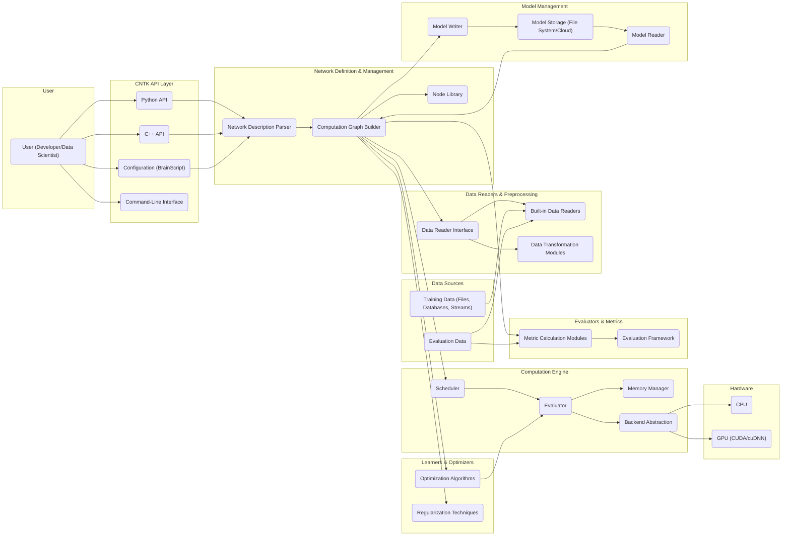

## Project Design Document: CNTK (Cognitive Toolkit) - Improved

**1. Introduction**

This document provides an enhanced architectural design of the Microsoft Cognitive Toolkit (CNTK), an open-source deep-learning framework. This improved version aims to offer a more detailed and clearer understanding of the system's components, interactions, and data flows, serving as a robust foundation for subsequent threat modeling activities.

**1.1. Purpose**

The purpose of this document is to provide a comprehensive architectural overview of CNTK to facilitate a more effective and detailed threat identification and mitigation process. It elaborates on the key components, their specific responsibilities, and the intricate ways they interact with each other and external entities.

**1.2. Scope**

This document covers the core architectural components of CNTK as represented in the provided GitHub repository (https://github.com/microsoft/cntk). It provides a deeper dive into the logical and physical structure of the framework, including its major modules, their relationships, and key functionalities. While still avoiding low-level implementation details, it includes more specific information relevant to understanding potential security implications.

**2. System Overview**

CNTK is a powerful framework designed for building and training deep learning models. It empowers users to define complex neural networks as a structured series of computational steps, utilizing a declarative approach for clarity and efficiency. CNTK boasts support for a wide array of network architectures and training methodologies, effectively leveraging diverse hardware resources such as CPUs and GPUs for accelerated performance.

**Key Features:**

*   **Flexible Network Definition:** Users can define intricate neural network topologies using a high-level configuration language (BrainScript) or programmatically through robust APIs (Python and C++).
*   **Optimized Computation Graph:** CNTK internally represents the defined network as an optimized computation graph, enabling efficient execution and parallelization.
*   **Diverse Training Algorithms:** The framework incorporates a rich set of optimization algorithms, catering to various training scenarios and model types.
*   **Scalable Data Handling:** CNTK provides sophisticated mechanisms for efficiently reading, processing, and managing large and complex datasets.
*   **Hardware Acceleration Capabilities:**  It seamlessly integrates with and utilizes GPUs and other specialized accelerators to significantly accelerate the training process.
*   **Multi-Language Support:** Offers comprehensive APIs in both Python for ease of use and rapid prototyping, and C++ for performance-critical applications and fine-grained control.
*   **Comprehensive Model Evaluation and Inference Tools:** Provides robust tools for rigorously evaluating the performance of trained models and deploying them for inference tasks.

**3. Architectural Design**

The CNTK architecture is structured around the following key components, each with specific responsibilities:

*   **User Interface/API Layer:** This layer serves as the primary point of interaction for users.
    *   Python API: A user-friendly interface enabling model definition, training, and evaluation using Python scripts.
    *   C++ API: A lower-level interface offering greater control and performance optimization for advanced users.
    *   Configuration Language (BrainScript): A declarative language specifically designed for defining neural network architectures in a concise manner.
    *   Command-Line Interface (CLI): A set of tools for executing various CNTK tasks and managing models directly from the command line.
*   **Network Definition and Management:** This component is responsible for interpreting and managing the structure of neural networks.
    *   Network Description Language Parser:  Parses network definitions provided through configuration files (BrainScript) or API calls, translating them into an internal representation.
    *   Computation Graph Builder: Constructs the core computation graph representation of the defined neural network, optimizing it for efficient execution.
    *   Node Library: A comprehensive collection of pre-built neural network operations, including various layer types (e.g., convolutional, recurrent), activation functions, and loss functions.
*   **Computation Engine:** The central processing unit of CNTK, responsible for the actual execution of the computation graph.
    *   Scheduler:  Determines the optimal order of operations within the computation graph to maximize parallelism and efficiency.
    *   Evaluator: Executes the individual nodes (operations) within the computation graph, performing the necessary computations.
    *   Memory Manager:  Manages the allocation and deallocation of memory during the computation process, ensuring efficient resource utilization.
    *   Backend Abstraction Layer: Provides an abstraction layer that allows CNTK to run on different hardware backends (CPU, GPU) without requiring significant code changes.
*   **Learners and Optimizers:** This component implements the algorithms used to train neural networks by adjusting their parameters.
    *   Stochastic Gradient Descent (SGD) and its variants (e.g., Momentum SGD, Nesterov SGD).
    *   Adaptive learning rate methods (e.g., Adam, RMSprop, Adagrad).
    *   Regularization techniques (e.g., L1, L2 regularization, Dropout) to prevent overfitting.
*   **Data Readers and Preprocessing:** This component handles the crucial task of ingesting and preparing data for training and evaluation.
    *   Data Reader Interface: Defines a common interface for reading data from diverse sources, allowing for extensibility.
    *   Built-in Data Readers: Provides pre-built readers for common data formats such as text files, image formats, and sequence data.
    *   Data Transformation Modules: Offers tools for performing data augmentation (e.g., image rotation, scaling) and preprocessing steps (e.g., normalization, standardization).
*   **Evaluators and Metrics:** This component provides the tools necessary to assess the performance of trained models.
    *   Metric Calculation Modules: Implements a variety of evaluation metrics relevant to different machine learning tasks (e.g., accuracy, precision, recall, F1-score, cross-entropy loss).
    *   Evaluation Framework: Orchestrates the evaluation process, feeding data through the model and calculating the specified metrics.
*   **Model Serialization and Deserialization:** This component manages the saving and loading of trained models, allowing for persistence and reuse.
    *   Model Writer: Serializes the trained model's parameters and network structure into a file format for storage.
    *   Model Reader: Deserializes a saved model from a file, reconstructing the network and its learned parameters.
*   **Backend/Hardware Abstraction Layer:** This critical layer isolates the core computation engine from the specifics of the underlying hardware.
    *   CPU Backend: Executes computations on the central processing unit.
    *   GPU Backend (CUDA, cuDNN): Leverages the parallel processing power of NVIDIA GPUs using CUDA and the cuDNN library for accelerated deep learning computations.
    *   Other Accelerator Support (potentially):  Provides an abstraction for integrating with other types of hardware accelerators.

**4. Data Flow Diagram**

**Data Flow Description:**

1. **Network Definition:** The user initiates the process by defining the desired neural network architecture using the Python API, C++ API, or the declarative BrainScript configuration language.
2. **Graph Construction:** The Network Description Parser interprets the provided definition, and the Computation Graph Builder constructs the optimized internal representation of the network as a computation graph.
3. **Data Ingestion and Preprocessing:** The Data Readers retrieve and preprocess training and evaluation data from various specified sources, preparing it for use in the training process.
4. **Training Process:** The Computation Engine, guided by the Scheduler and utilizing the Learners/Optimizers, executes the computation graph using the training data. The Backend Abstraction Layer seamlessly utilizes the available hardware resources, such as the CPU or GPU, for efficient computation. Regularization techniques are applied as configured.
5. **Performance Evaluation:** The Evaluation Framework uses the trained model and evaluation data to calculate relevant performance metrics, providing insights into the model's effectiveness.
6. **Model Persistence:** The trained model's parameters and network structure are serialized by the Model Writer and stored in a persistent storage medium, such as the file system or cloud storage.
7. **Inference/Prediction:** A previously saved model can be loaded by the Model Reader, and the Computation Engine can then perform inference on new, unseen data to generate predictions.

**5. External Interfaces**

CNTK interacts with a range of external entities to provide its functionality:

*   **Programming Languages:**
    *   Python: Provides a high-level, user-friendly interface for scripting, rapid prototyping, and model development.
    *   C++: Offers a lower-level interface for performance-critical applications, fine-grained control over execution, and integration with existing C++ codebases.
*   **Data Sources:**
    *   File Systems: Enables reading data from local or network-accessible file systems in various formats.
    *   Databases: Can potentially integrate with databases through custom data readers or external libraries.
    *   Cloud Storage (e.g., Azure Blob Storage, AWS S3, Google Cloud Storage): Facilitates access to large datasets stored in cloud environments.
    *   Data Streaming Platforms (e.g., Apache Kafka, Azure Event Hubs): Allows for real-time ingestion of data streams for online learning scenarios.
*   **Hardware:**
    *   CPUs: Utilized for general-purpose computation and as a fallback when GPUs are not available.
    *   GPUs (NVIDIA CUDA-enabled): Leveraged for accelerated deep learning computations using the CUDA framework and cuDNN library.
    *   Other Accelerators (Potential Future Integration):  The architecture allows for potential integration with other specialized hardware accelerators.
*   **External Libraries:**
    *   NumPy: A fundamental library for numerical computations in Python, often used for data manipulation.
    *   SciPy: A library for scientific and technical computing, providing various mathematical algorithms.
    *   cuDNN (NVIDIA Deep Neural Network library): Provides highly optimized primitives for deep learning on NVIDIA GPUs.
*   **Deployment Environments:**
    *   Local Machines (Desktops, Laptops): For development, experimentation, and small-scale deployments.
    *   Cloud Platforms (e.g., Azure, AWS, GCP): For scalable training and deployment of models in the cloud.
    *   Edge Devices: For deploying models on resource-constrained devices for edge computing scenarios.

**6. Security Considerations (Detailed for Threat Modeling)**

This section provides a more detailed exploration of potential security considerations, forming a stronger basis for threat modeling.

*   **Input Validation Vulnerabilities:**
    *   **Threat:** Maliciously crafted network definitions (e.g., excessively large networks, infinite loops) or data inputs (e.g., adversarial examples, malformed data) could lead to denial of service, code injection, or unexpected behavior.
    *   **Mitigation Considerations:** Implement robust input validation and sanitization for all user-provided data, including network configurations, data paths, and hyperparameters. Employ schema validation and limit resource consumption during parsing and graph construction.
*   **Model Security and Intellectual Property Risks:**
    *   **Threat:** Trained models represent valuable intellectual property. Unauthorized access, modification, or theft of these models could lead to significant financial or competitive losses.
    *   **Mitigation Considerations:** Implement access controls to restrict who can access and modify saved models. Consider encryption for models at rest and in transit. Explore techniques like model watermarking to detect unauthorized use.
*   **Dependency Management and Supply Chain Security:**
    *   **Threat:** CNTK relies on external libraries. Vulnerabilities in these dependencies could be exploited to compromise the framework. Malicious actors could also inject vulnerabilities into the supply chain.
    *   **Mitigation Considerations:** Maintain a comprehensive Software Bill of Materials (SBOM). Regularly scan dependencies for known vulnerabilities and promptly update them. Use trusted repositories and verify the integrity of downloaded packages.
*   **Access Control and Authentication:**
    *   **Threat:** In multi-user environments or cloud deployments, inadequate access controls could allow unauthorized users to define, train, deploy, or access sensitive models and data.
    *   **Mitigation Considerations:** Implement strong authentication and authorization mechanisms. Utilize role-based access control (RBAC) to restrict access based on user roles and responsibilities.
*   **Data Security and Privacy:**
    *   **Threat:** Sensitive training data could be exposed to unauthorized access or disclosure, violating privacy regulations and potentially causing harm.
    *   **Mitigation Considerations:** Implement data encryption at rest and in transit. Enforce strict access controls to training data. Consider anonymization or differential privacy techniques when handling sensitive data.
*   **Code Injection Vulnerabilities:**
    *   **Threat:**  Vulnerabilities in the APIs or configuration interfaces could allow attackers to inject and execute arbitrary code on the system.
    *   **Mitigation Considerations:**  Employ secure coding practices, including careful handling of user inputs and avoiding the use of insecure functions. Regularly perform static and dynamic code analysis.
*   **Denial of Service (DoS) Attacks:**
    *   **Threat:** Attackers could attempt to overwhelm the framework with excessive requests or resource-intensive tasks, leading to service disruption.
    *   **Mitigation Considerations:** Implement rate limiting and resource quotas. Design the system to be resilient to resource exhaustion. Utilize load balancing and auto-scaling in cloud deployments.
*   **Side-Channel Attacks:**
    *   **Threat:** Attackers might exploit subtle information leaked through system behavior (e.g., timing variations, power consumption) to infer sensitive information about the model or training data.
    *   **Mitigation Considerations:** While challenging, consider techniques to reduce information leakage, such as constant-time algorithms where applicable. Be aware of potential vulnerabilities in hardware and underlying libraries.

**7. Conclusion**

This improved design document provides a more detailed and comprehensive understanding of the CNTK architecture, highlighting key components, their interactions, and data flows. The expanded security considerations offer a stronger foundation for conducting a thorough and effective threat modeling process. This document serves as a valuable resource for identifying potential vulnerabilities and developing appropriate mitigation strategies for the CNTK project.