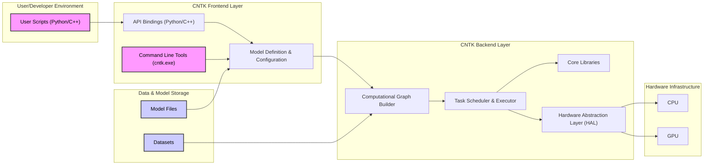
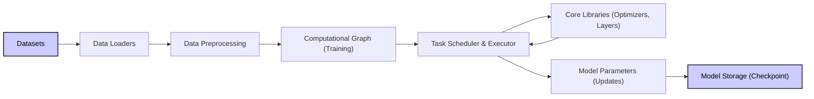
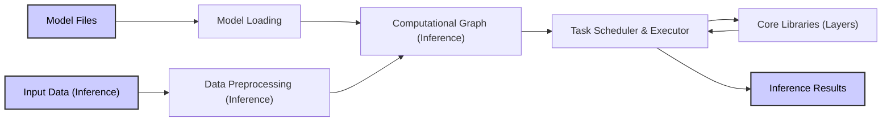

# Project Design Document: CNTK (Microsoft Cognitive Toolkit) for Threat Modeling

**Version:** 1.1
**Date:** October 26, 2023
**Author:** AI Expert Assistant

## 1. Project Overview

**Project Name:** CNTK (Microsoft Cognitive Toolkit)

**Project Repository:** [https://github.com/microsoft/cntk](https://github.com/microsoft/cntk)

**Project Description:**

CNTK (Microsoft Cognitive Toolkit), now known as Microsoft Cognitive Toolkit Legacy, is a deep learning framework developed by Microsoft. It facilitates the creation of deep learning models through a flexible and efficient computational network description using directed graphs. CNTK supports diverse neural network architectures, including feedforward, convolutional (CNNs), and recurrent (RNNs). Its applications span image recognition, speech recognition, and natural language processing. While officially deprecated and in maintenance mode, analyzing its architecture remains valuable for understanding legacy systems and the design principles of deep learning frameworks.

**Purpose of this Document:**

This document provides a comprehensive design overview of the CNTK project, specifically tailored for threat modeling. It details the system architecture, key components, data flow, and technology stack to enable the identification of potential security vulnerabilities and risks. This document serves as the foundational artifact for subsequent threat modeling exercises. It is intended to be used by security professionals, developers, and anyone involved in assessing the security posture of systems utilizing or interacting with CNTK.

## 2. Architecture Overview

CNTK's architecture is centered around the concept of a computational network represented as a directed acyclic graph (DAG). This DAG defines the data flow and operations within a deep learning model. The system is structured into distinct layers:

*   **Frontend (User Interface & Model Definition):**  Provides user-facing interfaces for model definition, training, and evaluation. This includes Python and C++ APIs, and command-line tools. It acts as the entry point for user interaction and model specification.
*   **Backend (Computation Engine):**  The core execution engine responsible for processing the computational graph. It manages resource allocation, performs calculations, and orchestrates the execution of deep learning operations.
*   **Core Libraries:**  Offers a suite of fundamental building blocks for deep learning. These libraries include mathematical functions, neural network layers, optimization algorithms, and data handling utilities. They are optimized for performance and efficiency.
*   **Hardware Abstraction Layer (HAL):**  Provides an abstraction layer to interact with diverse hardware platforms, including CPUs and GPUs. This layer optimizes performance based on the underlying hardware and ensures portability.

**High-Level Architecture Diagram:**

## 3. Component Breakdown

This section provides a detailed breakdown of CNTK's key components, outlining their functionalities, purposes, and security relevance.

### 3.1. Frontend Components

*   **API Bindings (Python/C++):**
    *   **Functionality:** Exposes programming interfaces in Python and C++ for user interaction. These APIs enable users to define neural network architectures, configure training parameters (e.g., learning rate, batch size), load and preprocess data, initiate model training, and perform inference. They also provide functionalities for model serialization and deserialization.
    *   **Purpose:**  To offer a user-friendly and programmable interface to CNTK's capabilities. The Python API prioritizes ease of use and rapid prototyping, while the C++ API provides greater control and performance optimization for production deployments.
    *   **Security Relevance:**  APIs are critical entry points for user-supplied code and configurations.
        *   **Vulnerability:**  Improper input validation in API handlers could lead to vulnerabilities such as injection attacks (e.g., code injection if model definitions allow arbitrary code execution), denial-of-service (DoS) through resource exhaustion, or arbitrary file access if file paths are not properly sanitized.
        *   **Threat Example:** A malicious user could craft a Python script that exploits a vulnerability in the API to read sensitive files from the server running CNTK or execute arbitrary code on the system.

*   **Command Line Tools (cntk.exe):**
    *   **Functionality:** Provides command-line utilities for executing various CNTK operations. These tools support model training, evaluation, inference, and model conversion. They are designed for batch processing and automation.
    *   **Purpose:**  To enable scripting and automation of CNTK workflows without requiring direct programming. Useful for automated training pipelines, scheduled inference tasks, and system administration.
    *   **Security Relevance:** Command-line tools parse user-provided arguments and configuration files, making them potential targets for attacks.
        *   **Vulnerability:**  Insufficient validation of command-line arguments or configuration file content could lead to command injection vulnerabilities. If the tool processes external configuration files without proper sanitization, it could be vulnerable to path traversal or arbitrary file inclusion attacks.
        *   **Threat Example:** A compromised configuration file, if processed by `cntk.exe`, could contain malicious commands that are executed by the system with the privileges of the CNTK process.

*   **Model Definition & Configuration:**
    *   **Functionality:**  Handles the parsing and interpretation of model descriptions. Models can be defined programmatically through APIs or declaratively using configuration files (e.g., CNTK configuration language). This component translates user-defined specifications into an internal representation suitable for the backend.
    *   **Purpose:**  To abstract the complexity of model specification and provide a structured way for users to define neural network architectures, training parameters, and data sources.
    *   **Security Relevance:**  Model configurations can be complex and may reference external resources or custom code.
        *   **Vulnerability:**  Parsing vulnerabilities in the configuration parser could be exploited to cause crashes or unexpected behavior. If model configurations allow inclusion of external scripts or libraries without proper validation, it could lead to remote code execution. Deserialization vulnerabilities could also be present if model configurations are serialized and deserialized.
        *   **Threat Example:** A maliciously crafted model configuration file could exploit a buffer overflow in the configuration parser, leading to a denial-of-service or potentially code execution.

### 3.2. Backend Components

*   **Computational Graph Builder:**
    *   **Functionality:**  Constructs the computational graph (DAG) based on the parsed model definition. It performs graph optimization, such as node fusion and memory allocation planning, to enhance execution efficiency.
    *   **Purpose:**  To transform the high-level model description into an optimized, executable computational representation that the task scheduler can process.
    *   **Security Relevance:**  Graph construction involves processing user-defined model structures, which could be maliciously crafted.
        *   **Vulnerability:**  Errors in graph construction logic or resource allocation could lead to denial-of-service (e.g., excessive memory consumption) or unexpected behavior. If the graph builder doesn't handle malformed or excessively complex graphs gracefully, it could be vulnerable to attacks.
        *   **Threat Example:** A user could define an extremely large or deeply nested neural network architecture that, when processed by the graph builder, consumes excessive resources and crashes the CNTK process.

*   **Task Scheduler & Executor:**
    *   **Functionality:**  Schedules and executes the operations defined in the computational graph. It manages data flow between operations, allocates resources (CPU/GPU memory, compute units), and orchestrates parallel execution of graph nodes. It handles both training and inference workloads.
    *   **Purpose:**  To efficiently execute the computational graph, maximizing hardware utilization and minimizing execution time.
    *   **Security Relevance:**  The executor handles sensitive data and model parameters during computation.
        *   **Vulnerability:**  Vulnerabilities in task scheduling or resource management could lead to data leaks (e.g., if temporary data is not properly cleared from memory), unauthorized access to resources, or race conditions that could be exploited. If the scheduler is not robust against unexpected errors or resource contention, it could be vulnerable to DoS attacks.
        *   **Threat Example:** A vulnerability in the task scheduler could allow an attacker to gain access to intermediate data values during computation, potentially revealing sensitive information from the dataset or model.

*   **Core Libraries:**
    *   **Functionality:**  Provides a comprehensive library of optimized functions and algorithms essential for deep learning. This includes:
        *   **Mathematical Operations:**  Optimized linear algebra routines (BLAS, LAPACK), matrix operations, activation functions (e.g., ReLU, sigmoid), loss functions, and gradient calculations.
        *   **Neural Network Layers:** Implementations of various neural network layers (e.g., convolutional layers, recurrent layers, dense layers, pooling layers, normalization layers).
        *   **Optimizers:** Implementations of optimization algorithms (e.g., Stochastic Gradient Descent (SGD), Adam, RMSprop) for model training.
        *   **Data Handling Utilities:**  Functions for data loading, preprocessing (e.g., normalization, data augmentation), and data manipulation.
    *   **Purpose:**  To provide efficient and reusable building blocks for implementing deep learning models, abstracting away low-level implementation details.
    *   **Security Relevance:**  Vulnerabilities in core library functions can have widespread security implications as they are used throughout the framework. Dependencies on external libraries also introduce potential vulnerabilities.
        *   **Vulnerability:**  Common vulnerabilities in native code libraries include buffer overflows, integer overflows, format string vulnerabilities, and use-after-free errors. If CNTK relies on vulnerable versions of external libraries, it inherits those vulnerabilities.
        *   **Threat Example:** A buffer overflow vulnerability in a matrix multiplication routine within the core libraries could be exploited to execute arbitrary code by providing specially crafted input data that triggers the overflow.

*   **Hardware Abstraction Layer (HAL):**
    *   **Functionality:**  Provides an abstraction layer that enables CNTK to run on different hardware platforms (CPUs, GPUs from NVIDIA and AMD) without requiring significant code modifications. It handles device-specific operations, memory management, and optimizations for each hardware type.
    *   **Purpose:**  To ensure portability and performance across diverse hardware environments, allowing users to leverage the most suitable hardware for their workloads.
    *   **Security Relevance:**  HAL interacts directly with hardware resources and device drivers, which can be complex and potentially contain vulnerabilities.
        *   **Vulnerability:**  Issues in HAL implementation or underlying device drivers could lead to security vulnerabilities, such as privilege escalation if HAL improperly interacts with driver interfaces, or memory corruption if memory management is flawed. Bugs in GPU drivers themselves are also a concern.
        *   **Threat Example:** A vulnerability in the HAL's GPU memory management could be exploited to gain unauthorized access to GPU memory or cause a GPU driver crash, leading to a denial-of-service.

### 3.3. Data and Model Storage

*   **Datasets:**
    *   **Functionality:**  CNTK consumes datasets for training and evaluation. Datasets can be in various formats (e.g., text files, image files, binary formats like TFRecord, CNTK's own format). Datasets can be loaded from local storage, network file systems, or cloud storage.
    *   **Purpose:**  To provide the input data necessary for training and testing deep learning models. The quality and format of datasets directly impact model performance.
    *   **Security Relevance:**  Datasets can be large and contain sensitive information (e.g., personal data, financial records, proprietary information).
        *   **Vulnerability:**  Unauthorized access to datasets could lead to data breaches. Data corruption or manipulation could lead to model poisoning or incorrect inference results. Insecure data loading mechanisms could be exploited to access files outside of intended dataset paths (path traversal).
        *   **Threat Example:** An attacker gaining access to the storage location of training datasets could steal sensitive data or modify the datasets to poison the trained model, causing it to misclassify data in a predictable way.

*   **Model Files:**
    *   **Functionality:**  Trained models are serialized and saved to files for persistent storage and later use in inference or further training (fine-tuning). Model files typically contain the network architecture (graph structure), learned parameters (weights and biases), and metadata (e.g., training configuration). Common formats include CNTK's native format and ONNX (Open Neural Network Exchange).
    *   **Purpose:**  To persist trained models, enabling deployment, reuse, and sharing of trained models without retraining.
    *   **Security Relevance:**  Model files contain sensitive information (learned parameters, which represent knowledge extracted from the training data).
        *   **Vulnerability:**  Unauthorized access to model files could lead to intellectual property theft or exposure of sensitive information learned by the model. Model tampering (modifying model files) could lead to model poisoning or malicious inference behavior. Deserialization vulnerabilities in model loading could be exploited.
        *   **Threat Example:** An attacker gaining access to model files could reverse engineer the model to extract sensitive information about the training data or modify the model to introduce a backdoor that causes it to misclassify specific inputs in a way that benefits the attacker.

## 4. Data Flow

The data flow in CNTK is distinct for training and inference phases.

**4.1. Training Data Flow:**

1.  **Datasets:** Training data is ingested from specified sources.
2.  **Data Loaders:** Components read and parse data from datasets, potentially performing format conversion and batching.
3.  **Data Preprocessing:** Data is transformed and prepared for training (e.g., normalization, augmentation, feature extraction).
4.  **Computational Graph (Training):** The training graph, representing the model and training operations, is constructed and prepared for execution.
5.  **Task Scheduler & Executor:** Manages the execution of the training graph, scheduling operations and allocating resources.
6.  **Core Libraries (Optimizers, Layers):**  Performs the core computations defined in the graph, including forward and backward passes, loss calculation, and gradient computation. Optimizers are used to update model parameters.
7.  **Model Parameters (Updates):** Model parameters (weights and biases) are updated based on the computed gradients and optimizer algorithm.
8.  **Model Storage (Checkpoint):** Periodically, the updated model parameters are saved to checkpoint files to allow for resuming training or for backup purposes.

**4.2. Inference Data Flow:**

1.  **Model Files:** A pre-trained model is loaded from storage.
2.  **Model Loading:**  The model architecture and learned parameters are deserialized and loaded into memory.
3.  **Input Data (Inference):** Input data for inference is provided to the system.
4.  **Data Preprocessing (Inference):** Input data is preprocessed to match the format expected by the model (consistent with training preprocessing).
5.  **Computational Graph (Inference):** The inference graph, representing the forward pass of the model, is prepared for execution.
6.  **Task Scheduler & Executor:** Manages the execution of the inference graph, scheduling operations and allocating resources.
7.  **Core Libraries (Layers):** Performs the core computations defined in the inference graph (forward pass through the neural network layers).
8.  **Inference Results:**  The output of the inference process, such as predictions, classifications, or feature embeddings, is generated.

## 5. Technology Stack

*   **Programming Languages:**
    *   **Core:** C++ (for performance-critical components, backend, core libraries, HAL). C++ is chosen for its performance and control over system resources.
    *   **Frontend/User Interface:** Python (primary API for ease of use and integration with scientific computing ecosystem), C++ (API for performance-critical applications and tighter integration), C# (Historically used for some components within Microsoft ecosystem).
*   **Operating Systems:**
    *   Windows (Primary development and deployment platform historically)
    *   Linux (Increasingly important for server deployments and cloud environments)
*   **Hardware Support:**
    *   CPUs (x86, ARM architectures) - for general-purpose computation and fallback execution.
    *   GPUs (NVIDIA CUDA, AMD ROCm) - for accelerated computation, especially for training large models. CUDA is the dominant GPU platform, while ROCm provides support for AMD GPUs. Specific versions of CUDA/cuDNN and ROCm/MIOpen are usually required and should be considered for vulnerability scanning.
*   **Build System:**
    *   CMake (Cross-platform build system, used for generating build files for various compilers and IDEs)
    *   Historically, Visual Studio (for Windows-specific builds and development)
*   **Dependencies (Examples - Security Relevant):**
    *   **Boost C++ Libraries:** Widely used C++ libraries, potential source of vulnerabilities if outdated versions are used. Version should be checked.
    *   **Protocol Buffers:** Used for data serialization, potential deserialization vulnerabilities if not handled carefully. Version should be checked.
    *   **CUDA/cuDNN (NVIDIA GPU support):** Proprietary libraries, vulnerabilities are possible and updates are important. Specific versions are critical for security assessments.
    *   **ROCm/MIOpen (AMD GPU support):** Open-source libraries, similar security considerations as CUDA/cuDNN. Specific versions are important.
    *   **System Libraries (e.g., BLAS, LAPACK, OpenSSL):** Fundamental system libraries, vulnerabilities in these can have widespread impact. Versions should be checked and updated regularly. OpenSSL is particularly critical for secure communication if CNTK uses network features.

## 6. Deployment Model

CNTK can be deployed in diverse environments, each with its own security considerations:

*   **Local Machine (Development/Research):**  Users install and run CNTK on personal computers.
    *   **Security Considerations:** Primarily user-level security. Risks include malware on the development machine, accidental data exposure, and vulnerabilities in the CNTK installation itself. Least privilege principles should be applied to user accounts.
*   **On-Premise Servers/Clusters (Enterprise Data Centers):**  CNTK deployed within an organization's infrastructure.
    *   **Security Considerations:** Network security becomes crucial. Access control to servers and data storage is paramount. Vulnerability management of the server OS and CNTK installation is essential. Physical security of the data center is also relevant. Consider network segmentation to isolate CNTK workloads.
*   **Cloud Environments (Azure, AWS, GCP):**  CNTK deployed on cloud platforms, leveraging cloud services.
    *   **Security Considerations:** Cloud provider's security model is inherited, but configuration is the user's responsibility. Identity and Access Management (IAM) is critical for controlling access to cloud resources. Secure storage configurations (encryption at rest and in transit) are necessary for datasets and models. Network security groups and firewalls should be configured to restrict access. Regular security audits and compliance checks are important.
*   **Containers (Docker, Kubernetes):**  CNTK containerized for consistent deployment and scalability.
    *   **Security Considerations:** Container image security is crucial. Base images should be hardened and regularly scanned for vulnerabilities. Container orchestration platform (e.g., Kubernetes) security needs to be addressed, including RBAC (Role-Based Access Control), network policies, and secrets management. Container runtime security is also important.
*   **Embedded Systems (Limited Inference):**  Potentially deploying trained models (inference only) on resource-constrained embedded devices.
    *   **Security Considerations:** Embedded systems often have limited resources and may be exposed to physical attacks. Model security (preventing extraction or tampering) is critical. Secure boot and firmware updates are important. Consider hardware security features if available. Minimize attack surface by deploying only necessary components.

## 7. Security Considerations (Detailed)

This section expands on the initial security considerations, providing more specific details and examples for threat modeling.

*   **Input Validation:**
    *   **Datasets:**
        *   **Threat:** Maliciously crafted datasets could exploit parsing vulnerabilities in data loaders (e.g., format string bugs, buffer overflows when processing image headers, CSV parsing issues).
        *   **Mitigation:** Implement robust input validation for all dataset formats. Use secure parsing libraries. Sanitize file paths and filenames. Consider using checksums to verify data integrity. Implement input data schema validation.
    *   **Model Configurations:**
        *   **Threat:**  Malicious model configurations could inject code (if configuration language allows scripting), cause resource exhaustion (e.g., define excessively large models), or exploit parsing vulnerabilities.
        *   **Mitigation:**  Strictly validate model configuration files against a defined schema. Sanitize all input values. Disable or restrict any scripting or code execution capabilities within configuration files. Use secure configuration parsing libraries. Implement size limits for model definitions.
    *   **Command Line Arguments:**
        *   **Threat:** Command injection vulnerabilities if command-line arguments are not properly sanitized before being passed to shell commands or internal functions.
        *   **Mitigation:**  Sanitize and validate all command-line arguments. Avoid constructing shell commands from user inputs. Use parameterized commands or safe APIs for system interactions.

*   **Access Control:**
    *   **Datasets and Model Files:**
        *   **Threat:** Unauthorized access to sensitive datasets or trained models could lead to data breaches, IP theft, or model tampering.
        *   **Mitigation:** Implement strong access control mechanisms (e.g., file system permissions, cloud IAM) to restrict access to datasets and model files based on the principle of least privilege. Encrypt datasets and model files at rest and in transit.
    *   **API Access:**
        *   **Threat:** Unauthorized access to CNTK APIs could allow malicious users to train models with poisoned data, perform unauthorized inference, or modify existing models.
        *   **Mitigation:** Implement API authentication and authorization mechanisms. Use API keys, OAuth 2.0, or other secure authentication protocols. Enforce rate limiting to prevent brute-force attacks and DoS.

*   **Dependency Management:**
    *   **Third-Party Libraries:**
        *   **Threat:** Using vulnerable versions of third-party libraries (e.g., Boost, Protocol Buffers, OpenSSL) could introduce known vulnerabilities into CNTK.
        *   **Mitigation:** Maintain a Software Bill of Materials (SBOM) for CNTK dependencies. Regularly scan dependencies for vulnerabilities using vulnerability scanning tools. Implement a patch management process to update vulnerable dependencies promptly.
    *   **Supply Chain Security:**
        *   **Threat:** Compromised build tools or dependencies in the supply chain could lead to backdoors or malware being injected into CNTK binaries.
        *   **Mitigation:** Use trusted and verified sources for dependencies. Implement secure build pipelines with integrity checks. Digitally sign CNTK binaries to ensure authenticity and integrity.

*   **Secure Coding Practices:**
    *   **Memory Safety:**
        *   **Threat:** Memory corruption vulnerabilities (buffer overflows, use-after-free, memory leaks) in C++ code could be exploited for code execution or DoS.
        *   **Mitigation:** Employ secure coding practices in C++ development (e.g., use memory-safe containers, bounds checking, address sanitizers during development). Conduct thorough code reviews and static/dynamic analysis to identify memory safety issues.
    *   **Error Handling:**
        *   **Threat:** Poor error handling could lead to information leaks (e.g., exposing internal paths or sensitive data in error messages) or denial-of-service (e.g., crashing the application due to unhandled exceptions).
        *   **Mitigation:** Implement robust error handling throughout the codebase. Avoid exposing sensitive information in error messages. Log errors securely for debugging and auditing purposes. Ensure graceful degradation in case of errors.

*   **Model Security:**
    *   **Model Poisoning:**
        *   **Threat:** Attackers could manipulate training data to degrade model performance, introduce backdoors, or bias model predictions in a specific way.
        *   **Mitigation:** Implement data validation and sanitization processes for training data. Monitor model performance for anomalies that might indicate poisoning. Consider using robust training techniques that are less susceptible to poisoning.
    *   **Model Extraction/Inversion:**
        *   **Threat:** Attackers could attempt to extract sensitive information from trained models (e.g., training data characteristics, model architecture details) or even fully reconstruct the model.
        *   **Mitigation:**  Restrict access to model files and APIs that expose model details. Consider model obfuscation or differential privacy techniques (though these may not be directly applicable to CNTK as a legacy framework).

*   **Data Security:**
    *   **Data Confidentiality:**
        *   **Threat:** Sensitive training and inference data could be exposed to unauthorized parties.
        *   **Mitigation:** Encrypt sensitive data at rest and in transit. Implement access controls to restrict data access. Use secure communication channels for data transfer.
    *   **Data Integrity:**
        *   **Threat:** Data corruption or unauthorized modification could lead to incorrect model training or inference results.
        *   **Mitigation:** Implement data integrity checks (e.g., checksums, digital signatures). Use secure storage mechanisms that protect data integrity.

This detailed design document and security considerations provide a solid foundation for conducting a comprehensive threat model for CNTK. The next step is to use this information to perform a structured threat modeling exercise (e.g., using STRIDE methodology) to identify specific threats, vulnerabilities, and risks, and then develop appropriate mitigation strategies and security controls.