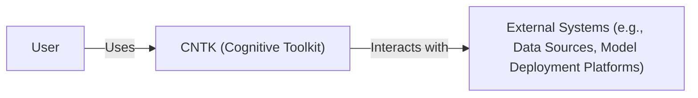
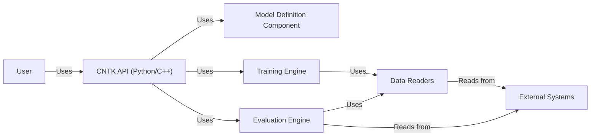
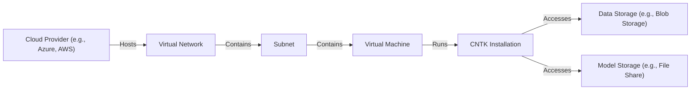
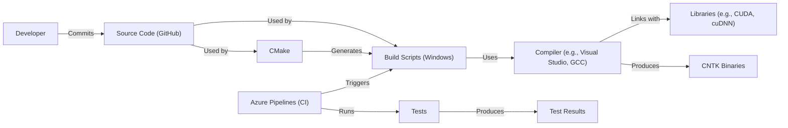

Okay, let's create a design document for the Microsoft Cognitive Toolkit (CNTK) based on the provided GitHub repository. I will follow the instructions precisely, focusing on creating a document suitable for later threat modeling.

# BUSINESS POSTURE

CNTK is a deep learning framework.  It appears to be a mature project, likely past its peak adoption phase, but still maintained.  The primary business goals likely revolve around:

*   Providing a research and development platform for deep learning models.
*   Supporting Microsoft's internal deep learning needs (historically).
*   Maintaining a competitive offering in the deep learning framework space (though this may be less of a priority now, given the dominance of PyTorch and TensorFlow).
*   Enabling users to create, train, and evaluate various types of neural networks.

Key business risks that need to be addressed:

*   **Data Integrity:**  Incorrect or manipulated training data could lead to flawed models with significant consequences, depending on their application.
*   **Model Integrity:**  Compromised model definitions or trained weights could lead to malicious behavior in deployed models.
*   **Intellectual Property Theft:**  The framework itself and models developed using it could be targets for theft.
*   **Availability:** While not a cloud service, the framework's usability and ability to function correctly are crucial for users.
*   **Reputational Risk:** Vulnerabilities or misuse of the framework could damage Microsoft's reputation.
*   **Compliance:** Depending on how and where CNTK is used, compliance with data privacy regulations (like GDPR) might be a concern.

# SECURITY POSTURE

Based on the repository, the following security controls and accepted risks are apparent:

*   security control: Code reviews (evident from the pull request process on GitHub).
*   security control: Static analysis (likely used, though specific tools aren't immediately obvious from the top-level repository structure; presence of linters and some test files suggests this).
*   security control: Issue tracking and vulnerability management (via GitHub Issues).
*   security control: Open-source development model (allows for community scrutiny and contributions).
*   security control: Use of established cryptographic libraries (CNTK likely relies on libraries like OpenSSL for any cryptographic operations, rather than implementing its own).
*   accepted risk: Reliance on third-party dependencies (inherent in any large software project; managed through dependency management tools but still a risk).
*   accepted risk: Potential for vulnerabilities in complex C++ and Python codebase (deep learning frameworks are complex, increasing the attack surface).
*   accepted risk: Limited built-in security features for model deployment (CNTK focuses on model creation and training; deployment security is largely left to the user).
*   accepted risk: The project is in maintenance mode, so the risk appetite for new features and significant security enhancements may be lower.

Recommended Security Controls (High Priority):

*   Implement a comprehensive Software Bill of Materials (SBOM) generation process to track all dependencies and their versions.
*   Integrate Static Application Security Testing (SAST) tools into the build pipeline to automatically identify potential vulnerabilities.
*   Consider Dynamic Application Security Testing (DAST) or fuzzing to test the framework's robustness against unexpected inputs.
*   Develop and publish clear security guidelines for users, particularly regarding model deployment and data handling.
*   Establish a formal security vulnerability disclosure program.

Security Requirements:

*   **Authentication:** Not directly applicable to the framework itself, but crucial for any deployment environment where models are accessed or managed.
*   **Authorization:** Similarly, not directly applicable to the core framework, but essential for controlling access to models and training data in deployment.
*   **Input Validation:**
    *   Crucial for preventing malformed data from corrupting models or causing crashes.
    *   Should be applied to both training data and model definitions.
    *   Should include checks for data type, range, and format.
*   **Cryptography:**
    *   CNTK should rely on established, well-vetted cryptographic libraries (like OpenSSL) for any encryption or hashing needs.
    *   If model weights or data need to be stored securely, appropriate encryption mechanisms should be used.
    *   Secure key management practices are essential.
*   **Data Handling:**
    *   Clear guidelines should be provided to users on how to handle sensitive data securely.
    *   Consider incorporating data sanitization and anonymization techniques.

# DESIGN

## C4 CONTEXT

*   Elements Description:
    *   Element:
        *   Name: User
        *   Type: Person
        *   Description: Researchers, data scientists, or developers who use CNTK to build and train deep learning models.
        *   Responsibilities: Providing training data, defining model architectures, training models, evaluating results, and deploying models.
        *   Security controls: Not directly applicable to the user, but user education on secure practices is important.
    *   Element:
        *   Name: CNTK (Cognitive Toolkit)
        *   Type: Software System
        *   Description: The deep learning framework itself.
        *   Responsibilities: Providing APIs for model definition, training, and evaluation; managing computational resources; handling data loading and processing.
        *   Security controls: Code reviews, static analysis, issue tracking, reliance on secure libraries.
    *   Element:
        *   Name: External Systems (e.g., Data Sources, Model Deployment Platforms)
        *   Type: Software System
        *   Description: Systems that interact with CNTK, such as data storage services, cloud platforms, or deployment environments.
        *   Responsibilities: Providing data for training, hosting trained models, serving predictions.
        *   Security controls: Depend on the specific external system; should include authentication, authorization, and data protection mechanisms.

## C4 CONTAINER

*   Elements Description:
    *   Element:
        *   Name: User
        *   Type: Person
        *   Description: Researchers, data scientists, or developers.
        *   Responsibilities: Interacting with the CNTK API.
        *   Security controls: User education.
    *   Element:
        *   Name: CNTK API (Python/C++)
        *   Type: API
        *   Description: The interface through which users interact with the framework.
        *   Responsibilities: Providing functions for model definition, training, and evaluation.
        *   Security controls: Input validation, API security best practices.
    *   Element:
        *   Name: Model Definition Component
        *   Type: Container
        *   Description: Handles the creation and representation of neural network architectures.
        *   Responsibilities: Parsing model definition files, creating computational graphs.
        *   Security controls: Input validation (to prevent malformed model definitions).
    *   Element:
        *   Name: Training Engine
        *   Type: Container
        *   Description: Manages the training process.
        *   Responsibilities: Optimizing model parameters, performing forward and backward passes, updating weights.
        *   Security controls: Robustness against numerical instability, protection against adversarial attacks (potentially).
    *   Element:
        *   Name: Evaluation Engine
        *   Type: Container
        *   Description: Evaluates trained models.
        *   Responsibilities: Calculating performance metrics, generating predictions.
        *   Security controls: Input validation, protection against data leakage.
    *   Element:
        *   Name: Data Readers
        *   Type: Container
        *   Description: Handles loading and pre-processing of data.
        *   Responsibilities: Reading data from various sources, performing data transformations.
        *   Security controls: Input validation, secure handling of data sources.
    *   Element:
        *   Name: External Systems
        *   Type: Software System
        *   Description: External data sources and deployment platforms.
        *   Responsibilities: Providing data, hosting models.
        *   Security controls: Depend on the specific system.

## DEPLOYMENT

CNTK, as a framework, can be deployed in various ways. Here are a few possibilities, with one described in detail:

1.  **Local Machine:**  For development and testing, CNTK can be installed directly on a user's machine.
2.  **Cloud Virtual Machines (VMs):**  CNTK can be installed on VMs in cloud environments like Azure, AWS, or GCP.
3.  **Containerized Environments (Docker, Kubernetes):** CNTK can be packaged into Docker containers and deployed using container orchestration platforms like Kubernetes.
4.  **Serverless Functions:**  While less common, parts of the CNTK workflow (like model inference) could potentially be deployed as serverless functions.

We'll describe the **Cloud Virtual Machines (VMs)** deployment in detail:

*   Elements Description:
    *   Element:
        *   Name: Cloud Provider (e.g., Azure, AWS)
        *   Type: Infrastructure Provider
        *   Description: The cloud platform hosting the deployment.
        *   Responsibilities: Providing infrastructure resources (compute, storage, networking).
        *   Security controls: Cloud provider's security features (e.g., IAM, network security groups).
    *   Element:
        *   Name: Virtual Network
        *   Type: Network
        *   Description: A logically isolated network within the cloud provider.
        *   Responsibilities: Providing network connectivity and isolation.
        *   Security controls: Network security groups, firewalls.
    *   Element:
        *   Name: Subnet
        *   Type: Network
        *   Description: A subdivision of the virtual network.
        *   Responsibilities: Further segmenting the network.
        *   Security controls: Network security groups.
    *   Element:
        *   Name: Virtual Machine
        *   Type: Virtual Machine
        *   Description: A virtualized computing instance.
        *   Responsibilities: Running the CNTK installation.
        *   Security controls: OS hardening, access controls, vulnerability patching.
    *   Element:
        *   Name: CNTK Installation
        *   Type: Software Installation
        *   Description: The installed CNTK framework and its dependencies.
        *   Responsibilities: Providing the deep learning functionality.
        *   Security controls: Secure configuration, regular updates.
    *   Element:
        *   Name: Data Storage (e.g., Blob Storage)
        *   Type: Data Storage
        *   Description: Storage for training data.
        *   Responsibilities: Storing and providing access to data.
        *   Security controls: Access controls, encryption at rest and in transit.
    *   Element:
        *   Name: Model Storage (e.g., File Share)
        *   Type: Data Storage
        *   Description: Storage for trained models.
        *   Responsibilities: Storing and providing access to models.
        *   Security controls: Access controls, encryption at rest and in transit.

## BUILD

CNTK's build process, based on the GitHub repository, appears to involve a combination of CMake and custom build scripts (primarily for Windows). While there's evidence of continuous integration (CI) through Azure Pipelines, the specifics are not fully exposed at the top level of the repository.

* Build process description:
    1.  Developers commit code changes to the GitHub repository.
    2.  Azure Pipelines (CI) is triggered by commits.
    3.  CMake is used to generate build files (e.g., Makefiles, Visual Studio projects).
    4.  Build scripts (primarily for Windows) orchestrate the compilation process.
    5.  A compiler (e.g., Visual Studio on Windows, GCC on Linux) compiles the source code.
    6.  The compiler links with necessary libraries (e.g., CUDA, cuDNN for GPU support).
    7.  The build process produces CNTK binaries (libraries and executables).
    8.  Tests are run as part of the CI process.
    9.  Test results are generated.

Security Controls in Build Process:

*   security control: Use of a CI system (Azure Pipelines) for automated builds and testing.
*   security control: Dependency management (though the specific tools are not immediately clear from the top-level view).
*   security control: Compilation with appropriate security flags (likely, but needs verification).
*   security control: Execution of tests to verify functionality and potentially catch some security issues.

Recommended Improvements:

*   Integrate SAST tools into the Azure Pipelines build process.
*   Generate an SBOM as part of the build.
*   Implement code signing for released binaries.
*   Use a dependency vulnerability scanner.

# RISK ASSESSMENT

*   **Critical Business Processes:**
    *   Training of deep learning models.
    *   Evaluation of deep learning models.
    *   (Potentially) Deployment of models (depending on how CNTK is used).

*   **Data Sensitivity:**
    *   **Training Data:** Can range from publicly available datasets to highly sensitive, proprietary data. Sensitivity depends entirely on the user's application.
    *   **Model Definitions:** May contain proprietary information about the model architecture.
    *   **Trained Model Weights:** Can be considered intellectual property and may also encode information about the training data.
    *   **Evaluation Data:** Similar to training data, sensitivity depends on the specific use case.

# QUESTIONS & ASSUMPTIONS

*   **Questions:**
    *   What specific SAST/DAST tools are currently used, if any?
    *   What are the exact dependency management tools and processes?
    *   What are the specific security flags used during compilation?
    *   Are there any existing security guidelines or documentation for users?
    *   What is the process for handling reported security vulnerabilities?
    *   What level of support and maintenance is currently provided for CNTK?
    *   Are there any specific compliance requirements that users of CNTK typically need to meet?
    *   What are the intended deployment scenarios for models trained with CNTK?
    *   Is there a threat model already in place for CNTK or parts of it?

*   **Assumptions:**
    *   BUSINESS POSTURE: CNTK is primarily used for research and development, with a lower emphasis on production deployments compared to frameworks like TensorFlow or PyTorch. The project is in maintenance mode.
    *   SECURITY POSTURE: Basic security practices (code reviews, issue tracking) are in place, but there's room for improvement in areas like automated security testing and vulnerability management.
    *   DESIGN: The provided C4 diagrams are a reasonable high-level representation of the system, but further details may be needed for a comprehensive threat model. The deployment scenario described (Cloud VMs) is a common one, but other scenarios are possible. The build process relies on CMake and custom scripts, with CI provided by Azure Pipelines.