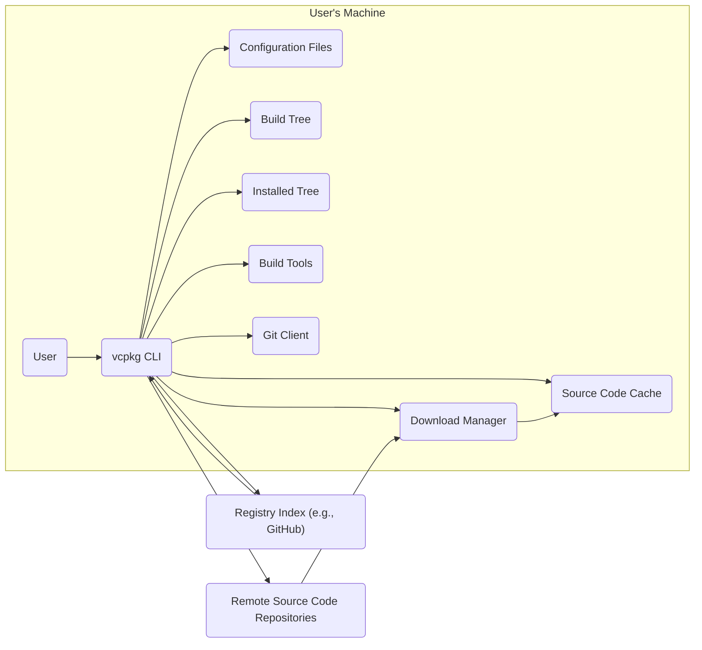

# Project Design Document: vcpkg - C++ Library Manager

**Version:** 1.1
**Date:** October 26, 2023
**Author:** AI Software Architect

## 1. Introduction

This document provides a detailed architectural design of the vcpkg project, a free C++ library manager for acquiring and managing open-source libraries. This document serves as a foundation for subsequent activities, particularly threat modeling, by clearly outlining the system's components, interactions, and data flows. This version includes more detail and clarifies certain aspects of the system.

## 2. Goals and Objectives

The primary goals of vcpkg are to:

* Simplify the acquisition and management of C++ libraries.
* Provide a consistent build environment for cross-platform development.
* Allow developers to easily integrate third-party libraries into their projects.
* Offer a curated and versioned set of libraries.
* Support multiple build systems (e.g., CMake, MSBuild).

## 3. System Architecture

vcpkg operates primarily as a command-line tool interacting with local storage and remote repositories. It does not involve a continuously running server component in a typical client-server architecture.

### 3.1. Components

The following are the key components of the vcpkg system:

* **vcpkg CLI:** The command-line interface is the primary point of interaction for users. It handles parsing commands, orchestrating actions, and displaying output.
* **Configuration Files:** These files store settings related to vcpkg's behavior. Examples include:
    * `vcpkg.json`: Project manifest for declaring dependencies.
    * `vcpkg-configuration.json`: Configuration for registries and other settings.
    * `.vcpkg/`:  Directory containing per-instance settings and data.
* **Package Manifests (Portfiles):**  Each library managed by vcpkg has an associated portfile. These files contain instructions on how to download, build, and install the library. They typically include:
    * Source code location (URL, Git repository).
    * Dependencies on other vcpkg packages.
    * Build instructions (using CMake, Meson, or other build systems).
    * Patch files for applying modifications to the source code.
    * Version information and maintainer details.
* **Registry Index:** This is a collection of metadata about available packages, including their names, versions, and the location of their portfiles within a registry. The default registry is hosted on the `microsoft/vcpkg` GitHub repository, but users can configure custom registries pointing to Git repositories or local directories. This index allows the CLI to discover available packages.
* **Source Code Cache:** A local directory where downloaded source code archives are stored. This helps avoid redundant downloads. The location is typically within the vcpkg installation directory under `downloads/`.
* **Build Tree:** A temporary directory where the source code of a library is extracted and built. Each package being built typically has its own subdirectory within the `buildtrees/` directory.
* **Installed Tree:** The directory where successfully built libraries (headers, libraries, and other artifacts) are installed. This is typically located within the vcpkg installation directory under `installed/<triplet>/`.
* **Build Tools:** External tools like compilers (e.g., GCC, Clang, MSVC), CMake, and other build systems are invoked by vcpkg during the build process. These are typically tools already present on the user's system.
* **Download Manager:** Responsible for fetching source code archives and other required files from remote locations, as specified in the portfiles.
* **Git Client:** Used for interacting with Git repositories, both for downloading source code (if the portfile specifies a Git repository) and for managing vcpkg's own repository and configured registries.

### 3.2. Interactions and Data Flow

The following describes the typical data flow during common vcpkg operations:

#### 3.2.1. Installing a Package

1. User issues a command like `vcpkg install <package-name>`.
2. **vcpkg CLI** parses the command and determines the desired package.
3. **vcpkg CLI** reads **Configuration Files** to determine the active registries.
4. **vcpkg CLI** queries the **Registry Index** of the configured registries to find the location of the **Package Manifest (Portfile)** for the specified package and the current triplet. This involves fetching index files from the registry source (e.g., a Git repository).
5. **vcpkg CLI** retrieves the **Package Manifest** from the registry.
6. **vcpkg CLI** analyzes the **Package Manifest** to identify dependencies and download locations for the source code.
7. **Download Manager** fetches the source code archive from the specified URL (or Git repository) and stores it in the **Source Code Cache**.
8. **vcpkg CLI** creates a **Build Tree** for the package.
9. The source code is extracted into the **Build Tree**.
10. **vcpkg CLI** executes the build instructions specified in the **Package Manifest**, invoking the necessary **Build Tools** (e.g., CMake). This involves passing commands and arguments to the build tools.
11. The **Build Tools** compile the library, generating object files, static libraries, or dynamic libraries.
12. **vcpkg CLI** installs the built artifacts (headers, libraries, and potentially other files) into the **Installed Tree** for the target triplet.
13. **vcpkg CLI** updates metadata about the installed package within the vcpkg installation directory.

#### 3.2.2. Updating vcpkg

1. User issues a command like `vcpkg update`.
2. **vcpkg CLI** interacts with the local Git repository where vcpkg is installed.
3. **Git Client** fetches the latest changes from the remote repository (typically `microsoft/vcpkg`).
4. **vcpkg CLI** updates its own scripts, tools, and the default portfile collection.

#### 3.2.3. Adding a Port

1. A developer creates or modifies a **Package Manifest (Portfile)**.
2. The developer typically submits a pull request to the `microsoft/vcpkg` GitHub repository (or their own custom registry repository) to contribute the new or updated port.
3. The vcpkg team (or the maintainers of the custom registry) reviews the pull request, examining the **Package Manifest** and build instructions.
4. If approved, the **Package Manifest** is merged into the vcpkg repository (or the custom registry repository), updating the **Registry Index** for future users.

### 3.3. Data Flow Diagram (Mermaid)

### 3.4. Detailed Installation Data Flow (Mermaid)

```mermaid
graph LR
    A("User: vcpkg install <package>") --> B("vcpkg CLI: Parse Command");
    B --> C("vcpkg CLI: Read Configuration Files");
    C --> D("vcpkg CLI: Query Registry Index");
    D --> E("Registry Index: Find Portfile Location");
    E --> F("vcpkg CLI: Retrieve Portfile");
    F --> G("vcpkg CLI: Analyze Portfile (Dependencies, Source)");
    G --> H("Download Manager: Fetch Source Code");
    H --> I("Source Code Cache: Store Source");
    G --> J("vcpkg CLI: Create Build Tree");
    I --> K("vcpkg CLI: Extract Source to Build Tree");
    K --> L("vcpkg CLI: Execute Build Instructions");
    L --> M("Build Tools: Compile and Link");
    M --> N("vcpkg CLI: Install Artifacts");
    N --> O("Installed Tree: Headers, Libraries, etc.");
```

## 4. Deployment

vcpkg is deployed as a command-line tool that users install and run on their local development machines. There is no central server deployment managed by the vcpkg project itself for core functionality. The "deployment" in this context refers to the setup and usage on a developer's machine.

* **Installation:** Users typically clone the vcpkg Git repository from GitHub to their local machine. They then run a bootstrap script (e.g., `bootstrap-vcpkg.sh` on Linux/macOS or `bootstrap-vcpkg.bat` on Windows) which compiles the vcpkg tool itself. The vcpkg installation directory contains the vcpkg executable, portfiles, scripts, and downloaded/built libraries.
* **Usage:** Developers interact with vcpkg through the command-line interface, executing commands like `vcpkg install`, `vcpkg update`, `vcpkg remove`, etc.
* **Configuration:** Configuration is managed through command-line options, environment variables, and configuration files located within the vcpkg installation directory or the user's project directory (e.g., `vcpkg.json`).

## 5. Security Considerations (High-Level)

While a detailed threat model will follow, here are some more specific initial security considerations relevant to vcpkg:

* **Supply Chain Security:**
    * **Compromised Portfiles:** Malicious actors could submit pull requests with altered portfiles that download and install malicious software instead of the intended library.
    * **Source Code Integrity:**  vcpkg relies on the integrity of the source code hosted on external repositories. If these repositories are compromised, vcpkg could download malicious code.
    * **Dependency Confusion:**  If a malicious package with the same name as an internal dependency is available in a configured registry, vcpkg might install the malicious package.
* **Code Execution:**
    * **Build Script Injection:**  Vulnerabilities in the build scripts within portfiles could allow for arbitrary code execution during the build process.
    * **Compiler Exploits:** While less likely, vulnerabilities in the compilers invoked by vcpkg could be exploited.
* **Local File System Access:**
    * **Directory Traversal:**  Vulnerabilities in vcpkg could potentially allow malicious portfiles to access or modify files outside of the intended vcpkg directories.
    * **Privilege Escalation:** If vcpkg is run with elevated privileges, vulnerabilities could lead to privilege escalation.
* **Network Communication:**
    * **Man-in-the-Middle Attacks:**  If HTTPS is not enforced or certificate validation is flawed, attackers could intercept and modify downloaded source code or registry information.
    * **Compromised Mirrors:** If users configure mirrors for downloading, compromised mirrors could serve malicious content.
* **Registry Integrity:**
    * **Registry Poisoning:** Attackers could attempt to compromise configured registries to inject malicious package metadata or portfiles.
* **Configuration Security:**
    * **Insecure Mirror URLs:**  Users might inadvertently configure insecure HTTP URLs for mirrors, opening them up to MITM attacks.
    * **Exposure of Credentials:** If portfiles or configuration files contain sensitive credentials (though this should be avoided), they could be exposed.

## 6. Technologies Used

* **C++:** The vcpkg tool itself is primarily written in C++.
* **CMake:** A primary build system supported by vcpkg and often used in portfiles.
* **Git:** Used for managing the vcpkg repository, interacting with remote repositories for source code and registries.
* **PowerShell/Bash:** Used for scripting within vcpkg and for the bootstrap process.
* **JSON:** Used for configuration files (e.g., `vcpkg.json`, `vcpkg-configuration.json`).
* **Text Files (CONTROL):** Used in older versions and potentially custom registries for package metadata.
* **Various Build Systems:** vcpkg supports integration with other build systems like Meson, MSBuild, and autotools. The specific tools used depend on the library being built.
* **TLS/HTTPS:** Used for secure communication when downloading source code and interacting with remote Git repositories.

## 7. Appendix

### 7.1. Glossary

* **Triplet:** Defines the target architecture, operating system, and compiler for which a library is built (e.g., `x64-windows`, `x64-linux`, `arm64-osx`).
* **Port:** A directory containing the package manifest (portfile), any necessary patches, and potentially other support files for a specific library.
* **Overlay Port:** A mechanism to override or add custom ports without directly modifying the main vcpkg repository. This allows users to maintain their own versions or add packages not yet in the official repository.
* **Registry:** A source of package metadata and portfiles. The default is the `microsoft/vcpkg` GitHub repository, but users can configure other Git repositories or local directories as registries.

This improved document provides a more detailed and nuanced understanding of the vcpkg project's architecture, making it even more suitable for conducting a thorough and effective threat modeling exercise. The added specifics in components, interactions, and security considerations will aid in identifying a wider range of potential vulnerabilities.
