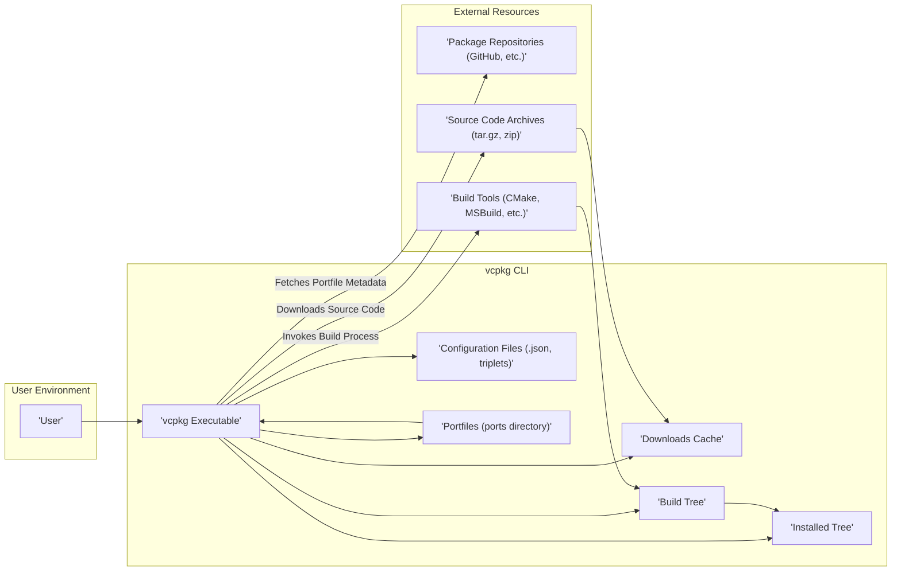

## Project Design Document: vcpkg Package Manager (Improved)

**1. Introduction**

This document provides an enhanced and more detailed design overview of the vcpkg package manager, an open-source tool developed by Microsoft for managing C and C++ libraries on Windows, Linux, and macOS. This improved document aims to provide a more granular understanding of vcpkg's architecture, components, and data flow, with a stronger emphasis on security considerations to facilitate effective threat modeling.

**2. Goals**

* Provide a clear, detailed, and security-focused description of the vcpkg system.
* Identify key components, their responsibilities, and potential security vulnerabilities.
* Outline the data flow within the vcpkg ecosystem, highlighting potential attack vectors.
* Explicitly detail security-relevant aspects of the design and potential threats.
* Serve as a robust and actionable basis for identifying and mitigating potential threats and vulnerabilities through threat modeling exercises.

**3. Scope**

This document covers the core functionalities of the vcpkg command-line interface (CLI) and its interactions with external resources. It focuses on the lifecycle of a package, from acquisition and building to installation and usage. The scope includes the management of portfiles, source code, and build processes. Internal implementation details of specific ports or build systems are not the primary focus, but their interaction with vcpkg is considered from a security perspective.

**4. High-Level Architecture**

**5. Component Details**

* **User:** The individual or automated system interacting with the vcpkg CLI to manage C and C++ libraries. This interaction is the initial point of trust and potential vulnerability (e.g., social engineering).
* **vcpkg Executable:** The central command-line tool. It parses commands, manages package metadata, orchestrates downloads and builds, and handles installation. Vulnerabilities here could grant broad control over the system.
* **Configuration Files:**
    * **`vcpkg.json` (Manifest File):** Declares project dependencies. Maliciously crafted manifests could introduce unwanted or vulnerable packages.
    * **Triplets:** Define the target build environment. Incorrect or manipulated triplets could lead to unexpected build outcomes or vulnerabilities.
    * **Portfiles (within the `ports` directory):** Scripts (typically CMake) defining the build process for each library. These are a critical point for potential code injection or malicious actions during the build.
    * **Configuration Overlays:** Allow customization, potentially introducing vulnerabilities if not managed carefully.
* **Downloads Cache:** A local storage for downloaded source archives. While improving efficiency, it's a potential target for tampering to inject malicious code.
* **Build Tree:** A temporary workspace for building libraries. Insecure permissions or vulnerabilities in build scripts could lead to local privilege escalation or data compromise.
* **Installed Tree:** The final destination for built libraries. Compromise here directly impacts projects using these libraries. Incorrect permissions could allow unauthorized modification.
* **Package Repositories:**  Sources of portfile metadata. Compromised repositories are a significant supply chain risk, potentially distributing malicious build instructions.
* **Source Code Archives:**  The actual library source code. Compromised archives directly introduce vulnerabilities into the built libraries. Integrity verification is crucial.
* **Build Tools:** External compilers and build systems invoked by vcpkg. Vulnerabilities in these tools could be exploited during the build process. vcpkg's security is partially dependent on the security of these external tools.

**6. Data Flow (Detailed)**

The process of installing a library using vcpkg can be broken down into more granular steps, highlighting potential security checkpoints:

1. **User Initiates Installation:** The user executes a command like `vcpkg install <package-name>`. This is the initial input and a potential point for command injection if vcpkg doesn't sanitize inputs properly.
2. **Portfile Lookup:**
    * vcpkg searches configured package repositories (default and any user-added overlays) for the portfile matching the requested package.
    * **Security Consideration:**  Reliance on the integrity and authenticity of these repositories. A compromised repository could serve malicious portfiles.
3. **Portfile Retrieval:** The relevant portfile is downloaded.
    * **Security Consideration:**  Ensuring secure transport (HTTPS) and potentially verifying the portfile's integrity (e.g., through signing).
4. **Dependency Resolution and Portfile Processing:**
    * vcpkg parses the portfile to identify dependencies and build instructions.
    * **Security Consideration:**  The portfile's contents are treated as trusted code. Malicious portfiles can execute arbitrary commands during the build.
5. **Source Code URL Retrieval:** The portfile specifies the location(s) to download the source code archive.
    * **Security Consideration:**  The security of these URLs. Are they HTTPS? Is there a mechanism to verify the source?
6. **Source Code Download:**
    * vcpkg downloads the source code archive.
    * **Security Consideration:**  Man-in-the-middle attacks during download. Lack of integrity checks (e.g., hash verification) on the downloaded archive.
7. **Download Cache Interaction:** The downloaded archive is stored in the Downloads Cache.
    * **Security Consideration:**  Potential for tampering with cached files.
8. **Build Environment Setup:** vcpkg creates a temporary build directory within the Build Tree.
    * **Security Consideration:**  Permissions on the Build Tree. Can other processes interfere?
9. **Build Process Execution:**
    * vcpkg executes the build commands defined in the portfile, typically invoking build tools like CMake or MSBuild.
    * **Security Consideration:**  This is the most critical phase for potential code execution vulnerabilities. The security of the build scripts and the invoked build tools is paramount. vcpkg executes these commands with the user's privileges.
10. **Installation to Installed Tree:**
    * Upon successful build, vcpkg copies the compiled libraries and headers to the Installed Tree.
    * **Security Consideration:**  Permissions on the Installed Tree. Can unauthorized users modify installed libraries?
11. **User Project Integration:** The user configures their project to link against the libraries in the Installed Tree.
    * **Security Consideration:**  If the Installed Tree is compromised, user projects will link against potentially malicious libraries.

**7. Security Considerations (Categorized)**

To facilitate threat modeling, we can categorize potential threats:

* **Supply Chain Attacks:**
    * **Compromised Package Repositories:** Attackers could inject malicious portfiles, leading to the installation of compromised libraries.
    * **Compromised Source Code Archives:** Attackers could compromise the source code hosted on external sites, leading to vulnerabilities in the built libraries.
    * **Dependency Confusion/Substitution:** Attackers could create packages with similar names to legitimate dependencies in public repositories, tricking users into installing malicious versions.
* **Code Execution Vulnerabilities:**
    * **Malicious Portfiles:** Portfiles can contain arbitrary code that is executed during the build process.
    * **Build Tool Exploits:** Vulnerabilities in the underlying build tools (compilers, linkers) could be exploited during the build.
    * **Command Injection:** If vcpkg doesn't properly sanitize user inputs, attackers could inject malicious commands.
* **Data Integrity Threats:**
    * **Man-in-the-Middle Attacks:** Attackers could intercept and modify downloaded source code or portfiles.
    * **Tampering with Local Files:** Attackers with local access could modify files in the Downloads Cache, Build Tree, or Installed Tree.
* **Authentication and Authorization Issues:**
    * **Access to Private Repositories:** Weak authentication or authorization for private repositories could allow unauthorized access to portfiles and source code.
* **Configuration Vulnerabilities:**
    * **Insecure Configuration:** Misconfigured triplets or other settings could lead to unexpected behavior or security weaknesses.
* **Information Disclosure:**
    * **Leaking Sensitive Information:** Error messages or logs could inadvertently reveal sensitive information about the build environment or dependencies.

**8. Deployment**

vcpkg is typically deployed as a command-line tool installed directly on developer machines or within CI/CD pipelines. It requires network access to download resources. The security posture of the environment where vcpkg is deployed significantly impacts its overall security.

**9. Future Considerations (Security Enhancements)**

These are potential areas for future development that would enhance the security of vcpkg:

* **Cryptographic Verification of Downloads:** Implementing mandatory verification of downloaded source code archives using checksums or digital signatures specified in the portfiles.
* **Portfile Signing and Verification:** Introducing a mechanism for signing portfiles by trusted entities to ensure their authenticity and integrity, preventing tampering.
* **Sandboxed Build Environments:** Exploring the use of containerization or other sandboxing technologies to isolate the build process for each package, limiting the impact of malicious build scripts.
* **Enhanced Dependency Management Security:** Implementing stricter checks and controls around dependency resolution, including mechanisms to prevent dependency confusion attacks (e.g., using namespace prefixes or verifiable package identities).
* **Improved Security Auditing and Logging:** Enhancing logging capabilities to track security-relevant events and facilitate auditing.
* **Static Analysis of Portfiles:** Integrating static analysis tools to identify potential security issues within portfiles before execution.
* **Role-Based Access Control for Private Repositories:** Implementing granular access control mechanisms for private vcpkg repositories.

This improved design document provides a more detailed and security-focused overview of vcpkg, making it a more effective foundation for subsequent threat modeling activities. The added granularity and categorization of security considerations should facilitate a more comprehensive identification of potential threats and vulnerabilities.