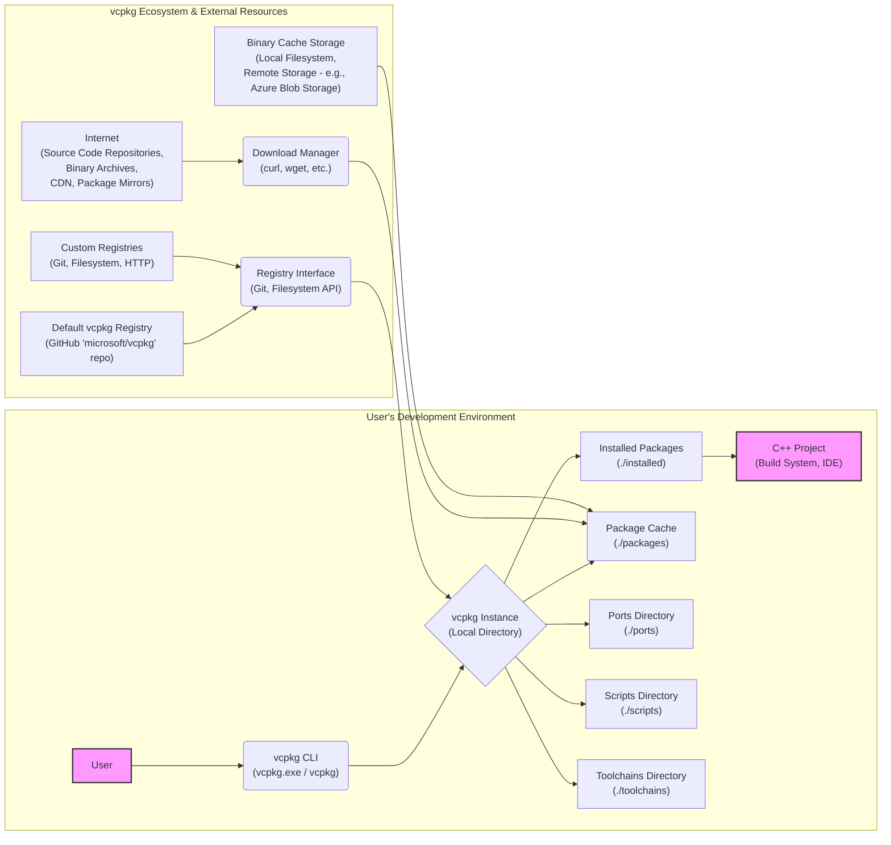

# Project Design Document: vcpkg Package Manager for Threat Modeling (Improved)

**Project:** vcpkg - C++ Package Manager
**Version:** 1.1
**Date:** 2023-10-27
**Author:** AI Software Architect

## 1. Introduction

This document provides an enhanced and more detailed design overview of the vcpkg C++ package manager, as hosted on GitHub at [https://github.com/microsoft/vcpkg](https://github.com/microsoft/vcpkg). Building upon the previous version, this document aims to provide an even stronger foundation for threat modeling activities. It further elaborates on the system's architecture, key components, data flow, and trust boundaries, incorporating more specific details and potential threat scenarios. This refined information will be crucial for a more comprehensive identification of security vulnerabilities and the development of robust mitigation strategies.

## 2. Project Overview

vcpkg is a command-line package manager for C++ that dramatically simplifies the process of acquiring and managing C++ libraries on Windows, Linux, and macOS. It addresses the historical challenges of C++ dependency management by providing a centralized system for discovering, installing, and updating libraries. vcpkg operates primarily by building libraries from source code, offering flexibility and compatibility across diverse environments. It also supports consuming pre-built binaries where available, optimizing installation time in certain scenarios.

**Key Features (Expanded):**

*   **Cross-Platform Support:** Operates seamlessly across Windows, Linux, and macOS, ensuring consistent dependency management regardless of the development platform.
*   **Source and Binary Packages:** Prioritizes building from source for maximum compatibility and customization, but also leverages pre-built binaries for speed when feasible and available through binary caching or registries.
*   **Manifest-Based Dependency Management (`vcpkg.json`):** Projects can declare their dependencies in a `vcpkg.json` manifest file, enabling declarative and reproducible builds. This file lists required packages and version constraints.
*   **Registry Support (Default and Custom):**
    *   **Default Registry:** The primary registry is maintained by the vcpkg team and hosted on GitHub, offering a vast catalog of community-contributed packages.
    *   **Custom Registries:**  vcpkg allows the configuration of custom registries, enabling organizations or individuals to host and manage their own private or curated package collections. These can be Git repositories, filesystem directories, or other supported types, offering flexibility and control over package sources.
*   **Versioning and Baselines:** Supports semantic versioning for packages and the use of baselines to ensure consistent dependency resolution across projects and over time. Baselines define a specific commit in the registry to use as a starting point for version resolution.
*   **Extensibility (Ports and Overlays):**
    *   **Ports:**  Users can contribute new packages by creating "portfiles" (CMake scripts) that define the build and installation process for a library.
    *   **Overlays:**  Users can overlay and customize existing ports or add entirely new ports without modifying the core vcpkg repository, facilitating local modifications and private package additions.
*   **Binary Caching:** Supports local and remote binary caching to speed up subsequent installations of the same package and version. This can significantly reduce build times, especially in CI/CD environments.
*   **Exports:**  Provides mechanisms to export installed packages into various formats suitable for different build systems and deployment scenarios (e.g., NuGet packages, CMake toolchain files).

## 3. System Architecture

The following diagram illustrates the refined high-level architecture of vcpkg, emphasizing the interaction between components.

**Components Description (Enhanced):**

*   **"User"**: Represents a developer interacting with vcpkg through the command-line interface.
*   **"vcpkg CLI (vcpkg.exe / vcpkg)"**: The primary executable, acting as the user interface and orchestrator of vcpkg operations. It parses commands, interacts with registries, manages the local vcpkg instance, and invokes build tools.
*   **"vcpkg Instance (Local Directory)"**: The central working directory for vcpkg, containing:
    *   **"Ports Directory (./ports)"**: Contains portfiles (`portfile.cmake`) for each package, defining build instructions, dependencies, and metadata.
    *   **"Scripts Directory (./scripts)"**: Houses scripts used for various vcpkg operations, including build logic and toolchain management.
    *   **"Toolchains Directory (./toolchains)"**: Defines toolchain files that configure compilers, linkers, and other build tools for different target environments.
    *   **"Installed Packages Directory (./installed)"**: Stores the final installed libraries, headers, and associated files, organized by target architecture and configuration.
    *   **"Package Cache Directory (./packages)"**:  A local cache for downloaded source code archives, intermediate build artifacts, and built packages. This significantly speeds up repeated installations.
*   **"Installed Packages Directory (./installed)"**:  Specifically the `./installed` subdirectory within the vcpkg instance, containing the ready-to-use libraries.
*   **"Package Cache Directory (./packages)"**: Specifically the `./packages` subdirectory within the vcpkg instance, acting as the local cache.
*   **"Ports Directory (./ports)"**: Specifically the `./ports` subdirectory within the vcpkg instance, containing port definitions.
*   **"Scripts Directory (./scripts)"**: Specifically the `./scripts` subdirectory within the vcpkg instance, containing scripts for vcpkg operations.
*   **"Toolchains Directory (./toolchains)"**: Specifically the `./toolchains` subdirectory within the vcpkg instance, containing toolchain configurations.
*   **"C++ Project (Build System, IDE)"**: The user's C++ project that consumes libraries managed by vcpkg. Build systems (CMake, MSBuild, etc.) are configured to find packages in the "Installed Packages Directory".
*   **"Default vcpkg Registry (GitHub 'microsoft/vcpkg' repo)"**: The official vcpkg registry hosted as the `microsoft/vcpkg` repository on GitHub. It's the primary source for package definitions.
*   **"Custom Registries (Git, Filesystem, HTTP)"**: User-configurable registries, allowing for private or curated package sources. Supported types include Git repositories, local filesystem paths, and HTTP endpoints for registry metadata.
*   **"Registry Interface (Git, Filesystem API)"**: The abstraction layer within vcpkg CLI that handles communication with different registry types. For Git registries, it uses Git commands; for filesystem registries, it uses file system APIs.
*   **"Internet (Source Code Repositories, Binary Archives, CDN, Package Mirrors)"**: The external network from which vcpkg downloads resources. This includes source code repositories (GitHub, GitLab, etc.), binary archive hosting services, CDNs for faster downloads, and package mirrors.
*   **"Download Manager (curl, wget, etc.)"**: The component responsible for downloading files from the internet. It typically utilizes system tools like `curl` or `wget` or built-in functionalities for HTTP/HTTPS requests.
*   **"Binary Cache Storage (Local Filesystem, Remote Storage - e.g., Azure Blob Storage)"**:  Storage locations for binary caches. Can be the local filesystem for personal caching or remote storage (like Azure Blob Storage, AWS S3, or Artifactory) for shared caching in teams or CI/CD pipelines.

## 4. Data Flow Diagram

```mermaid
graph LR
    A["User\n(vcpkg CLI)"] --> B{"Parse Command\n('vcpkg install <package>')\n& Configuration"};
    B --> C{"Registry Resolution\n(Default & Custom Registries)"};
    C --> D{"Registry Interface"};
    D --> E["Retrieve Package Metadata\n(package info, version, portfile location)"];
    E --> F{"Locate Portfile\n(<package>/portfile.cmake)"};
    F --> G{"Dependency Resolution\n(parse portfile, resolve dependencies)"};
    G --> H{"Check Local Binary Cache"};
    H -- "Cache Hit" --> I{"Install from Binary Cache"};
    H -- "Cache Miss" --> J{"Check Remote Binary Cache\n(if configured)"};
    J -- "Remote Cache Hit" --> I;
    J -- "Remote Cache Miss" --> K{"Download Source Code\n(from Internet - Source Repo URL in portfile)"};
    K --> L["Verify Download\n(Checksum Verification)"];
    L --> M["Extract Source Code\n(to build directory)"];
    M --> N{"Apply Patches\n(patches specified in portfile)"};
    N --> O{"Build Package\n(execute build instructions in portfile,\nusing toolchain)"};
    O --> P{"Package Binary Caching\n(Store built binaries in local & remote cache)"};
    P --> Q{"Install Package\n(copy files to Installed Packages Directory)"};
    Q --> R["Report Success/Failure\nto User"];

    style A fill:#f9f,stroke:#333,stroke-width:2px
```

The following diagram refines the data flow during a `vcpkg install <package>` operation, adding more detail and clarity.

**Data Flow Description (Enhanced):**

1.  **User Input & Configuration:** The user executes `vcpkg install <package>` via the CLI. vcpkg parses the command and loads relevant configuration settings (e.g., configured registries, binary cache locations).
2.  **Registry Resolution:** vcpkg resolves the package name by querying configured registries (starting with custom registries if defined, then the default registry).
3.  **Registry Interface Interaction:** vcpkg interacts with the appropriate registry interface based on the registry type (Git, Filesystem, etc.).
4.  **Package Metadata Retrieval:** vcpkg retrieves package metadata from the registry, including package information, available versions, and the location of the portfile within the registry.
5.  **Portfile Location:** vcpkg locates the `portfile.cmake` for the requested package within the retrieved registry data.
6.  **Dependency Resolution:** vcpkg parses the portfile, identifies package dependencies, and recursively resolves dependencies, potentially involving further registry lookups.
7.  **Local Binary Cache Check:** vcpkg checks the local binary cache to see if a pre-built binary package matching the requested version, configuration, and dependencies is available.
8.  **Cache Hit (Install from Binary Cache):** If a local cache hit occurs, vcpkg installs the package directly from the local binary cache.
9.  **Remote Binary Cache Check (Optional):** If no local cache hit and a remote binary cache is configured, vcpkg checks the remote cache.
10. **Remote Cache Hit (Install from Remote Cache):** If a remote cache hit occurs, vcpkg downloads and installs the package from the remote binary cache.
11. **Cache Miss (Download Source Code):** If no cache hit (local or remote), vcpkg proceeds to download the source code for the package from the source repository URL specified in the portfile.
12. **Download Verification:** vcpkg verifies the integrity of the downloaded source code archive using checksums (e.g., SHA256) provided in the portfile or registry metadata.
13. **Source Code Extraction:** The downloaded archive is extracted into a temporary build directory.
14. **Patch Application:** Patches specified in the portfile are applied to the extracted source code to address compatibility issues or apply necessary modifications.
15. **Package Building:** vcpkg executes the build instructions defined in the portfile, utilizing the configured toolchain (compilers, linkers, build tools) to build the library from source.
16. **Package Binary Caching:** After successful build, vcpkg stores the built binary package in both the local binary cache and, if configured, the remote binary cache for future use.
17. **Package Installation:** vcpkg installs the built package by copying necessary files (libraries, headers, etc.) to the "Installed Packages Directory".
18. **Success/Failure Reporting:** vcpkg reports the outcome of the installation process to the user, indicating success or providing error messages in case of failure.

## 5. Trust Boundaries (Detailed)

Expanding on the trust boundaries, with specific threat examples:

*   **User's Development Environment <-> Internet:**
    *   **Boundary:** Network connection for downloading resources from the internet.
    *   **Trust Assumption:** The internet is an untrusted network. All data transmitted over the internet is potentially vulnerable to interception and manipulation.
    *   **Threats:**
        *   **Man-in-the-Middle (MITM) Attacks:** Attackers intercept network traffic to inject malicious code or redirect downloads to compromised servers.
        *   **Compromised Download Servers:** Legitimate source code repositories or binary archive hosts could be compromised, serving malicious files.
        *   **Phishing/Social Engineering:** Users could be tricked into downloading malicious vcpkg instances or configurations from untrusted sources.
*   **User's Development Environment <-> Default vcpkg Registry (GitHub):**
    *   **Boundary:** Interaction with the default vcpkg registry on GitHub to retrieve portfiles and package metadata.
    *   **Trust Assumption:** While GitHub is a reputable platform, the registry content is community-maintained and subject to potential vulnerabilities or malicious contributions.
    *   **Threats:**
        *   **Malicious Portfiles:** Attackers could submit malicious portfiles to the registry that contain vulnerabilities, execute arbitrary code during builds, or introduce backdoors into installed libraries.
        *   **Registry Compromise:** Although less likely, a compromise of the GitHub repository hosting the default registry could lead to widespread distribution of malicious portfiles.
        *   **Dependency Confusion Attacks (Registry Level):** Attackers could attempt to register malicious packages with names similar to legitimate packages in the default registry.
*   **User's Development Environment <-> Custom Registries:**
    *   **Boundary:** Interaction with user-defined custom registries.
    *   **Trust Assumption:** Trust level depends entirely on the source and management of the custom registry. Security posture can vary significantly.
    *   **Threats:**
        *   **Insecure Custom Registries:** Custom registries hosted on insecure infrastructure or with weak access controls are highly vulnerable to compromise and malicious package injection.
        *   **Internal Malicious Actors:** Within an organization, malicious insiders could introduce compromised packages into private custom registries.
        *   **Lack of Auditing and Review:** Custom registries may lack the community review and auditing processes present in the default registry, increasing the risk of vulnerabilities.
*   **vcpkg CLI <-> Build System:**
    *   **Boundary:** Execution of build scripts (portfiles) by the vcpkg CLI using system build tools.
    *   **Trust Assumption:** System build tools (compilers, linkers, etc.) are assumed to be trusted, but vulnerabilities in portfiles or the build process can be exploited.
    *   **Threats:**
        *   **Arbitrary Code Execution:** Malicious portfiles could contain commands that exploit vulnerabilities in build tools or execute arbitrary code on the user's system during the build process.
        *   **Build Script Injection:** Attackers could inject malicious code into portfiles to compromise the build process and inject backdoors into compiled libraries.
        *   **Resource Exhaustion:** Malicious portfiles could be designed to consume excessive system resources (CPU, memory, disk space) during builds, leading to denial-of-service.
*   **User <-> vcpkg CLI:**
    *   **Boundary:** Interaction between the user and the vcpkg CLI.
    *   **Trust Assumption:** The user is assumed to be authorized to use vcpkg on their system.
    *   **Threats:**
        *   **Privilege Escalation:** Vulnerabilities in the vcpkg CLI could allow unauthorized users to gain elevated privileges on the system by exploiting the tool.
        *   **Command Injection:** If the vcpkg CLI improperly handles user input, attackers could inject malicious commands to be executed by the CLI with its privileges.
        *   **Local File System Access Vulnerabilities:**  Vulnerabilities in how vcpkg handles file system operations could allow attackers to read, write, or delete arbitrary files on the user's system.

## 6. Security Considerations and Mitigation Strategies

Expanding on security considerations with specific mitigation strategies:

*   **Supply Chain Security:**
    *   **Consideration:** Ensuring integrity and authenticity of packages and their sources to prevent supply chain attacks.
    *   **Mitigation Strategies:**
        *   **Checksum Verification:** Implement mandatory checksum verification (SHA256 or stronger) for downloaded source code archives and binary packages.
        *   **HTTPS for Downloads:** Enforce HTTPS for all downloads from source repositories, binary caches, and registries to prevent MITM attacks.
        *   **Code Signing (Future Enhancement):** Explore and implement code signing for vcpkg binaries and potentially for binary packages in registries to verify origin and integrity.
        *   **Source Code Auditing:** Encourage community auditing and static analysis of portfiles in the default registry to identify potential vulnerabilities.
*   **Registry Security:**
    *   **Consideration:** Protecting registry integrity to prevent malicious portfiles.
    *   **Mitigation Strategies:**
        *   **Access Control (Registry Management):** Implement strict access control for managing and modifying the default vcpkg registry.
        *   **Portfile Review Process:** Establish a robust review process for new portfile submissions to the default registry, including security checks and static analysis.
        *   **Vulnerability Scanning of Portfiles:** Implement automated vulnerability scanning of portfiles in registries to detect potential security issues.
        *   **Registry Integrity Monitoring:** Monitor registries for unauthorized modifications or suspicious activity.
        *   **For Custom Registries:** Provide guidelines and best practices for securing custom registries, emphasizing access control, HTTPS, and integrity checks.
*   **Build Process Security:**
    *   **Consideration:** Mitigating risks during the build process from malicious portfiles or build tool vulnerabilities.
    *   **Mitigation Strategies:**
        *   **Sandboxed Builds (Future Enhancement):** Explore sandboxing build processes to limit the impact of malicious code execution during builds.
        *   **Static Analysis of Portfiles:** Implement static analysis tools to automatically scan portfiles for potentially dangerous commands or patterns.
        *   **Secure Build Environments:** Recommend or enforce the use of secure build environments with hardened operating systems and up-to-date build tools.
        *   **Principle of Least Privilege:** Run build processes with the minimum necessary privileges to limit the impact of potential exploits.
*   **Download Source Verification:**
    *   **Consideration:** Ensuring downloaded source code and binaries are authentic and untampered with.
    *   **Mitigation Strategies:**
        *   **Mandatory Checksum Verification (as mentioned above).**
        *   **Signature Verification (Future Enhancement):** Explore signature verification for source code archives and binary packages if feasible.
        *   **Reputable Source Repositories:** Prioritize downloading from well-known and reputable source code repositories.
        *   **Content Delivery Networks (CDNs):** Utilize CDNs for distributing downloads to improve speed and potentially enhance security through distributed infrastructure.
*   **Dependency Confusion:**
    *   **Consideration:** Preventing dependency confusion attacks.
    *   **Mitigation Strategies:**
        *   **Package Naming Conventions:** Enforce clear and consistent package naming conventions to reduce the risk of name collisions and confusion.
        *   **Registry Namespacing:** Implement registry namespacing to differentiate between packages from different sources and reduce the likelihood of confusion.
        *   **User Awareness:** Educate users about dependency confusion risks and best practices for verifying package sources.
*   **Local Security:**
    *   **Consideration:** Ensuring the vcpkg CLI and local instance are secure.
    *   **Mitigation Strategies:**
        *   **Regular Security Audits:** Conduct regular security audits and penetration testing of the vcpkg CLI and core components.
        *   **Input Validation:** Implement robust input validation throughout the vcpkg CLI to prevent command injection and other input-related vulnerabilities.
        *   **Secure File Handling:** Ensure secure file handling practices to prevent local file system access vulnerabilities.
        *   **Principle of Least Privilege (CLI Execution):** Encourage users to run vcpkg CLI with the minimum necessary privileges.
        *   **Regular Updates:** Encourage users to keep their vcpkg instance updated to the latest version to benefit from security patches and improvements.
*   **User Education:**
    *   **Consideration:** Empowering users to use vcpkg securely.
    *   **Mitigation Strategies:**
        *   **Security Documentation:** Provide comprehensive security documentation and best practices for using vcpkg securely.
        *   **Security Warnings and Guidance:** Display clear security warnings and guidance to users when performing potentially risky operations (e.g., using custom registries, installing packages from untrusted sources).
        *   **Community Awareness:** Foster a security-conscious community around vcpkg by promoting security discussions and knowledge sharing.

## 7. Conclusion

This improved design document provides a more detailed and nuanced understanding of the vcpkg package manager's architecture and security landscape. By elaborating on components, data flows, trust boundaries, and security considerations with specific threat examples and mitigation strategies, this document offers a significantly enhanced foundation for threat modeling. This refined analysis will enable more effective identification of potential security vulnerabilities and the development of targeted security controls to strengthen vcpkg and its ecosystem against evolving threats. This document should be considered a living document, to be updated and refined as vcpkg evolves and new security challenges emerge. Further in-depth security analysis and ongoing risk assessment are crucial for maintaining a robust and secure C++ package management solution.