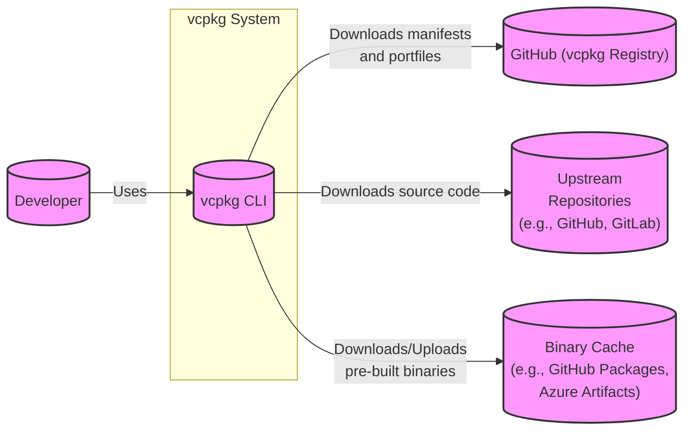
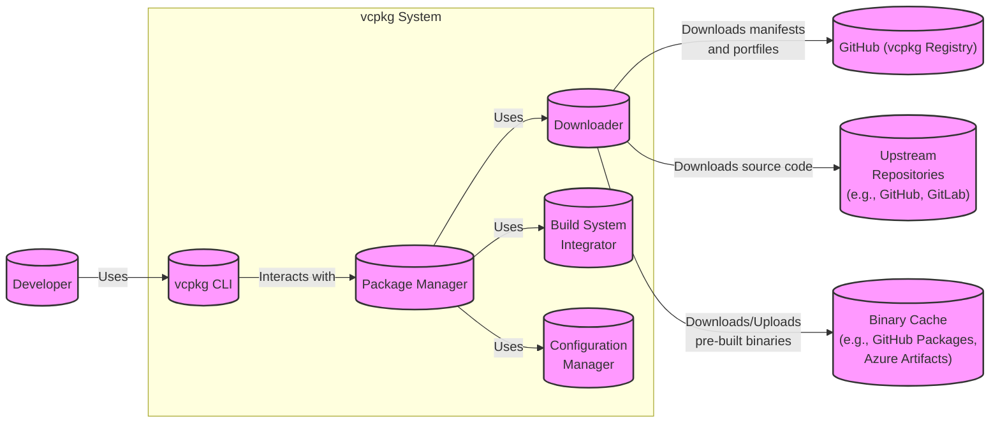
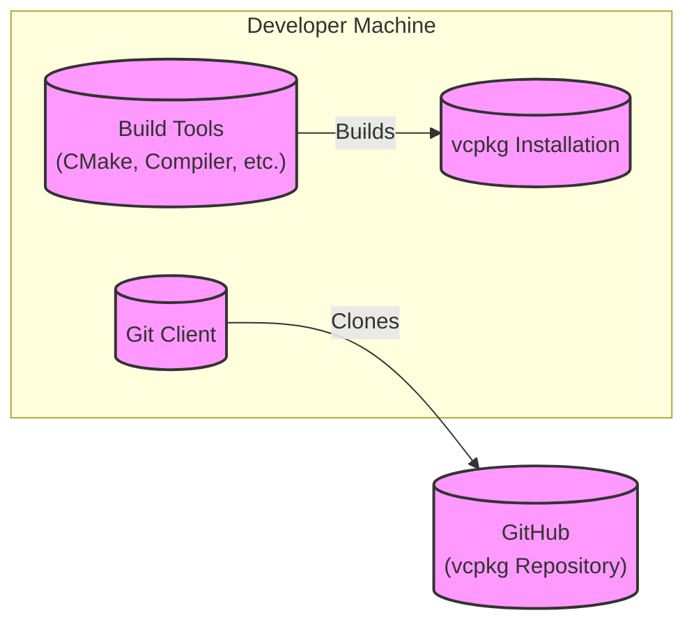
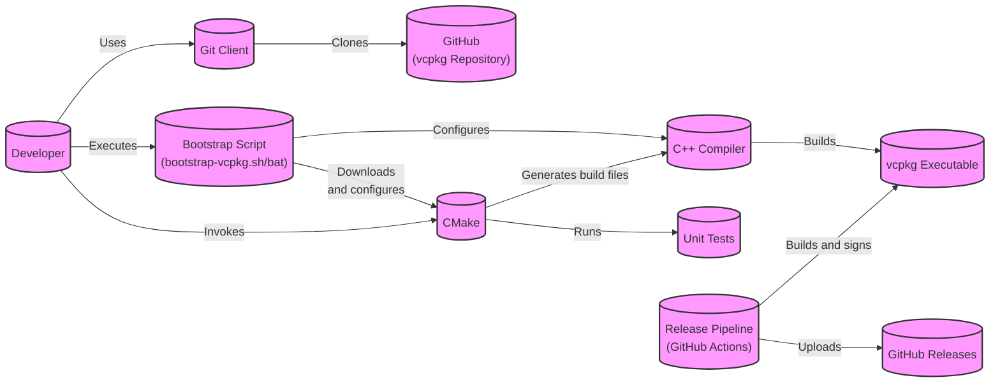

Okay, let's create a design document for the vcpkg project, focusing on aspects relevant for threat modeling.

# BUSINESS POSTURE

vcpkg is a command-line package manager for C++ libraries. It simplifies the acquisition and management of open-source libraries on Windows, Linux, and macOS.  It's a critical tool for developers building C++ applications, and its primary business goals are:

*   Goal: Simplify dependency management for C++ developers.
*   Goal: Provide a consistent and reliable way to build C++ projects across different platforms.
*   Goal: Reduce the time and effort required to integrate third-party libraries.
*   Goal: Enhance developer productivity.
*   Goal: Support a wide range of C++ libraries and build tools.
*   Goal: Maintain a high level of security and trust in the managed packages.

Based on these goals, the most important business risks are:

*   Risk: Compromise of the vcpkg registry or distribution mechanism, leading to the delivery of malicious packages to users.
*   Risk: Availability issues with the vcpkg service, preventing developers from accessing necessary libraries.
*   Risk: Incompatibility with popular build systems or development environments, limiting adoption.
*   Risk: Lack of support for critical libraries or platforms, reducing usefulness.
*   Risk: Bugs or vulnerabilities within vcpkg itself, leading to build failures or security exploits.
*   Risk: Failure to keep up with evolving C++ standards and best practices.

# SECURITY POSTURE

Existing security controls and accepted risks (based on the public repository and common practices):

*   security control: Code signing of executables (where applicable, depending on the platform). Location: Build process, likely in release pipelines.
*   security control: Use of HTTPS for communication with the GitHub repository and other online resources. Location: Throughout the codebase, wherever network communication occurs.
*   security control: Community-driven vetting of package manifests and build scripts (ports). Location: GitHub pull request review process.
*   security control: Static analysis and code review during development. Location: GitHub pull request process, potentially integrated with CI.
*   security control: Use of a well-defined manifest format (vcpkg.json) to specify dependencies and build configurations. Location: Defined in the vcpkg documentation and enforced by the tool.
*   security control: Binary Caching. Location: GitHub Actions, Azure DevOps.
*   accepted risk: Reliance on the security of third-party library sources (e.g., upstream GitHub repositories, project websites). vcpkg doesn't directly control the security of the libraries it manages.
*   accepted risk: Potential for vulnerabilities in the build scripts (CMake, etc.) of individual packages.
*   accepted risk: Limited control over the user's build environment (e.g., compiler versions, installed tools).

Recommended security controls (high priority):

*   security control: Implement a robust mechanism for verifying the integrity of downloaded packages, such as cryptographic signatures and checksums, beyond just relying on HTTPS.
*   security control: Introduce a formal security vulnerability disclosure program and response process.
*   security control: Regularly perform security audits and penetration testing of the vcpkg infrastructure.
*   security control: Implement Software Bill of Materials (SBOM) generation for managed packages.
*   security control: Integrate dynamic analysis (fuzzing) into the CI/CD pipeline.
*   security control: Implement supply chain security measures, such as SLSA (Supply-chain Levels for Software Artifacts).

Security Requirements:

*   Authentication:
    *   vcpkg itself doesn't require user authentication for basic package management.
    *   Authentication is handled by the underlying platform (e.g., GitHub credentials for accessing private repositories).
    *   Binary Caching might use authentication.
*   Authorization:
    *   Access control to the vcpkg registry (for publishing new packages or updates) should be strictly controlled.  This is likely managed through GitHub repository permissions.
    *   Users should not be able to modify the core vcpkg installation or configuration without appropriate system-level permissions.
*   Input Validation:
    *   vcpkg must rigorously validate all inputs, including package manifests (vcpkg.json), portfiles, and user-provided command-line arguments.  This is crucial to prevent command injection, path traversal, and other vulnerabilities.
    *   Input validation should be performed against a well-defined schema or grammar.
*   Cryptography:
    *   HTTPS should be used for all network communications.
    *   Cryptographic hashes (e.g., SHA-256) should be used to verify the integrity of downloaded packages.
    *   Consider using digital signatures to verify the authenticity of packages and manifests.
*   Configuration Management:
    *   Secure defaults should be used for all configuration options.
    *   Users should be warned about potentially insecure configurations.

# DESIGN

## C4 CONTEXT

C4 Context Element Descriptions:

*   Element:
    *   Name: Developer
    *   Type: Person
    *   Description: A software developer who uses vcpkg to manage C++ dependencies.
    *   Responsibilities: Writes code, configures build systems, uses vcpkg to install and manage libraries.
    *   Security controls: Uses strong passwords, keeps development environment secure, follows secure coding practices.

*   Element:
    *   Name: vcpkg CLI
    *   Type: Software System
    *   Description: The command-line interface for vcpkg.
    *   Responsibilities: Parses user commands, manages package installations, downloads packages, interacts with the build system.
    *   Security controls: Input validation, HTTPS communication, secure configuration management.

*   Element:
    *   Name: GitHub (vcpkg Registry)
    *   Type: External System
    *   Description: The primary registry for vcpkg packages, hosted on GitHub.
    *   Responsibilities: Stores package manifests (vcpkg.json) and portfiles.
    *   Security controls: GitHub's built-in security features, access controls, code signing (for releases).

*   Element:
    *   Name: Upstream Repositories
    *   Type: External System
    *   Description: The source code repositories for the C++ libraries managed by vcpkg.
    *   Responsibilities: Host the source code for the libraries.
    *   Security controls: Rely on the security of the upstream repository providers (e.g., GitHub, GitLab).

*   Element:
    *   Name: Binary Cache
    *   Type: External System
    *   Description: A cache for pre-built binary packages.
    *   Responsibilities: Stores and serves pre-built binary packages to speed up installation.
    *   Security controls: Access controls, integrity checks (e.g., checksums), potentially authentication.

## C4 CONTAINER

C4 Container Element Descriptions:

*   Element:
    *   Name: vcpkg CLI
    *   Type: Application
    *   Description: Entry point for user interaction.
    *   Responsibilities: Command-line parsing, user interface.
    *   Security controls: Input validation.

*   Element:
    *   Name: Package Manager
    *   Type: Component
    *   Description: Core logic for managing packages.
    *   Responsibilities: Resolving dependencies, managing installations, updates, and removals.
    *   Security controls: Input validation, dependency graph analysis.

*   Element:
    *   Name: Downloader
    *   Type: Component
    *   Description: Handles downloading files.
    *   Responsibilities: Downloading manifests, portfiles, source code, and binary packages.
    *   Security controls: HTTPS communication, integrity checks (checksums).

*   Element:
    *   Name: Build System Integrator
    *   Type: Component
    *   Description: Integrates with various build systems (CMake, MSBuild, etc.).
    *   Responsibilities: Generating build system configurations, invoking the build system.
    *   Security controls: Secure configuration generation, sandboxing (if possible).

*   Element:
    *   Name: Configuration Manager
    *   Type: Component
    *   Description: Manages vcpkg configuration.
    *   Responsibilities: Reading and writing configuration files, managing settings.
    *   Security controls: Secure configuration storage, secure defaults.

*   Element:
    *   Name: Developer
    *   Type: Person
    *   Description: A software developer who uses vcpkg to manage C++ dependencies.
    *   Responsibilities: Writes code, configures build systems, uses vcpkg to install and manage libraries.
    *   Security controls: Uses strong passwords, keeps development environment secure, follows secure coding practices.

*   Element:
    *   Name: GitHub (vcpkg Registry)
    *   Type: External System
    *   Description: The primary registry for vcpkg packages, hosted on GitHub.
    *   Responsibilities: Stores package manifests (vcpkg.json) and portfiles.
    *   Security controls: GitHub's built-in security features, access controls, code signing (for releases).

*   Element:
    *   Name: Upstream Repositories
    *   Type: External System
    *   Description: The source code repositories for the C++ libraries managed by vcpkg.
    *   Responsibilities: Host the source code for the libraries.
    *   Security controls: Rely on the security of the upstream repository providers (e.g., GitHub, GitLab).

*   Element:
    *   Name: Binary Cache
    *   Type: External System
    *   Description: A cache for pre-built binary packages.
    *   Responsibilities: Stores and serves pre-built binary packages to speed up installation.
    *   Security controls: Access controls, integrity checks (e.g., checksums), potentially authentication.

## DEPLOYMENT

vcpkg can be deployed in several ways:

1.  **Cloning the repository:** Users clone the vcpkg GitHub repository and build it from source.
2.  **Downloading a pre-built release:** Users download a pre-built executable from the GitHub releases page.
3.  **Using a package manager:**  vcpkg can be installed via other package managers (like Chocolatey on Windows).

We'll describe deployment via cloning the repository, as it's the most common and gives the most control:

Deployment Element Descriptions:

*   Element:
    *   Name: Git Client
    *   Type: Tool
    *   Description: The Git client used to clone the vcpkg repository.
    *   Responsibilities: Cloning the repository, fetching updates.
    *   Security controls: Uses SSH or HTTPS for secure communication with GitHub.

*   Element:
    *   Name: Build Tools
    *   Type: Tool
    *   Description: The build tools required to build vcpkg from source (CMake, a C++ compiler, etc.).
    *   Responsibilities: Compiling the vcpkg source code.
    *   Security controls: Ensure the build tools are from trusted sources and are up-to-date.

*   Element:
    *   Name: vcpkg Installation
    *   Type: Software System
    *   Description: The installed instance of vcpkg.
    *   Responsibilities: Managing C++ dependencies.
    *   Security controls:  Regularly update vcpkg to the latest version.

*   Element:
    *   Name: GitHub
    *   Type: External System
    *   Description: The primary registry for vcpkg packages, hosted on GitHub.
    *   Responsibilities: Stores package manifests (vcpkg.json) and portfiles.
    *   Security controls: GitHub's built-in security features, access controls, code signing (for releases).

## BUILD

The vcpkg build process typically involves the following steps:

1.  **Clone:** Developer clones the vcpkg repository using Git.
2.  **Bootstrap:** A bootstrap script (bootstrap-vcpkg.sh or bootstrap-vcpkg.bat) is executed. This script downloads necessary dependencies (like CMake) and prepares the build environment.
3.  **Build:** The vcpkg executable is built using CMake and a C++ compiler.
4.  **Test:** (Optional) Unit tests are run to verify the functionality of vcpkg.
5.  **Release:** (For maintainers) A new release is created, typically involving code signing and uploading to GitHub Releases.

Security Controls in the Build Process:

*   security control: The bootstrap script should download dependencies from trusted sources using HTTPS.
*   security control: The build process should be automated using a CI/CD system (like GitHub Actions) to ensure consistency and reproducibility.
*   security control: Static analysis tools (linters, code analyzers) should be integrated into the CI/CD pipeline to detect potential vulnerabilities.
*   security control: Unit tests should be run as part of the CI/CD pipeline to verify the functionality of vcpkg.
*   security control: Code signing should be used for released executables to ensure authenticity and integrity.
*   security control: Supply chain security measures (e.g., SLSA) should be considered to protect against attacks on the build process itself.

# RISK ASSESSMENT

*   Critical Business Processes:
    *   Acquisition and installation of C++ libraries.
    *   Building C++ projects with dependencies managed by vcpkg.
    *   Maintaining a consistent and reliable build environment.

*   Data to Protect:
    *   Package manifests (vcpkg.json):  Medium sensitivity (reveals dependencies, but not typically confidential).
    *   Portfiles: Medium sensitivity (contain build instructions, but not typically confidential).
    *   Source code of managed libraries: Varies in sensitivity, depending on the library. vcpkg doesn't directly host the source code, but it facilitates its download.
    *   Pre-built binary packages: High sensitivity.  Compromise could lead to widespread distribution of malicious code.
    *   vcpkg configuration files: Low sensitivity (contain user preferences, but not typically confidential).
    *   User's build environment: High sensitivity. vcpkg interacts with the user's build environment, so vulnerabilities in vcpkg could potentially be used to compromise the user's system.

# QUESTIONS & ASSUMPTIONS

*   Questions:
    *   What is the specific threat model for the vcpkg registry (GitHub repository)? What are the controls in place to prevent unauthorized modifications?
    *   What is the process for handling security vulnerabilities reported in vcpkg or in managed libraries?
    *   Are there any plans to implement more robust integrity checks for downloaded packages, such as digital signatures?
    *   What are the specific security considerations for the binary caching feature?
    *   How are contributions to vcpkg (ports, bug fixes, etc.) reviewed and vetted for security issues?
    *   What level of assurance is provided for the different binary caching options?
    *   Is there a plan to implement SBOM generation?

*   Assumptions:
    *   Assumption: The vcpkg project relies heavily on the security of GitHub for its infrastructure and operations.
    *   Assumption: The vcpkg maintainers follow secure coding practices and conduct regular code reviews.
    *   Assumption: Users are responsible for securing their own build environments.
    *   Assumption: The primary threat is the distribution of malicious packages through the vcpkg registry or binary cache.
    *   Assumption: Upstream library providers are responsible for the security of their own code.
    *   Assumption: Users will install vcpkg and its dependencies from trusted sources.
    *   Assumption: Users will keep their vcpkg installation up-to-date.