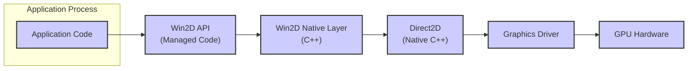
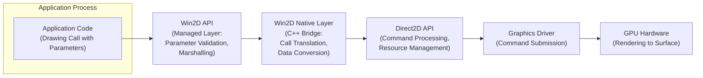

# Project Design Document: Win2D

**Version:** 1.1
**Date:** October 26, 2023
**Prepared By:** [Your Name/Team Name]

## 1. Introduction

This document provides a detailed design overview of the Win2D project, an easy-to-use Windows Runtime API for high-performance 2D graphics rendering. This document is specifically tailored to serve as a foundation for subsequent threat modeling activities, outlining the key components, interactions, and data flows within the system with a security-focused lens. The information presented here is derived from the public repository: [https://github.com/microsoft/win2d](https://github.com/microsoft/win2d).

## 2. Goals

The primary goals of Win2D are:

* To offer a modern and efficient API for 2D graphics rendering on the Windows platform.
* To provide a managed code interface (primarily C# and other .NET languages) for accessing the capabilities of the native Direct2D library.
* To simplify common 2D graphics tasks and reduce the complexity for developers.
* To achieve high performance in 2D rendering by effectively leveraging Direct2D and hardware acceleration provided by the GPU.
* To integrate seamlessly with the Windows Runtime (WinRT) and the Universal Windows Platform (UWP) application model.
* To support a comprehensive set of 2D graphics primitives, visual effects, and image manipulation operations.

## 3. Architecture

Win2D is structured as a managed wrapper around the native Direct2D API. This architecture allows developers to utilize Direct2D's performance benefits through a more approachable .NET interface.

Key architectural components include:

* **Application Code:**
    * This represents the developer's application logic that consumes the Win2D API to perform 2D graphics rendering.
    * It initiates drawing operations and manages Win2D resources.
* **Win2D API (Managed Code):**
    * This is the primary public interface of Win2D, exposed as a set of .NET classes and interfaces.
    * It provides abstractions for graphics resources (e.g., `"CanvasDevice"`, `"CanvasRenderTarget"`, `"CanvasDrawingSession"`), drawing operations (e.g., `"DrawRectangle"`, `"FillEllipse"`), and various graphics effects.
    * This layer is responsible for:
        * Parameter validation of inputs from the application.
        * Managing the lifecycle of managed Win2D objects.
        * Marshalling calls and data to the underlying native layer.
* **Win2D Native Layer (C++):**
    * This layer acts as a bridge between the managed API and the native Direct2D API.
    * It comprises C++ code that implements the managed API surface, translating managed calls into corresponding Direct2D function calls.
    * Key responsibilities include:
        * Managing the lifetime of native Direct2D objects.
        * Performing necessary data conversions between managed and native types.
        * Handling error codes and exceptions from the native layer.
* **Direct2D (Native C++):**
    * A low-level, hardware-accelerated 2D graphics API provided by Microsoft as part of DirectX.
    * Win2D relies on Direct2D for the core rendering functionalities.
    * It interacts directly with the graphics driver to utilize the GPU for rendering.
* **Windows Runtime (WinRT) Infrastructure:**
    * The foundational platform for UWP applications and modern Windows applications.
    * Win2D components are built upon and tightly integrated with the WinRT infrastructure, leveraging its services for component activation, memory management, and inter-process communication.
* **Graphics Driver:**
    * Software provided by the GPU vendor that enables communication between the operating system, Direct2D, and the graphics processing unit (GPU).
    * Direct2D depends on the graphics driver for executing rendering commands on the GPU.
* **Graphics Processing Unit (GPU) Hardware:**
    * The dedicated hardware responsible for performing the actual 2D graphics rendering operations.

## 4. Data Flow

The typical data flow for a rendering operation initiated by an application using Win2D follows these steps:

* **Initiation:** The application code makes a call to a Win2D API method to initiate a drawing operation (e.g., calling `"CanvasDrawingSession.DrawRectangle"` with specific parameters like position, size, and color).
* **Managed Layer Processing:** The Win2D managed layer receives the API call. It performs initial parameter validation and prepares the data for transition to the native layer. This might involve converting managed data types to their native equivalents.
* **Native Layer Transition:** The call and its associated data are marshalled across the managed/native boundary to the Win2D native layer (C++).
* **Direct2D Call Translation:** The Win2D native layer translates the managed API call into a sequence of corresponding Direct2D API calls. This involves mapping Win2D objects and parameters to Direct2D equivalents.
* **Direct2D Processing:** Direct2D receives the drawing commands. It performs internal processing, potentially including resource allocation and command buffer management.
* **Driver Interaction:** Direct2D interacts with the installed graphics driver, submitting the rendering commands and associated data to be executed by the GPU.
* **GPU Rendering:** The graphics driver instructs the GPU to perform the actual rendering operations based on the received commands.
* **Output to Surface:** The rendered output is written to a designated surface, such as a `"CanvasControl"` or `"SwapChainPanel"`, which is then displayed within the application's user interface.

## 5. Security Considerations for Threat Modeling

Considering the architecture and data flow, the following are key security considerations for threat modeling Win2D:

* **Input Validation at API Boundary:**
    * **Threat:** Malicious or malformed input passed to Win2D API methods could lead to unexpected behavior, crashes, or potentially exploitable vulnerabilities in the native layer.
    * **Examples:**  Providing extremely large or negative values for coordinates, sizes, or counts; passing invalid image data; supplying unexpected object types.
* **Memory Management Vulnerabilities in Native Layer:**
    * **Threat:** Errors in memory allocation, deallocation, or buffer handling within the Win2D native layer (or Direct2D itself) could lead to memory corruption, buffer overflows, use-after-free vulnerabilities, or memory leaks.
    * **Examples:** Incorrectly calculating buffer sizes when passing data to Direct2D; failing to release allocated memory, leading to resource exhaustion.
* **Type Confusion and Object Lifetime Issues:**
    * **Threat:** Incorrect handling of object types or the lifetime of native Direct2D objects by the Win2D native layer could lead to type confusion vulnerabilities or access violations.
    * **Examples:**  Casting objects to incorrect types; attempting to access freed Direct2D resources.
* **Security of Interoperability with Native Code:**
    * **Threat:** Vulnerabilities could arise in the marshalling and translation of data and calls between the managed and native layers. Incorrectly sized buffers or improper data conversions could lead to buffer overflows or data corruption.
    * **Examples:**  Incorrectly calculating the size of data structures being passed across the boundary; failing to handle different data representations between managed and native code.
* **Reliance on Direct2D and Driver Security:**
    * **Threat:** Win2D's security is inherently tied to the security of the underlying Direct2D API and the graphics driver. Vulnerabilities in these components could be indirectly exploitable through Win2D.
    * **Examples:**  Direct2D vulnerabilities related to shader processing or command parsing; driver bugs that could be triggered by specific Win2D rendering operations.
* **Resource Exhaustion and Denial of Service:**
    * **Threat:** An attacker could attempt to exhaust system resources (e.g., memory, GPU resources) by making excessive calls to Win2D API methods, leading to a denial of service.
    * **Examples:**  Allocating a very large number of graphics resources; triggering computationally expensive rendering operations repeatedly.
* **Privilege Escalation (Less Likely but Possible):**
    * **Threat:** While less common for graphics APIs, vulnerabilities in Win2D or its interaction with the driver could theoretically be exploited to gain elevated privileges.
    * **Examples:**  A bug in the driver interaction that allows writing to protected memory regions.
* **Information Disclosure:**
    * **Threat:**  Bugs in Win2D or Direct2D could potentially lead to the disclosure of sensitive information, such as data from other processes or kernel memory.
    * **Examples:**  Reading uninitialized memory; exposing data through error messages or logging.
* **Side-Channel Attacks:**
    * **Threat:**  Although challenging, potential side-channel vulnerabilities related to timing differences or resource usage during rendering operations could theoretically leak information.

## 6. Technologies Used

* **Primary Programming Languages:** C#, C++
* **Core Graphics API:** Direct2D (Native C++)
* **Platform Integration API:** Windows Runtime (WinRT)
* **Development Tools:**  Likely utilizes Microsoft Visual Studio and associated build tools (e.g., MSBuild, NuGet).
* **Distribution Mechanism:** Typically distributed as NuGet packages for inclusion in application projects.

## 7. Deployment Model

Win2D is deployed as a library that is included within an application's package. When the application runs, the Win2D libraries are loaded and utilized for graphics rendering. It primarily operates within the application's process.

## 8. Assumptions and Constraints

* **Trust in Underlying Platform:** The security of the underlying Windows operating system and its core graphics components is assumed.
* **Graphics Driver Quality:**  Win2D's functionality and security are dependent on the stability and security of the installed graphics driver. Issues within the driver are largely outside of Win2D's direct control.
* **Direct2D as a Trusted Component:**  The core Direct2D API is assumed to be a well-vetted and secure component, although vulnerabilities can still occur.
* **Application Running in Standard User Context:**  The threat model primarily considers scenarios where the application using Win2D is running with standard user privileges.
* **Focus on Win2D Library:** The primary focus is on the security of the Win2D library itself, not the security of the applications that utilize it.

## 9. Out of Scope

The following are explicitly considered outside the scope of this design document and subsequent threat modeling activities:

* **Internal Implementation Details of Direct2D:**  The focus is on Win2D's interface with Direct2D, not the detailed internal workings of the Direct2D library itself.
* **Specific Graphics Driver Vulnerabilities:**  Threats that are solely due to bugs in specific graphics driver implementations are generally out of scope, unless they are directly triggered or exposed through the Win2D API.
* **Security of the Host Application:**  Vulnerabilities within the application code that utilizes Win2D are not the primary focus. The threat model centers on the security of the Win2D library.
* **Network-Based Attacks:**  Threats that originate from network interactions are generally out of scope, as Win2D is primarily a local graphics rendering API. However, if Win2D is used to render content from network sources (e.g., images), those aspects might be considered.
* **Operating System Kernel Vulnerabilities:**  Fundamental vulnerabilities within the Windows kernel are considered outside the scope of this specific threat model for Win2D.

This improved design document provides a more detailed and security-focused overview of the Win2D project, intended to be a valuable resource for subsequent threat modeling exercises.