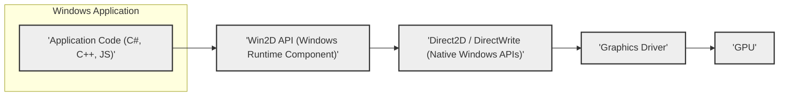
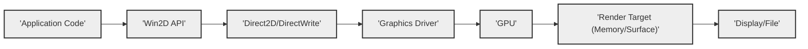

## Project Design Document: Win2D - Windows Runtime API for 2D Graphics Rendering

**Document Version:** 1.1
**Date:** October 26, 2023
**Author:** AI Expert (Based on User Request)
**Project Repository:** [https://github.com/microsoft/win2d](https://github.com/microsoft/win2d)

---

### 1. Introduction

This document provides a design overview of the Win2D project, a Windows Runtime API for high-performance 2D graphics rendering on Windows. Win2D simplifies the process of creating 2D graphics applications by providing an easy-to-use interface built on top of Direct2D and DirectWrite. This document is intended to serve as a foundation for threat modeling and security analysis of the Win2D library. It outlines the system architecture, key components, data flow, and technology stack involved.

### 2. Goals and Objectives

The primary goals of the Win2D project are:

* **Provide a modern and accessible 2D graphics API for Windows:**  Offer a developer-friendly interface for creating visually rich applications on the Windows platform.
* **Leverage the power of Direct2D and DirectWrite:**  Harness the performance and capabilities of the underlying Direct2D and DirectWrite graphics technologies.
* **Simplify 2D graphics development:** Abstract away the complexities of low-level graphics programming, making it easier for developers to create 2D graphics applications.
* **Support a wide range of 2D graphics operations:**  Enable drawing shapes, text, images, effects, and animations.
* **Integrate seamlessly with Windows UI frameworks:**  Work effectively with XAML and other Windows UI technologies.
* **Offer cross-language support:**  Be accessible from various programming languages commonly used for Windows development (C#, C++, JavaScript, etc.).

### 3. Target Audience

This design document is intended for the following audiences:

* **Security Architects and Engineers:** To understand the architecture of Win2D for threat modeling and security assessments.
* **Software Developers:** To gain a high-level understanding of Win2D's design and components for effective utilization.
* **Project Stakeholders:** To have a clear overview of the system's architecture and technology for informed decision-making.

### 4. System Architecture

Win2D is designed as a layered architecture, abstracting the complexities of Direct2D and DirectWrite while exposing their powerful features through a more user-friendly Windows Runtime API.

#### 4.1. High-Level Architecture

The following diagram illustrates the high-level architecture of Win2D:



**Description:**

1. **"'Application Code (C#, C++, JS)'"**:  Developers write applications using languages like C#, C++, or JavaScript, utilizing the Win2D API to create 2D graphics.
2. **"'Win2D API (Windows Runtime Component)'"**: This is the core Win2D library, implemented as a Windows Runtime Component. It provides managed and native interfaces for developers to interact with. It acts as a bridge, translating high-level Win2D calls into lower-level Direct2D/DirectWrite API calls.
3. **"'Direct2D / DirectWrite (Native Windows APIs)'"**: These are native Windows APIs for hardware-accelerated 2D graphics rendering (Direct2D) and text rendering (DirectWrite) respectively. Win2D leverages these for performance and feature richness.
4. **"'Graphics Driver'":** The software driver that interfaces between the operating system and the graphics processing unit (GPU). It translates API calls into GPU-specific instructions.
5. **"'GPU'":** The Graphics Processing Unit, a dedicated hardware component responsible for accelerating graphics rendering operations, significantly improving performance.

#### 4.2. Component-Level Architecture

Win2D can be further broken down into key components, each responsible for specific aspects of 2D graphics rendering.

```mermaid
graph LR
    subgraph "'Win2D API'"
        subgraph "'Core Objects'"
            CO1["'CanvasDevice'"]
            CO2["'CanvasRenderTarget'"]
            CO3["'CanvasDrawingSession'"]
        end

        subgraph "'Drawing Objects'"
            DO1["'CanvasBitmap'"]
            DO2["'CanvasGeometry'"]
            DO3["'CanvasStrokeStyle'"]
            DO4["'CanvasTextFormat'"]
            DO5["'CanvasTextLayout'"]
            DO6["'CanvasSolidColorBrush'"]
            DO7["'CanvasImageBrush'"]
            DO8["'CanvasLinearGradientBrush'"]
            DO9["'CanvasRadialGradientBrush'"]
        end

        subgraph "'Effects'"
            EF1["'GaussianBlurEffect'"]
            EF2["'ColorMatrixEffect'"]
            EF3["'ArithmeticCompositeEffect'"]
            EFn["'... (Other Effects) ...'"]
        end

        subgraph "'Text & Typography'"
            TT1["'CanvasTextFormat'"]
            TT2["'CanvasTextLayout'"]
            TT3["'CanvasTypography'"]
        end

        subgraph "'Interoperability'"
            IO1["'ICanvasImage' Interface"]
            IO2["'Direct3D Interop'"]
            IO3["'GDI Interop'"]
        end
    end

    CO1 --> CO2 & DO1 & DO2 & DO3 & DO4 & DO5 & DO6 & DO7 & DO8 & DO9 & EF1 & EF2 & EF3 & EFn & TT1 & TT2 & TT3 & IO1 & IO2 & IO3
    CO2 --> CO3
    CO3 --> DO1 & DO2 & DO3 & DO4 & DO5 & DO6 & DO7 & DO8 & DO9 & EF1 & EF2 & EF3 & EFn & TT1 & TT2 & TT3 & IO1 & IO2 & IO3

    classDef box fill:#eee,stroke:#333,stroke-width:1px;
    class CO1,CO2,CO3,DO1,DO2,DO3,DO4,DO5,DO6,DO7,DO8,DO9,EF1,EF2,EF3,EFn,TT1,TT2,TT3,IO1,IO2,IO3 box;
    classDef group fill:#ddd,stroke:#333,stroke-width:2px;
    class "Core Objects", "Drawing Objects", "Effects", "Text & Typography", "Interoperability", "Win2D API" group;
```

**Component Descriptions:**

* **"'Core Objects'":** These are fundamental objects required to start and manage Win2D rendering.
    * **"'CanvasDevice'":**  Represents the Direct2D device. It is the entry point for creating almost all other Win2D resources. Manages the underlying Direct2D device context and resource lifetime. Crucial for resource allocation and management.
    * **"'CanvasRenderTarget'":** Represents an off-screen rendering target. Drawing operations are performed on a render target. Think of it as an image buffer in memory.  The content of a `CanvasRenderTarget` can then be drawn to the screen or used as a source for other drawing operations.
    * **"'CanvasDrawingSession'":** Provides the drawing context for a `CanvasRenderTarget`. It is obtained from a `CanvasRenderTarget` and offers the methods for actually drawing shapes, text, images, and applying effects. It's the interface through which drawing commands are issued.

* **"'Drawing Objects'":** These objects represent the visual elements that can be drawn using Win2D.
    * **"'CanvasBitmap'":** Represents a bitmap image. Can be loaded from various image file formats, created from memory buffers, or obtained from Direct3D surfaces. Used for displaying images and textures.
    * **"'CanvasGeometry'":** Represents vector graphics shapes defined mathematically. Can be simple shapes (rectangles, circles, ellipses) or complex paths composed of lines, curves, and arcs. Enables resolution-independent drawing.
    * **"'CanvasStrokeStyle'":** Defines the visual style of lines and outlines when drawing geometries or paths. Controls properties like line thickness, dash patterns, line caps (endings), and line joins (corners).
    * **"'CanvasTextFormat'":** Defines the formatting attributes of text to be rendered. Includes font family, font size, font style (bold, italic), text alignment, and other typographic properties.
    * **"'CanvasTextLayout'":** Represents a formatted block of text, ready for drawing. It takes a string and a `CanvasTextFormat` and performs text layout, handling wrapping, line breaks, and complex script rendering.
    * **"'CanvasSolidColorBrush'":** Fills shapes or text with a uniform solid color. Simple and efficient for solid color fills.
    * **"'CanvasImageBrush'":** Fills shapes or text with a repeating or stretched image pattern. Allows for texture fills and image-based patterns.
    * **"'CanvasLinearGradientBrush'":** Fills shapes or text with a gradient that transitions linearly between colors along a specified direction. Creates smooth color transitions.
    * **"'CanvasRadialGradientBrush'":** Fills shapes or text with a gradient that transitions radially outwards from a center point. Useful for creating highlights and spotlight effects.

* **"'Effects'":** Win2D provides a set of built-in image effects that can be applied to `CanvasBitmap`s and `CanvasRenderTarget`s to modify their visual appearance.
    * **"'GaussianBlurEffect'":** Blurs an image, simulating an out-of-focus effect.
    * **"'ColorMatrixEffect'":** Applies a color transformation matrix to adjust colors, brightness, contrast, and perform color space conversions.
    * **"'ArithmeticCompositeEffect'":** Combines two images using arithmetic operations, enabling blending modes and compositing effects.
    * **"'... (Other Effects) ...'":** Win2D includes many more effects like `OpacityEffect`, `SaturationEffect`, `HueRotationEffect`, etc., extending image manipulation capabilities.

* **"'Text & Typography'":** Components specifically designed for advanced text rendering, leveraging DirectWrite for high-quality text and typography features.
    * **"'CanvasTextFormat'":** (Reiterated for emphasis) Central to text rendering, defining font and basic text properties.
    * **"'CanvasTextLayout'":** (Reiterated for emphasis) Handles complex text layout and rendering.
    * **"'CanvasTypography'":** Provides fine-grained control over advanced typographic features like ligatures, kerning, and OpenType features, allowing for professional-quality typography.

* **"'Interoperability'":** Components that enable Win2D to interact with other graphics technologies and legacy systems.
    * **"'ICanvasImage' Interface":** A common interface implemented by all drawable Win2D objects (`CanvasBitmap`, `CanvasRenderTarget`, effects, etc.). This interface allows for composition and seamless integration of different Win2D elements.
    * **"'Direct3D Interop'":** Enables sharing of Direct3D surfaces and resources between Win2D and Direct3D. Crucial for scenarios requiring integration with 3D rendering or leveraging existing Direct3D assets.
    * **"'GDI Interop'":** Provides limited interoperability with older GDI (Graphics Device Interface) based graphics code. Allows for drawing Win2D content onto GDI device contexts and vice versa, facilitating migration from legacy GDI code.

### 5. Data Flow

The typical data flow in Win2D for rendering a frame involves these steps:

1. **Resource Creation & Loading:** The application initializes `CanvasDevice` and creates or loads necessary resources like `CanvasBitmap`s, `CanvasBrushes`, `CanvasGeometries`, and `CanvasTextFormat`s. Resources are often loaded once and reused across frames for efficiency.
2. **Render Target Setup:** A `CanvasRenderTarget` is created, typically sized to match the output display area. This is the off-screen buffer where drawing will occur.
3. **Drawing Session Initiation:** A `CanvasDrawingSession` is obtained from the `CanvasRenderTarget`. This session represents the drawing context for the current frame.
4. **Issuing Drawing Commands:** The application uses the `CanvasDrawingSession` to issue a sequence of drawing commands. These commands specify what to draw (shapes, text, images), where to draw them (coordinates, transformations), and how to draw them (brushes, stroke styles, effects).
5. **Rendering Pipeline Execution:** Win2D translates these drawing commands into corresponding Direct2D and DirectWrite API calls. Direct2D and DirectWrite process these commands, leveraging the Graphics Driver and GPU for hardware acceleration.
6. **Output to Surface/Display:** The rendered content in the `CanvasRenderTarget` is then drawn to the final output surface, which could be the application window's swap chain for display on the screen, or it could be saved to an image file.
7. **Resource Management (Cleanup):** After rendering, applications should manage resources effectively. While Win2D and Direct2D have resource management mechanisms, explicit disposal of long-lived resources when no longer needed is good practice to prevent resource leaks.

**Simplified Data Flow Diagram:**



### 6. Technology Stack

Win2D is built upon and utilizes the following technologies:

* **Programming Languages:**
    * **C++:** The primary language for the core implementation of Win2D, focusing on performance and direct interaction with Direct2D/DirectWrite.
    * **C#:** Used to create the managed API layer of Win2D, making it accessible to .NET developers and for creating samples and higher-level abstractions.
    * **JavaScript (via WinRT):** Win2D is exposed as a Windows Runtime Component, making it accessible from JavaScript applications running in Windows environments (e.g., UWP, WinUI 3 in WebView2).

* **APIs and Frameworks:**
    * **Windows Runtime (WinRT):** The foundation for the Win2D API, enabling cross-language compatibility, componentization, and seamless integration with the modern Windows platform.
    * **Direct2D:** The core 2D graphics rendering API from Microsoft, providing hardware acceleration, high performance, and a rich set of 2D drawing primitives and effects.
    * **DirectWrite:** The underlying text rendering API from Microsoft, ensuring high-quality, resolution-independent text rendering, advanced typography features, and support for various languages and scripts.
    * **NuGet:** Used for packaging and distributing Win2D as a NuGet package, simplifying integration into developer projects and managing dependencies.

* **Operating System:**
    * **Windows 10 and later:** Win2D is designed and optimized for modern Windows operating systems, leveraging the features and capabilities of these platforms.

### 7. Security Considerations (Detailed)

Win2D, while designed to be a secure API, interacts with lower-level graphics subsystems and handles external data, necessitating careful security considerations.

* **Input Validation & Data Sanitization:**
    * **Threat:** Applications loading images from untrusted sources (network, user uploads, etc.) are vulnerable to image parsing vulnerabilities (e.g., buffer overflows, format string bugs) in image codecs used by `CanvasBitmap.LoadAsync`. Similarly, rendering user-provided text without sanitization can lead to unexpected behavior or vulnerabilities in text layout and rendering.
    * **Mitigation:**
        * **Validate image sources:**  If possible, restrict image sources to trusted origins. Implement robust error handling during image loading to catch and handle corrupted or malicious image files gracefully. Consider using secure image loading libraries if dealing with highly untrusted sources.
        * **Sanitize text input:** When rendering user-provided text, especially in web contexts, sanitize and encode the text to prevent potential XSS vulnerabilities if the rendered output is displayed in a web browser or WebView. Be aware of potential injection attacks through specially crafted text that could exploit text layout engines.

* **Resource Management & Denial of Service:**
    * **Threat:** Failure to properly dispose of Win2D resources (e.g., `CanvasDevice`, `CanvasRenderTarget`, `CanvasBitmap`) can lead to resource leaks, especially in long-running applications. Excessive resource consumption can lead to memory exhaustion and denial-of-service. Complex drawing operations, especially with large geometries, bitmaps, or effects, can consume significant GPU resources, potentially causing performance degradation or denial-of-service if triggered maliciously or unintentionally.
    * **Mitigation:**
        * **Implement proper resource disposal:** Use `using` statements (in C#) or RAII (Resource Acquisition Is Initialization) in C++ to ensure automatic disposal of Win2D objects that implement `IDisposable`. Explicitly dispose of resources when they are no longer needed, especially in long-lived components.
        * **Limit resource usage:** Implement safeguards to limit the size and complexity of drawing operations, especially when dealing with user-provided content. Implement timeouts or resource limits to prevent runaway rendering processes from consuming excessive resources.
        * **Monitor resource consumption:** Monitor application resource usage (memory, GPU usage) to detect and address potential resource leaks or excessive consumption issues.

* **Vulnerabilities in Underlying APIs (Direct2D/DirectWrite & Graphics Drivers):**
    * **Threat:** Win2D relies on Direct2D and DirectWrite, which in turn depend on graphics drivers. Vulnerabilities in these underlying components (Direct2D/DirectWrite APIs or graphics drivers) could potentially be exploited through Win2D.
    * **Mitigation:**
        * **Keep OS and drivers updated:** Regularly update the operating system and graphics drivers to patch known vulnerabilities in Direct2D, DirectWrite, and graphics driver components. Encourage users to keep their systems updated.
        * **Stay informed about security advisories:** Monitor security advisories and vulnerability databases for reports of vulnerabilities in Direct2D, DirectWrite, and related graphics components. Apply patches and mitigations promptly.

* **Denial of Service through Algorithmic Complexity:**
    * **Threat:**  Crafted input data, especially complex geometries or effects with specific parameters, could trigger computationally expensive rendering operations in Direct2D, leading to excessive CPU/GPU usage and denial-of-service. For example, excessively detailed geometries or certain effect combinations might have non-linear performance scaling.
    * **Mitigation:**
        * **Limit complexity of operations:** Impose limits on the complexity of drawing operations, such as the number of geometry primitives, effect parameters, or bitmap sizes, especially when processing untrusted input.
        * **Performance testing and profiling:** Conduct thorough performance testing and profiling of Win2D applications, especially with complex or potentially malicious input data, to identify performance bottlenecks and potential denial-of-service vulnerabilities.

* **Cross-Site Scripting (XSS) in Text Rendering (Web Context):**
    * **Threat:** If Win2D is used to render text in a web context (e.g., in a WebView or when generating images for web display), and the text content is derived from untrusted sources (user input, external data), it might be possible to inject malicious scripts or HTML tags that could be executed when the rendered output is displayed in a web browser.
    * **Mitigation:**
        * **Sanitize and encode text for web output:** When rendering text that will be displayed in a web context, rigorously sanitize and HTML-encode the text to remove or neutralize any potentially malicious HTML tags or JavaScript code. Use appropriate encoding functions provided by the web platform or security libraries.

* **Memory Corruption in Native Code (Win2D Implementation):**
    * **Threat:** As Win2D's core is implemented in native C++, there is a theoretical risk of memory corruption vulnerabilities (buffer overflows, use-after-free, etc.) in the Win2D library itself. While Microsoft's development practices aim to minimize these risks, such vulnerabilities are always a possibility in native code.
    * **Mitigation:**
        * **Rely on Microsoft's security development lifecycle:** Trust in Microsoft's Security Development Lifecycle (SDL) and rigorous testing processes to minimize vulnerabilities in Win2D.
        * **Stay updated with Win2D releases:** Apply updates and patches to Win2D as they are released by Microsoft to address any discovered vulnerabilities.

### 8. Deployment Model

Win2D is primarily distributed and deployed as a NuGet package and is also included within the Windows SDK.

* **NuGet Package (Recommended):** The primary and recommended method for integrating Win2D into Windows applications is through NuGet packages. Developers can add the `Microsoft.Graphics.Win2D` NuGet package to their projects using Visual Studio's NuGet Package Manager or command-line tools. This approach offers:
    * **Simplified Dependency Management:** NuGet automatically handles downloading and including Win2D and its dependencies in the project.
    * **Version Control:** NuGet allows developers to specify and manage specific versions of Win2D, ensuring consistency and compatibility.
    * **Easy Updates:** Updating to newer versions of Win2D is straightforward through NuGet package updates.

* **Windows SDK:** Win2D is also included as part of the Windows Software Development Kit (SDK). This means that if a developer has installed the Windows SDK, Win2D libraries are available on their system. However, using the NuGet package is generally preferred for better version management and project isolation, as it avoids potential conflicts with system-wide SDK installations.

### 9. Future Considerations

Future development and enhancements for Win2D could focus on:

* **Performance Optimizations:** Continuous efforts to improve rendering performance, especially for complex scenes, effects, and large datasets. Explore further GPU acceleration opportunities and optimize resource utilization.
* **Expanded Feature Set & API Enhancements:** Adding new 2D graphics features, effects, and drawing primitives to expand Win2D's capabilities and address evolving developer needs. Consider incorporating more advanced Direct2D features as they become available.
* **Improved Interoperability & Ecosystem Integration:** Enhancing interoperability with other graphics APIs (e.g., Vulkan, WebGPU) and frameworks. Explore deeper integration with web technologies and cross-platform graphics solutions where feasible.
* **Enhanced Security & Robustness:** Ongoing security reviews, penetration testing, and vulnerability assessments to proactively identify and mitigate potential security risks. Improve error handling and robustness of the API.
* **Developer Experience Improvements:** Focus on improving the developer experience through better documentation, samples, debugging tools, and more intuitive API design. Gather developer feedback and address pain points.
* **Cross-Platform Strategy (Limited Scope):** While Win2D is primarily Windows-centric, explore opportunities for code sharing or limited cross-platform support for specific scenarios or components, where technically feasible and strategically aligned. This could involve investigating abstraction layers or platform-specific implementations for certain functionalities.

---

This revised design document provides a more detailed and improved overview of the Win2D project, specifically enhanced for threat modeling and security analysis. It elaborates on component descriptions, provides more specific security considerations with potential threats and mitigations, and clarifies deployment models and future directions. This document should serve as a more robust foundation for security assessments and further development planning.