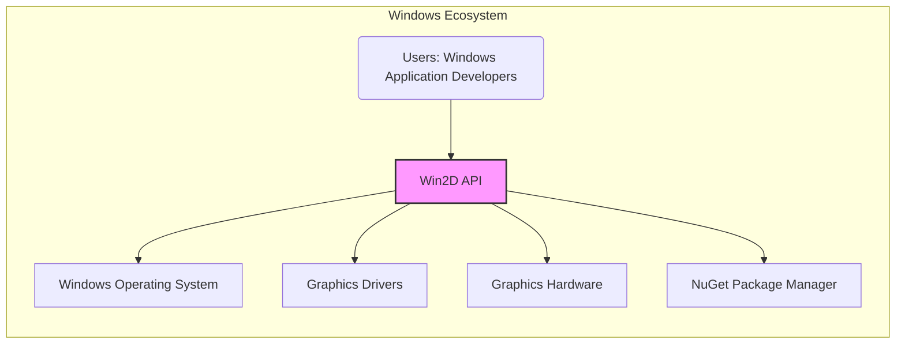
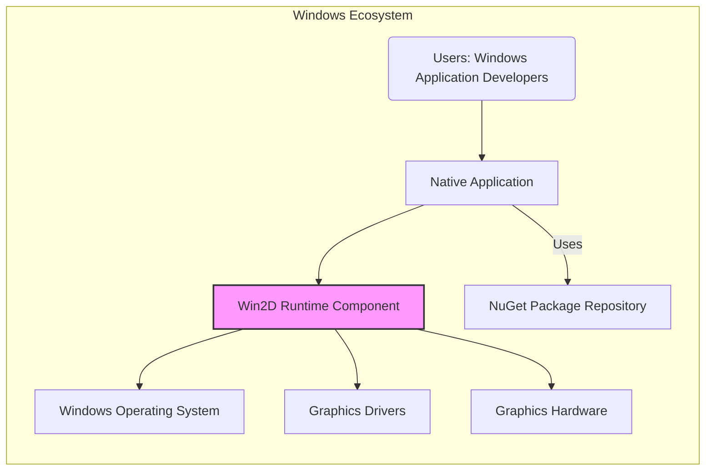
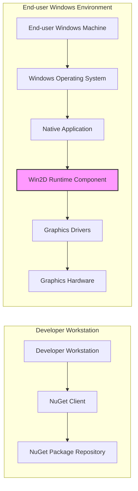

# BUSINESS POSTURE

- Business Priorities and Goals:
 - Provide Windows application developers with an efficient and easy-to-use API for 2D graphics rendering.
 - Enable developers to create visually rich and performant Windows applications leveraging GPU acceleration.
 - Maintain compatibility and stability across different Windows versions and hardware configurations.
 - Foster a thriving ecosystem of Windows applications by offering robust graphics capabilities.
- Business Risks:
 - Security vulnerabilities in the Win2D API could lead to exploitation in applications using it, causing harm to end-users and damaging Microsoft's reputation.
 - Performance bottlenecks or instability in the API could hinder application performance and developer adoption.
 - Lack of compatibility with future Windows updates or hardware changes could render applications using Win2D obsolete.
 - Insufficient adoption by developers compared to alternative graphics solutions could lead to the project's decline.

# SECURITY POSTURE

- Existing Security Controls:
 - security control: Secure Development Lifecycle (SDL) - Implemented throughout the development process at Microsoft, encompassing requirements, design, implementation, verification, and release phases. (Location: Microsoft internal development processes)
 - security control: Code Reviews - Implemented as part of the development process to identify potential security flaws and vulnerabilities. (Location: Microsoft internal development processes, likely documented in development guidelines)
 - security control: Static Analysis Security Testing (SAST) - Implemented to automatically scan the codebase for potential security vulnerabilities. (Location: Microsoft internal build and CI/CD pipelines)
 - security control: Dynamic Analysis Security Testing (DAST) - Implemented to test the running application for vulnerabilities. (Location: Microsoft internal testing environments and processes)
 - security control: Penetration Testing - Likely performed periodically by internal security teams or external vendors to identify exploitable vulnerabilities. (Location: Microsoft internal security testing processes)
 - security control: Dependency Scanning - Implemented to identify vulnerabilities in third-party libraries and components used by Win2D. (Location: Microsoft internal build and CI/CD pipelines)
 - security control: Signing of Binaries - Win2D components are digitally signed by Microsoft to ensure integrity and authenticity. (Location: Microsoft build and release processes)
 - security control: Access Control - Access to the source code repository and build systems is restricted to authorized Microsoft personnel. (Location: Microsoft internal infrastructure and access management systems)
- Accepted Risks:
 - accepted risk: Complexity of graphics rendering logic may introduce subtle vulnerabilities that are difficult to detect through automated testing.
 - accepted risk: Performance optimizations might sometimes prioritize speed over certain exhaustive security checks in specific code paths.
 - accepted risk: Newly discovered zero-day vulnerabilities in underlying graphics drivers or hardware could potentially impact Win2D applications.
- Recommended Security Controls:
 - security control: Fuzzing - Implement fuzzing techniques to automatically generate and test a wide range of inputs to uncover potential crashes and vulnerabilities in the graphics rendering engine.
 - security control: Software Bill of Materials (SBOM) Generation - Generate SBOM for Win2D releases to provide transparency into the components and dependencies, facilitating vulnerability management for users.
 - security control: Security Champions Program - Designate security champions within the Win2D development team to promote security awareness and best practices.
 - security control: Incident Response Plan - Establish a clear incident response plan for handling security vulnerabilities reported in Win2D, including patching and communication procedures.
- Security Requirements:
 - Authentication:
  - Not directly applicable to the Win2D API itself, as it is a client-side graphics rendering library.
  - However, related services like NuGet package management and developer accounts require strong authentication mechanisms.
 - Authorization:
  - Not directly applicable to the Win2D API itself.
  - Access to Win2D source code, build systems, and release pipelines should be strictly authorized and controlled.
 - Input Validation:
  - Critical requirement for Win2D to prevent vulnerabilities such as buffer overflows, injection attacks, and denial-of-service.
  - All input data processed by the Win2D API, including graphics commands, image data, and resource parameters, must be thoroughly validated to ensure it conforms to expected formats and ranges.
  - Input validation should be implemented at multiple layers to catch errors early in the processing pipeline.
 - Cryptography:
  - May be relevant for specific use cases within graphics rendering, such as secure rendering of sensitive content or watermarking.
  - If cryptographic operations are used within Win2D, they must be implemented using secure and well-vetted cryptographic libraries and algorithms.
  - Key management and secure storage of cryptographic keys should be addressed if applicable.

# DESIGN

## C4 CONTEXT



- Context Diagram Elements:
 - - Name: Windows Application Developers
   - Type: Person
   - Description: Software developers who use Win2D API to create Windows applications with 2D graphics.
   - Responsibilities: Utilize Win2D API to implement graphics rendering in their applications. Consume Win2D NuGet packages.
   - Security controls: Secure coding practices in their applications, responsible use of APIs, managing dependencies.
 - - Name: Win2D API
   - Type: Software System
   - Description: Windows Runtime API for immediate-mode 2D graphics rendering with GPU acceleration. Provides a set of interfaces and classes for developers to draw 2D graphics.
   - Responsibilities: Provide 2D graphics rendering capabilities to Windows applications. Interface with the Windows OS, graphics drivers, and hardware.
   - Security controls: Input validation, secure coding practices, regular security testing, binary signing.
 - - Name: Windows Operating System
   - Type: Software System
   - Description: The underlying operating system on which Win2D API runs. Provides core services and APIs for applications.
   - Responsibilities: Provide runtime environment for Win2D applications. Manage system resources and security.
   - Security controls: Operating system level security controls, kernel security, process isolation, access control.
 - - Name: Graphics Drivers
   - Type: Software System
   - Description: Software that enables the operating system and applications to interact with graphics hardware (GPU).
   - Responsibilities: Translate graphics commands from Win2D API into instructions for the GPU. Manage GPU resources.
   - Security controls: Driver security, vulnerability management, driver signing, hardware security features.
 - - Name: Graphics Hardware
   - Type: Hardware System
   - Description: Graphics Processing Unit (GPU) that performs the actual graphics rendering operations.
   - Responsibilities: Execute graphics rendering commands efficiently.
   - Security controls: Hardware security features, firmware security.
 - - Name: NuGet Package Manager
   - Type: Software System
   - Description: Package manager for .NET that is used to distribute and consume Win2D library.
   - Responsibilities: Distribute Win2D library to developers. Manage package dependencies.
   - Security controls: Package signing, vulnerability scanning of packages, secure package repository.

## C4 CONTAINER



- Container Diagram Elements:
 - - Name: Native Application
   - Type: Application
   - Description: Windows application developed by developers using Win2D API. This application directly utilizes Win2D Runtime Component.
   - Responsibilities: Implement application logic and user interface, utilize Win2D for 2D graphics rendering.
   - Security controls: Application-level security controls, input validation, secure coding practices, dependency management.
 - - Name: Win2D Runtime Component
   - Type: Library/Component
   - Description: Native DLL component that implements the Win2D API. Provides the core graphics rendering functionality.
   - Responsibilities: Implement 2D graphics rendering algorithms, interface with Windows OS and graphics drivers, manage graphics resources.
   - Security controls: Input validation, memory safety, secure coding practices, regular security testing, binary signing.
 - - Name: Windows Operating System
   - Type: Container
   - Description: The underlying operating system providing services to the Win2D Runtime Component.
   - Responsibilities: Provide runtime environment, manage system resources, enforce security policies.
   - Security controls: OS-level security controls, kernel security, process isolation, access control.
 - - Name: Graphics Drivers
   - Type: Container
   - Description: Drivers that enable communication between Win2D Runtime Component and Graphics Hardware.
   - Responsibilities: Translate graphics commands, manage GPU resources, provide hardware-specific optimizations.
   - Security controls: Driver security, vulnerability management, driver signing, hardware security features.
 - - Name: Graphics Hardware
   - Type: Container
   - Description: Physical GPU hardware that performs graphics rendering as instructed by Graphics Drivers.
   - Responsibilities: Execute graphics rendering commands efficiently.
   - Security controls: Hardware security features, firmware security.
 - - Name: NuGet Package Repository
   - Type: Container
   - Description: Repository where Win2D NuGet packages are stored and distributed.
   - Responsibilities: Host and distribute Win2D packages, manage package versions.
   - Security controls: Package signing, vulnerability scanning, access control to repository management.

## DEPLOYMENT



- Deployment Diagram Elements:
 - - Name: Developer Workstation
   - Type: Environment
   - Description: Environment used by developers to build Windows applications using Win2D.
   - Responsibilities: Development, coding, testing, packaging of applications.
   - Security controls: Workstation security, developer access control, code repository access control.
 - - Name: NuGet Client
   - Type: Software
   - Description: Tool used by developers to download and manage NuGet packages, including Win2D.
   - Responsibilities: Package download, dependency management, package installation.
   - Security controls: Secure communication channels (HTTPS), package signature verification.
 - - Name: NuGet Package Repository
   - Type: Environment
   - Description: Repository where Win2D NuGet packages are stored and served to developers.
   - Responsibilities: Host and distribute Win2D packages, ensure package integrity and availability.
   - Security controls: Package signing, access control, infrastructure security, vulnerability scanning.
 - - Name: End-user Windows Machine
   - Type: Environment
   - Description: Environment where end-users run Windows applications that utilize Win2D.
   - Responsibilities: Run Windows applications, provide user interface, execute application logic.
   - Security controls: End-user machine security, operating system security, application security.
 - - Name: Windows Operating System (End-user)
   - Type: Software
   - Description: Windows OS running on the end-user machine, providing the runtime environment for Win2D applications.
   - Responsibilities: Provide runtime environment, manage system resources, enforce security policies.
   - Security controls: OS-level security controls, kernel security, process isolation, access control, Windows Update.
 - - Name: Native Application (End-user)
   - Type: Software
   - Description: Windows application installed and running on the end-user machine, utilizing Win2D Runtime Component.
   - Responsibilities: Provide application functionality to end-users, utilize Win2D for graphics rendering.
   - Security controls: Application-level security controls, input validation, secure configuration, update mechanisms.
 - - Name: Win2D Runtime Component (End-user)
   - Type: Software
   - Description: Win2D DLL loaded and used by the Native Application on the end-user machine.
   - Responsibilities: Provide 2D graphics rendering functionality to the application.
   - Security controls: Binary signing, memory safety, input validation.
 - - Name: Graphics Drivers (End-user)
   - Type: Software
   - Description: Graphics drivers installed on the end-user machine, enabling communication with the GPU.
   - Responsibilities: Translate graphics commands, manage GPU resources.
   - Security controls: Driver security, driver signing, vulnerability management, Windows Update.
 - - Name: Graphics Hardware (End-user)
   - Type: Hardware
   - Description: GPU hardware on the end-user machine performing graphics rendering.
   - Responsibilities: Execute graphics rendering commands.
   - Security controls: Hardware security features, firmware security.

## BUILD

```mermaid
graph LR
    Developer[Developer Workstation] --> VCS[Version Control System (GitHub)]
    VCS --> BuildSystem[Build System (Azure DevOps)]
    BuildSystem --> Compiler[Compiler & Linker]
    BuildSystem --> SAST[SAST Scanners]
    BuildSystem --> DependencyCheck[Dependency Check]
    BuildSystem --> Tester[Automated Testers]
    BuildSystem --> SignTool[Signing Tool]
    BuildSystem --> ArtifactRepo[Artifact Repository (NuGet)]
    style BuildSystem fill:#f9f,stroke:#333,stroke-width:2px
```

- Build Process Elements:
 - - Name: Developer Workstation
   - Type: Environment
   - Description: Developer's local machine where code is written and changes are committed.
   - Responsibilities: Code development, local testing, committing code changes.
   - Security controls: Workstation security, developer authentication, code review (pre-commit).
 - - Name: Version Control System (GitHub)
   - Type: System
   - Description: GitHub repository hosting the Win2D source code.
   - Responsibilities: Source code management, version control, collaboration.
   - Security controls: Access control, authentication, authorization, audit logging, branch protection.
 - - Name: Build System (Azure DevOps)
   - Type: System
   - Description: Automated build system used to compile, test, and package Win2D.
   - Responsibilities: Automated build process, compilation, testing, security checks, packaging, release.
   - Security controls: Build pipeline security, access control, secure credentials management, build isolation.
 - - Name: Compiler & Linker
   - Type: Tool
   - Description: Software tools used to compile source code into binary artifacts.
   - Responsibilities: Code compilation, linking, optimization.
   - Security controls: Compiler security features (e.g., stack protection, address space layout randomization), secure toolchain.
 - - Name: SAST Scanners
   - Type: Tool
   - Description: Static Application Security Testing tools used to scan the source code for potential vulnerabilities.
   - Responsibilities: Automated vulnerability scanning, identify potential security flaws in code.
   - Security controls: SAST tool configuration, vulnerability reporting, integration into build pipeline.
 - - Name: Dependency Check
   - Type: Tool
   - Description: Tool to scan project dependencies for known vulnerabilities.
   - Responsibilities: Identify vulnerable dependencies, generate reports, ensure dependency security.
   - Security controls: Dependency database updates, integration into build pipeline, vulnerability alerting.
 - - Name: Automated Testers
   - Type: Tool
   - Description: Automated testing frameworks used to execute unit tests, integration tests, and other tests.
   - Responsibilities: Automated testing, ensure code quality and functionality, regression testing.
   - Security controls: Test environment security, test case design (including security test cases).
 - - Name: Signing Tool
   - Type: Tool
   - Description: Tool used to digitally sign the build artifacts (DLLs, NuGet packages).
   - Responsibilities: Code signing, ensure software integrity and authenticity, prevent tampering.
   - Security controls: Secure key management, code signing certificate protection, timestamping.
 - - Name: Artifact Repository (NuGet)
   - Type: System
   - Description: Repository where built and signed Win2D NuGet packages are published.
   - Responsibilities: Package hosting, distribution, version management, package integrity.
   - Security controls: Access control, package signing verification, vulnerability scanning, infrastructure security.

# RISK ASSESSMENT

- Critical Business Processes:
 - Providing a secure, reliable, and high-performance 2D graphics API for Windows developers.
 - Maintaining the integrity and availability of the Win2D library and its distribution channels (NuGet).
 - Protecting the reputation of Microsoft as a trusted provider of development tools and technologies.
- Data to Protect and Sensitivity:
 - Win2D API Source Code: Highly sensitive. Confidentiality and integrity are crucial to prevent unauthorized access, modification, or disclosure, which could lead to vulnerabilities or intellectual property theft.
 - Win2D Build Artifacts (Binaries, NuGet Packages): Highly sensitive. Integrity and availability are critical to ensure that developers and end-users receive genuine and untampered software.
 - Microsoft's Signing Keys: Extremely sensitive. Confidentiality and integrity are paramount as compromise could allow malicious actors to sign and distribute malware disguised as legitimate Win2D components.
 - Vulnerability Information: Sensitive. Confidentiality is important to allow for coordinated vulnerability disclosure and patching before exploits become widespread.

# QUESTIONS & ASSUMPTIONS

- Questions:
 - What is the intended audience for this design document? Is it primarily for internal security review, external developers, or both?
 - What level of detail is required for the threat modeling exercise that will follow this document? Are there specific areas of concern that should be prioritized?
 - Are there any specific regulatory compliance requirements that Win2D needs to adhere to (e.g., GDPR, security certifications)?
 - What is the expected lifespan of the Win2D project, and are there any plans for future evolution or deprecation?
- Assumptions:
 - BUSINESS POSTURE: Security and performance are equally high priorities for the Win2D project. Microsoft is committed to maintaining the long-term viability and security of Win2D.
 - SECURITY POSTURE: Win2D development follows Microsoft's Secure Development Lifecycle (SDL) and incorporates industry best practices for secure software development. Deployment of Win2D is primarily through NuGet packages and the Windows SDK. Microsoft has a robust incident response process for security vulnerabilities.
 - DESIGN: The C4 model accurately represents the high-level architecture of Win2D and its interactions with the Windows ecosystem. The deployment model described is representative of typical Win2D usage scenarios. The build process incorporates standard security checks and supply chain security measures.