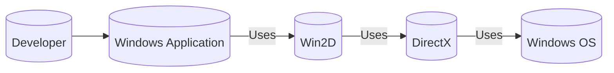
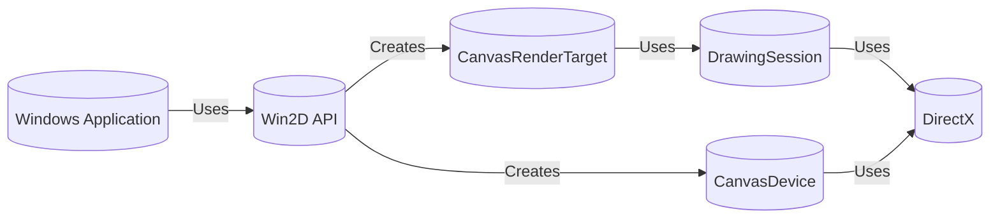
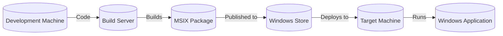
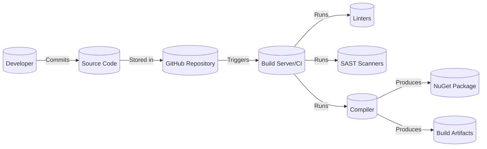

# BUSINESS POSTURE

Business Priorities and Goals:

*   Provide a high-performance, retained-mode 2D graphics API for Windows developers.
*   Offer an easy-to-use API that integrates well with the Windows Runtime (WinRT) and existing DirectX code.
*   Support a wide range of graphics hardware and software configurations.
*   Enable developers to create visually rich and interactive applications.
*   Maintain backward compatibility with previous versions of the API.
*   Provide comprehensive documentation and samples.
*   Continuously improve performance and add new features based on developer feedback.

Most Important Business Risks:

*   Security vulnerabilities in the API could allow malicious code execution or data breaches.
*   Performance issues or bugs could lead to poor user experience or application crashes.
*   Lack of compatibility with certain hardware or software could limit adoption.
*   Failure to keep up with evolving graphics standards and technologies could make the API obsolete.
*   Inadequate documentation or support could hinder developer adoption.

# SECURITY POSTURE

Existing Security Controls:

*   security control: The API is designed to run within the Windows application sandbox, which limits its access to system resources and other applications. (Described in Windows documentation)
*   security control: The API uses the Windows Runtime security model, which includes features like capability-based access control. (Described in Windows documentation)
*   security control: Input validation is performed on API parameters to prevent common vulnerabilities like buffer overflows. (Implied, needs confirmation in code/documentation)
*   security control: The API is regularly tested for security vulnerabilities using static and dynamic analysis tools. (Implied, needs confirmation in project documentation)
*   security control: Microsoft's Security Development Lifecycle (SDL) is followed during the development of the API. (Implied, needs confirmation in project documentation)

Accepted Risks:

*   accepted risk: The API relies on the underlying DirectX and Windows graphics infrastructure, which may have their own security vulnerabilities.
*   accepted risk: The API may be vulnerable to denial-of-service attacks if it is used to render excessively complex or malicious content.

Recommended Security Controls:

*   security control: Implement fuzz testing to identify potential vulnerabilities in the API's input handling.
*   security control: Conduct regular security code reviews to identify and address potential vulnerabilities.
*   security control: Provide clear guidance to developers on how to use the API securely, including best practices for input validation and data handling.
*   security control: Establish a process for reporting and responding to security vulnerabilities discovered in the API.

Security Requirements:

*   Authentication: Not directly applicable to this API, as it operates within the context of the calling application's authentication.
*   Authorization: The API relies on the Windows Runtime's capability-based authorization model to control access to system resources.
*   Input Validation: All API parameters should be validated to ensure they are within expected ranges and formats. This is crucial to prevent buffer overflows and other injection vulnerabilities.
*   Cryptography: The API may use cryptographic functions for certain operations, such as secure image loading or content protection. These functions should use strong, well-vetted algorithms and key management practices.

# DESIGN

## C4 CONTEXT

Element Descriptions:

*   Element:
    *   Name: Developer
    *   Type: Person
    *   Description: A software developer who uses Win2D to create Windows applications.
    *   Responsibilities: Writes code that utilizes the Win2D API to create and manage 2D graphics.
    *   Security controls: Follows secure coding practices.

*   Element:
    *   Name: Windows Application
    *   Type: Software System
    *   Description: An application built for the Windows platform that utilizes Win2D for its 2D graphics rendering.
    *   Responsibilities: Provides application functionality to the end-user, utilizing Win2D for graphics rendering.
    *   Security controls: Runs within the Windows application sandbox; utilizes Windows Runtime security model.

*   Element:
    *   Name: Win2D
    *   Type: Software System
    *   Description: The Win2D API, a retained-mode 2D graphics API for Windows.
    *   Responsibilities: Provides an abstraction layer over DirectX for 2D graphics rendering, simplifying development.
    *   Security controls: Input validation on API parameters; regular security testing; adherence to Microsoft's SDL.

*   Element:
    *   Name: DirectX
    *   Type: Software System
    *   Description: A collection of APIs for handling tasks related to multimedia, especially game programming and video, on Microsoft platforms.
    *   Responsibilities: Provides low-level access to graphics hardware.
    *   Security controls: Relies on underlying Windows security mechanisms.

*   Element:
    *   Name: Windows OS
    *   Type: Software System
    *   Description: The Windows operating system.
    *   Responsibilities: Provides the underlying platform and resources for all applications and APIs.
    *   Security controls: Windows security model, including capability-based access control.

## C4 CONTAINER

Element Descriptions:

*   Element:
    *   Name: Windows Application
    *   Type: Container
    *   Description: The application using Win2D.
    *   Responsibilities: Contains the application logic and utilizes Win2D for rendering.
    *   Security controls: Runs within the Windows application sandbox.

*   Element:
    *   Name: Win2D API
    *   Type: Container
    *   Description: The public interface of Win2D.
    *   Responsibilities: Exposes classes and methods for 2D graphics operations.
    *   Security controls: Input validation, follows SDL.

*   Element:
    *   Name: CanvasDevice
    *   Type: Container
    *   Description: Represents a display device.
    *   Responsibilities: Manages resources associated with a specific display adapter.
    *   Security controls: Relies on underlying OS and DirectX security.

*   Element:
    *   Name: CanvasRenderTarget
    *   Type: Container
    *   Description: Represents a drawing surface.
    *   Responsibilities: Provides a surface for drawing operations.
    *   Security controls: Relies on underlying OS and DirectX security.

*   Element:
    *   Name: DrawingSession
    *   Type: Container
    *   Description: Used to draw onto a CanvasRenderTarget.
    *   Responsibilities: Executes drawing commands.
    *   Security controls: Relies on underlying OS and DirectX security.

*   Element:
    *   Name: DirectX
    *   Type: Container
    *   Description: The underlying graphics API.
    *   Responsibilities: Provides low-level graphics functionality.
    *   Security controls: Relies on underlying OS security.

## DEPLOYMENT

Possible Deployment Solutions:

1.  Application Package (MSIX): The most common and recommended way to deploy WinRT applications.
2.  Side-loading: For development and testing purposes, applications can be side-loaded onto devices.
3.  Classic Win32 Application with Win2D NuGet Package.

Chosen Deployment Solution (MSIX):

Element Descriptions:

*   Element:
    *   Name: Development Machine
    *   Type: Node
    *   Description: The developer's workstation.
    *   Responsibilities: Used for writing and testing code.
    *   Security controls: Standard developer workstation security measures.

*   Element:
    *   Name: Build Server
    *   Type: Node
    *   Description: A server that builds the application package.
    *   Responsibilities: Compiles the code and creates the MSIX package.
    *   Security controls: Secure build environment, access controls.

*   Element:
    *   Name: MSIX Package
    *   Type: Node
    *   Description: The application package.
    *   Responsibilities: Contains the application and its dependencies.
    *   Security controls: Code signing, package integrity checks.

*   Element:
    *   Name: Windows Store
    *   Type: Node
    *   Description: The Microsoft Store.
    *   Responsibilities: Distributes the application to users.
    *   Security controls: Store security policies and procedures.

*   Element:
    *   Name: Target Machine
    *   Type: Node
    *   Description: The user's device.
    *   Responsibilities: Runs the application.
    *   Security controls: Windows OS security features.

*   Element:
    *   Name: Windows Application
    *   Type: Software System
    *   Description: Application that uses Win2D.
    *   Responsibilities: Provides application functionality to the end-user, utilizing Win2D for graphics rendering.
    *   Security controls: Runs within the Windows application sandbox; utilizes Windows Runtime security model.

## BUILD

Build Process Description:

1.  Developers write code and commit it to the GitHub repository.
2.  The build server (likely using GitHub Actions or Azure Pipelines, based on the Microsoft context) is triggered by commits to the repository.
3.  The build server retrieves the source code.
4.  Linters are run to check for code style and potential errors.
5.  Static Application Security Testing (SAST) scanners are run to identify potential security vulnerabilities in the code.
6.  The compiler builds the Win2D library and creates a NuGet package.
7.  Build artifacts, including the NuGet package, are stored for later use.

Security Controls:

*   security control: Use of linters to enforce coding standards and identify potential errors.
*   security control: Use of SAST scanners to detect security vulnerabilities.
*   security control: Build automation to ensure a consistent and repeatable build process.
*   security control: Secure build environment to prevent tampering with the build process.
*   security control: NuGet package signing to ensure the integrity of the distributed library.

# RISK ASSESSMENT

Critical Business Processes:

*   Providing a reliable and performant 2D graphics API for Windows developers.
*   Maintaining the reputation of Microsoft as a provider of high-quality developer tools.

Data to Protect:

*   Source code of the Win2D API (Sensitivity: Confidential).
*   Documentation and samples (Sensitivity: Public, but integrity is important).
*   Developer feedback and bug reports (Sensitivity: Confidential).
*   No user data is directly handled by the Win2D API itself. It operates on graphics data provided by the calling application. The sensitivity of that data depends on the application.

# QUESTIONS & ASSUMPTIONS

Questions:

*   What specific static and dynamic analysis tools are used for security testing?
*   Is there a formal process for handling security vulnerability reports?
*   What are the specific performance targets for the API?
*   Are there any specific hardware or software compatibility requirements beyond the general Windows requirements?
*   What is the branching strategy and release process?
*   Are there any code signing procedures in place?
*   What specific version of DirectX is targeted?
*   Is there a dedicated security team reviewing the code?

Assumptions:

*   BUSINESS POSTURE: Microsoft's standard security development lifecycle (SDL) is followed.
*   BUSINESS POSTURE: There is a process for responding to security vulnerabilities.
*   SECURITY POSTURE: Input validation is performed on all API parameters.
*   SECURITY POSTURE: Regular security testing is conducted.
*   DESIGN: The API is designed to be thread-safe.
*   DESIGN: The API handles exceptions gracefully.
*   DESIGN: GitHub Actions or Azure Pipelines are used for CI/CD.
*   DESIGN: NuGet is used for package management.