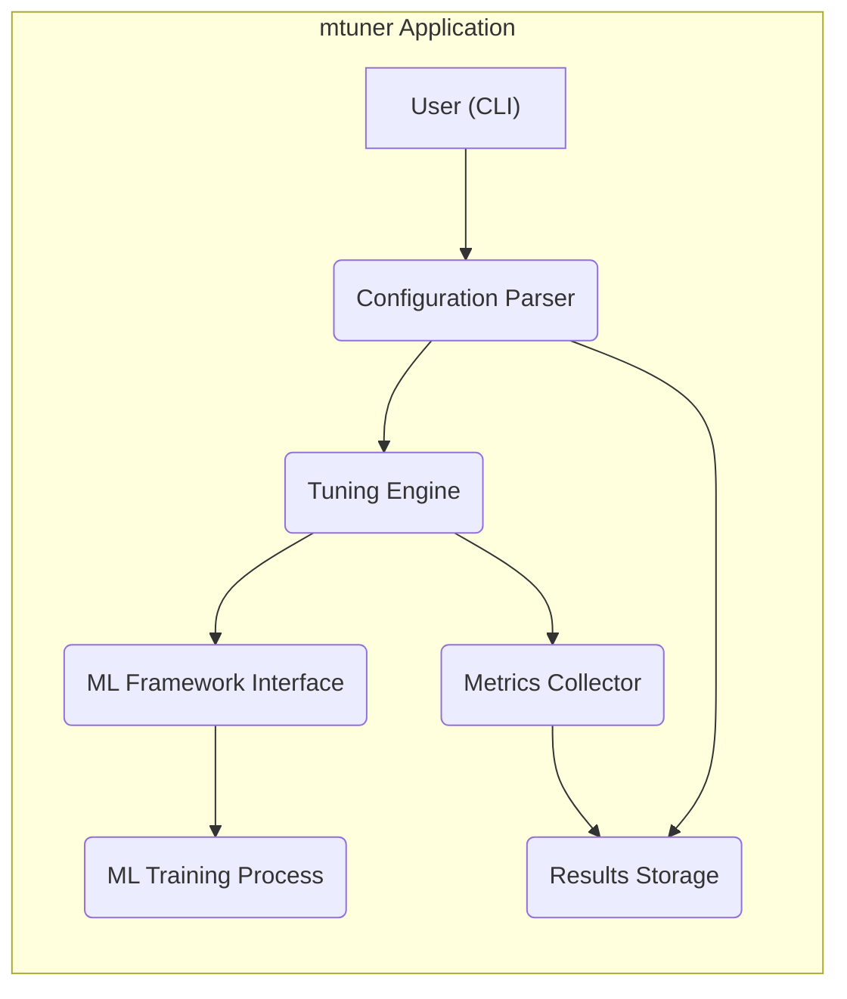
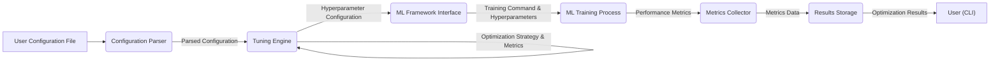

# Project Design Document: mtuner

**Version:** 1.1
**Date:** October 26, 2023
**Prepared By:** Gemini (AI Language Model)

## 1. Introduction

This document provides a detailed design overview of the `mtuner` project, a command-line tool for optimizing machine learning model hyperparameters. This document is intended to serve as a foundation for subsequent threat modeling activities. It outlines the system's architecture, components, data flow, and key security considerations.

### 1.1. Purpose

The primary purpose of this document is to provide a comprehensive understanding of the `mtuner` project's design. This understanding is crucial for identifying potential security vulnerabilities and developing appropriate mitigation strategies during the threat modeling process.

### 1.2. Scope

This document covers the design of the `mtuner` command-line interface (CLI) and its core functionalities. It focuses on the logical architecture and data flow within the application. It does not delve into the specifics of individual machine learning frameworks or external services unless they directly interact with `mtuner`.

### 1.3. Target Audience

This document is intended for:

* Security engineers and analysts involved in threat modeling.
* Developers working on or interacting with the `mtuner` project.
* Architects responsible for the overall system design and security.

## 2. System Overview

`mtuner` is a command-line tool designed to automate the process of hyperparameter optimization for machine learning models. It allows users to define search spaces for hyperparameters and leverages various optimization algorithms to find the best configuration for their models.

### 2.1. Key Features

* Configuration-driven optimization: Users define the optimization process through configuration files.
* Support for multiple ML frameworks: Designed to be compatible with popular frameworks like TensorFlow, PyTorch, etc. (through framework-specific integrations).
* Various optimization algorithms: Implements or integrates with different optimization techniques (e.g., Bayesian optimization, random search, grid search).
* Metrics tracking and reporting: Monitors and reports performance metrics during the optimization process.
* Persistence of results: Stores optimization results for later analysis and comparison.

## 3. System Architecture

The following diagram illustrates the high-level architecture of `mtuner`:

### 3.1. Components

* **User (CLI):** The command-line interface through which users interact with `mtuner`. This component accepts user commands and displays output. It's responsible for:
    * Accepting user commands and arguments.
    * Displaying progress and status updates.
    * Presenting optimization results.
* **Configuration Parser:** Responsible for reading and validating the user-provided configuration file. This file defines the hyperparameters to tune, the search space, the optimization algorithm, and other settings. Key responsibilities include:
    * Reading configuration files (e.g., YAML, JSON).
    * Validating the structure and content of the configuration.
    * Handling potential errors in the configuration file.
    * Providing the parsed configuration to the Tuning Engine.
* **Tuning Engine:** The core component that orchestrates the hyperparameter optimization process. It selects hyperparameter configurations based on the chosen algorithm and manages the execution of training runs. Its functions include:
    * Implementing various optimization algorithms.
    * Generating hyperparameter sets to evaluate.
    * Managing the lifecycle of training runs.
    * Communicating with the ML Framework Interface.
    * Receiving and processing metrics from the Metrics Collector.
* **ML Framework Interface:** An abstraction layer that allows `mtuner` to interact with different machine learning frameworks. This component handles the specifics of invoking training processes and retrieving metrics from the chosen framework. It is responsible for:
    * Translating generic training requests into framework-specific commands.
    * Invoking the ML Training Process.
    * Handling framework-specific output and error messages.
    * Potentially monitoring the training process.
* **ML Training Process:** The actual execution of the machine learning model training with a specific set of hyperparameters. This is typically an external process invoked by the ML Framework Interface. This process:
    * Loads the model and dataset.
    * Applies the provided hyperparameters.
    * Executes the training loop.
    * Outputs performance metrics.
* **Metrics Collector:** Monitors the training process and collects performance metrics (e.g., accuracy, loss). This component:
    * Receives metrics from the ML Training Process (potentially through log parsing or direct communication).
    * Aggregates and potentially transforms the metrics.
    * Provides the metrics to the Tuning Engine for decision-making.
* **Results Storage:**  A component responsible for storing the results of each training run, including the hyperparameter configuration and the corresponding metrics. This could involve:
    * Writing results to local files (e.g., CSV, JSON).
    * Storing data in a database.
    * Utilizing cloud storage services.

## 4. Data Flow

The following diagram illustrates the typical data flow within `mtuner`:

### 4.1. Data Flow Description

1. **User Configuration:** The user provides a configuration file specifying the optimization parameters.
2. **Configuration Parsing:** The Configuration Parser reads and validates the configuration file, producing a structured representation of the configuration.
3. **Tuning Engine Orchestration:** The Tuning Engine, based on the configured optimization algorithm and feedback from previous runs (metrics), generates hyperparameter configurations.
4. **ML Framework Interaction:** The Tuning Engine passes the generated hyperparameter configuration to the ML Framework Interface.
5. **Training Execution:** The ML Framework Interface translates the request and invokes the ML Training Process with the specified hyperparameters.
6. **Metrics Collection:** The ML Training Process executes, and performance metrics are generated and collected by the Metrics Collector.
7. **Results Storage:** The Metrics Collector stores the collected metrics along with the corresponding hyperparameter configuration in the Results Storage.
8. **Optimization Loop:** The Tuning Engine uses the collected metrics to evaluate the performance of the current configuration and refine its search strategy, generating new hyperparameter configurations for subsequent runs. This process repeats until a stopping criterion is met.
9. **Results Reporting:** The user can query the Results Storage through the CLI to view the optimization results, including the best performing hyperparameter configurations and their associated metrics.

## 5. Security Considerations

This section outlines initial security considerations for the `mtuner` project. These will be further explored during the threat modeling process.

### 5.1. Input Validation

* **Configuration File Parsing:** The Configuration Parser must rigorously validate the input configuration file to prevent injection attacks or unexpected behavior due to malformed input.
    * Implement schema validation to ensure the configuration file adheres to the expected structure and data types.
    * Sanitize string inputs to prevent command injection if these are used in system calls or passed as arguments to external processes. For example, if the configuration allows specifying custom training commands, these need careful validation.
    * Limit the size and complexity of the configuration file to prevent denial-of-service attacks.
* **CLI Input:**  Validate user input provided through the command-line interface to prevent command injection or other vulnerabilities.
    * Use parameterized commands or safe string formatting when constructing commands based on user input.
    * Implement input sanitization for any user-provided strings.

### 5.2. Access Control

* **Configuration Files:** Access to configuration files should be controlled to prevent unauthorized modification of the optimization process.
    * Recommend secure file permissions for configuration files.
    * Consider encrypting sensitive information within configuration files if necessary.
* **Results Storage:** Access to the stored optimization results should be controlled to protect potentially sensitive information about model performance and hyperparameters.
    * Implement access controls based on user roles or permissions.
    * Encrypt stored results, especially if they are stored in a shared location.
* **External Resources:** If `mtuner` interacts with external resources (e.g., cloud storage, databases, remote training servers), appropriate authentication and authorization mechanisms must be implemented.
    * Use secure protocols (e.g., HTTPS, SSH) for communication.
    * Store credentials securely (e.g., using environment variables or dedicated secret management tools), avoiding hardcoding.

### 5.3. Data Protection

* **Sensitive Data Handling:** If the configuration or results contain sensitive data (e.g., API keys, credentials, dataset paths), appropriate encryption and secure storage mechanisms should be used.
    * Employ encryption at rest and in transit for sensitive data.
    * Avoid logging sensitive information.
* **Data Integrity:** Mechanisms should be in place to ensure the integrity of the stored optimization results.
    * Use checksums or digital signatures to verify the integrity of stored data.

### 5.4. Dependency Management

* **Third-party Libraries:**  Carefully manage and audit third-party libraries used by `mtuner` to identify and mitigate potential vulnerabilities. Keep dependencies updated.
    * Use a dependency management tool to track and manage dependencies.
    * Regularly scan dependencies for known vulnerabilities.

### 5.5. Logging and Auditing

* **Activity Logging:** Implement comprehensive logging of `mtuner` activities, including user actions, configuration changes, and errors. This is crucial for security monitoring and incident response.
    * Log relevant events such as successful and failed login attempts (if applicable), configuration changes, and errors.
    * Ensure logs include timestamps and user identifiers.
    * Securely store and manage log files.

### 5.6. Error Handling

* **Robust Error Handling:** Implement robust error handling to prevent unexpected program termination and to avoid exposing sensitive information in error messages.
    * Avoid displaying stack traces or internal implementation details in error messages presented to the user.
    * Log detailed error information for debugging purposes, but ensure these logs are securely stored.

## 6. Assumptions and Constraints

* **Configuration Files:** It is assumed that configuration files are typically stored locally or in accessible network locations. The security of these locations is the responsibility of the user or administrator.
* **ML Framework Integration:** The level of integration with specific ML frameworks might vary, potentially introducing framework-specific security considerations that are outside the direct control of `mtuner`.
* **Execution Environment:** The security of the environment where `mtuner` is executed (e.g., user's machine, server, container) is a factor that needs to be considered. `mtuner`'s security is dependent on the security of its execution environment.

## 7. Future Considerations

* **Web Interface:**  A future enhancement could involve a web-based interface for managing and monitoring optimization tasks. This would introduce new security considerations related to web application security, such as authentication, authorization, cross-site scripting (XSS), and cross-site request forgery (CSRF).
* **Distributed Optimization:**  Supporting distributed optimization across multiple machines would require careful consideration of inter-process communication security, including secure authentication and encryption of communication channels.
* **Integration with Cloud Platforms:**  Direct integration with cloud ML platforms would necessitate secure authentication and authorization mechanisms for accessing cloud resources, leveraging platform-provided security features where possible. This would also involve managing cloud-specific credentials securely.

This document provides a foundational understanding of the `mtuner` project's design. The information presented here will be used as the basis for a detailed threat modeling exercise to identify and mitigate potential security risks.