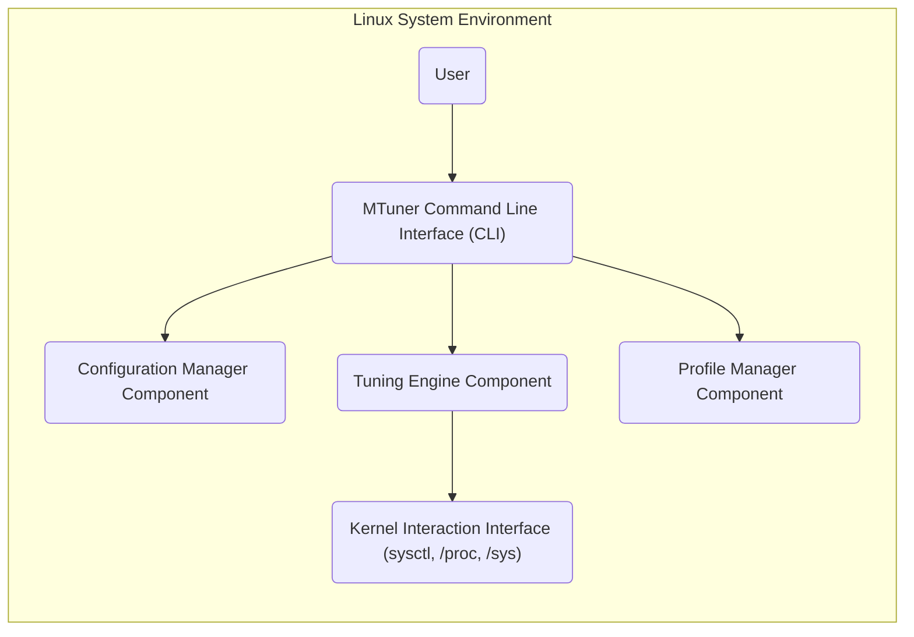
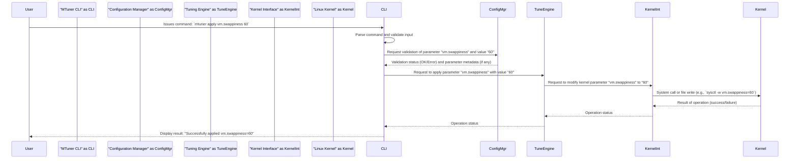

# Project Design Document: MTuner - Linux Performance Tuning Tool

**Version:** 1.1
**Date:** October 26, 2023
**Author:** AI Software Architect

## 1. Introduction

This document provides an enhanced and detailed design overview of MTuner, a Linux performance tuning tool as found in the provided GitHub repository: [https://github.com/milostosic/mtuner](https://github.com/milostosic/mtuner). This document outlines the system's architecture, components, data flow, and key considerations, specifically tailored for subsequent threat modeling activities. We aim to provide a clear and comprehensive understanding of MTuner's inner workings and potential security implications.

## 2. Goals and Objectives

The primary goal of MTuner is to provide a user-friendly command-line interface (CLI) for optimizing various aspects of a Linux system's performance. Key objectives include:

*   Simplifying the process of adjusting kernel parameters (e.g., `vm.swappiness`, `net.ipv4.tcp_congestion_control`).
*   Providing a mechanism for saving and restoring comprehensive tuning profiles.
*   Offering intelligent recommendations for performance improvements based on system analysis (though the current scope might be limited, this is a potential future objective).
*   Allowing users to easily apply and revert individual tuning changes or entire profiles.
*   Providing clear feedback to the user about the applied changes and their status.

## 3. Target Audience

This document is primarily intended for:

*   Security architects and engineers responsible for threat modeling the MTuner application and its deployment environment.
*   Software developers involved in the maintenance, debugging, and extension of MTuner's codebase.
*   System administrators and DevOps engineers seeking a deeper understanding of MTuner's architecture for operational purposes and security assessments.

## 4. Scope

This design document covers the core functionalities of MTuner as observed in the provided GitHub repository. It focuses on the following aspects, providing more granular detail than the previous version:

*   Command-line interface and the parsing of various user commands and options.
*   Configuration file management, including the structure and format of configuration files.
*   Interaction with the Linux kernel for parameter tuning, specifying the methods used (e.g., `sysctl`, direct file writes to `/proc` or `/sys`).
*   Profile management (saving, loading, applying, and the storage format of profiles).
*   Error handling and logging mechanisms within MTuner.

This document does not cover:

*   Specific performance tuning algorithms or strategies currently implemented within MTuner.
*   Detailed implementation specifics within the MTuner codebase, such as specific function names or internal data structures (unless directly relevant to understanding data flow or security).
*   The user interface design beyond the command-line interaction and its basic syntax.

## 5. High-Level Architecture

MTuner operates as a command-line tool that interacts directly with the Linux operating system kernel to modify its behavior. The following diagram illustrates the high-level architecture, with more descriptive node names:

**Components:**

*   **User:** The human operator interacting with the MTuner tool via the command line interface to manage system performance.
*   **MTuner Command Line Interface (CLI):** The primary entry point for user interaction. It parses commands, validates input, and orchestrates the actions of other components.
*   **Configuration Manager Component:** Responsible for loading, parsing, validating, and providing access to MTuner's configuration settings from files.
*   **Tuning Engine Component:** The core logic for applying and reverting performance tuning parameters by interacting with the Linux kernel through the Kernel Interaction Interface.
*   **Profile Manager Component:** Handles the saving, loading, and application of user-defined collections of tuning parameters (profiles).
*   **Kernel Interaction Interface (sysctl, /proc, /sys):**  Represents the specific system calls and file system interactions used by MTuner to read and modify kernel parameters.

## 6. Detailed Design

### 6.1. MTuner Command Line Interface (CLI)

*   **Functionality:**
    *   Parses command-line arguments and options using libraries like `argparse` (or similar).
    *   Provides a user-friendly syntax for common operations (e.g., `mtuner apply <parameter> <value>`, `mtuner profile save <name>`).
    *   Performs input validation to ensure that provided parameter names and values are within acceptable ranges and formats, preventing errors and potential injection attacks.
    *   Orchestrates calls to the **Configuration Manager Component**, **Tuning Engine Component**, and **Profile Manager Component** based on the parsed user command.
    *   Displays formatted output and feedback to the user, including success/failure messages and potential warnings.
*   **Key Interactions:**
    *   Receives commands and input from the **User**.
    *   Invokes methods in the **Configuration Manager Component** to load initial settings or validate user-provided values.
    *   Triggers actions in the **Tuning Engine Component** to apply or revert specific tuning parameters.
    *   Utilizes the **Profile Manager Component** for operations like saving, loading, and listing tuning profiles.
*   **Data Handled:**
    *   Command strings entered by the user.
    *   Parameter names and their intended values as input by the user (e.g., "vm.swappiness", "60").
    *   Status messages and output strings displayed to the user.

### 6.2. Configuration Manager Component

*   **Functionality:**
    *   Loads MTuner's configuration from one or more files, potentially supporting formats like YAML, JSON, or INI.
    *   Parses the configuration data into internal data structures (e.g., dictionaries, objects).
    *   Validates the configuration against predefined schemas or rules to ensure data integrity and prevent unexpected behavior. This might include checking for valid data types and ranges.
    *   Provides a consistent interface for other components to access configuration parameters and settings.
*   **Key Interactions:**
    *   Invoked by the **MTuner Command Line Interface (CLI)** at startup or when a configuration reload is explicitly requested by the user.
    *   Provides configuration data, such as default parameter values or allowed ranges, to the **Tuning Engine Component** for validation purposes.
*   **Data Handled:**
    *   Paths to configuration files on the file system.
    *   Default values for tunable kernel parameters.
    *   Metadata about tunable parameters, such as descriptions, valid ranges, and data types.
    *   Global settings for MTuner's behavior.

### 6.3. Tuning Engine Component

*   **Functionality:**
    *   Receives instructions from the **MTuner Command Line Interface (CLI)** to apply or revert specific tuning parameters with provided values.
    *   Interacts with the **Kernel Interaction Interface (sysctl, /proc, /sys)** to modify the actual system settings.
    *   May perform additional validation of the requested changes against configured limits or safety checks before applying them to the kernel.
    *   Implements error handling for kernel interactions, such as dealing with permission issues or invalid parameter values.
    *   Provides feedback on the success or failure of individual tuning operations to the **MTuner Command Line Interface (CLI)**.
*   **Key Interactions:**
    *   Invoked by the **MTuner Command Line Interface (CLI)** when the user requests to apply a tuning change.
    *   Utilizes the **Kernel Interaction Interface (sysctl, /proc, /sys)** to communicate with the operating system kernel.
    *   May retrieve configuration data, such as allowed parameter ranges, from the **Configuration Manager Component**.
*   **Data Handled:**
    *   Names of the specific kernel parameters to be modified (e.g., "vm.swappiness").
    *   The new values intended for those kernel parameters (e.g., "60").
    *   Status codes and error messages received from the kernel interaction.

### 6.4. Profile Manager Component

*   **Functionality:**
    *   Allows users to save the current set of applied tuning parameters (or a specified subset) as a named profile.
    *   Loads previously saved tuning profiles from persistent storage.
    *   Applies the settings from a loaded profile by invoking the **Tuning Engine Component** for each parameter in the profile.
    *   Manages the storage of profiles, typically as files in a designated directory, potentially using formats like JSON or YAML to serialize the profile data.
    *   Provides functionality to list, delete, and manage existing profiles.
*   **Key Interactions:**
    *   Invoked by the **MTuner Command Line Interface (CLI)** in response to profile-related commands (e.g., `mtuner profile save`, `mtuner profile load`).
    *   Utilizes the **Tuning Engine Component** to apply the individual parameter settings contained within a loaded profile.
    *   Interacts with the file system to read and write profile data.
*   **Data Handled:**
    *   Profile names assigned by the user.
    *   Serialized representations of tuning profiles, containing parameter names and their corresponding values.
    *   Paths to profile files on the file system.

### 6.5. Kernel Interaction Interface (sysctl, /proc, /sys)

*   **Functionality:**
    *   Provides an abstraction layer over the direct interaction with the Linux kernel, encapsulating the methods used to read and write kernel parameters.
    *   Implements the necessary system calls (e.g., `sysctl()`) or file system manipulations (e.g., writing to files in `/proc` or `/sys`) to effect changes.
    *   Includes error handling and potentially validation specific to kernel interactions, such as checking permissions or handling invalid parameter names.
    *   May offer different methods for interacting with the kernel depending on the specific parameter being tuned.
*   **Key Interactions:**
    *   Used exclusively by the **Tuning Engine Component** to apply and potentially read kernel parameter values.
*   **Mechanisms:**
    *   Execution of the `sysctl` command-line utility.
    *   Direct system calls using libraries that wrap `sysctl()`.
    *   File I/O operations to read from and write to files within the `/proc` and `/sys` virtual file systems.

## 7. Data Flow

The following diagram illustrates a more detailed data flow when a user applies a specific tuning parameter using the MTuner CLI:

**Data Elements:**

*   **User Command String:** The raw text command entered by the user.
*   **Parsed Command Components:**  The individual parts of the command, such as the action (apply), parameter name, and value.
*   **Validation Data:** Information used to check the validity of user input, potentially including allowed ranges and data types.
*   **Parameter Metadata:**  Descriptive information about the kernel parameter being modified.
*   **Kernel Modification Instructions:**  Specific instructions for the Kernel Interface, including the parameter name and the desired new value.
*   **System Call/File Write Operation:** The actual interaction with the Linux kernel.
*   **Kernel Operation Result:**  The feedback from the kernel indicating the success or failure of the modification.
*   **Operation Status Message:**  A summary of the outcome of the tuning operation.

## 8. Security Considerations (Detailed for Threat Modeling)

The following are more detailed security considerations, categorized for clarity, relevant for comprehensive threat modeling:

*   **Privilege Escalation Risks:**
    *   MTuner inherently requires elevated privileges (root or `sudo`) to modify kernel parameters. Vulnerabilities in MTuner could be exploited by local attackers to gain root access.
    *   Improper handling of user input or configuration data could lead to command injection vulnerabilities, allowing attackers to execute arbitrary commands with root privileges.
*   **Configuration File Security:**
    *   If configuration files are writable by non-privileged users, attackers could modify them to apply malicious or unstable kernel settings, leading to denial of service or system compromise.
    *   Sensitive information, if stored in configuration files (though unlikely in this tool), could be exposed if file permissions are not properly managed.
*   **Input Validation Vulnerabilities:**
    *   Insufficient validation of user-supplied parameter names or values could allow attackers to inject unexpected data, potentially leading to errors, crashes, or even the ability to manipulate unintended kernel parameters.
    *   Lack of proper sanitization of input could open doors for command injection if MTuner internally executes shell commands based on user input.
*   **Kernel Interaction Vulnerabilities:**
    *   Errors in the way MTuner interacts with the kernel (e.g., incorrect `sysctl` usage, writing invalid data to `/proc` or `/sys`) could cause kernel panics, system instability, or even security vulnerabilities within the kernel itself.
    *   Race conditions or other concurrency issues in the kernel interaction logic could lead to unpredictable behavior or security flaws.
*   **Profile Security Risks:**
    *   If profile files are stored with insecure permissions, attackers could modify them to include malicious or destabilizing kernel settings that are applied when the profile is loaded.
    *   Lack of integrity checks on profile files could allow for undetected tampering.
*   **Denial of Service Potential:**
    *   Maliciously crafted commands or profiles could be used to set kernel parameters to values that severely degrade system performance or cause instability, leading to a denial of service.
    *   Resource exhaustion vulnerabilities within MTuner itself could be exploited to crash the tool and potentially impact system stability.
*   **Information Disclosure Risks:**
    *   Verbose error messages or logging could inadvertently expose sensitive system information to unauthorized users.
    *   If MTuner reads and processes sensitive information from the system (beyond kernel parameters), vulnerabilities in this processing could lead to information leaks.

## 9. Deployment Considerations

*   MTuner is intended to be deployed as a command-line utility on Linux systems.
*   Installation typically involves copying the executable to a standard location (e.g., `/usr/local/bin`, `/usr/bin`) and ensuring it has appropriate execute permissions.
*   Configuration files are commonly placed in system-wide directories (e.g., `/etc/mtuner`) or user-specific configuration directories (`~/.config/mtuner`). Proper file permissions are crucial for security.
*   Running MTuner for applying tuning changes requires root privileges, typically enforced through `sudo`. This dependency should be clearly documented and understood for security implications.

## 10. Future Considerations

*   Integration with system monitoring tools (e.g., Prometheus, Grafana) for automated performance analysis and tuning recommendations based on real-time metrics.
*   More sophisticated validation and safety checks for tuning parameters, potentially including rollback mechanisms or warnings for potentially dangerous settings.
*   A graphical user interface (GUI) or a web interface for easier interaction and management, which would introduce new security considerations related to web application security.
*   Support for tuning parameters beyond the kernel, potentially including application-specific settings.
*   Enhanced error handling and detailed logging, with options for different logging levels and destinations, while being mindful of potential information disclosure.
*   Implementation of security features like signed profiles or integrity checks for configuration files.

This enhanced document provides a more detailed and structured design overview of the MTuner project, specifically focusing on aspects relevant to threat modeling. The expanded descriptions of components, data flow, and security considerations offer a stronger foundation for identifying and mitigating potential security risks.
