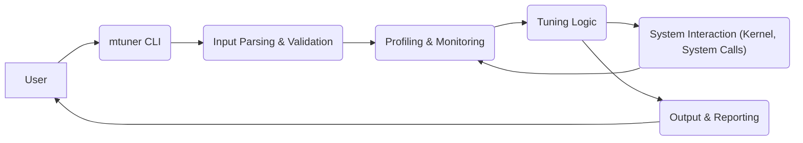
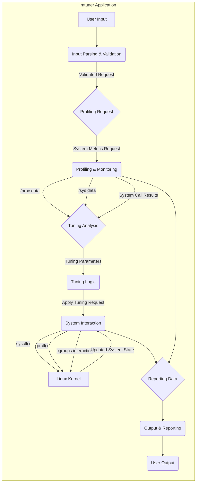

# Project Design Document: mtuner

**Version:** 1.1
**Date:** October 26, 2023
**Author:** AI Software Architect

## 1. Introduction

This document provides an enhanced and more detailed design overview of the `mtuner` project, a Linux performance tuning tool available at [https://github.com/milostosic/mtuner](https://github.com/milostosic/mtuner). Building upon the previous version, this document further clarifies the system's architecture, components, and data flow to facilitate more effective threat modeling activities. It serves as a comprehensive reference for understanding the system's inner workings, potential security vulnerabilities, and trust boundaries.

## 2. Goals and Objectives

The primary goals of this design document are:

- To provide a comprehensive and refined description of the `mtuner` application's architecture and functionality.
- To clearly identify key components, their specific responsibilities, and their interactions within the system.
- To precisely illustrate the data flow within the application, highlighting data sources and destinations.
- To serve as a robust and detailed basis for conducting thorough threat modeling, including identifying potential attack vectors and vulnerabilities.
- To provide a clear and unambiguous understanding of the system for security analysis, auditing, and potential future development and enhancements.

## 3. High-Level Architecture

The `mtuner` application operates as a command-line tool that interacts with the Linux operating system to monitor and adjust kernel parameters and process settings for performance optimization. This interaction requires specific privileges and involves accessing sensitive system information.

## 4. Detailed Architecture

The `mtuner` application can be broken down into the following key components, each with specific responsibilities and interactions:

- **mtuner CLI:** The primary interface for user interaction, responsible for receiving and interpreting user commands.
- **Input Parsing & Validation:**  Ensures the integrity and safety of user-provided commands and arguments before further processing.
- **Profiling & Monitoring:** Gathers real-time and historical performance data from the Linux system using various system interfaces.
- **Tuning Logic:**  Analyzes collected performance data and determines optimal tuning parameters based on predefined rules or user-specified goals.
- **System Interaction (Kernel, System Calls):**  The component responsible for applying tuning parameters by directly interacting with the Linux kernel.
- **Output & Reporting:**  Formats and presents the results of profiling and tuning operations to the user in a clear and understandable manner.

## 5. Data Flow

The typical data flow within `mtuner` involves the following stages:

- **User Input:** The user provides commands and arguments to the `mtuner CLI`.
- **Input Processing:** The `Input Parsing & Validation` component receives the input, parses it to understand the user's intent, and validates its correctness against expected formats and constraints.
- **Profiling Data Collection:** Based on the validated input, the `Profiling & Monitoring` component is invoked to collect performance data from various sources within the system.
- **Data Analysis:** The collected data is passed to the `Tuning Logic` component for analysis. This component applies algorithms and heuristics to identify areas for potential performance improvement.
- **Tuning Action Execution:** The `Tuning Logic` determines the necessary tuning actions and instructs the `System Interaction` component to apply these changes.
- **System Modification:** The `System Interaction` component uses appropriate system calls to modify kernel parameters or process settings.
- **Result Reporting:** The `Output & Reporting` component gathers the results of the profiling and tuning operations and presents them to the user.

## 6. Components Details

### 6.1. mtuner CLI

- **Responsibility:**  Acts as the primary point of contact for users, receiving commands and displaying output.
- **Functionality:**
    - Accepts user commands and options (e.g., `mtuner monitor cpu`, `mtuner tune memory`).
    - Parses command-line arguments using libraries like `argparse` or similar.
    - Validates the basic structure of user input.
    - Invokes the appropriate internal components based on the parsed commands.
    - Handles initial error reporting for invalid command syntax.

### 6.2. Input Parsing & Validation

- **Responsibility:**  Ensures that user-provided commands and arguments are syntactically correct, semantically valid, and safe for processing. This is a critical component for preventing injection attacks and ensuring the application's stability.
- **Functionality:**
    - Parses command-line arguments, extracting commands and their associated parameters.
    - Validates the format and range of input values (e.g., ensuring numeric values are within acceptable limits, checking for valid file paths if applicable).
    - Checks for required arguments and flags.
    - Sanitizes input to prevent command injection or other forms of malicious input exploitation (e.g., escaping shell metacharacters if passing data to external commands, though less likely in this architecture).
    - Provides informative and specific error messages for invalid input, guiding the user to correct their commands.
    - Examples of validation:
        - Checking if a provided process ID is a valid integer.
        - Verifying that a specified CPU core number exists on the system.
        - Ensuring that a requested tuning parameter is within the allowed range for that specific kernel setting.

### 6.3. Profiling & Monitoring

- **Responsibility:**  Collects performance-related data from the Linux system to provide insights into system behavior and identify potential bottlenecks.
- **Functionality:**
    - Reads data from the `/proc` filesystem (e.g., `/proc/stat` for CPU statistics, `/proc/meminfo` for memory information, `/proc/[pid]/status` for process details).
    - Reads data from the `/sys` filesystem (e.g., kernel parameters under `/sys/kernel/`).
    - Potentially uses system calls like `getrusage()` to gather resource usage statistics for processes, `perf_event_open()` for more advanced performance monitoring (if implemented).
    - May involve parsing text-based data from system files and converting it into usable data structures.
    - Handles potential errors when accessing system resources (e.g., permission denied, file not found).
    - May implement caching mechanisms to avoid excessive reads from system files.

### 6.4. Tuning Logic

- **Responsibility:**  Analyzes the performance data collected by the `Profiling & Monitoring` component and determines the optimal tuning parameters to improve system performance based on predefined rules, user configurations, or potentially machine learning models.
- **Functionality:**
    - Implements algorithms or heuristics to identify performance bottlenecks based on the collected metrics (e.g., high CPU utilization, memory pressure, I/O wait times).
    - Compares current system metrics against predefined thresholds or target values specified by the user or default configurations.
    - Suggests adjustments to kernel parameters (e.g., using `sysctl` to modify values in `/proc/sys/`).
    - Suggests adjustments to process settings (e.g., using `nice` or `chrt` to change process priorities, interacting with cgroups to manage resource limits).
    - May allow users to define custom tuning strategies or profiles.
    - Could incorporate logic to revert changes if they negatively impact performance.

### 6.5. System Interaction (Kernel, System Calls)

- **Responsibility:**  Provides the interface for applying the tuning parameters determined by the `Tuning Logic` by directly interacting with the Linux kernel. This component operates with elevated privileges and requires careful design to prevent unintended consequences.
- **Functionality:**
    - Uses system calls like `sysctl()` to modify kernel parameters (e.g., `sysctl -w vm.swappiness=10`).
    - Uses system calls like `nice()`, `setpriority()`, `chrt()`, `sched_setscheduler()` to adjust process scheduling priorities.
    - Interacts with cgroups (control groups) via system calls or library interfaces to manage resource allocation and limits for groups of processes.
    - Requires appropriate privileges (typically root) to perform these actions, often necessitating the use of `sudo` when running `mtuner`.
    - Implements error handling to gracefully manage failures when applying tuning parameters (e.g., permission denied, invalid parameter).
    - Should include mechanisms to log or audit the changes made to the system.

### 6.6. Output & Reporting

- **Responsibility:**  Presents the results of profiling and tuning operations to the user in a clear, informative, and potentially actionable manner.
- **Functionality:**
    - Formats collected performance metrics for display (e.g., CPU usage percentages, memory utilization graphs, I/O throughput).
    - Presents suggested tuning parameters and their potential impact.
    - Reports the outcome of applied tuning changes, indicating success or failure and any encountered errors.
    - May provide visualizations or summaries of the data using libraries or terminal-based graphics.
    - Allows users to customize the output format (e.g., plain text, JSON, CSV).
    - May include logging capabilities for recording actions and results.

## 7. Security Considerations (Detailed)

This section expands on the preliminary security considerations, providing more specific potential threats and vulnerabilities associated with each component:

- **Trust Boundaries:** The primary trust boundary exists between the user input and the `Input Parsing & Validation` component, and again between the `mtuner` application and the Linux kernel when using `System Interaction`.
- **Privilege Escalation:**
    - The `System Interaction` component operates with elevated privileges, making it a prime target for exploitation. Vulnerabilities in this component could allow an attacker to gain root access.
    - Improper input validation in earlier components could potentially lead to the `System Interaction` component executing unintended actions with root privileges.
- **Input Validation Vulnerabilities:**
    - **Command Injection:** If user input is not properly sanitized, attackers could inject malicious commands that are executed by the system.
    - **Path Traversal:** If file paths are accepted as input (e.g., for configuration files), insufficient validation could allow attackers to access or modify arbitrary files on the system.
    - **Integer Overflow/Underflow:**  If input values are not properly checked, large or negative values could cause unexpected behavior or crashes.
- **Data Security:**
    - While `mtuner` doesn't typically handle sensitive user data, unauthorized modification of kernel parameters could lead to denial of service or system instability.
    - Information disclosure could occur if the `Output & Reporting` component inadvertently reveals sensitive system information to unauthorized users.
- **System Call Security:**
    - Incorrect usage of system calls in the `System Interaction` component could lead to kernel panics or other system-level issues.
    - Exploitation of vulnerabilities in the kernel itself could be facilitated by the application's interaction with it.
- **Dependency Vulnerabilities:**
    - If `mtuner` relies on external libraries, vulnerabilities in those libraries could be exploited. Regular updates and security audits of dependencies are crucial.
- **Configuration Security:**
    - If `mtuner` uses configuration files, these files should be stored securely with appropriate permissions to prevent unauthorized modification.
- **Error Handling:**
    - Poor error handling could reveal sensitive information about the system or the application's internal workings to attackers.
- **Logging and Auditing:**
    - Insufficient logging could make it difficult to track malicious activity or diagnose security incidents.

## 8. Deployment

The `mtuner` application is typically deployed as a standalone executable on a Linux system. Common deployment scenarios include:

- **System-wide Installation:** The executable is placed in a system-wide directory like `/usr/bin`, `/usr/local/bin`, or `/opt/mtuner`, making it accessible to all users. This often requires root privileges for installation.
- **User-specific Installation:** The executable is placed in a user's home directory (e.g., `~/bin`), making it accessible only to that specific user.
- **Containerized Deployment:** `mtuner` could be packaged within a Docker or other container image for easier deployment and management, potentially with specific security configurations and resource limitations.
- **Execution via `sudo`:**  Since many tuning operations require root privileges, users typically execute `mtuner` commands using `sudo`. Proper configuration of `sudoers` is essential to limit the scope of privileges granted.

## 9. Future Considerations

- **Modularization and Plugin Architecture:**  Designing the application with a more modular architecture and supporting plugins could enhance extensibility and maintainability.
- **GUI Interface:**  Developing a graphical user interface could improve usability for users who are not comfortable with the command line.
- **Automated Tuning and Machine Learning:**  Integrating more sophisticated automated tuning algorithms, potentially leveraging machine learning, could improve the effectiveness and efficiency of the tool.
- **Remote Management Capabilities:**  Exploring the possibility of remotely monitoring and tuning systems, which would introduce new security considerations.
- **Integration with Monitoring Systems:**  Allowing `mtuner` to integrate with existing monitoring systems for data collection and analysis.

This enhanced design document provides a more detailed and comprehensive understanding of the `mtuner` project. The expanded descriptions of components, the clarified data flow, and the detailed security considerations will be invaluable for conducting thorough threat modeling and ensuring the security of the application and the systems it interacts with.