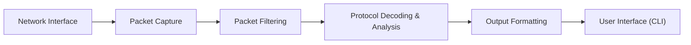
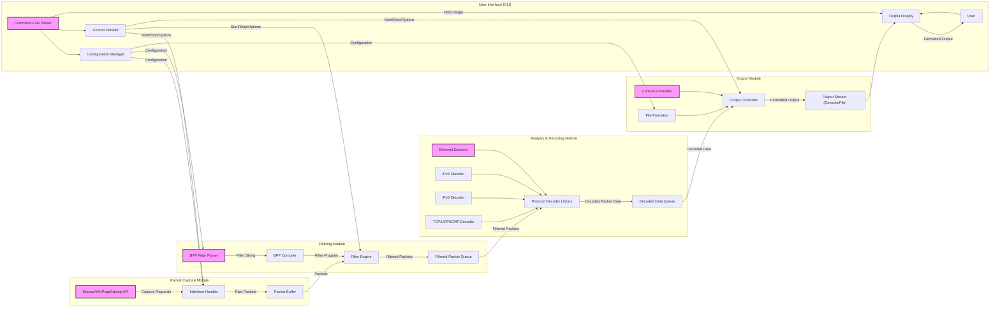
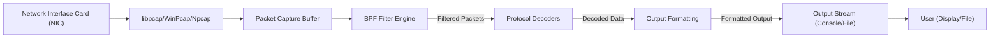

Okay, I will improve the project design document for `mtuner`. I will focus on clarity, completeness, and enhancing the security considerations section to be more threat modeling focused. I will also double-check the mermaid diagrams and markdown formatting.

Here is the improved version:

```markdown
# Project Design Document: mtuner - Network Traffic Analyzer

**Version:** 1.1
**Date:** 2023-10-27
**Author:** [Your Name/Organization]

## 1. Project Overview

**Project Name:** mtuner

**Project Repository:** [https://github.com/milostosic/mtuner](https://github.com/milostosic/mtuner)

**Project Description:** mtuner is a command-line network traffic analyzer and packet sniffer developed in C++. It is designed for capturing, filtering, and basic analysis of network packets from a specified interface. mtuner aims to be a lightweight, efficient, and user-friendly tool for network monitoring, debugging, security reconnaissance, and educational purposes. It prioritizes command-line operation for scripting and automation.

**Key Features:**

*   **Raw Packet Capture:** Captures raw network packets directly from a designated network interface using system-level APIs.
*   **Flexible Packet Filtering:** Implements robust packet filtering based on user-defined Berkeley Packet Filter (BPF) expressions, allowing for granular control over captured traffic.
*   **Protocol Decoding & Analysis:** Provides decoding and parsing of common network protocol headers including Ethernet, IPv4, IPv6, TCP, UDP, and ICMP.  Offers basic analysis by displaying key header fields.
*   **Command-Line Interface (CLI):**  Operates exclusively through a command-line interface, facilitating scripting, automation, and integration into other tools.
*   **Output Versatility:** Supports outputting captured and analyzed packet data to the console (standard output) or saving it to a file in human-readable text format.

## 2. Goals and Objectives

**Primary Goals:**

*   **Core Functionality:**  Establish a fully functional network packet capture and analysis tool with the features described above.
*   **Performance & Efficiency:** Optimize for efficient packet capture and processing to minimize system resource consumption and packet loss, even under moderate network load.
*   **User-Friendliness (CLI):** Design a clear and intuitive command-line interface with comprehensive options and help documentation.
*   **Cross-Platform Portability (Targeted):**  Maintain code portability across Linux-based systems as the primary target, with consideration for potential future expansion to other platforms.

**Specific Objectives:**

*   Successfully capture network packets from a user-specified network interface using `libpcap` (or `WinPcap`/`Npcap` on Windows).
*   Implement a robust BPF filter parsing and application mechanism.
*   Accurately decode and display essential fields from Ethernet, IP (v4 and v6), TCP, UDP, and ICMP protocol headers.
*   Provide clear and configurable output options for console display and file saving.
*   Develop a well-structured, modular, and maintainable C++ codebase adhering to good coding practices.
*   Include basic error handling and informative messages for common operational issues.

## 3. Target Audience

The intended users of mtuner are:

*   **Network and System Administrators:** For network monitoring, basic troubleshooting, and initial security incident investigation.
*   **Cybersecurity Professionals & Penetration Testers:** For network reconnaissance, traffic analysis during security assessments, and basic packet-level security analysis.
*   **Software and Application Developers:** For debugging network communication issues in applications and services.
*   **Networking Students and Educators:** As a practical learning tool for understanding network protocols and packet analysis techniques.
*   **Hobbyist Network Enthusiasts:** For personal exploration of network traffic and learning about network behavior.

## 4. System Architecture

### 4.1. High-Level Architecture

The mtuner system is architected as a pipeline of modules, processing network packets sequentially:



**Component Descriptions:**

*   **"Network Interface"**: Represents the physical or virtual network interface card (NIC) from which network traffic is captured.
*   **"Packet Capture"**:  The module responsible for capturing raw network packets from the designated network interface using libraries like `libpcap` or `WinPcap`/`Npcap`.
*   **"Packet Filtering"**: Applies user-defined BPF filters to the captured packets, discarding packets that do not match the specified criteria, thus optimizing processing and focusing on relevant traffic.
*   **"Protocol Decoding & Analysis"**: Parses and decodes the headers of filtered packets to extract key information from network protocols (Ethernet, IP, TCP, UDP, ICMP). Performs basic analysis by presenting this decoded data.
*   **"Output Formatting"**:  Formats the decoded packet information into a human-readable text representation suitable for console display or file output.
*   **"User Interface (CLI)"**: Provides the command-line interface for user interaction, allowing configuration of capture parameters, filters, output options, and control over the packet capture process.

### 4.2. Component-Level Architecture

A more detailed view of each module and its sub-components:



**Detailed Component Descriptions:**

*   **Packet Capture Module:**
    *   **"libpcap/WinPcap/Npcap API"**: The core packet capture library interface.  Provides functions for opening network interfaces, setting capture parameters (promiscuous mode, snapshot length), and reading raw packets.  Npcap is explicitly mentioned as the modern Windows alternative to WinPcap.
    *   **"Interface Handler"**: Manages the selected network interface, initializes the capture session using the chosen API, and handles potential errors during interface opening.
    *   **"Packet Buffer"**: A memory buffer to temporarily store captured raw packets received from the network interface before further processing.  This buffer helps to decouple capture from processing and handle bursts of traffic.

*   **Filtering Module:**
    *   **"BPF Filter Parser"**: Parses the user-provided BPF filter string from the command line, validating its syntax and structure.
    *   **"BPF Compiler"**: Compiles the parsed BPF filter string into a BPF bytecode program that can be efficiently executed by the filter engine.  Leverages the BPF compilation capabilities of `libpcap`/`WinPcap`/`Npcap`.
    *   **"Filter Engine"**: Executes the compiled BPF filter program against each packet in the "Packet Buffer". Packets matching the filter are passed to the "Filtered Packet Queue".
    *   **"Filtered Packet Queue"**: A queue to hold packets that have passed the filter, ready for decoding and analysis.  This queue helps manage the flow of filtered packets to the next stage.

*   **Analysis & Decoding Module:**
    *   **"Ethernet Decoder"**, **"IPv4 Decoder"**, **"IPv6 Decoder"**, **"TCP/UDP/ICMP Decoder"**:  Individual decoders for each supported protocol.  These modules parse the respective protocol headers and extract relevant fields.  IPv6 is explicitly added for clarity.
    *   **"Protocol Decoder Library"**: A collection of all protocol decoders, managed as a library for modularity and extensibility.  Receives filtered packets and dispatches them to the appropriate decoder based on the protocol type.
    *   **"Decoded Data Queue"**: A queue to store the structured, decoded packet data after processing by the protocol decoders.  This queue prepares the data for output formatting.

*   **Output Module:**
    *   **"Console Formatter"**: Formats the "Decoded Data Queue" for display on the console.  Includes options for verbosity levels, field selection, and output styling (if implemented).
    *   **"File Formatter"**: Formats the "Decoded Data Queue" for saving to a file.  Currently supports plain text output, but could be extended to other formats (CSV, PCAP in future enhancements).
    *   **"Output Controller"**: Manages the output destination (console or file) based on user configuration.  Directs the formatted output to the selected "Output Stream".
    *   **"Output Stream (Console/File)"**:  Represents the actual output stream, either standard output (console) or a file handle for file output.

*   **User Interface (CLI):**
    *   **"Command-Line Parser"**: Parses command-line arguments provided by the user, identifying options, parameters, and commands.  Uses a library or custom logic for argument parsing.
    *   **"Configuration Manager"**: Manages the overall configuration of mtuner based on parsed command-line arguments.  Sets parameters for packet capture, filtering, output, and other operational aspects.
    *   **"Control Handler"**: Handles control commands from the user (start, stop, change options during runtime - if supported).  Interacts with other modules to control the capture and processing lifecycle.
    *   **"Output Display"**:  Handles the presentation of formatted output to the user on the console.  Manages screen clearing, scrolling, and potentially basic formatting.
    *   **"Help/Usage"**: Provides help and usage information to the user when requested (e.g., via `--help` flag), displaying available commands, options, and syntax.
    *   **"User"**: The user interacting with mtuner through the command-line.

## 5. Data Flow

The data flow within mtuner is a linear pipeline, moving from packet capture to output:



**Data Flow Description:**

1.  **Packet Capture Initiation:**  The process begins when the user starts mtuner, and the "libpcap/WinPcap/Npcap" library starts capturing raw network packets from the "Network Interface Card (NIC)".
2.  **Buffering:** Captured packets are temporarily stored in the "Packet Capture Buffer" to handle potential rate mismatches between capture and processing.
3.  **Filtering Application:** The "BPF Filter Engine" retrieves packets from the buffer and applies the user-defined BPF filter rules. Only packets that satisfy the filter criteria are passed to the next stage.
4.  **Protocol Decoding:** "Protocol Decoders" receive the "Filtered Packets" and parse their headers, extracting relevant information based on the identified network protocols (Ethernet, IP, TCP, UDP, ICMP).
5.  **Output Formatting:** The "Decoded Data" is then processed by "Output Formatting", which transforms it into a human-readable text format suitable for display or file storage.
6.  **Output Delivery:** Finally, the "Formatted Output" is directed to the "Output Stream (Console/File)", displaying it to the "User" on the console or saving it to a file as requested.

## 6. Technology Stack

*   **Programming Language:** C++ (Primarily C++11 or later for modern features)
*   **Packet Capture Library:**
    *   **Linux/macOS:** `libpcap` (System library, typically pre-installed or easily installable via package managers)
    *   **Windows:** `Npcap` (Recommended modern replacement for WinPcap, requires separate installation)
*   **Filtering:** Berkeley Packet Filter (BPF) syntax and engine (provided and managed by `libpcap`/`Npcap`).
*   **Build System:** CMake (Cross-platform build system, preferred for C++ projects for flexibility and dependency management)
*   **Standard C++ Library (STL):** For core functionalities like data structures (vectors, queues, strings), algorithms, and input/output operations.
*   **Command-Line Argument Parsing Library (Optional but Recommended):**  Potentially a library like `getopt`, `argparse`, or `CLI11` to simplify command-line argument parsing and handling.

## 7. Deployment Architecture

mtuner is designed for local deployment as a command-line tool.

*   **Deployment Model:** Standalone, command-line executable. No client-server architecture or external dependencies beyond system libraries and packet capture libraries.
*   **Deployment Environment:** User's local workstation (desktop or laptop) or server systems where network traffic analysis is needed.  Target operating systems are primarily Linux-based distributions, with potential for Windows support.
*   **Installation Process:**
    1.  **Dependency Installation:** Install required libraries: `libpcap-dev` (or equivalent) on Linux, `Npcap SDK` on Windows (if building from source).
    2.  **Source Code Retrieval:** Clone the mtuner Git repository from GitHub.
    3.  **Build Process:** Use CMake to generate build files (Makefiles, Ninja, etc.) and then compile the source code using a C++ compiler (g++, clang, MSVC).
    4.  **Executable Creation:** The build process produces a standalone executable file (e.g., `mtuner`).
    5.  **Installation (Optional):**  Optionally, copy the executable to a system-wide directory (e.g., `/usr/local/bin` on Linux) for convenient access from any terminal location.
*   **Execution Requirements:** Requires appropriate operating system permissions to capture network packets. Typically requires root/administrator privileges or specific capabilities granted to the user executing mtuner.

## 8. Security Considerations for Threat Modeling

This section outlines security considerations relevant for threat modeling, categorized by potential impact areas and components.

**8.1. Privilege Escalation & Unauthorized Access:**

*   **Threat:**  If vulnerabilities exist in mtuner, especially in packet capture or filter processing, a local attacker could potentially exploit them to escalate privileges from a normal user to root/administrator.
*   **Component:** "Packet Capture Module", "Filtering Module", "User Interface (CLI)" (if command injection is possible).
*   **Mitigation:**  Rigorous input validation, secure coding practices, minimizing required privileges (capability-based security if possible), regular security audits and vulnerability scanning.  Principle of least privilege should be applied.

**8.2. Buffer Overflows & Memory Corruption:**

*   **Threat:**  C++ is susceptible to buffer overflows if memory management is not handled carefully. Maliciously crafted network packets could trigger buffer overflows in protocol decoders or packet processing logic, leading to crashes, denial of service, or potentially arbitrary code execution.
*   **Component:** "Analysis & Decoding Module" (Protocol Decoders), "Packet Capture Module" (Packet Buffer management).
*   **Mitigation:**  Use safe memory management practices (smart pointers, RAII), bounds checking in array accesses, robust input validation for packet data, fuzz testing with malformed packets, compiler-level buffer overflow protection.

**8.3. Denial of Service (DoS):**

*   **Threat:**  An attacker could send a flood of network traffic designed to overwhelm mtuner's processing capabilities, leading to resource exhaustion (CPU, memory) and denial of service.  Inefficient filtering or decoding logic could exacerbate this.
*   **Component:** "Packet Capture Module", "Filtering Module", "Analysis & Decoding Module".
*   **Mitigation:**  Efficient packet processing algorithms, rate limiting (if feasible), robust error handling to prevent crashes under heavy load, resource usage monitoring, optimized BPF filters to reduce processing overhead.

**8.4. Information Disclosure:**

*   **Threat:**  If mtuner inadvertently logs or outputs sensitive packet data (e.g., passwords, confidential information within application protocols) to insecure locations (console history, log files with weak permissions), it could lead to information disclosure.
*   **Component:** "Output Module", "User Interface (CLI)" (console output handling), logging mechanisms (if implemented in future).
*   **Mitigation:**  Careful handling of sensitive data, avoid logging or displaying sensitive information by default, provide options to sanitize output, secure file permissions for log files (if any), user awareness about potential sensitive data in network traffic.

**8.5. Filter Bypass & Injection:**

*   **Threat:**  If the BPF filter parsing or application is flawed, an attacker might be able to craft filter strings that bypass intended filters or inject malicious filter logic. This could allow them to capture traffic they shouldn't or interfere with the intended filtering behavior.
*   **Component:** "Filtering Module" (BPF Filter Parser, BPF Compiler, Filter Engine), "User Interface (CLI)" (command-line input handling).
*   **Mitigation:**  Thorough validation of BPF filter strings, use well-tested and reliable BPF compilation and execution mechanisms provided by `libpcap`/`Npcap`, prevent command injection vulnerabilities in CLI argument parsing.

**8.6. Dependency Vulnerabilities:**

*   **Threat:**  mtuner relies on external libraries like `libpcap` or `Npcap`. Vulnerabilities in these libraries could indirectly affect mtuner's security.
*   **Component:** "Packet Capture Module" (dependency on `libpcap`/`Npcap`).
*   **Mitigation:**  Regularly update dependencies to the latest versions, monitor security advisories for `libpcap`/`Npcap`, consider using static linking (with caution) or containerization to manage dependencies and isolate potential vulnerabilities.

## 9. Future Enhancements

*   **Graphical User Interface (GUI):** Develop a GUI for improved user experience, especially for less technical users.
*   **Advanced Protocol Decoding & Dissection:** Expand protocol support to include more application-layer protocols (HTTP, DNS, TLS, etc.) and provide deeper protocol dissection capabilities.
*   **Packet Reassembly & Stream Analysis:** Implement TCP stream reassembly to analyze application-layer data within TCP streams and provide session-based analysis.
*   **Statistical Analysis & Reporting:** Add real-time statistical analysis of network traffic (bandwidth usage, protocol distribution, flow analysis) and generate reports in various formats.
*   **Alerting & Anomaly Detection:** Implement alerting mechanisms for detecting suspicious network patterns or anomalies based on configurable rules.
*   **Plugin Architecture:** Design a plugin system to allow users to extend mtuner's functionality with custom decoders, analysis modules, output formats, and alerting rules.
*   **PCAP File Support:** Add the ability to read and write PCAP files, enabling offline analysis of captured traffic and interoperability with other network analysis tools.
*   **Improved Filtering Syntax & Features:** Enhance filtering capabilities with more expressive filter syntax, support for filtering based on application-layer data, and potentially integration with external threat intelligence feeds.

This improved design document provides a more detailed and security-focused overview of the mtuner project, suitable for comprehensive threat modeling and further development. The security considerations section is expanded and categorized to facilitate a structured threat analysis process. The document also incorporates more detail in component descriptions and future enhancements.