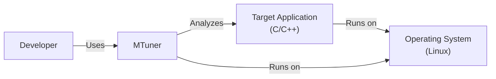
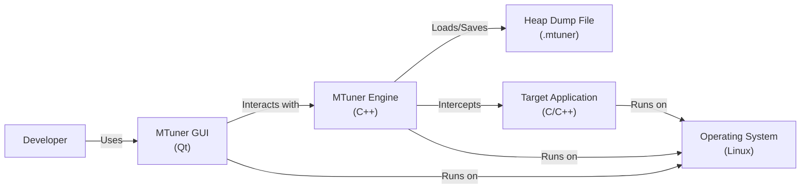
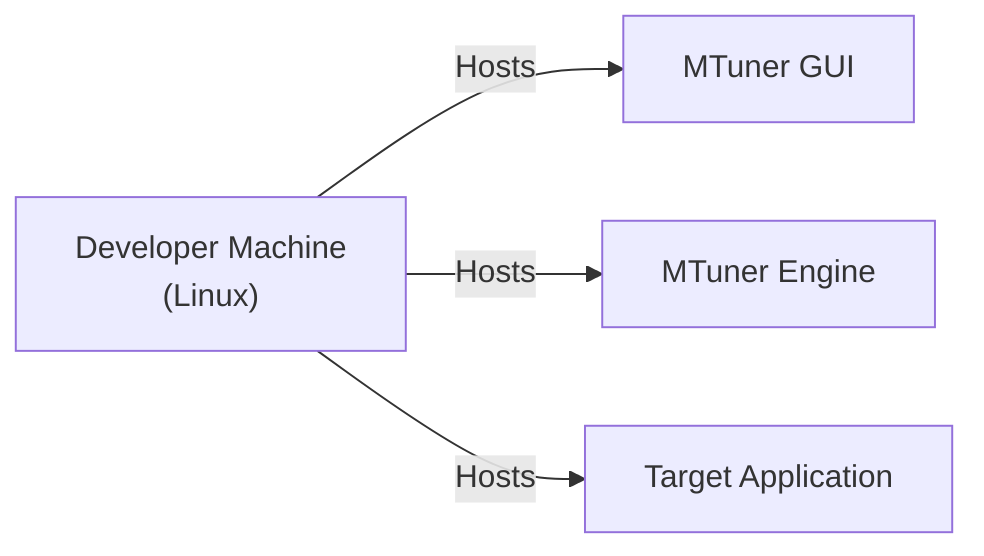
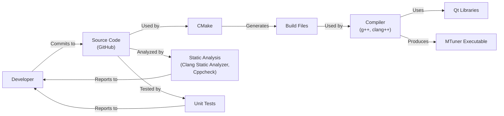

Okay, let's create a design document for the `mtuner` project.

# BUSINESS POSTURE

Business Priorities and Goals:

*   Provide a memory leak detection tool for C/C++ applications.
*   Offer a user-friendly interface for analyzing memory allocation patterns.
*   Support various platforms (Linux, potentially others).
*   Enable developers to identify and fix memory leaks, improving software quality and stability.
*   Potentially offer commercial support or enhanced features in the future.

Most Important Business Risks:

*   Inaccurate or misleading leak detection results, leading to wasted developer time or unfixed leaks.
*   Poor performance or high overhead of the tool, making it impractical for use in real-world scenarios.
*   Compatibility issues with different compilers, libraries, or operating system versions.
*   Security vulnerabilities within `mtuner` itself, potentially exposing user systems to risks.
*   Lack of adoption due to complexity or insufficient documentation.
*   Competition from existing, well-established memory analysis tools.

# SECURITY POSTURE

Existing Security Controls:

*   security control: The project uses CMake, which can help manage build configurations and dependencies securely. (Described in `CMakeLists.txt`)
*   security control: The project appears to be designed for single-user, local execution, reducing the attack surface related to network services. (Implicit in the project's design)
*   security control: The GUI is built using Qt, which, when kept up-to-date, provides some protection against common UI-related vulnerabilities. (Implicit in the use of Qt)

Accepted Risks:

*   accepted risk: The project currently has limited automated testing, increasing the risk of undetected bugs, including potential security vulnerabilities.
*   accepted risk: The project does not appear to implement specific security hardening measures beyond standard coding practices.
*   accepted risk: The project's reliance on external libraries (Qt, potentially others) introduces a dependency risk; vulnerabilities in these libraries could impact `mtuner`.
*   accepted risk: The project does not currently have a defined security vulnerability reporting process.

Recommended Security Controls:

*   security control: Integrate static analysis tools (e.g., Clang Static Analyzer, Cppcheck) into the build process to identify potential vulnerabilities early.
*   security control: Implement a comprehensive suite of unit and integration tests, including security-focused tests.
*   security control: Establish a security vulnerability reporting process and a plan for handling disclosed vulnerabilities.
*   security control: Regularly update dependencies (Qt, etc.) to their latest secure versions.
*   security control: Consider using a memory-safe language (e.g., Rust) for security-critical components, if feasible.
*   security control: Conduct regular security code reviews.
*   security control: If data is loaded from external files, implement robust input validation and sanitization to prevent injection attacks or buffer overflows.

Security Requirements:

*   Authentication: Not applicable, as `mtuner` appears to be a local, single-user tool.
*   Authorization: Not applicable, as there are no distinct user roles or privileges within the tool.
*   Input Validation:
    *   Crucial for any file loading functionality (e.g., loading heap dumps).
    *   Validate file formats, sizes, and data structures to prevent buffer overflows, format string vulnerabilities, or other injection attacks.
    *   Sanitize any user-provided input used in commands or system calls.
*   Cryptography:
    *   Not directly applicable in the current context, unless sensitive data is stored or transmitted (which doesn't seem to be the case).
    *   If encryption is needed in the future (e.g., for storing settings securely), use well-vetted cryptographic libraries and follow best practices.

# DESIGN

## C4 CONTEXT

C4 Context Element List:

*   Element:
    *   Name: Developer
    *   Type: Person
    *   Description: The software developer using mtuner to analyze their application.
    *   Responsibilities: Uses mtuner to identify and fix memory leaks in their application.
    *   Security controls: Not directly applicable.

*   Element:
    *   Name: MTuner
    *   Type: Software System
    *   Description: The memory profiling and leak detection tool.
    *   Responsibilities: Intercepts memory allocation calls, tracks memory usage, and provides a GUI for analysis.
    *   Security controls: Input validation, static analysis, regular updates, security code reviews.

*   Element:
    *   Name: Target Application (C/C++)
    *   Type: Software System
    *   Description: The application being analyzed for memory leaks.
    *   Responsibilities: The application's normal functionality.
    *   Security controls: Not directly controlled by mtuner, but mtuner helps identify vulnerabilities.

*   Element:
    *   Name: Operating System (Linux)
    *   Type: Software System
    *   Description: The underlying operating system (currently Linux).
    *   Responsibilities: Provides the environment for both mtuner and the target application.
    *   Security controls: OS-level security controls (e.g., user permissions, process isolation).

## C4 CONTAINER

C4 Container Element List:

*   Element:
    *   Name: Developer
    *   Type: Person
    *   Description: The software developer.
    *   Responsibilities: Uses the MTuner GUI to analyze the target application.
    *   Security controls: Not directly applicable.

*   Element:
    *   Name: MTuner GUI (Qt)
    *   Type: Application
    *   Description: The graphical user interface built with Qt.
    *   Responsibilities: Displays memory allocation data, allows user interaction, and controls the MTuner Engine.
    *   Security controls: Relies on Qt's security features, regular updates.

*   Element:
    *   Name: MTuner Engine (C++)
    *   Type: Application
    *   Description: The core logic for intercepting memory allocations and analyzing data.
    *   Responsibilities: Intercepts `malloc`, `free`, etc., tracks memory, generates heap dumps, and performs analysis.
    *   Security controls: Input validation (for heap dump files), static analysis, secure coding practices.

*   Element:
    *   Name: Target Application (C/C++)
    *   Type: Application
    *   Description: The application being analyzed.
    *   Responsibilities: The application's normal functionality.
    *   Security controls: Not directly controlled by mtuner.

*   Element:
    *   Name: Operating System (Linux)
    *   Type: Software System
    *   Description: The underlying operating system.
    *   Responsibilities: Provides the environment for all components.
    *   Security controls: OS-level security controls.

*   Element:
    *   Name: Heap Dump File (.mtuner)
    *   Type: File
    *   Description: A file containing a snapshot of the target application's heap.
    *   Responsibilities: Stores memory allocation data for later analysis.
    *   Security controls: Input validation when loading the file.

## DEPLOYMENT

Possible Deployment Solutions:

1.  Local Installation: The user compiles and installs `mtuner` directly on their development machine.
2.  Pre-built Binaries: Provide pre-compiled binaries for different Linux distributions.
3.  Containerization (Docker): Package `mtuner` within a Docker container for easier distribution and consistent execution.

Chosen Solution (Detailed Description): Local Installation

Deployment Element List:

*   Element:
    *   Name: Developer Machine (Linux)
    *   Type: Physical/Virtual Machine
    *   Description: The developer's workstation running Linux.
    *   Responsibilities: Hosts the entire development and analysis environment.
    *   Security controls: OS-level security, user permissions, firewall (if applicable).

*   Element:
    *   Name: MTuner GUI
    *   Type: Application Instance
    *   Description: Instance of the running MTuner GUI.
    *   Responsibilities: Provides the user interface.
    *   Security controls: Relies on Qt and OS security.

*   Element:
    *   Name: MTuner Engine
    *   Type: Application Instance
    *   Description: Instance of the running MTuner Engine.
    *   Responsibilities: Performs memory analysis.
    *   Security controls: Input validation, secure coding practices.

*   Element:
    *   Name: Target Application
    *   Type: Application Instance
    *   Description: Instance of the application being analyzed.
    *   Responsibilities: Runs the application's code.
    *   Security controls: Not directly controlled by mtuner.

## BUILD

Build Process Description:

1.  Developer commits code changes to the GitHub repository.
2.  CMake is used to generate build files based on the `CMakeLists.txt` configuration.
3.  A C++ compiler (g++, clang++) compiles the source code, linking against Qt libraries.
4.  Static analysis tools (Clang Static Analyzer, Cppcheck) analyze the source code for potential vulnerabilities and report findings to the developer.
5.  Unit tests are executed to verify the correctness of individual components.  Test results are reported to the developer.
6.  The compiler produces the `mtuner` executable.

Build Security Controls:

*   security control: Use of CMake for controlled build configuration.
*   security control: Integration of static analysis tools (Clang Static Analyzer, Cppcheck) to identify potential vulnerabilities during the build process.
*   security control: Execution of unit tests to catch bugs early.
*   security control: (Recommended) Dependency management to track and update external libraries (Qt).
*   security control: (Recommended) Code signing of the final executable to ensure authenticity and integrity.

# RISK ASSESSMENT

Critical Business Processes:

*   Accurate memory leak detection.
*   Providing a usable and performant analysis tool.

Data to Protect:

*   Heap dump files (.mtuner): These files contain a snapshot of the target application's memory, which *could* include sensitive data present in the application's memory at the time of the dump.  Sensitivity depends entirely on the target application.  If the target application handles PII, financial data, etc., then the heap dump would also contain this data.
*   Source code of target application: While not directly handled by MTuner, it is indirectly related.
*   Source code of MTuner: Contains the logic of the application, and potential vulnerabilities.

Data Sensitivity:

*   Heap dump files: Potentially HIGH (depending on the target application).
*   Source code of target application: Potentially HIGH (depending on the target application).
*   Source code of MTuner: MEDIUM.

# QUESTIONS & ASSUMPTIONS

Questions:

*   What specific Linux distributions are targeted for support?
*   Are there any plans for supporting other operating systems (Windows, macOS)?
*   What is the expected size of heap dumps that `mtuner` should handle efficiently?
*   Are there any specific performance requirements or constraints?
*   Are there any plans to integrate `mtuner` with other development tools or IDEs?
*   What level of support will be provided for different C/C++ compilers and standard library implementations?
*   Will there be any remote data collection or telemetry?

Assumptions:

*   BUSINESS POSTURE: The primary goal is to provide a free and open-source tool, with potential future commercial options.
*   SECURITY POSTURE: `mtuner` is intended for use in a trusted development environment.  It is not designed to be a network-facing service.
*   DESIGN: The target application is a C/C++ application running on Linux. The user has sufficient privileges to run and debug the target application. The user is responsible for the security of their own development environment.