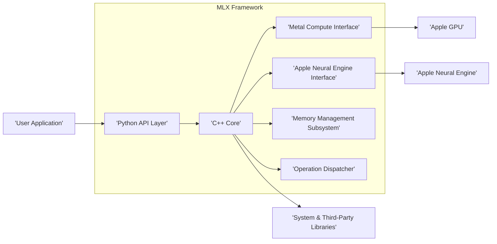
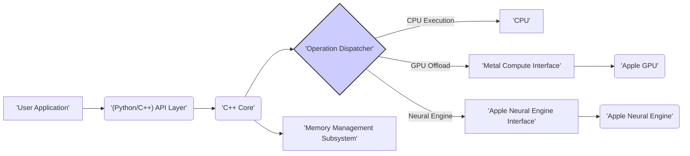

# Project Design Document: MLX - Machine Learning Framework for Apple Silicon

**Version:** 1.1
**Date:** October 26, 2023
**Author:** AI Architecture Expert

## 1. Introduction

This document provides an enhanced architectural design of the MLX project, a machine learning framework specifically designed for Apple silicon. This detailed design serves as a robust foundation for subsequent threat modeling activities, enabling a comprehensive understanding of the system's components, interactions, and potential vulnerabilities. This revision aims to provide greater clarity and depth compared to the initial version.

### 1.1. Purpose

The primary purpose of this document is to:

*   Clearly and comprehensively articulate the architecture of the MLX project.
*   Identify key components, their specific responsibilities, and their interactions.
*   Describe the data flow within the system with greater precision.
*   Provide a solid and detailed basis for identifying potential security threats and vulnerabilities.

### 1.2. Scope

This document covers the core architectural components of the MLX framework as presented in the linked GitHub repository. It focuses on the software architecture and its interaction with the underlying Apple silicon hardware. This revision provides more detail on the internal workings of key components.

### 1.3. Goals

The goals of this enhanced design document are to:

*   Provide a highly detailed and unambiguous overview of the MLX architecture.
*   Enable more effective and targeted threat modeling and security analysis.
*   Serve as a more comprehensive reference for developers and security engineers.

## 2. Overview

MLX is a machine learning framework developed by Apple, optimized for execution on its silicon. It offers a rich set of tools and libraries for building, training, and deploying machine learning models, specifically designed to leverage the performance capabilities of Apple's GPUs and Neural Engine. The framework provides both Python and C++ APIs, accommodating diverse development preferences and use cases.

### 2.1. Target Audience

This document is intended for:

*   Security engineers conducting in-depth threat modeling and security assessments.
*   Software architects and developers actively working on or integrating with the MLX framework.
*   Individuals requiring a thorough and detailed understanding of the MLX architecture.

### 2.2. Key Features

Based on the GitHub repository, the core functionalities of MLX include:

*   **Efficient Tensor Operations:** Provides a highly optimized core tensor library for numerical computation, leveraging Apple silicon.
*   **Modular Neural Network Layers:** Offers a collection of pre-built, configurable neural network layers (e.g., linear, convolutional, recurrent, attention mechanisms).
*   **Automatic Differentiation Engine:**  Implements automatic gradient computation, essential for training neural networks using backpropagation.
*   **Optimization Algorithms:** Includes a suite of optimization algorithms (e.g., SGD, Adam, RMSprop) for efficiently updating model parameters during training.
*   **Flexible Python and C++ APIs:**  Provides both high-level Python bindings for ease of use and a lower-level C++ API for performance-critical operations.
*   **Deep Integration with Apple Silicon:** Designed from the ground up to maximize the utilization of the GPU and Neural Engine on Apple devices through frameworks like Metal and the Neural Engine API.

## 3. Architectural Design

The MLX framework's architecture comprises the following key components, each with specific responsibilities:

*   **Python API Layer:**  Provides the primary interface for Python developers to interact with MLX.
*   **C++ Core:** The foundational layer implementing the core functionalities of the framework.
*   **Metal Compute Interface:**  Handles the execution of tensor operations on the Apple GPU.
*   **Apple Neural Engine Interface:**  Manages the delegation of suitable computations to the Neural Engine.
*   **Memory Management Subsystem:** Responsible for efficient allocation and management of memory across CPU, GPU, and Neural Engine.
*   **Operation Dispatcher:**  Determines the optimal execution path for operations (CPU, GPU, or Neural Engine).
*   **System and Third-Party Library Integrations:**  Dependencies on external libraries for various functionalities.

### 3.1. Component Diagram

### 3.2. Component Descriptions

*   **Python API Layer:** This layer exposes MLX functionalities to Python users. It provides classes and functions for tensor manipulation, defining neural network models, implementing training loops, and performing inference. It uses Python bindings (likely via Pybind11 or similar) to interface with the C++ Core. Error handling and type checking often occur at this level.
*   **C++ Core:** This is the heart of the MLX framework, implemented in C++. It contains the core logic for tensor operations (addition, multiplication, etc.), implementations of various neural network layers, the automatic differentiation engine, and optimization algorithms. It manages the overall execution flow and interacts with the lower-level hardware interfaces.
*   **Metal Compute Interface:** This component is responsible for offloading tensor computations to the Apple GPU using the Metal framework. It translates high-level tensor operations into Metal shader programs and manages the transfer of data between CPU and GPU memory. It handles the complexities of GPU resource management and synchronization.
*   **Apple Neural Engine Interface:** This component facilitates the utilization of the Apple Neural Engine for accelerating specific machine learning operations. It identifies operations that can benefit from the Neural Engine's specialized hardware and manages the data transfer and execution on the Neural Engine. This often involves converting data into specific formats required by the Neural Engine.
*   **Memory Management Subsystem:** This crucial component manages the allocation and deallocation of memory for tensors and other data structures across different memory spaces (CPU, GPU, Neural Engine). It aims to optimize memory usage and minimize data transfer overhead between these devices. It likely employs techniques like memory pooling and caching.
*   **Operation Dispatcher:** This component within the C++ Core analyzes each operation and determines the most efficient way to execute it. It decides whether to execute the operation on the CPU, offload it to the GPU via the Metal Compute Interface, or delegate it to the Neural Engine via the Apple Neural Engine Interface. This decision is based on factors like operation type, tensor size, and device availability.
*   **System and Third-Party Library Integrations:** MLX relies on standard C++ libraries (e.g., STL, potentially BLAS/LAPACK for CPU-based linear algebra if fallback is needed) and potentially other third-party libraries for tasks such as threading, synchronization primitives, and system calls.

### 3.3. Data Flow

The data flow within MLX during a typical machine learning workflow (e.g., training a model) is as follows:

1. **User Interaction via API:** The user application, through either the Python or C++ API, initiates an operation (e.g., a tensor operation, a layer forward pass, a training step). Input data (tensors) is provided.
2. **API Call to C++ Core:** The API layer translates the user request into a corresponding function call in the C++ Core. Data might be serialized or converted at this stage.
3. **Operation Dispatch:** The Operation Dispatcher within the C++ Core analyzes the requested operation and the involved tensors.
4. **Execution Path Selection:** The Dispatcher determines the optimal execution path:
    *   **CPU Execution:** For operations not suitable for GPU or Neural Engine, the C++ Core executes the computation directly on the CPU.
    *   **GPU Offloading:** If the operation is suitable for the GPU, the C++ Core interacts with the Metal Compute Interface. This involves:
        *   Transferring input tensor data to GPU memory.
        *   Launching Metal compute shaders to perform the operation.
        *   Transferring the resulting tensor data back to CPU memory (if needed).
    *   **Neural Engine Delegation:** If the operation can be accelerated by the Neural Engine, the C++ Core interacts with the Apple Neural Engine Interface. This involves:
        *   Formatting input data according to Neural Engine requirements.
        *   Submitting the computation to the Neural Engine.
        *   Retrieving the results from the Neural Engine.
5. **Memory Management:** The Memory Management Subsystem handles the allocation and deallocation of memory throughout the process, ensuring efficient use of available resources.
6. **Result Return:** The results of the operation (output tensors) are passed back through the layers (C++ Core to API layer) to the user application.

### 3.4. Key Interactions

*   **User Application <-> API Layer:**  Involves function calls, data structure passing (e.g., NumPy arrays or MLX tensor objects in Python), and error handling.
*   **API Layer <-> C++ Core:**  Utilizes language bindings to invoke C++ functions from Python or direct C++ function calls. Data serialization/deserialization might occur to bridge the language gap.
*   **C++ Core <-> Metal Compute Interface:**  Involves calls to the Metal framework's API for buffer management, command queue submission, and shader execution.
*   **C++ Core <-> Apple Neural Engine Interface:**  Involves calls to the Neural Engine's specific API for task submission and result retrieval. Data format conversion is often necessary.
*   **C++ Core <-> Memory Management Subsystem:**  Internal function calls within the C++ Core to request and release memory blocks.
*   **Operation Dispatcher <-> Execution Interfaces:**  Conditional branching and function calls to the appropriate execution interface (CPU, Metal, Neural Engine) based on the dispatcher's decision.

## 4. Key Security Considerations

Building upon the architectural design, the following are key security considerations for the MLX framework:

*   **Python API Input Sanitization:**  The Python API must rigorously validate all input from user applications to prevent injection attacks (e.g., through maliciously crafted data that could exploit vulnerabilities in the C++ Core).
*   **C++ Core Memory Safety:** Given the use of C++, careful attention must be paid to memory management to prevent buffer overflows, use-after-free errors, and other memory corruption vulnerabilities. Static and dynamic analysis tools should be employed.
*   **Metal API Security:**  The interaction with the Apple GPU via the Metal framework relies on the security of the Metal drivers and API. Vulnerabilities in Metal could potentially be exploited through MLX.
*   **Neural Engine API Security:** Similar to Metal, the security of the Apple Neural Engine interface depends on the underlying Neural Engine API and firmware.
*   **Memory Management Vulnerabilities:**  Flaws in the Memory Management Subsystem could lead to information leaks or the ability to corrupt data in other parts of the system.
*   **Operation Dispatch Logic:**  The logic within the Operation Dispatcher must be robust to prevent attackers from influencing the execution path in a way that could lead to vulnerabilities.
*   **Dependency Chain Security:**  The security of MLX is tied to the security of its dependencies (system libraries and any third-party libraries). Regularly auditing and updating dependencies is crucial.
*   **Data Confidentiality and Integrity:**  Mechanisms should be in place to protect the confidentiality and integrity of sensitive data processed by MLX, especially during model training.
*   **Model Security:**  If MLX involves loading or saving model files, measures must be taken to prevent the loading of malicious models that could execute arbitrary code.
*   **Side-Channel Attacks:**  Consideration should be given to potential side-channel attacks that could leak information about the model or data being processed, especially when using hardware accelerators.

## 5. Deployment Considerations

Secure deployment of applications utilizing MLX requires careful consideration of the following:

*   **Sandboxing and Isolation:** Deploying applications using MLX within sandboxed environments or containers can limit the potential impact of security vulnerabilities.
*   **Principle of Least Privilege:**  Applications using MLX should be granted only the necessary permissions to access resources.
*   **Secure Model Loading:** If applications load models from external sources, ensure that these sources are trusted and that model files are validated to prevent malicious content.
*   **Regular Security Audits:**  Applications using MLX should undergo regular security audits and penetration testing to identify potential vulnerabilities.
*   **Monitoring and Logging:** Implement robust monitoring and logging to detect and respond to suspicious activity.
*   **Keeping MLX and Dependencies Updated:**  Regularly update MLX and all its dependencies to patch known security vulnerabilities.
*   **Secure Data Handling Practices:**  Follow secure data handling practices when providing input data to MLX models, especially if the data is sensitive.

## 6. Future Considerations

The MLX project is likely to evolve, and future developments may introduce new security considerations. Potential areas for future architectural changes and their security implications include:

*   **Federated Learning Support:**  If MLX adds support for federated learning, new security challenges related to data privacy and secure aggregation will need to be addressed.
*   **Expanded Hardware Support:**  Support for new types of hardware accelerators could introduce new integration layers and potential vulnerabilities.
*   **Cloud Integration Features:**  Direct integration with cloud services for model training or deployment would introduce new network security considerations and authentication requirements.
*   **ONNX or Other Model Format Support:**  Adding support for importing models from other frameworks (e.g., ONNX) would require careful validation of imported models to prevent malicious code execution.

## 7. Conclusion

This enhanced design document provides a more detailed and comprehensive architectural overview of the MLX framework, strengthening the foundation for thorough threat modeling. By providing greater clarity on the responsibilities of each component, the data flow, and key interactions, this document enables security engineers to more effectively identify and assess potential vulnerabilities. Continuous review and updates to this document will be necessary as the MLX project evolves.