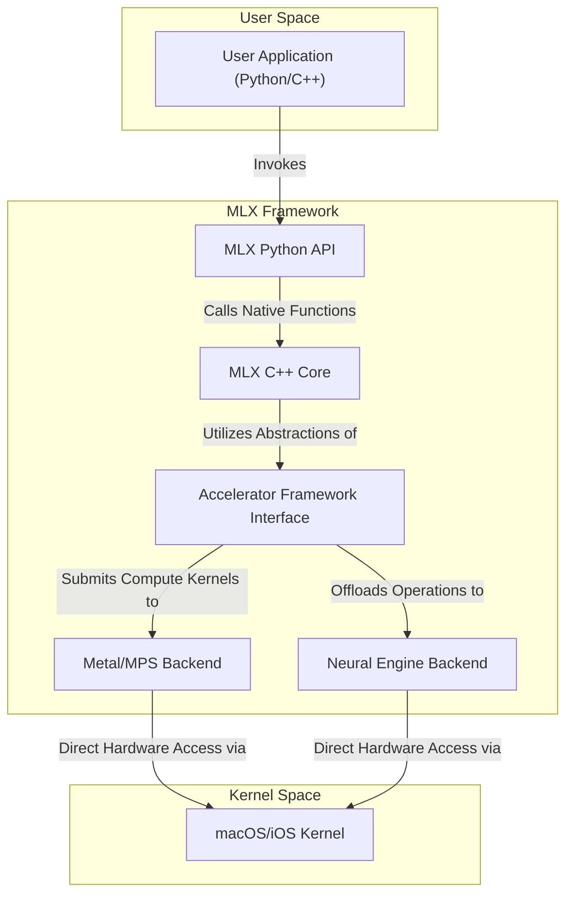
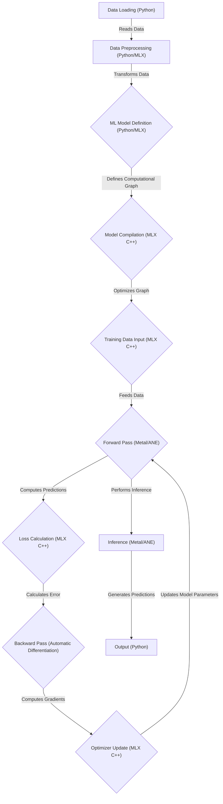

# Project Design Document: MLX - Machine Learning Framework for Apple Silicon

**Document Version:** 1.1
**Date:** October 26, 2023
**Prepared By:** AI Software Architect

## 1. Introduction

This document provides an enhanced design overview of the MLX project, a machine learning framework developed by Apple, optimized for Apple silicon. This document serves as a foundational resource for subsequent threat modeling activities by clearly delineating the system's architecture, components, data flow, and key interactions. The information herein is derived from the public information available in the MLX GitHub repository: [https://github.com/ml-explore/mlx](https://github.com/ml-explore/mlx). This revision aims to provide greater clarity and detail compared to the initial version.

## 2. Goals and Objectives

The core goals underpinning the MLX project are:

* To deliver a high-performance machine learning framework specifically engineered for Apple silicon (CPU, GPU, and Neural Engine).
* To offer intuitive and accessible APIs, primarily through Python, for the construction and training of machine learning models.
* To enable the efficient and optimized execution of machine learning workloads on Apple's hardware platforms.
* To ensure seamless integration with existing Apple technologies and established developer workflows within the Apple ecosystem.
* To facilitate advanced research and development within the domain of machine learning, specifically tailored for Apple platforms.

## 3. Target Audience

This enhanced design document is primarily intended for:

* Security engineers and architects tasked with performing threat modeling and security assessments of the MLX project and its integrations.
* Software developers actively contributing to the development of the MLX framework or building applications utilizing it.
* Cloud architects evaluating the potential deployment and integration of solutions built upon the MLX framework.
* Individuals seeking a deeper, more comprehensive understanding of the MLX system's architectural design and operational principles.

## 4. High-Level Architecture

The MLX framework can be conceptually divided into the following key components and their interactions:

**Detailed Component Descriptions:**

* **User Application (Python/C++):** Represents the user-developed software that leverages the MLX framework to define, train, and execute machine learning models. MLX provides both a high-level Python API for ease of use and a lower-level C++ API for greater control and performance optimization.
* **MLX Python API:** This layer provides a user-friendly, Pythonic interface to the underlying MLX functionalities. It acts as a wrapper around the core C++ implementation, simplifying common machine learning tasks for developers.
* **MLX C++ Core:** This is the foundational layer of the MLX framework, implemented in C++. It encompasses the core data structures (like the `mlx::array`), computational logic, and memory management routines. This layer is responsible for the heavy lifting of tensor operations, automatic differentiation, and model execution.
* **Accelerator Framework Interface:** MLX integrates with Apple's Accelerate framework, providing a unified interface to access low-level hardware acceleration capabilities. This includes access to both the GPU via Metal Performance Shaders (MPS) and the dedicated Neural Engine.
* **Metal/MPS Backend:** This component utilizes Apple's Metal graphics API and the Metal Performance Shaders framework to execute computationally intensive tasks on the GPU. It translates MLX operations into GPU kernels for parallel processing.
* **Neural Engine Backend:** This component is responsible for offloading suitable machine learning operations to the Apple Neural Engine (ANE), a dedicated hardware accelerator designed for efficient execution of neural networks.
* **macOS/iOS Kernel:** The underlying operating system kernel that manages system resources, including the CPU, GPU, and Neural Engine. MLX interacts with the kernel through system calls facilitated by the Accelerate framework.

## 5. Detailed Component Design

This section provides a more granular view of the key components within the MLX framework.

### 5.1. MLX Core (`mlx` directory in the repository)

The MLX Core, primarily written in C++, is the central processing unit of the framework. Its key responsibilities include:

* **Efficient Array Operations:** Provides a highly optimized multi-dimensional array manipulation library, forming the bedrock for numerical computation in machine learning. This includes operations like element-wise arithmetic, matrix multiplication, and reductions.
* **Automatic Differentiation (Autograd):** Implements a robust automatic differentiation engine, enabling the efficient computation of gradients required for training neural networks using backpropagation. This handles the chain rule and tracks operations on tensors.
* **Optimization Algorithms:** Includes implementations of various optimization algorithms (e.g., Stochastic Gradient Descent (SGD), Adam, RMSprop) used to update model parameters during the training process. These algorithms adjust model weights based on calculated gradients.
* **Predefined Neural Network Layers:** Offers a collection of pre-built neural network layers (e.g., linear layers, convolutional layers, recurrent layers, activation functions) that developers can use to construct complex model architectures.
* **Computational Graph Management:** Manages the creation, optimization, and execution of computational graphs representing machine learning models. This involves scheduling operations and managing data dependencies.
* **Memory Management System:** Implements a sophisticated memory management system tailored for Apple silicon's unified memory architecture, ensuring efficient allocation, deallocation, and sharing of memory between the CPU and GPU.

### 5.2. MLX C Bindings (`mlx-c` directory in the repository)

The MLX C Bindings provide a C API to the core MLX functionalities. This enables interoperability with other programming languages and systems that can interface with C libraries, expanding the potential uses of MLX.

### 5.3. Examples (`examples` directory in the repository)

The `examples` directory contains a curated collection of illustrative implementations demonstrating the practical application of the MLX framework across various machine learning tasks. These serve as valuable learning resources and demonstrate best practices for using the API.

### 5.4. Tests (`tests` directory in the repository)

The `tests` directory houses a comprehensive suite of unit and integration tests designed to ensure the functional correctness, stability, and performance of the MLX framework's components. These tests are crucial for maintaining code quality and preventing regressions.

### 5.5. Python Bindings (`mlx` Python package)

The Python bindings offer a user-friendly and intuitive interface to the underlying MLX C++ core. Key features include:

* **NumPy-Inspired API:** Provides a familiar syntax and semantics for users accustomed to the popular NumPy library, easing the learning curve.
* **High-Level Model Building Abstractions:** Facilitates the construction of neural networks using intuitive high-level abstractions and building blocks.
* **Utilities for Training Loop Management:** Offers convenient utilities for managing the training process, including data loading, iteration, and evaluation.
* **Interoperability with the Python Ecosystem:** Enables seamless integration with other popular Python libraries for data science and machine learning, such as `torch` and `numpy`.

## 6. Data Flow

The typical flow of data within the MLX framework during a standard machine learning workflow can be broken down into the following stages:

**Detailed Description of Data Flow Stages:**

* **Data Loading (Python):** Raw data is loaded from various sources (e.g., files, databases, network streams) using standard Python libraries.
* **Data Preprocessing (Python/MLX):** The loaded data undergoes preprocessing steps, such as normalization, standardization, data augmentation, and format conversion. MLX arrays can be used for efficient manipulation during this stage.
* **ML Model Definition (Python/MLX):** The architecture of the machine learning model is defined using the MLX Python API, specifying the layers, connections, and parameters.
* **Model Compilation (MLX C++):** The high-level model definition is translated into an optimized computational graph within the MLX C++ core. This involves optimizing the sequence of operations for efficient execution on the target hardware.
* **Training Data Input (MLX C++):** Batches of preprocessed training data are fed into the compiled model.
* **Forward Pass (Metal/ANE):** The input data propagates through the model's layers. Computations are performed on the GPU (via Metal/MPS) or the Neural Engine, depending on the operation and available resources.
* **Loss Calculation (MLX C++):** The model's predictions are compared to the ground truth labels, and a loss function is used to quantify the error.
* **Backward Pass (Automatic Differentiation):** The automatic differentiation engine computes the gradients of the loss function with respect to the model's parameters.
* **Optimizer Update (MLX C++):** The chosen optimization algorithm uses the calculated gradients to update the model's parameters, aiming to minimize the loss.
* **Inference (Metal/ANE):** Once trained, the model can be used to make predictions on new, unseen data. This process involves a forward pass through the trained model, leveraging the GPU or Neural Engine for efficient computation.
* **Output (Python):** The model's predictions or outputs are returned to the user's Python application for further processing or analysis.

## 7. Security Considerations (Preliminary)

Building upon the initial assessment, here are more specific preliminary security considerations:

* **Supply Chain Vulnerabilities:** Potential risks associated with compromised dependencies (e.g., libraries pulled from PyPI or other package repositories) that could introduce malicious code or vulnerabilities into the MLX framework.
* **Input Sanitization and Validation:** The importance of rigorously validating and sanitizing input data to prevent injection attacks or denial-of-service vulnerabilities caused by malformed or malicious inputs. This applies to both training and inference data.
* **Memory Safety Issues in C++ Core:** Potential vulnerabilities arising from memory management errors (e.g., buffer overflows, use-after-free) in the C++ core, which could lead to crashes, arbitrary code execution, or information disclosure.
* **Access Control and Permissions:** Considerations regarding how access to MLX functionalities, underlying hardware resources (GPU, ANE), and trained models is controlled and managed to prevent unauthorized access or modification.
* **Side-Channel Attack Mitigation:** Awareness of potential side-channel attacks (e.g., timing attacks, power analysis) that could leak sensitive information about model parameters or training data.
* **Model Security and Integrity:** The need to protect trained models from unauthorized access, modification, or theft, as these models represent valuable intellectual property and could be misused.
* **Security of System Library Integrations:**  Reliance on the security of underlying operating system libraries and frameworks (e.g., Accelerate, Metal). Vulnerabilities in these dependencies could indirectly impact MLX.
* **Code Injection through Model Definitions:**  Preventing the injection of malicious code through crafted model definitions or custom layers provided by users.
* **Serialization and Deserialization Vulnerabilities:** Risks associated with insecure serialization and deserialization of model parameters or data, which could be exploited to execute arbitrary code.

## 8. Deployment Considerations

MLX is primarily intended for deployment within the Apple ecosystem, targeting devices running macOS, iOS, and iPadOS. Key deployment considerations include:

* **Optimized On-Device Execution:** MLX's primary strength lies in its ability to efficiently execute machine learning models directly on Apple devices, leveraging the local hardware accelerators for optimal performance and reduced latency.
* **Efficient Resource Management:** Careful consideration of resource utilization (CPU, GPU, memory, battery) on the target device is crucial for ensuring smooth and efficient model execution without negatively impacting device performance or battery life.
* **Seamless Integration with Apple Ecosystem Services:** Leveraging Apple's ecosystem services and frameworks for tasks like model deployment, data management, and user authentication.
* **Secure Model Distribution:** Implementing secure mechanisms for distributing trained models to target devices, protecting against unauthorized access or tampering during transit and at rest.
* **Consideration for Different Apple Silicon Architectures:**  Potential need to optimize or adapt models for different generations and configurations of Apple silicon (e.g., M1, M2, A-series chips).

## 9. Future Considerations

The MLX project is under active development, and potential future directions include:

* **Expanded Hardware Support and Optimization:** Continued optimization and support for newer generations of Apple silicon, potentially including specialized accelerators.
* **Introduction of New Features and Neural Network Layers:** Expanding the framework with support for more advanced machine learning techniques, model architectures, and pre-trained models.
* **Exploration of Cloud Integration Strategies:** Potential integration with cloud services for distributed training, model serving, or data management.
* **Growth of Community Contributions and Ecosystem:** Fostering a vibrant community around MLX and encouraging external contributions to the framework and its ecosystem.
* **Enhanced Tooling and Debugging Capabilities:** Development of more comprehensive tools for debugging, profiling, and optimizing MLX applications.

## 10. Glossary

* **ANE:** Apple Neural Engine, a dedicated hardware accelerator for neural network computations.
* **GPU:** Graphics Processing Unit, a specialized electronic circuit designed to rapidly manipulate and alter memory to accelerate the creation of images in a frame buffer intended for output to a display device.
* **MPS:** Metal Performance Shaders, a collection of high-performance, GPU-accelerated compute kernels.
* **SGD:** Stochastic Gradient Descent, an iterative optimization algorithm used to find the minimum of a function.
* **API:** Application Programming Interface, a set of definitions and protocols used for building and integrating application software.
* **Autograd:** Automatic Differentiation, a set of techniques to algorithmically evaluate the derivative of a function specified by a computer program.

This enhanced design document provides a more detailed and comprehensive understanding of the MLX project's architecture and functionalities, offering a stronger foundation for subsequent threat modeling activities. The increased granularity in component descriptions, data flow analysis, and security considerations aims to facilitate a more thorough and effective security assessment.
