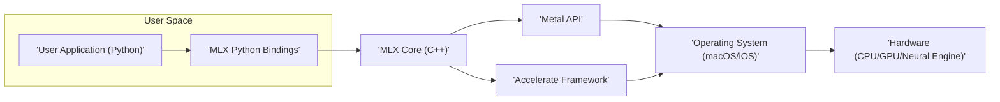
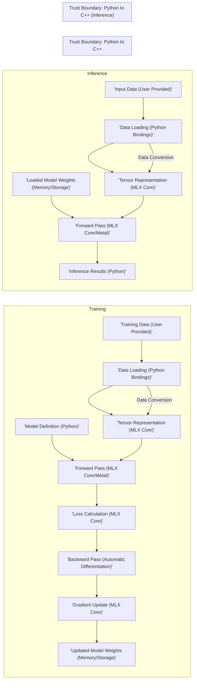

# Project Design Document: MLX - Machine Learning Framework

**Version:** 1.1
**Date:** October 26, 2023
**Author:** AI Software Architect

## 1. Introduction

This document provides a detailed design overview of the MLX project, a machine learning framework primarily targeting Apple silicon. This document is specifically designed to serve as a foundation for subsequent threat modeling activities, outlining the system's architecture, components, data flows, and key interactions with a focus on potential security implications.

### 1.1. Purpose

The primary purpose of this document is to provide a comprehensive architectural description of the MLX project to explicitly facilitate threat modeling. It aims to clearly define the system's boundaries, components, and interactions, enabling security experts to systematically identify potential vulnerabilities, attack vectors, and associated risks.

### 1.2. Scope

This document covers the core architecture and functionality of the MLX framework as represented in the provided GitHub repository (https://github.com/ml-explore/mlx). It focuses on the software components, their interactions, and the data they process. It includes considerations for local execution on Apple silicon as the primary deployment scenario. Cloud deployment aspects are considered at a high level as potential future extensions.

### 1.3. Goals

* Clearly define the major software components of the MLX framework.
* Describe the interactions and data flow between these components, highlighting trust boundaries.
* Identify key data storage and processing locations, including sensitive data.
* Provide a detailed foundation for identifying potential security threats, vulnerabilities, and attack surfaces.

## 2. System Overview

MLX is a machine learning framework engineered for efficient execution on Apple silicon, leveraging the Neural Engine and GPU capabilities through frameworks like Metal and Accelerate. It provides a NumPy-like API for users to build, train, and deploy machine learning models.

### 2.1. High-Level Architecture

* **'User Application (Python)'**: Represents the user's machine learning code written using the MLX Python API. This is the primary entry point for interacting with the framework.
* **'MLX Python Bindings'**: These are the Python wrappers generated (likely using tools like Pybind11) that provide the interface between Python and the core MLX C++ library.
* **'MLX Core (C++)'**: This is the core of the MLX framework, implemented in C++. It contains the logic for tensor operations, model execution, automatic differentiation, and interaction with hardware acceleration APIs.
* **'Metal API'**: Apple's low-level graphics and compute API used by MLX for leveraging GPU acceleration. This involves submitting compute kernels and managing GPU resources.
* **'Accelerate Framework'**: Apple's framework providing optimized numerical and signal processing routines, potentially used by MLX for CPU-based computations and optimized linear algebra operations.
* **'Operating System (macOS/iOS)'**: The underlying operating system providing system resources, security features, and the necessary APIs for MLX to function.
* **'Hardware (CPU/GPU/Neural Engine)'**: The physical hardware components where the actual computations are performed. MLX aims to efficiently utilize these resources.

### 2.2. Key Features Relevant to Security

* **NumPy-like API:** While providing a user-friendly interface, it also means potential vulnerabilities common in numerical libraries could be relevant.
* **Automatic Differentiation:** Involves complex graph computations, which could be susceptible to vulnerabilities if not implemented carefully.
* **GPU Acceleration via Metal:** Introduces dependencies on Metal drivers and the potential for GPU-specific vulnerabilities.
* **Apple Silicon Optimization:** While beneficial for performance, it ties the framework closely to Apple's ecosystem and its specific security considerations.
* **Lazy Evaluation:** The delayed execution of computations might introduce complexities in tracking data flow and potential security implications.

## 3. Component Details

This section provides a more detailed description of the key components within the MLX framework, focusing on their responsibilities and potential security considerations.

### 3.1. 'MLX Python Bindings'

* **Description:**  Provides the Python interface for interacting with the MLX core library. Typically generated using tools like Pybind11.
* **Responsibilities:**
    * Exposing MLX C++ functionalities to Python, including functions for tensor manipulation, model building, and training.
    * Handling data type conversions between Python objects and C++ data structures.
    * Managing the lifecycle of MLX objects created from Python.
    * Implementing error handling and exception propagation between the two languages.
* **Potential Security Considerations:**
    * **Type Confusion:** Incorrect type handling during the binding process could lead to vulnerabilities where Python objects are misinterpreted in the C++ core.
    * **Memory Management Issues:** Improper handling of object lifetimes or memory allocation/deallocation at the boundary between Python and C++ can lead to memory leaks or use-after-free vulnerabilities.
    * **Arbitrary Code Execution:** Vulnerabilities in the binding code could potentially allow malicious Python code to execute arbitrary code within the context of the MLX core process.
    * **Input Validation Bypass:** If input validation is primarily done in Python, vulnerabilities in the bindings could allow bypassing these checks when data is passed to the C++ core.

### 3.2. 'MLX Core (C++)'

* **Description:** The central component of the MLX framework, implemented in C++. This is where the core computational logic resides.
* **Responsibilities:**
    * Implementing core tensor operations (addition, multiplication, convolution, etc.).
    * Managing memory allocation and deallocation for tensors and other internal data structures.
    * Orchestrating computations on the CPU, GPU, and Neural Engine, selecting the appropriate execution backend.
    * Implementing automatic differentiation algorithms (e.g., backpropagation).
    * Interfacing with low-level hardware acceleration APIs (Metal, Accelerate).
    * Handling serialization and deserialization of model weights and other persistent data.
* **Potential Security Considerations:**
    * **Memory Safety Vulnerabilities:** Buffer overflows, heap overflows, use-after-free, and other memory corruption vulnerabilities in the C++ code are critical concerns.
    * **Integer Overflows/Underflows:** Potential for arithmetic errors in tensor operations leading to unexpected behavior or vulnerabilities.
    * **Improper Input Handling:**  Even if Python bindings perform validation, the C++ core must also handle potentially malformed or unexpected data.
    * **Vulnerabilities in Hardware API Interactions:** Incorrect usage or assumptions about the behavior of Metal or Accelerate APIs could lead to security issues.
    * **Denial of Service:** Resource exhaustion vulnerabilities (e.g., excessive memory allocation) could be exploited to crash the application.
    * **Model Security Issues:**  The core is responsible for loading and executing models, making it a potential target for model poisoning or manipulation attacks if model loading is not secure.

### 3.3. 'Metal API' Integration

* **Description:** MLX utilizes Apple's Metal API to offload computationally intensive tasks to the GPU.
* **Responsibilities:**
    * Submitting compute kernels (shaders) to the GPU for parallel execution of tensor operations.
    * Managing GPU memory allocation and data transfers between CPU and GPU memory.
    * Synchronizing CPU and GPU operations to ensure correct execution order.
* **Potential Security Considerations:**
    * **Shader Vulnerabilities:** Maliciously crafted or vulnerable compute kernels could potentially lead to GPU crashes, hangs, or even information disclosure.
    * **Memory Corruption on GPU:** Errors in managing GPU memory could lead to data corruption or vulnerabilities exploitable by other processes.
    * **Driver Vulnerabilities:**  Bugs or vulnerabilities in the underlying Metal drivers could be exploited through MLX.
    * **Information Leakage:**  Sensitive data might reside in GPU memory and could potentially be accessed if not properly managed.

### 3.4. 'Accelerate Framework' Integration

* **Description:** MLX may leverage the Accelerate framework for optimized numerical computations on the CPU, particularly for linear algebra operations.
* **Responsibilities:**
    * Utilizing optimized routines from Accelerate for tasks like matrix multiplication, vector operations, etc.
* **Potential Security Considerations:**
    * **Vulnerabilities in Accelerate Framework:**  Security flaws within the Accelerate framework itself could be a concern for MLX.
    * **Incorrect Usage Leading to Unexpected Behavior:**  Improperly calling Accelerate functions with incorrect parameters could lead to unexpected results or crashes.

### 3.5. Data Storage

* **Description:** MLX needs to store and load various types of data, including model weights, training datasets, and potentially intermediate results.
* **Responsibilities:**
    * Reading data from files in various formats (e.g., NumPy's `.npy`, potentially custom formats).
    * Saving trained model weights to files for persistence.
    * Potentially caching data in memory or on disk for performance.
* **Potential Security Considerations:**
    * **Deserialization Vulnerabilities:**  Loading model weights or data from untrusted sources without proper validation can lead to arbitrary code execution if the deserialization process is flawed.
    * **Unauthorized Access:**  Stored model weights represent valuable intellectual property and need to be protected from unauthorized access.
    * **Data Integrity:**  Ensuring the integrity of loaded data is crucial to prevent model poisoning or unexpected behavior.
    * **Path Traversal:**  Improper handling of file paths during loading or saving could allow attackers to access or overwrite arbitrary files on the system.

## 4. Data Flow

This section describes the typical flow of data within the MLX framework during model training and inference, highlighting potential security implications at each stage.

* **'Training Data (User Provided)'**: The initial dataset used to train the model. **Security Implication:** This data could be malicious or contain adversarial examples.
* **'Data Loading (Python Bindings)'**: The process of reading training data into the framework. **Security Implication:** Vulnerabilities in data loading libraries or improper handling of file formats could be exploited.
* **'Tensor Representation (MLX Core)'**: Data is represented as multi-dimensional arrays (tensors) within MLX. **Security Implication:** Memory corruption vulnerabilities could occur during tensor creation or manipulation.
* **'Model Definition (Python)'**: The structure of the neural network is defined in Python. **Security Implication:** Malicious model definitions could potentially exploit vulnerabilities in the core.
* **'Forward Pass (MLX Core/Metal)'**: Input data is passed through the model to generate predictions. **Security Implication:** Shader vulnerabilities or incorrect GPU memory management could be exploited during this stage.
* **'Loss Calculation (MLX Core)'**: The difference between predictions and actual values is calculated. **Security Implication:** Potential for arithmetic errors or vulnerabilities in the loss function implementation.
* **'Backward Pass (Automatic Differentiation)'**: Gradients are computed to determine how to adjust model weights. **Security Implication:** Complex graph computations could be susceptible to vulnerabilities if not implemented carefully.
* **'Gradient Update (MLX Core)'**: Model weights are updated based on the calculated gradients. **Security Implication:** Errors in weight updates could lead to model instability or vulnerabilities.
* **'Updated Model Weights (Memory/Storage)'**: The modified weights of the trained model. **Security Implication:** These weights are sensitive and need to be protected from unauthorized access and tampering.
* **'Input Data (User Provided)'**: New data for which predictions are needed. **Security Implication:** Similar to training data, this input could be malicious.
* **'Loaded Model Weights (Memory/Storage)'**: The weights of a previously trained model loaded into memory. **Security Implication:** Deserialization vulnerabilities could be exploited during model loading.
* **'Inference Results (Python)'**: The predictions generated by the model. **Security Implication:** The integrity of these results is dependent on the security of the entire pipeline.

## 5. Security Considerations (Detailed)

This section expands on the initial security considerations, providing more specific examples of potential threats and vulnerabilities.

* **Input Validation:**
    * **Threat:** Injection attacks (e.g., if filenames are taken directly from user input without sanitization).
    * **Vulnerability:** Lack of proper validation of data types, ranges, and formats for both training and inference data.
    * **Mitigation:** Implement robust input validation at the Python binding level and within the C++ core. Sanitize file paths and data before processing.
* **Dependency Management:**
    * **Threat:** Exploiting known vulnerabilities in third-party libraries used by MLX (e.g., if using external libraries for data loading).
    * **Vulnerability:** Using outdated or vulnerable versions of dependencies.
    * **Mitigation:** Regularly audit and update dependencies. Use dependency scanning tools to identify potential vulnerabilities.
* **Memory Safety:**
    * **Threat:** Exploiting buffer overflows, use-after-free, or other memory corruption vulnerabilities in the C++ core.
    * **Vulnerability:** Unsafe memory management practices in the C++ code.
    * **Mitigation:** Employ safe coding practices, utilize memory safety tools (e.g., AddressSanitizer, MemorySanitizer), and perform thorough code reviews.
* **Access Control:**
    * **Threat:** Unauthorized access to sensitive data like trained model weights.
    * **Vulnerability:** Lack of proper access control mechanisms for stored models.
    * **Mitigation:** Implement appropriate file system permissions and consider encryption for stored model weights.
* **Serialization/Deserialization:**
    * **Threat:** Arbitrary code execution through deserialization of malicious model weights or data.
    * **Vulnerability:** Using insecure deserialization methods or failing to validate the integrity of serialized data.
    * **Mitigation:** Use secure serialization formats and implement integrity checks (e.g., digital signatures) for serialized data.
* **Supply Chain Security:**
    * **Threat:** Compromised dependencies or malicious code injected during the build process.
    * **Vulnerability:** Lack of control over the build environment and dependencies.
    * **Mitigation:** Implement secure build pipelines, verify the integrity of downloaded dependencies, and use code signing.
* **Hardware Security:**
    * **Threat:** Exploiting vulnerabilities in the underlying hardware (CPU, GPU, Neural Engine) or their drivers.
    * **Vulnerability:** Reliance on potentially vulnerable hardware or drivers.
    * **Mitigation:** Stay updated with hardware and driver security advisories. While direct mitigation within MLX might be limited, awareness of these risks is important.
* **Model Security:**
    * **Threat:** Model poisoning (injecting malicious data during training) or adversarial attacks (crafting inputs to fool the model during inference).
    * **Vulnerability:** Lack of defenses against model poisoning or adversarial examples.
    * **Mitigation:** Implement techniques for detecting and mitigating model poisoning and adversarial attacks. This might involve input sanitization, adversarial training, or anomaly detection.

## 6. Deployment Considerations

MLX is primarily designed for local execution on Apple silicon devices. This section outlines security considerations specific to this deployment scenario.

* **Local Execution (macOS/iOS):**
    * **User Permissions:** The security of MLX relies on the security of the user's local environment. Ensure users run MLX with appropriate permissions.
    * **Software Updates:** Keeping the operating system and MLX framework updated is crucial for patching security vulnerabilities.
    * **Sandboxing:** Consider the potential benefits of running MLX within a sandbox environment to limit the impact of potential vulnerabilities.
    * **Data Privacy:** When processing sensitive data locally, ensure appropriate measures are in place to protect data privacy.

* **Cloud Deployment (Future):** If MLX is deployed in the cloud, additional security considerations will be necessary:
    * **Network Security:** Secure communication channels (e.g., TLS) for data transfer.
    * **Access Control:** Robust authentication and authorization mechanisms to control access to MLX services and data.
    * **Data Encryption:** Encryption at rest and in transit for sensitive data.
    * **Infrastructure Security:** Secure configuration and management of the cloud infrastructure.

* **Distributed Training (Future):**
    * **Secure Communication:** Encrypted communication between training nodes.
    * **Node Authentication:** Verifying the identity of participating nodes.
    * **Data Integrity:** Ensuring the integrity of data shared between nodes.

## 7. Future Considerations

As MLX evolves, new features and functionalities will introduce new security challenges. Future threat modeling efforts should consider:

* **Expanded Platform Support:** Supporting new operating systems or hardware architectures will introduce new security considerations specific to those platforms.
* **Distributed Training Capabilities:**  Security implications of inter-process communication, data sharing, and node management in a distributed environment.
* **Integration with Cloud Services:**  Security risks associated with interacting with external cloud services and APIs.
* **New Model Architectures and Operations:**  The introduction of new model types or operations might introduce new vulnerabilities or attack vectors.

This improved design document provides a more detailed and security-focused overview of the MLX project, serving as a more robust foundation for subsequent threat modeling activities.