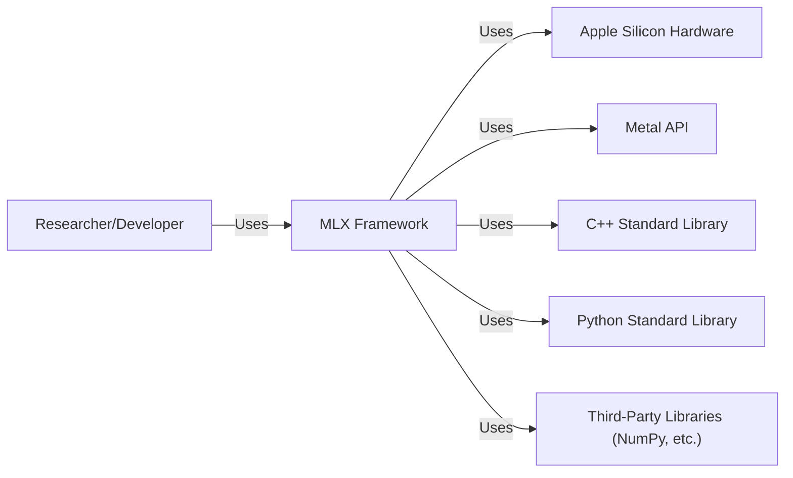
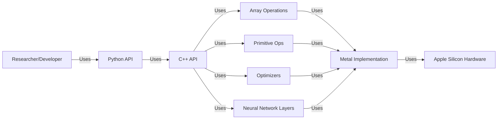
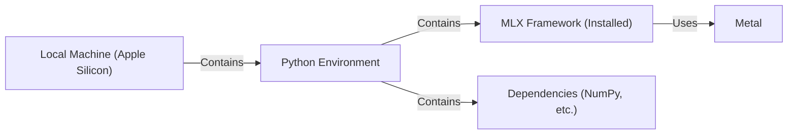
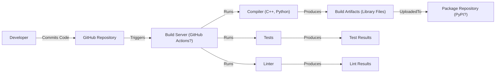

Okay, let's create a design document for the MLX project, focusing on aspects relevant to threat modeling.

# BUSINESS POSTURE

Business Priorities and Goals:

*   Provide a user-friendly and efficient framework for machine learning research on Apple silicon.
*   Enable researchers and developers to easily experiment with and deploy new ML models.
*   Foster a community around the framework, encouraging contributions and extensions.
*   Offer a performant alternative to existing frameworks, leveraging the unique hardware capabilities of Apple silicon.
*   Simplify the transition from research prototypes to deployed models.

Most Important Business Risks:

*   Inability to attract and retain users due to performance, usability, or feature limitations compared to established frameworks (e.g., PyTorch, TensorFlow).
*   Security vulnerabilities that could compromise user data or allow malicious code execution, damaging the project's reputation and user trust.
*   Lack of adoption by the research community, hindering the project's growth and impact.
*   Failure to keep up with advancements in ML hardware and software, leading to obsolescence.
*   Intellectual property risks, such as unintentional infringement of existing patents or licenses.

# SECURITY POSTURE

Existing Security Controls (Based on the GitHub repository):

*   security control: Code reviews: Pull requests are used, suggesting a code review process is in place. (Implicit in the GitHub workflow).
*   security control: Basic examples and tests: The repository includes examples and tests, which can help identify and prevent some bugs, including some with security implications. (Found in the `examples` and `tests` directories).
*   security control: Use of C++ and Python: Using a combination of C++ (for performance-critical parts) and Python (for usability) can help isolate potential vulnerabilities. (Project structure).
*   security control: Community engagement: An active community can help identify and report security issues. (GitHub Issues and Discussions).

Accepted Risks:

*   accepted risk: The framework is relatively new, and undiscovered vulnerabilities may exist.
*   accepted risk: Reliance on third-party libraries (e.g., for numerical computation) introduces potential supply chain risks.
*   accepted risk: The focus is on research and experimentation, which may prioritize speed and flexibility over strict security hardening.
*   accepted risk: Limited formal security auditing has been performed (as far as is publicly visible).

Recommended Security Controls:

*   security control: Static Application Security Testing (SAST): Integrate SAST tools into the build process to automatically scan for common vulnerabilities.
*   security control: Software Composition Analysis (SCA): Use SCA tools to identify and track dependencies, and to flag known vulnerabilities in those dependencies.
*   security control: Fuzz testing: Implement fuzz testing to discover unexpected behavior and potential vulnerabilities by providing invalid or random inputs.
*   security control: Security-focused code reviews: Explicitly include security considerations in code reviews, with reviewers trained to identify potential vulnerabilities.
*   security control: Establish a security reporting process: Create a clear and easy way for users to report security vulnerabilities (e.g., a `SECURITY.md` file).
*   security control: Consider a bug bounty program: Incentivize external security researchers to find and report vulnerabilities.

Security Requirements:

*   Authentication: Not directly applicable to the core framework, as it's a library, not a service. Authentication would be relevant for any associated services (e.g., model deployment platforms).
*   Authorization: Not directly applicable at the framework level. Authorization would be relevant for any associated services.
*   Input Validation:
    *   Crucial for preventing various attacks, including buffer overflows and code injection.
    *   The framework should validate the shape, type, and range of input tensors.
    *   Input validation should occur at the API boundaries (both Python and C++).
    *   Error handling should be robust and not leak sensitive information.
*   Cryptography:
    *   Not directly used in the core framework (as far as is visible).
    *   If the framework is extended to support distributed training or model deployment, cryptography (e.g., TLS) would be essential for securing communication.
    *   If handling sensitive data, appropriate encryption mechanisms should be used.
*   Memory Management
    *   C++ parts of framework should be carefully reviewed for memory leaks, buffer overflows, use-after-free, and double-free vulnerabilities.

# DESIGN

## C4 CONTEXT

C4 Context Element Descriptions:

*   Element:
    *   Name: Researcher/Developer
    *   Type: Person
    *   Description: A user who interacts with the MLX framework to build, train, and evaluate machine learning models.
    *   Responsibilities: Writing ML code, managing data, configuring training, evaluating results.
    *   Security controls: N/A (External to the system).

*   Element:
    *   Name: MLX Framework
    *   Type: Software System
    *   Description: The core machine learning framework.
    *   Responsibilities: Providing APIs for model definition, training, and evaluation; managing memory; interacting with hardware.
    *   Security controls: Input validation, code reviews, (future) SAST, SCA, fuzz testing.

*   Element:
    *   Name: Apple Silicon Hardware
    *   Type: Hardware
    *   Description: The underlying hardware (CPU, GPU, Neural Engine) on which MLX runs.
    *   Responsibilities: Executing computations.
    *   Security controls: Hardware-level security features (e.g., secure enclave).

*   Element:
    *   Name: Metal API
    *   Type: API
    *   Description: Apple's low-level graphics and compute API.
    *   Responsibilities: Providing access to the GPU for computation.
    *   Security controls: Managed by Apple.

*   Element:
    *   Name: C++ Standard Library
    *   Type: Library
    *   Description: Standard library for C++
    *   Responsibilities: Provide basic functionality for C++ code.
    *   Security controls: Managed by C++ community.

*   Element:
    *   Name: Python Standard Library
    *   Type: Library
    *   Description: Standard library for Python
    *   Responsibilities: Provide basic functionality for Python code.
    *   Security controls: Managed by Python community.

*   Element:
    *   Name: Third-Party Libraries (NumPy, etc.)
    *   Type: Library
    *   Description: External libraries used by MLX (e.g., NumPy for numerical operations).
    *   Responsibilities: Providing specific functionality (e.g., numerical computation, data manipulation).
    *   Security controls: Managed by the respective library maintainers; SCA should be used to monitor for vulnerabilities.

## C4 CONTAINER

C4 Container Element Descriptions:

*   Element:
    *   Name: Researcher/Developer
    *   Type: Person
    *   Description: A user who interacts with the MLX framework to build, train, and evaluate machine learning models.
    *   Responsibilities: Writing ML code, managing data, configuring training, evaluating results.
    *   Security controls: N/A (External to the system).

*   Element:
    *   Name: Python API
    *   Type: API
    *   Description: The user-facing Python API for interacting with the framework.
    *   Responsibilities: Providing a user-friendly interface for model building, training, and evaluation.
    *   Security controls: Input validation, API design best practices.

*   Element:
    *   Name: C++ API
    *   Type: API
    *   Description: The internal C++ API for performance-critical operations.
    *   Responsibilities: Implementing core functionality, managing memory, interacting with the Metal API.
    *   Security controls: Input validation, secure coding practices, memory safety checks.

*   Element:
    *   Name: Array Operations
    *   Type: Component
    *   Description: Component for handling array manipulations.
    *   Responsibilities: Basic array operations.
    *   Security controls: Input validation, secure coding practices, memory safety checks.

*   Element:
    *   Name: Primitive Ops
    *   Type: Component
    *   Description: Component for handling primitive operations.
    *   Responsibilities: Basic operations.
    *   Security controls: Input validation, secure coding practices, memory safety checks.

*   Element:
    *   Name: Optimizers
    *   Type: Component
    *   Description: Component for providing optimization algorithms.
    *   Responsibilities: Optimization algorithms.
    *   Security controls: Input validation, secure coding practices, memory safety checks.

*   Element:
    *   Name: Neural Network Layers
    *   Type: Component
    *   Description: Component for providing neural network layers.
    *   Responsibilities: Neural network layers.
    *   Security controls: Input validation, secure coding practices, memory safety checks.

*   Element:
    *   Name: Metal Implementation
    *   Type: Component
    *   Description: The component that interacts directly with the Metal API.
    *   Responsibilities: Translating MLX operations into Metal commands.
    *   Security controls: Secure use of the Metal API.

*   Element:
    *   Name: Apple Silicon Hardware
    *   Type: Hardware
    *   Description: The underlying hardware (CPU, GPU, Neural Engine) on which MLX runs.
    *   Responsibilities: Executing computations.
    *   Security controls: Hardware-level security features.

## DEPLOYMENT

Deployment Solutions:

1.  Local Machine: The simplest deployment scenario is running MLX directly on a user's Apple silicon machine.
2.  Cloud-based VMs: MLX could be deployed on virtual machines with Apple silicon (e.g., AWS EC2 Mac instances).
3.  Containerized Deployment: MLX could be packaged into a Docker container for easier deployment and portability. This would be particularly useful for cloud-based deployments.

Chosen Solution (Detailed Description): Local Machine

Deployment Element Descriptions:

*   Element:
    *   Name: Local Machine (Apple Silicon)
    *   Type: Hardware
    *   Description: The user's physical machine with Apple silicon.
    *   Responsibilities: Providing the hardware resources for running MLX.
    *   Security controls: Operating system security features, user access controls.

*   Element:
    *   Name: Python Environment
    *   Type: Environment
    *   Description: A virtual environment or the system's Python installation.
    *   Responsibilities: Managing Python packages and dependencies.
    *   Security controls: Using a virtual environment to isolate dependencies and avoid conflicts.

*   Element:
    *   Name: MLX Framework (Installed)
    *   Type: Software
    *   Description: The installed MLX framework.
    *   Responsibilities: Providing the ML functionality.
    *   Security controls: As described in the Security Posture section.

*   Element:
    *   Name: Dependencies (NumPy, etc.)
    *   Type: Software
    *   Description: The installed dependencies of MLX.
    *   Responsibilities: Providing supporting functionality.
    *   Security controls: SCA to monitor for vulnerabilities in dependencies.

*   Element:
    *   Name: Metal
    *   Type: API
    *   Description: Apple's low-level graphics and compute API.
    *   Responsibilities: Providing access to the GPU for computation.
    *   Security controls: Managed by Apple.

## BUILD

Build Process Description:

1.  Developers write code and commit it to the GitHub repository.
2.  The build server (likely GitHub Actions, based on the repository) is triggered by commits or pull requests.
3.  The build server runs the compiler (C++ compiler and Python setup tools) to build the MLX library.
4.  The build server runs tests to verify the functionality of the code.  This should include unit tests and potentially integration tests.
5.  The build server runs a linter to check for code style and potential errors.
6.  If all steps are successful, the build artifacts (library files) are produced.
7.  The build artifacts are uploaded to a package repository (potentially PyPI, for easy installation via `pip`).

Security Controls in Build Process:

*   security control: Code reviews (via GitHub pull requests).
*   security control: Automated testing (unit tests, integration tests).
*   security control: Linting (to enforce code style and identify potential errors).
*   security control: (Recommended) SAST and SCA integration into the build process.
*   security control: (Recommended) Dependency pinning to ensure consistent and reproducible builds.
*   security control: (Recommended) Code signing of build artifacts to ensure authenticity and integrity.

# RISK ASSESSMENT

Critical Business Processes:

*   Model development and training.
*   Experimentation with new ML techniques.
*   Deployment of trained models (potentially through integration with other tools).

Data to Protect:

*   User-provided data used for training models (Sensitivity: Variable, could range from public datasets to highly sensitive proprietary data).
*   Trained model weights (Sensitivity: Variable, could represent significant intellectual property).
*   Source code of the MLX framework (Sensitivity: Medium, as it's open source, but unauthorized modifications could be harmful).
*   User credentials (if any associated services are developed) (Sensitivity: High).

# QUESTIONS & ASSUMPTIONS

Questions:

*   What are the specific plans for supporting distributed training and model deployment? This will significantly impact the security requirements.
*   What are the target use cases for MLX? (e.g., research, production, specific industries) This will help prioritize security efforts.
*   What level of security assurance is desired? (e.g., informal testing, formal verification, certification)
*   Are there any plans to handle sensitive data within the framework itself?
*   What is the process for handling security vulnerabilities reported by the community?
*   Is there a dedicated security team or individual responsible for the security of MLX?

Assumptions:

*   BUSINESS POSTURE: The primary goal is to provide a research-oriented framework, with a focus on usability and performance on Apple silicon.
*   SECURITY POSTURE: Security is important, but not the absolute highest priority (compared to, say, a financial application). A balance between security and usability/performance is desired.
*   DESIGN: The framework will primarily be used on local machines or trusted cloud environments. The initial focus is not on highly sensitive data or adversarial environments. The build process relies on GitHub Actions. The deployment process is via pip installation.