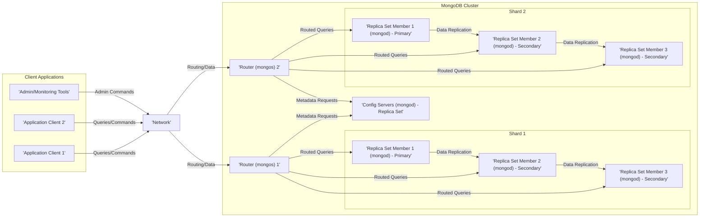
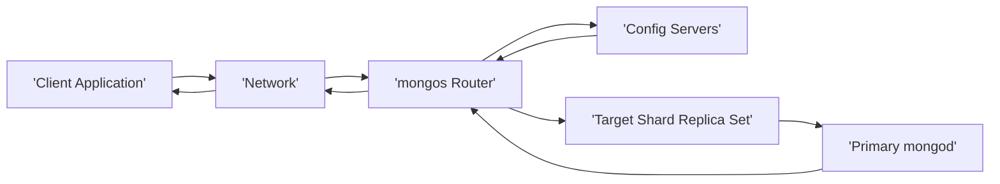
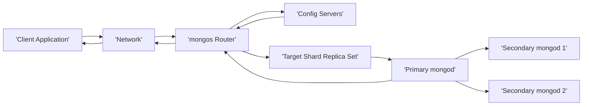

# Project Design Document: MongoDB

**Version:** 1.1
**Date:** October 26, 2023
**Prepared By:** AI Software Architect

## 1. Introduction

This document provides an enhanced and more detailed architectural design of the MongoDB database system, based on the open-source project available at [https://github.com/mongodb/mongo](https://github.com/mongodb/mongo). Building upon the previous version, this document offers a deeper understanding of the system's components, their interactions, and the overall architecture. It is intended to serve as a robust foundation for subsequent threat modeling activities, providing granular insights into potential attack surfaces and vulnerabilities.

## 2. Goals and Objectives

The fundamental goals of the MongoDB project are to deliver:

*   A highly **scalable** and **performant** NoSQL database solution capable of handling large volumes of data and high traffic loads.
*   A **flexible schema-less** data model, allowing for agile development and adaptation to evolving data structures.
*   Comprehensive support for **diverse data types**, including documents, arrays, and embedded objects, along with rich **indexing options** to optimize query efficiency.
*   **Robust data replication** mechanisms ensuring **high availability** and data durability through replica sets.
*   A powerful and expressive **query language** and **aggregation framework** for complex data analysis and manipulation.
*   Comprehensive and configurable **secure access control** and **authentication mechanisms** to protect sensitive data.
*   Support for **ACID properties** within single document operations and across replica sets (with certain caveats for multi-document transactions in sharded environments).

## 3. High-Level Architecture

The following diagram illustrates the high-level architecture of a typical MongoDB deployment, emphasizing the key interactions between components:

## 4. Component Architecture

The core building blocks of the MongoDB system are:

*   **`mongod` (Database Process):** The fundamental server process responsible for:
    *   **Data Storage:** Persisting data in BSON (Binary JSON) format on disk.
    *   **Query Processing:** Executing read and write operations against the stored data.
    *   **Indexing:** Building and maintaining indexes to accelerate query performance.
    *   **Replication:** Participating in replica sets to ensure data redundancy and high availability.
    *   **Access Control:** Enforcing authentication and authorization policies to secure data access.
    *   **Storage Engine Management:** Utilizing pluggable storage engines like WiredTiger (default) or others.
*   **`mongos` (Query Router):**  The intelligent routing process in a sharded cluster that:
    *   **Client Interface:** Accepts incoming client connections and queries.
    *   **Shard Awareness:** Determines the target shard(s) for a given query based on the sharding key and cluster metadata.
    *   **Query Routing:** Directs queries to the appropriate `mongod` instances within the relevant shards.
    *   **Result Aggregation:** Merges and returns results from multiple shards to the client.
    *   **Metadata Caching:** Caches routing information obtained from the config servers for efficiency.
*   **Config Servers:** Specialized `mongod` instances that collectively hold the metadata defining the sharded cluster's structure, including:
    *   **Shard Mapping:**  Information about which data chunks reside on which shards.
    *   **Chunk Ranges:** Definitions of the data ranges assigned to each shard.
    *   **Cluster Configuration:** Overall settings and topology of the sharded environment.
    *   **High Availability:** Typically deployed as a replica set to ensure resilience and prevent single points of failure for cluster metadata.
*   **Client Drivers:** Language-specific libraries that provide a programmatic interface for applications to interact with MongoDB, handling:
    *   **Connection Management:** Establishing and maintaining connections to `mongod` or `mongos` instances.
    *   **Query Construction:** Facilitating the creation of MongoDB queries and commands.
    *   **Data Serialization/Deserialization:** Converting data between application formats and BSON.
    *   **Security Handling:** Implementing authentication and encryption protocols.
*   **MongoDB Shell (`mongo`):** An interactive JavaScript-based command-line interface for:
    *   **Database Administration:** Managing users, roles, indexes, and other administrative tasks.
    *   **Data Exploration:** Querying and manipulating data directly within the shell.
    *   **Scripting:** Automating administrative tasks using JavaScript.
*   **MongoDB Compass:** A graphical user interface (GUI) tool designed for:
    *   **Visual Data Exploration:** Browsing databases, collections, and documents.
    *   **Query Building and Execution:** Constructing and running queries through a visual interface.
    *   **Performance Monitoring:** Observing key metrics and performance indicators.
    *   **Schema Analysis:** Understanding the structure and data types within collections.

## 5. Data Flow

### 5.1. Read Operation (Sharded Environment)

**Detailed Flow:**

1. The **Client Application** initiates a read request.
2. The request travels through the **Network** to a **`mongos` Router**.
3. The **`mongos` Router** consults the **Config Servers** to determine the location of the data based on the query and sharding key.
4. The **Config Servers** provide the necessary routing information back to the **`mongos` Router**.
5. The **`mongos` Router** forwards the query to the **Primary `mongod`** instance within the **Target Shard's Replica Set**.
6. The **Primary `mongod`** executes the query and returns the results to the **`mongos` Router**.
7. The **`mongos` Router** sends the results back through the **Network**.
8. The **Client Application** receives the requested data.

### 5.2. Write Operation (Sharded Environment)

**Detailed Flow:**

1. The **Client Application** initiates a write request.
2. The request travels through the **Network** to a **`mongos` Router**.
3. The **`mongos` Router** consults the **Config Servers** to identify the target shard for the write operation.
4. The **Config Servers** provide the routing information to the **`mongos` Router**.
5. The **`mongos` Router** forwards the write operation to the **Primary `mongod`** instance of the **Target Shard's Replica Set**.
6. The **Primary `mongod`** applies the write operation locally.
7. The **Primary `mongod`** then replicates the write operation to the **Secondary `mongod`** instances within the replica set.
8. Once a sufficient number of secondaries have acknowledged the write (based on the write concern), the **Primary `mongod`** acknowledges the write to the **`mongos` Router**.
9. The **`mongos` Router** sends the acknowledgement back through the **Network**.
10. The **Client Application** receives confirmation of the successful write operation.

## 6. Key Components and Their Functionality (Detailed)

*   **`mongod` (Database Process):**
    *   **Storage Management:** Utilizes storage engines like WiredTiger, which provides document-level locking, compression, and data-at-rest encryption capabilities. Other engines like in-memory storage are available for specific use cases.
    *   **Query Execution Engine:** Parses and executes queries using indexes to efficiently retrieve data. Supports a rich query language with operators for filtering, sorting, and projecting data.
    *   **Indexing Mechanisms:** Supports various index types (e.g., single field, compound, geospatial, text) to optimize query performance. Index selection is crucial for efficient data retrieval.
    *   **Replication Protocol:** Implements a robust replication protocol based on oplog (operation log) tailing, ensuring data consistency across replica set members. Election mechanisms handle primary failover.
    *   **Authentication and Authorization Framework:** Integrates with pluggable authentication mechanisms and enforces role-based access control (RBAC) to manage user permissions at the database, collection, and document level.
*   **`mongos` (Query Router):**
    *   **Connection Pooling:** Manages a pool of connections to the underlying `mongod` instances to optimize performance and resource utilization.
    *   **Query Decomposition and Aggregation:** Breaks down complex queries into sub-queries that can be executed on individual shards and then aggregates the results.
    *   **Sharding Logic:** Implements the logic for determining the target shard(s) based on the sharding key and the cluster's metadata. Different sharding strategies (e.g., ranged, hashed) are supported.
    *   **Failure Handling:** Detects and handles failures of `mongod` instances and re-routes queries accordingly.
*   **Config Servers:**
    *   **Metadata Consistency:** Employs a distributed consensus protocol (typically within the config server replica set) to ensure consistency of the cluster metadata.
    *   **Chunk Management:** Responsible for managing the distribution of data chunks across shards and handling chunk splits and migrations.
    *   **Cluster State Monitoring:** Tracks the health and status of the sharded cluster.
*   **Replica Sets:**
    *   **Automatic Failover:** Monitors the health of the primary node and automatically elects a new primary if the current one becomes unavailable.
    *   **Data Redundancy:** Maintains multiple copies of the data, providing resilience against data loss.
    *   **Read Scaling (with limitations):**  Read operations can be directed to secondary members under certain conditions, potentially improving read scalability.
*   **Sharding:**
    *   **Horizontal Scaling:** Enables scaling out the database by distributing data across multiple servers.
    *   **Data Distribution Strategies:** Supports different strategies for distributing data based on the sharding key, impacting query performance and data locality.
    *   **Chunk Balancing:**  Automatically balances the number of chunks across shards to ensure even data distribution.
*   **Storage Engines:**
    *   **WiredTiger (Default):** A high-performance storage engine offering document-level concurrency control, compression, and encryption at rest.
    *   **In-Memory Storage Engine:** Stores data in RAM for extremely low latency reads and writes, suitable for specific use cases where data durability is less critical.
*   **Client Drivers:**
    *   **Language Support:** Available for a wide range of programming languages (e.g., Java, Python, Node.js, C#, Go).
    *   **Abstraction Layer:** Provide a convenient abstraction layer over the underlying MongoDB protocol.
    *   **Security Features:** Implement security features like TLS/SSL encryption and authentication.

## 7. Security Considerations (Enhanced)

Key security aspects of MongoDB, with more specific details, include:

*   **Authentication:**
    *   **Authentication Mechanisms:** Supports SCRAM-SHA-1 and SCRAM-SHA-256 for password-based authentication, x.509 certificate authentication for mutual TLS, and Kerberos authentication for integration with enterprise authentication systems. LDAP authentication is also supported for centralized user management.
    *   **Role-Based Access Control (RBAC):** Allows for the creation of custom roles with specific privileges on databases, collections, and even specific operations. This enables fine-grained control over data access.
    *   **Auditing:** Provides comprehensive auditing capabilities to track authentication attempts, authorization decisions, and data modification operations. Audit logs can be directed to various destinations, including files and syslog.
*   **Authorization:**
    *   **Privilege Management:**  Administrators can grant or revoke specific privileges to users and roles, controlling their ability to read, write, create, delete, and perform administrative tasks.
    *   **Database and Collection Level Security:** Permissions can be applied at the database and collection level, restricting access to specific data sets.
    *   **Document Level Security (with limitations):** While not natively enforced by MongoDB, application-level logic can be implemented to control access to specific documents based on user roles or attributes.
*   **Network Security:**
    *   **TLS/SSL Encryption:**  Mandatory for production deployments to encrypt communication between clients and servers (`mongod`, `mongos`) and between members of replica sets and sharded clusters. Proper certificate management is crucial.
    *   **Network Interface Binding:** Configure `mongod` and `mongos` instances to bind to specific network interfaces, limiting their exposure to the network.
    *   **Firewall Configuration:** Implement firewall rules to restrict inbound and outbound traffic to only necessary ports and IP addresses.
*   **Data-at-Rest Encryption:**
    *   **Storage Engine Encryption:** WiredTiger supports encryption of data files on disk, protecting sensitive data from unauthorized access if the storage media is compromised. Integration with key management systems (KMS) is essential for secure key storage and rotation.
*   **Input Validation:**
    *   **Application Responsibility:** While MongoDB is schema-less, robust input validation must be implemented at the application layer to prevent data injection attacks (e.g., NoSQL injection) and ensure data integrity.
*   **Security Hardening:**
    *   **Operating System Security:** Follow best practices for securing the underlying operating system, including regular patching, disabling unnecessary services, and using strong passwords.
    *   **MongoDB Configuration Hardening:**  Configure MongoDB with security best practices in mind, such as disabling the JavaScript engine in production environments if not needed, and limiting network access.
    *   **Regular Security Updates:**  Apply security patches and updates to MongoDB and its dependencies promptly.

## 8. Deployment Considerations (Expanded)

MongoDB offers flexible deployment options:

*   **On-Premises:**
    *   **Full Control:** Provides complete control over the infrastructure, configuration, and security.
    *   **Higher Operational Overhead:** Requires managing hardware, operating systems, and MongoDB installations.
    *   **Suitable for:** Organizations with strict compliance requirements or existing infrastructure investments.
*   **Cloud-Based (Self-Managed):**
    *   **Infrastructure as a Service (IaaS):** Deploying MongoDB on virtual machines (e.g., AWS EC2, Azure VMs, GCP Compute Engine) offers flexibility and scalability.
    *   **Shared Responsibility Model:**  The cloud provider manages the underlying infrastructure, while the user is responsible for managing the MongoDB installation and configuration.
    *   **Suitable for:** Organizations seeking scalability and cost-effectiveness while retaining control over the database.
*   **Managed Services (e.g., MongoDB Atlas):**
    *   **Platform as a Service (PaaS):** Fully managed database service handles infrastructure provisioning, patching, backups, and monitoring.
    *   **Reduced Operational Overhead:** Simplifies database management and allows developers to focus on application development.
    *   **Suitable for:** Organizations prioritizing ease of use, scalability, and reduced operational burden.

Deployment architecture considerations include:

*   **Scalability:** Sharding is essential for handling large datasets and high write loads. Choose an appropriate sharding key based on query patterns.
*   **High Availability:** Replica sets are crucial for ensuring data availability and fault tolerance. Deploy replica set members across different availability zones for increased resilience.
*   **Geographic Distribution:** For global applications, consider deploying replica set members across multiple geographic regions to minimize latency and improve data locality.
*   **Security:** Implement appropriate security measures based on the deployment environment, including network segmentation, access control lists, and encryption.
*   **Performance:** Choose appropriate instance sizes, storage types, and indexing strategies to optimize performance. Monitor key metrics and adjust resources as needed.

## 9. Future Considerations (More Concrete Examples)

Potential future enhancements and areas of development for MongoDB include:

*   **Enhanced Distributed Transactions:** Improving support for ACID properties across multiple documents and shards, potentially through advancements in distributed consensus protocols.
*   **Improved Security Features:**  Further enhancements to security features, such as more granular auditing options, enhanced encryption capabilities (e.g., searchable encryption), and integration with more security information and event management (SIEM) systems.
*   **Performance and Scalability Optimizations:** Continued optimizations to the query engine, storage engine, and replication protocol to further improve performance and scalability for increasingly demanding workloads.
*   **Integration with Emerging Technologies:**  Deeper integration with technologies like serverless computing, edge computing, and machine learning platforms.
*   **Evolution of the Aggregation Framework:**  Expanding the capabilities of the aggregation framework with new operators and features for more complex data analysis and transformation.
*   **Enhanced Developer Experience:**  Improvements to the developer experience through better tooling, more intuitive APIs, and enhanced documentation.
*   **Support for New Data Types and Indexing Options:**  Exploring support for new data types and indexing techniques to address evolving data management needs.

This enhanced document provides a more comprehensive and detailed understanding of the MongoDB architecture, serving as a valuable resource for in-depth threat modeling and security analysis. The added granularity in component descriptions, data flow explanations, and security considerations aims to facilitate a more thorough identification of potential vulnerabilities and attack vectors.
