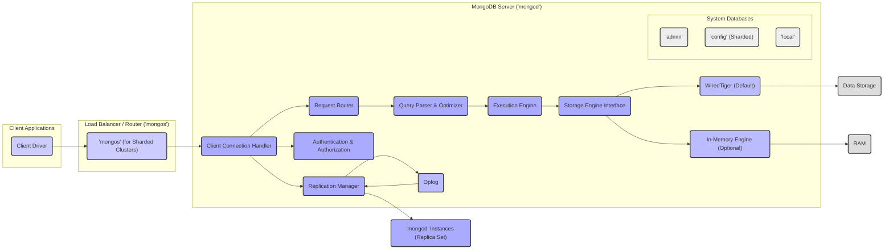
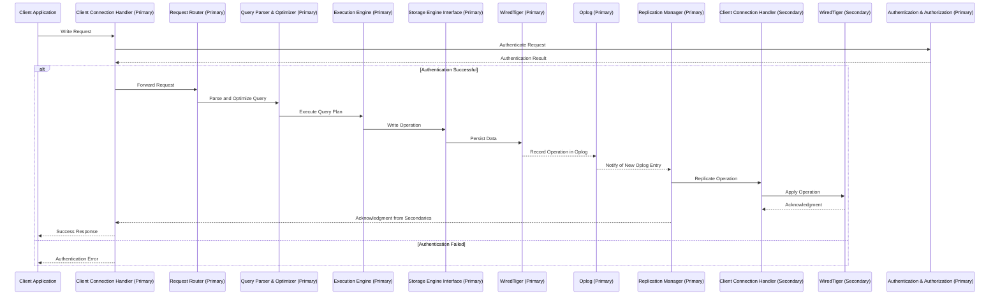
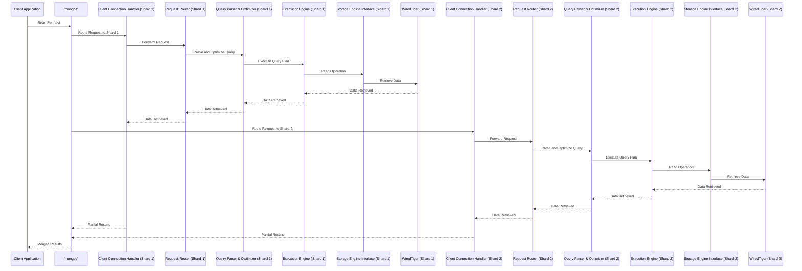

# Project Design Document: MongoDB Core Server (Improved)

**Project Name:** MongoDB Core Server

**Project Repository:** https://github.com/mongodb/mongo

**Document Version:** 1.1

**Date:** October 26, 2023

**Author:** AI Software Architect

## 1. Introduction

This document provides an enhanced architectural overview of the core MongoDB server, based on the codebase found in the provided GitHub repository. It is specifically designed to serve as a robust foundation for subsequent threat modeling activities. The document details key components, data flows, and interactions within the system, with a focus on identifying potential security concerns and attack surfaces.

## 2. Goals

* Deliver a clear, detailed, and threat-modeling-focused architectural overview of the MongoDB server.
* Precisely identify the major components, outlining their specific responsibilities and functionalities relevant to security.
* Thoroughly describe the key data flows and interactions, highlighting potential vulnerabilities at each stage.
* Serve as a comprehensive and actionable basis for identifying potential threats, vulnerabilities, and attack vectors during threat modeling sessions.

## 3. High-Level Architecture

The MongoDB server's architecture comprises several interconnected components working in concert to deliver database services. This diagram illustrates the primary elements and their relationships.

## 4. Component Details

This section provides a detailed breakdown of each key component, emphasizing functionalities relevant to security.

* **Client Drivers:**
    * Purpose: Provide language-specific libraries for applications to interact with MongoDB.
    * Responsibilities:
        * Establishing and managing connections to `mongod` or `mongos`.
        * Serializing and deserializing data between application formats and BSON.
        * Implementing authentication mechanisms.
        * Handling connection pooling and error handling.
    * Security Relevance: Vulnerabilities in drivers can expose applications to attacks. Incorrect implementation can lead to credential leaks or insecure connections.
* **`mongos` (for Sharded Clusters):**
    * Purpose: Acts as a query router and load balancer for sharded deployments.
    * Responsibilities:
        * Accepting client connections.
        * Routing queries to the appropriate shards based on the sharding key.
        * Merging results from multiple shards.
        * Enforcing authentication and authorization for the cluster.
    * Security Relevance: A compromised `mongos` can grant access to the entire sharded cluster. Improper routing can lead to data breaches.
* **`mongod` (MongoDB Server):**
    * Purpose: The core database process responsible for data storage and management.
    * Key Subcomponents:
        * **Client Connection Handler:**
            * Responsibilities: Accepting incoming client connections, managing connection state, handling initial authentication handshake.
            * Security Relevance: Vulnerabilities here can allow unauthorized connection attempts or denial-of-service attacks.
        * **Request Router:**
            * Responsibilities: Directing incoming requests to the appropriate internal components based on the request type.
            * Security Relevance: Improper routing could bypass security checks or expose internal functionalities.
        * **Query Parser & Optimizer:**
            * Responsibilities: Parsing client queries, validating syntax, constructing query plans, and optimizing execution for performance.
            * Security Relevance: Susceptible to NoSQL injection attacks if input is not properly sanitized. Optimization flaws could lead to performance degradation.
        * **Execution Engine:**
            * Responsibilities: Executing the optimized query plan, interacting with the storage engine to retrieve or modify data.
            * Security Relevance:  Bugs in the execution engine could lead to data corruption or unauthorized data access.
        * **Storage Engine Interface:**
            * Responsibilities: Providing an abstraction layer between the execution engine and the underlying storage engine.
            * Security Relevance:  Ensuring consistent security policies are enforced regardless of the storage engine in use.
        * **WiredTiger (Default Storage Engine):**
            * Responsibilities: Persistent storage of data on disk, providing features like concurrency control, compression, and encryption at rest.
            * Security Relevance:  Responsible for the security of data at rest. Proper configuration of encryption is crucial.
        * **In-Memory Engine (Optional):**
            * Responsibilities: Storing data in RAM for high-performance read operations. Data is not persistent across restarts by default.
            * Security Relevance:  Data in memory is vulnerable if the server is compromised. Suitable only for specific, non-sensitive use cases without persistence.
        * **Authentication & Authorization:**
            * Responsibilities: Verifying the identity of clients (authentication) and controlling access to resources based on roles and permissions (authorization). Supports various mechanisms like SCRAM-SHA-1, x.509 certificates, LDAP, and Kerberos.
            * Security Relevance:  Critical for preventing unauthorized access to the database. Weak authentication or authorization schemes are major vulnerabilities.
        * **Replication Manager:**
            * Responsibilities: Managing the replication process to maintain data consistency across replica set members. Handles election of primary nodes and synchronization of data.
            * Security Relevance:  Securing communication between replica set members is crucial. Compromise of one member could potentially affect others.
        * **Oplog (Operation Log):**
            * Responsibilities: A capped collection on the primary node that records all write operations. Used by secondary nodes to replicate data.
            * Security Relevance: Contains sensitive data modification history. Unauthorized access could reveal confidential information or be used for replay attacks.
* **System Databases:**
    * **`admin`:**
        * Purpose: Stores administrative information, including user credentials, roles, and server configuration settings.
        * Security Relevance: Highly sensitive data. Access should be strictly controlled.
    * **`config` (Sharded):**
        * Purpose: In sharded clusters, stores metadata about the cluster's configuration, including shard assignments and chunk ranges.
        * Security Relevance:  Compromise can lead to data loss or misrouting of queries.
    * **`local`:**
        * Purpose: Used for replication status, oplog, and other local server state information.
        * Security Relevance: Contains information about data replication, which could be exploited.

## 5. Data Flow Diagrams

These diagrams illustrate the flow of data for key operations, highlighting potential security checkpoints.

### 5.1. Authenticated Write Operation (Replica Set)

### 5.2. Read Operation (Sharded Cluster)

## 6. Security Considerations

This section elaborates on potential security concerns and recommended practices.

* **Authentication and Authorization:**
    * **Threats:** Brute-force attacks on credentials, unauthorized access due to weak passwords or default configurations, privilege escalation.
    * **Mitigations:** Enforce strong password policies, utilize multi-factor authentication, implement robust RBAC with the principle of least privilege, regularly review and audit user permissions. Consider using x.509 certificates or LDAP/Kerberos for centralized authentication.
* **Network Security:**
    * **Threats:** Man-in-the-middle attacks, eavesdropping on sensitive data, unauthorized access through open ports.
    * **Mitigations:** Always use TLS/SSL for all client-server and inter-node communication. Configure firewalls to restrict access to necessary ports. Consider using VPNs for added security in cloud environments.
* **Data at Rest Encryption:**
    * **Threats:** Unauthorized access to data if physical storage is compromised.
    * **Mitigations:** Enable encryption at rest using the built-in WiredTiger encryption feature or disk-level encryption. Securely manage encryption keys.
* **Data in Transit Encryption:**
    * **Threats:** Eavesdropping on sensitive data during transmission.
    * **Mitigations:** Enforce TLS/SSL for all network communication. Ensure proper certificate management.
* **Auditing:**
    * **Threats:** Lack of visibility into security events, making it difficult to detect and respond to breaches.
    * **Mitigations:** Enable and regularly review audit logs. Log authentication attempts, data access, and administrative actions. Integrate with security information and event management (SIEM) systems.
* **Input Validation:**
    * **Threats:** NoSQL injection attacks, where malicious code is injected through user inputs.
    * **Mitigations:** Sanitize and validate all user inputs on the application side and, where possible, on the server-side. Use parameterized queries or the aggregation framework to prevent injection.
* **Denial of Service (DoS) Protection:**
    * **Threats:** Resource exhaustion, making the database unavailable to legitimate users.
    * **Mitigations:** Implement connection limits, rate limiting, and query timeouts. Monitor server resources and configure alerts for unusual activity. Consider using a load balancer to distribute traffic.
* **Vulnerability Management:**
    * **Threats:** Exploitation of known vulnerabilities in MongoDB or its dependencies.
    * **Mitigations:** Regularly patch and update the MongoDB server and its drivers. Subscribe to security advisories and promptly address reported vulnerabilities.
* **Oplog Security:**
    * **Threats:** Unauthorized access to the oplog revealing sensitive data history or enabling replay attacks.
    * **Mitigations:** Restrict access to the `local` database and the oplog collection. Secure communication within the replica set.
* **External Dependencies:**
    * **Threats:** Vulnerabilities in the underlying operating system, libraries, or infrastructure.
    * **Mitigations:** Keep the operating system and all dependencies up-to-date with security patches. Follow security best practices for the underlying infrastructure.

## 7. Deployment Considerations

Security considerations vary based on the deployment architecture.

* **Standalone Server:**
    * Security heavily relies on securing the single server instance.
    * Focus on strong local authentication, network security (firewall), and data at rest encryption.
* **Replica Set:**
    * Secure communication between replica set members using keyfile authentication or x.509 certificates is critical.
    * Ensure proper network segmentation and access control for all members.
    * Consider the security implications of different voting configurations.
* **Sharded Cluster:**
    * Securing the `mongos` routers is paramount as they are the entry point.
    * Secure the configuration servers (`configsvr`) as they hold critical cluster metadata.
    * Implement authentication and authorization consistently across all shards.
    * Network segmentation between shards can enhance security.

## 8. Assumptions and Limitations

* This document provides a generalized view of the MongoDB core server. Specific features, configurations, and security mechanisms may differ based on the MongoDB version and deployment environment.
* The focus is primarily on the server-side architecture. Security practices within client applications are equally important but are not exhaustively covered here.
* This document serves as a foundation for threat modeling and does not encompass all aspects of the MongoDB project, such as the build process, testing methodologies, or client driver implementations in detail.

## 9. Next Steps

The immediate next step is to utilize this enhanced design document as the basis for a thorough threat modeling exercise. This will involve systematically identifying potential threats, vulnerabilities, and attack vectors based on the described architecture, data flows, and security considerations. The output of the threat modeling process will inform the prioritization of security enhancements and the implementation of appropriate mitigation strategies.