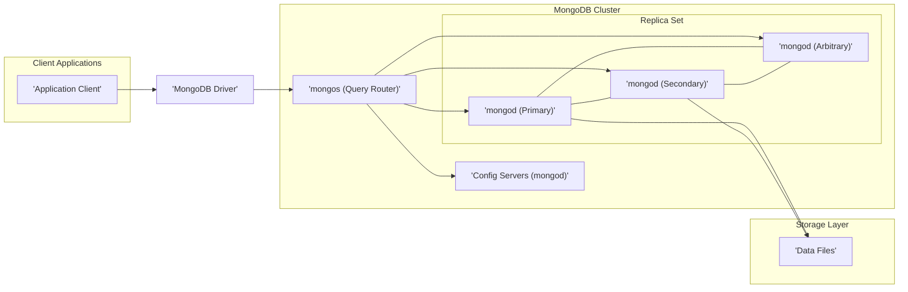

## Project Design Document: MongoDB (Improved)

**1. Introduction**

This document provides a detailed architectural overview of the MongoDB database system, intended to serve as a foundation for subsequent threat modeling activities. It meticulously outlines the key components, their interactions, and the flow of data within MongoDB. The focus is on the core database system and its primary interaction points, providing a comprehensive understanding for security analysis.

**2. Goals and Objectives**

The primary goal of this document is to furnish a clear, accurate, and comprehensive description of MongoDB's architecture. The specific objectives are to:

*   Thoroughly identify and describe the major components of the MongoDB system, including their specific roles and responsibilities.
*   Detail the interactions and data flow between these components for both read and write operations, considering different deployment scenarios.
*   Clearly outline the key functionalities and responsibilities of each component, emphasizing aspects relevant to security.
*   Provide a robust and detailed foundation for identifying potential security vulnerabilities, attack vectors, and areas of concern during subsequent threat modeling exercises.

**3. High-Level Architecture**

MongoDB is a distributed, document-oriented NoSQL database designed for scalability and flexibility. At a high level, it involves client applications interacting with a cluster of interconnected servers responsible for data storage, retrieval, and management.



**4. Detailed Architecture and Components**

The MongoDB architecture is composed of several distinct components that collaborate to provide database functionality:

*   **Client Applications:** These are software applications that initiate interactions with the MongoDB database to perform various operations, including creating, reading, updating, and deleting data. They rely on MongoDB drivers for communication.
*   **MongoDB Drivers:** These are officially supported libraries provided by MongoDB. They enable applications written in various programming languages to seamlessly interact with the database. Drivers handle connection pooling, request serialization into the BSON format, response deserialization, and error handling.
*   **`mongos` (Query Router):** This is a lightweight routing process that acts as an intelligent query router in sharded MongoDB deployments. It intercepts client requests, determines the appropriate shard(s) to handle the request based on the cluster's metadata, and routes the request accordingly. In non-sharded (replica set) deployments, `mongos` directs requests to the primary node. It also plays a role in aggregating results from multiple shards.
*   **`mongod` (Database Server):** This is the core database server process in MongoDB. Each `mongod` instance manages a subset of the overall data. `mongod` instances are organized into replica sets for high availability and can be further grouped into shards for horizontal scalability.
    *   **Primary Node:** Within a replica set, the primary node is responsible for receiving all write operations. It applies these operations to its local data and then replicates them to the secondary nodes. Only one primary exists in a replica set at any given time.
    *   **Secondary Nodes:** Secondary nodes in a replica set replicate data from the primary node. They provide data redundancy and can handle read operations, distributing the read load and improving performance.
    *   **Arbitrary Node:**  In a replica set, any secondary node can become the primary through an election process if the current primary becomes unavailable. Arbitrary nodes participate in these elections.
*   **Replica Set:** A fundamental building block for high availability in MongoDB. It's a group of `mongod` instances that maintain the same data set. If the primary node fails, one of the secondaries is automatically elected as the new primary, ensuring continuous operation.
*   **Config Servers:** In a sharded cluster, config servers are specialized `mongod` instances that hold the cluster's metadata. This metadata includes information about which data chunks reside on which shards. `mongos` instances query the config servers to determine the location of data for routing client requests. Config servers themselves are typically deployed as a replica set for high availability.
*   **Shards:** In a sharded cluster, data is horizontally partitioned across multiple replica sets, known as shards. Each shard contains a subset of the total data, allowing the database to scale horizontally to handle large datasets and high throughput.
*   **Data Files:** These are the physical files on the underlying storage system where MongoDB persists the actual database data. The specific format and organization of these files are managed by the chosen storage engine (e.g., WiredTiger).
*   **MongoDB Atlas (Optional):** This is MongoDB's fully managed cloud database service. While not a core component of the open-source MongoDB server software itself, it's a prevalent deployment option. Atlas handles infrastructure provisioning, scaling, backups, and security management.
*   **MongoDB Compass (Optional):** A graphical user interface (GUI) provided by MongoDB for interacting with and managing MongoDB databases. It allows users to visualize data, run queries, monitor server performance, and perform administrative tasks.

**5. Data Flow**

Understanding the flow of data is crucial for identifying potential vulnerabilities. Here's a breakdown of typical read and write operations:

*   **Write Operation:**
    1. The client application initiates a write operation (e.g., `insert`, `update`, `delete`) and sends the request to the MongoDB driver.
    2. The MongoDB driver establishes a connection with a `mongos` instance (in a sharded environment) or directly with the primary `mongod` instance in a replica set.
    3. If a `mongos` is involved, it examines the write operation and consults the config servers to determine the shard(s) responsible for the affected data.
    4. The `mongos` then routes the write request to the primary node of the target shard's replica set.
    5. The primary `mongod` on the target shard receives the write request.
    6. The primary `mongod` applies the write operation to its local data files, utilizing the configured storage engine.
    7. The primary `mongod` then initiates the replication process, sending the write operation to the secondary nodes within its replica set.
    8. The secondary nodes apply the replicated write operation to their local data files.
    9. Once a configurable write concern (specifying the number of nodes that must acknowledge the write) is satisfied, the primary `mongod` sends an acknowledgment back to the `mongos` (if present) or directly to the driver.
    10. The `mongos` (if involved) relays the acknowledgment back to the MongoDB driver.
    11. The MongoDB driver informs the client application that the write operation was successful.

*   **Read Operation:**
    1. The client application initiates a read operation (e.g., `find`) and sends the request to the MongoDB driver.
    2. The MongoDB driver connects to a `mongos` instance (in a sharded environment) or a `mongod` instance in a replica set. The specific target `mongod` is determined by the read preference settings (e.g., read from primary, secondary, or nearest).
    3. If a `mongos` is involved, it analyzes the read query and consults the config servers to identify the shard(s) containing the requested data.
    4. The `mongos` routes the read request to the appropriate `mongod` instance(s) on the target shard(s).
    5. The targeted `mongod` instance(s) execute the query against their local data.
    6. The `mongod` instance(s) return the query results to the `mongos` (if present).
    7. If the query involved multiple shards, the `mongos` aggregates the results from the different shards and returns the combined result set to the driver.
    8. The MongoDB driver deserializes the results and provides them to the client application.

```mermaid
sequenceDiagram
    participant "Client Application" as CA
    participant "MongoDB Driver" as MD
    participant "mongos" as MONGOS
    participant "mongod (Primary)" as MP
    participant "mongod (Secondary)" as MS

    group Write Operation
        CA->>MD: Write Request
        MD->>MONGOS: Write Request
        MONGOS->>MP: Write Request
        MP->>MS: Replicate Write
        MP-->>MONGOS: Acknowledge Write
        MONGOS-->>MD: Acknowledge Write
        MD-->>CA: Write Success
    end

    group Read Operation
        CA->>MD: Read Request
        MD->>MONGOS: Read Request
        MONGOS->>MP: Read Request
        MP-->>MONGOS: Query Results
        MONGOS-->>MD: Query Results
        MD-->>CA: Query Results
    end
```

**6. Security Considerations (Relevant for Threat Modeling)**

While the primary focus of this document is architectural design, it's crucial to highlight key security considerations that will be central to subsequent threat modeling efforts:

*   **Authentication and Authorization:** MongoDB employs a robust role-based access control (RBAC) system. Authentication verifies the identity of clients and internal components, while authorization determines the specific actions each authenticated entity is permitted to perform on database resources. Proper configuration and management of users and roles are essential.
*   **Network Security:** Securing network communication channels is paramount. This includes utilizing TLS/SSL encryption for all communication between clients and the database, as well as between the nodes within the MongoDB cluster. Network segmentation and firewall rules are also critical for limiting access.
*   **Data Encryption:** MongoDB supports encryption at rest, allowing for the encryption of data files on the underlying storage. It also supports encryption in transit through TLS/SSL. Implementing both is crucial for protecting sensitive data.
*   **Auditing:** MongoDB provides comprehensive auditing capabilities, allowing administrators to track database events, including authentication attempts, data modifications, and administrative actions. These audit logs are invaluable for security monitoring, incident response, and compliance.
*   **Input Validation:**  Protecting against injection attacks (e.g., NoSQL injection) requires rigorous validation and sanitization of all data received from client applications before it is processed by the database.
*   **Access Control to Configuration:**  Restricting access to the config servers in a sharded cluster and the overall cluster configuration is vital. Unauthorized modifications to the configuration can have significant security implications.
*   **Driver Security:**  Ensuring the security and integrity of the MongoDB drivers used by applications is crucial. Vulnerable drivers can introduce security risks at the application level. Keeping drivers up-to-date and using official, verified drivers is recommended.
*   **Secure Defaults and Hardening:**  Properly configuring MongoDB with secure defaults and implementing security hardening measures (e.g., disabling unnecessary features, limiting network exposure) is essential for minimizing the attack surface.

**7. Deployment Considerations**

MongoDB offers flexibility in deployment options, each with its own security implications:

*   **Standalone:** A single `mongod` instance. While simple to set up, it lacks redundancy and is generally not recommended for production environments due to the single point of failure. Security relies solely on the configuration of that single instance.
*   **Replica Set:** Provides high availability and data redundancy. This is the recommended configuration for most production deployments. Security considerations include securing communication between replica set members and proper access control.
*   **Sharded Cluster:** Designed for horizontal scalability. Security considerations are more complex due to the distributed nature, requiring secure communication between all components (clients, `mongos` instances, config servers, and shard replica sets).
*   **Cloud Deployments (e.g., MongoDB Atlas):**  Offloads infrastructure management and some security responsibilities to the cloud provider. However, users are still responsible for configuring access controls, network settings, and data encryption within the managed service.

**8. Technologies Used**

*   **Programming Languages (Server):** Primarily C++, with some components in JavaScript (for server-side scripting and the `mongo` shell).
*   **Storage Engines:** WiredTiger (the default storage engine offering document-level locking and compression), MMAPv1 (an older storage engine, now deprecated).
*   **Communication Protocols:** TCP/IP for network communication, the MongoDB Wire Protocol (a binary protocol for communication between clients and servers).
*   **Operating Systems:**  Supports a wide range of operating systems, including various Linux distributions, Windows Server, and macOS.

This improved design document provides a more detailed and nuanced understanding of the MongoDB architecture, emphasizing aspects relevant to security. This enhanced information will be invaluable for conducting thorough and effective threat modeling exercises to proactively identify and mitigate potential security risks.