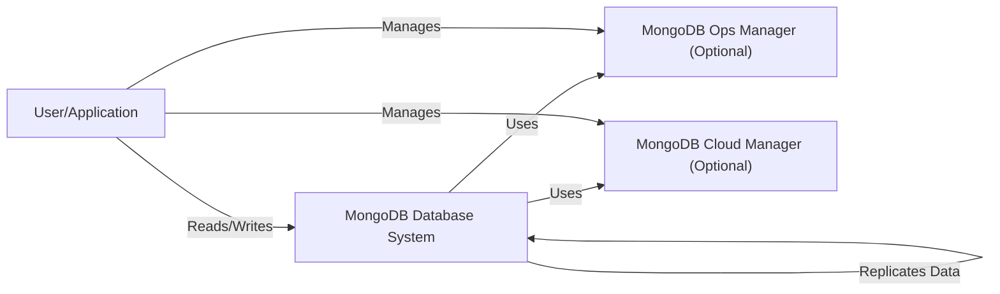
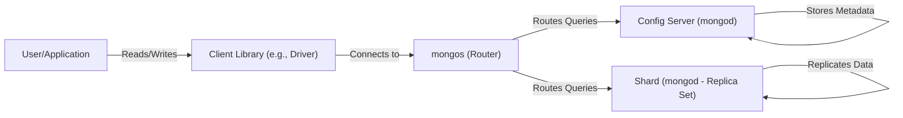
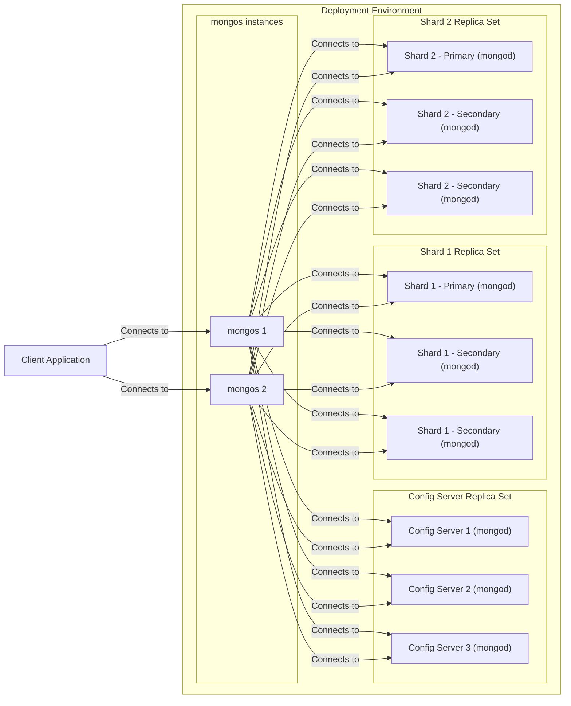
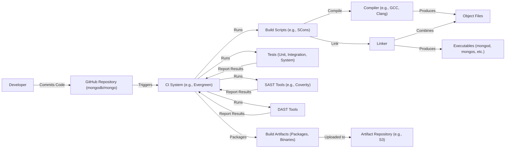

Okay, let's create a design document for the MongoDB project, focusing on aspects relevant for threat modeling.

# BUSINESS POSTURE

MongoDB is a widely used, open-source, document-oriented NoSQL database.  It's designed for scalability, flexibility, and high performance, catering to a broad range of applications from small startups to large enterprises.  Given its widespread adoption, the project's business posture centers around maintaining trust, ensuring data integrity, and providing a reliable and secure database solution.

Business Priorities and Goals:

*   Maintain and grow user trust and adoption.
*   Provide a high-performance, scalable, and reliable database.
*   Ensure data integrity and availability.
*   Offer a flexible schema design to accommodate evolving application needs.
*   Provide robust security features to protect sensitive data.
*   Foster a vibrant open-source community.
*   Offer commercial support and enterprise features.

Most Important Business Risks:

*   Data breaches or loss leading to reputational damage and loss of customer trust.
*   Service unavailability or performance degradation impacting user applications.
*   Vulnerabilities that could be exploited by attackers to gain unauthorized access or control.
*   Failure to comply with relevant data privacy regulations (e.g., GDPR, CCPA).
*   Competition from other database solutions (both NoSQL and relational).
*   Supply chain attacks that compromise the integrity of the MongoDB software.

# SECURITY POSTURE

MongoDB incorporates various security controls and addresses several risks.  However, as with any complex software, there are always areas for improvement and ongoing vigilance.

Existing Security Controls:

*   security control: Authentication: MongoDB supports various authentication mechanisms, including SCRAM (Salted Challenge Response Authentication Mechanism), x.509 certificates, and integration with external authentication providers like LDAP and Kerberos. Described in the MongoDB documentation and implemented in the server and client components.
*   security control: Authorization: Role-Based Access Control (RBAC) allows granular control over user permissions, limiting access to specific databases, collections, and operations. Described in the MongoDB documentation and implemented in the server.
*   security control: TLS/SSL Encryption: Network traffic between clients and servers, as well as between server nodes (in a replica set or sharded cluster), can be encrypted using TLS/SSL. Described in the MongoDB documentation and implemented in the server and client components.
*   security control: Auditing: MongoDB can log various events, including authentication attempts, authorization failures, and database operations, to facilitate security monitoring and forensics. Described in the MongoDB documentation and implemented in the server.
*   security control: Encryption at Rest: MongoDB Enterprise Advanced offers encryption at rest using a key management system (KMIP) or local key management. Described in the MongoDB documentation and implemented in the server.
*   security control: Client-Side Field Level Encryption (CSFLE): Allows applications to encrypt sensitive fields before sending data to the server. Described in the MongoDB documentation and implemented in the client libraries and server.
*   security control: Security Technical Implementation Guides (STIGs): MongoDB provides STIGs to help users configure the database securely according to industry best practices. Described in the MongoDB documentation.
*   security control: Regular Security Assessments and Penetration Testing: MongoDB Inc. likely conducts regular security assessments and penetration testing to identify and address vulnerabilities. Implemented by MongoDB Inc. security team.

Accepted Risks:

*   accepted risk: Default Configuration: The default MongoDB configuration may not be fully secure, requiring users to explicitly configure security settings.
*   accepted risk: Community Edition Limitations: The Community Edition lacks some advanced security features available in the Enterprise Advanced edition (e.g., encryption at rest).
*   accepted risk: Complexity of Configuration: Securely configuring MongoDB, especially in complex deployments (e.g., sharded clusters), can be challenging and requires significant expertise.
*   accepted risk: User Responsibility: Ultimately, the security of a MongoDB deployment depends heavily on the user's configuration and operational practices.

Recommended Security Controls:

*   Implement a robust vulnerability management program with regular scanning and patching.
*   Enforce strong password policies and multi-factor authentication (MFA) where possible.
*   Regularly review and update RBAC roles to ensure least privilege.
*   Implement network segmentation to isolate MongoDB deployments from other systems.
*   Monitor audit logs for suspicious activity and implement alerting mechanisms.
*   Consider using a Web Application Firewall (WAF) to protect against application-layer attacks.

Security Requirements:

*   Authentication:
    *   Support for strong authentication mechanisms (e.g., SCRAM, x.509).
    *   Integration with external identity providers (LDAP, Kerberos).
    *   Enforcement of strong password policies.
    *   Support for multi-factor authentication (MFA).

*   Authorization:
    *   Granular Role-Based Access Control (RBAC).
    *   Principle of least privilege.
    *   Ability to define custom roles.

*   Input Validation:
    *   Server-side validation of data types and formats.
    *   Protection against injection attacks (e.g., NoSQL injection).
    *   Use of parameterized queries or a similar mechanism to prevent injection.

*   Cryptography:
    *   TLS/SSL encryption for network communication.
    *   Encryption at rest (for sensitive data).
    *   Secure key management.
    *   Use of strong, industry-standard cryptographic algorithms.
    *   Client-Side Field Level Encryption (CSFLE) support.

# DESIGN

## C4 CONTEXT

Element Descriptions:

*   Element:
    *   Name: User/Application
    *   Type: External Entity (User or Application)
    *   Description: Represents any user or application that interacts with the MongoDB database.
    *   Responsibilities: Sending queries, inserting data, updating data, deleting data, performing administrative tasks.
    *   Security controls: Authentication, Authorization (through MongoDB's RBAC), TLS/SSL encryption (for network communication).

*   Element:
    *   Name: MongoDB Database System
    *   Type: System
    *   Description: The core MongoDB database system, including mongod and mongos processes.
    *   Responsibilities: Storing data, processing queries, managing replication, enforcing security policies.
    *   Security controls: Authentication, Authorization (RBAC), TLS/SSL encryption, Auditing, Encryption at Rest (Enterprise Advanced), CSFLE.

*   Element:
    *   Name: MongoDB Ops Manager (Optional)
    *   Type: System
    *   Description: An on-premises management platform for MongoDB deployments.
    *   Responsibilities: Monitoring, automation, backup, and recovery.
    *   Security controls: Authentication, Authorization, TLS/SSL encryption, Auditing.

*   Element:
    *   Name: MongoDB Cloud Manager (Optional)
    *   Type: System
    *   Description: A cloud-based management platform for MongoDB deployments.
    *   Responsibilities: Monitoring, automation, backup, and recovery.
    *   Security controls: Authentication, Authorization, TLS/SSL encryption, Auditing.

## C4 CONTAINER

Element Descriptions:

*   Element:
    *   Name: User/Application
    *   Type: External Entity
    *   Description: Represents any user or application that interacts with the MongoDB database.
    *   Responsibilities: Sending queries, inserting data, updating data, deleting data.
    *   Security controls: Authentication, Authorization (through MongoDB's RBAC), TLS/SSL encryption (for network communication).

*   Element:
    *   Name: Client Library (e.g., Driver)
    *   Type: Container
    *   Description: Provides an interface for applications to interact with MongoDB.
    *   Responsibilities: Connecting to the database, serializing/deserializing data, executing commands.
    *   Security controls: Authentication, TLS/SSL encryption, CSFLE support.

*   Element:
    *   Name: mongos (Router)
    *   Type: Container
    *   Description: A routing service for sharded clusters; directs client requests to the appropriate shard(s).
    *   Responsibilities: Routing queries, aggregating results, maintaining cluster metadata.
    *   Security controls: Authentication, Authorization, TLS/SSL encryption, Auditing.

*   Element:
    *   Name: Config Server (mongod)
    *   Type: Container
    *   Description: Stores metadata about the sharded cluster.
    *   Responsibilities: Maintaining cluster configuration, tracking shard locations.
    *   Security controls: Authentication, Authorization, TLS/SSL encryption, Auditing, Encryption at Rest (Enterprise Advanced).

*   Element:
    *   Name: Shard (mongod - Replica Set)
    *   Type: Container
    *   Description: A replica set that stores a subset of the sharded data.
    *   Responsibilities: Storing data, processing queries, replicating data.
    *   Security controls: Authentication, Authorization, TLS/SSL encryption, Auditing, Encryption at Rest (Enterprise Advanced), CSFLE.

## DEPLOYMENT

MongoDB can be deployed in various ways:

1.  **Standalone:** A single mongod instance.  Simple but lacks high availability.
2.  **Replica Set:**  Multiple mongod instances with automatic failover.  Provides high availability and data redundancy.
3.  **Sharded Cluster:**  Data is distributed across multiple replica sets (shards).  Provides horizontal scalability and high availability.
4.  **MongoDB Atlas:**  A fully managed cloud database service.

We'll describe a sharded cluster deployment on self-managed infrastructure (e.g., VMs or bare-metal servers).

Element Descriptions:

*   Element:
    *   Name: Config Server 1/2/3 (mongod)
    *   Type: Node (Virtual Machine or Physical Server)
    *   Description: Hosts a mongod instance configured as a config server.
    *   Responsibilities: Storing cluster metadata.
    *   Security controls: OS-level security (firewall, access controls), MongoDB security (authentication, authorization, TLS/SSL, auditing, encryption at rest).

*   Element:
    *   Name: Shard 1/2 - Primary/Secondary (mongod)
    *   Type: Node (Virtual Machine or Physical Server)
    *   Description: Hosts a mongod instance configured as a shard replica set member.
    *   Responsibilities: Storing data, processing queries, replicating data.
    *   Security controls: OS-level security, MongoDB security (authentication, authorization, TLS/SSL, auditing, encryption at rest, CSFLE).
*   Element:
    *   Name: mongos 1/2
    *   Type: Node (Virtual Machine or Physical Server)
    *   Description: Hosts a mongos instance.
    *   Responsibilities: Routing queries.
    *   Security controls: OS-level security, MongoDB security (authentication, authorization, TLS/SSL, auditing).

*   Element:
    *   Name: Client Application
    *   Type: External Entity
    *   Description: Represents an application connecting to the MongoDB cluster.
    *   Responsibilities: Sending requests to the database.
    *   Security controls: Application-level security, secure connection to mongos (TLS/SSL).

## BUILD

MongoDB's build process is complex and involves multiple stages, tools, and repositories.  We'll focus on the core aspects relevant to security.

Security Controls in the Build Process:

*   Source Code Management (GitHub): Access controls, code review processes, branch protection rules.
*   Continuous Integration (CI) System (Evergreen): Automated builds, testing, and security checks triggered by code commits.
*   Build Scripts (SCons): Define the build process, including compilation, linking, and packaging.
*   Compiler and Linker: Standard tools with security hardening options (e.g., stack protection, address space layout randomization).
*   Tests: Unit, integration, and system tests to verify functionality and identify potential security issues.
*   Static Application Security Testing (SAST): Tools like Coverity are used to analyze the source code for vulnerabilities.
*   Dynamic Application Security Testing (DAST): Tools are used to test the running application for vulnerabilities.
*   Artifact Repository: Secure storage for build artifacts.
*   Supply Chain Security: Efforts are likely made to ensure the integrity of dependencies and build tools, although this is an ongoing challenge for all open-source projects.

# RISK ASSESSMENT

Critical Business Processes:

*   Data storage and retrieval: The core function of MongoDB is to store and retrieve data reliably and efficiently.
*   Data consistency and integrity: Ensuring that data remains accurate and consistent, even in the face of failures.
*   High availability and scalability: Providing continuous access to data and the ability to scale to meet growing demands.
*   User authentication and authorization: Controlling access to data and preventing unauthorized access.

Data Sensitivity:

MongoDB can store a wide range of data, from non-sensitive public information to highly sensitive personal data, financial records, and intellectual property. The sensitivity of the data depends entirely on the user's application. Therefore, MongoDB deployments must be configured to handle the *most sensitive* data they might contain.

Data Sensitivity Levels:

*   Public: Non-sensitive data that can be freely shared.
*   Internal: Data that is not intended for public access but is not highly sensitive.
*   Confidential: Sensitive data that requires protection from unauthorized access.
*   Restricted: Highly sensitive data that requires the highest level of protection, potentially including encryption at rest and in transit, strict access controls, and auditing.

# QUESTIONS & ASSUMPTIONS

Questions:

*   What specific compliance requirements (e.g., GDPR, HIPAA, PCI DSS) apply to the intended use cases of this MongoDB deployment?
*   What is the expected data volume and growth rate?
*   What are the performance requirements (e.g., latency, throughput)?
*   What is the acceptable downtime window?
*   What is the budget for security controls and infrastructure?
*   What are the specific threat actors and attack vectors of greatest concern?
*   What level of detail is available regarding the internal workings of MongoDB's Evergreen CI/CD system?
*   What specific DAST tools are used, and how are they integrated into the build process?
*   What are the specific procedures for handling security vulnerabilities discovered in MongoDB?
*   What mechanisms are in place to ensure the integrity of third-party dependencies used by MongoDB?

Assumptions:

*   BUSINESS POSTURE: We assume a high level of concern for security and data protection, given MongoDB's widespread use and the potential for storing sensitive data. We assume a moderate to low risk appetite, balancing the need for innovation with the importance of maintaining trust.
*   SECURITY POSTURE: We assume that MongoDB Inc. follows industry best practices for secure software development and has a dedicated security team. We assume that users are responsible for properly configuring and securing their MongoDB deployments.
*   DESIGN: We assume a sharded cluster deployment for high availability and scalability. We assume the use of standard security features like authentication, authorization, and TLS/SSL encryption. We assume that the build process includes automated security checks (SAST and DAST). We assume that users will follow MongoDB's security recommendations and best practices.