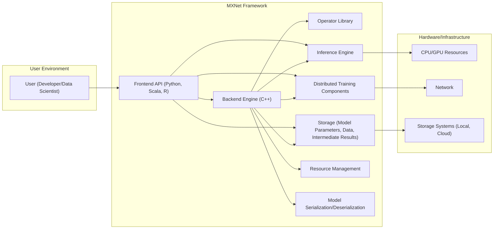
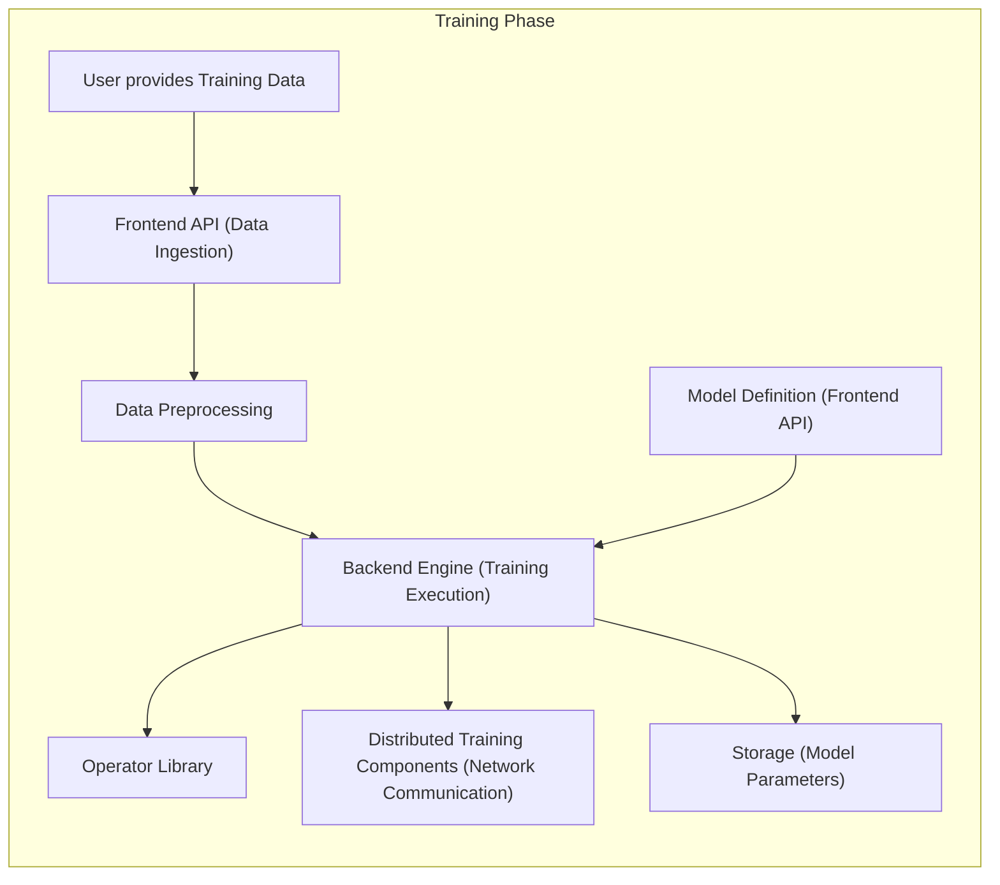
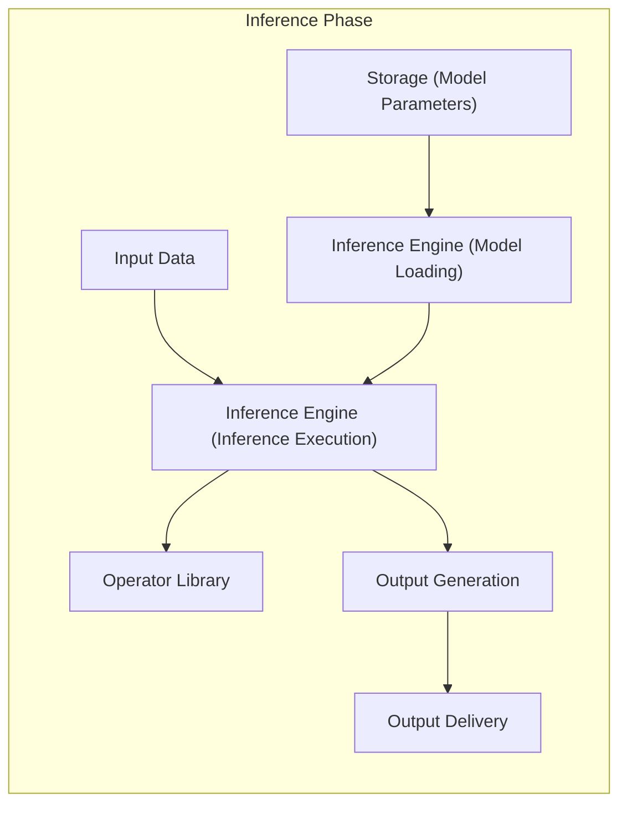

# Project Design Document: Apache MXNet

**Version:** 1.1
**Date:** October 26, 2023
**Author:** Gemini (AI Language Model)

## 1. Introduction

This document provides an enhanced high-level design overview of the Apache MXNet (incubating) project, specifically tailored for threat modeling. It aims to provide a detailed description of the key components, architecture, and data flow within the system, with a strong emphasis on security-relevant aspects. This document will serve as a robust foundation for subsequent threat modeling activities.

## 2. Goals and Objectives

*   Provide a clear, concise, and detailed description of the Apache MXNet architecture, focusing on elements relevant to security.
*   Identify the major components and their interactions, highlighting potential trust boundaries and data exchange points.
*   Outline the data flow within the system, including specific data transformations, storage mechanisms, and potential points of interception or manipulation.
*   Elaborate on key security-relevant aspects of the design, providing concrete examples of potential threats and vulnerabilities.
*   Serve as a comprehensive and actionable basis for identifying potential threats, vulnerabilities, and attack vectors.

## 3. High-Level Architecture

Apache MXNet is a versatile deep learning framework designed for training and deploying neural networks across diverse hardware and software environments. Its architecture is layered, with a high-performance C++ backend and user-friendly frontend APIs in languages like Python, Scala, and R. This separation allows for flexibility and performance optimization.

## 4. Key Components

*   **Frontend API (Python, Scala, R):**
    *   Provides the primary interface for users to interact with MXNet, enabling the definition, training, and deployment of neural networks.
    *   Responsible for parsing user input (code, data configurations), translating it into instructions for the backend engine.
    *   Presents results and feedback to the user.
    *   Security Relevance: Vulnerable to code injection if not properly sanitizing user inputs. Can be a point of access control enforcement.
*   **Backend Engine (C++):**
    *   The core computational engine of MXNet, responsible for the heavy lifting of executing neural network operations.
    *   Manages memory allocation, scheduling of operations, and parallel execution across available hardware resources.
    *   Provides a low-level interface for implementing custom operators and extending the framework's functionality.
    *   Security Relevance: Potential for memory corruption vulnerabilities if not carefully implemented. Access control to internal resources is critical.
*   **Operator Library:**
    *   A comprehensive collection of pre-built, optimized neural network operations (e.g., convolution, activation functions, matrix multiplications, loss functions).
    *   Optimized for different hardware architectures (CPUs, GPUs).
    *   Extensible, allowing developers to add custom operators, which introduces potential security risks if not reviewed and validated.
    *   Security Relevance: Custom operators can introduce vulnerabilities if they contain bugs or malicious code.
*   **Storage (Model Parameters, Data, Intermediate Results):**
    *   Used to persistently store trained model parameters (weights and biases), training datasets, and intermediate results during the training process.
    *   Can interact with various storage systems, including local file systems, network file systems, and cloud storage services (e.g., AWS S3, Azure Blob Storage).
    *   Security Relevance: Requires robust access control mechanisms to protect sensitive model parameters and training data. Vulnerable to unauthorized access, modification, or deletion.
*   **Distributed Training Components:**
    *   Enables the parallel training of neural networks across multiple devices (CPUs, GPUs, machines) to accelerate the training process.
    *   Includes mechanisms for data parallelism (distributing data across workers) and model parallelism (distributing the model across workers).
    *   Relies on network communication for synchronizing gradients and model parameters between participating nodes.
    *   Security Relevance: Network communication needs to be secured (e.g., using TLS) to prevent eavesdropping and tampering. Authentication and authorization are crucial for participating nodes.
*   **Inference Engine:**
    *   Optimized for deploying trained models for making predictions (inference) in production environments.
    *   Designed for low latency and high throughput.
    *   Can be deployed on various platforms, including servers, edge devices, and mobile platforms.
    *   Security Relevance: Requires protection against adversarial inputs designed to cause incorrect predictions or denial of service. Access control to the deployed model is important.
*   **Resource Management:**
    *   Responsible for managing and allocating computational resources (CPU, GPU memory) required for training and inference.
    *   May involve scheduling tasks and prioritizing resource allocation.
    *   Security Relevance: Vulnerable to resource exhaustion attacks if not properly managed. Access control to resource management functions is important.
*   **Model Serialization/Deserialization:**
    *   Handles the process of saving trained models to persistent storage (serialization) and loading them back into memory (deserialization).
    *   Supports various model formats.
    *   Security Relevance: Deserialization of untrusted model files can lead to arbitrary code execution vulnerabilities. Model integrity checks are necessary.

## 5. Data Flow

The data flow within MXNet encompasses both the training and inference phases, each with distinct characteristics and security considerations.

### 5.1. Training Data Flow

*   **Data Ingestion:**
    *   Users provide training data through the Frontend API.
    *   Data sources can include:
        *   Local files (e.g., CSV, images, text files) - *Security Relevance: Potential for malicious files to be introduced.*
        *   Cloud storage (e.g., AWS S3, Azure Blob Storage, Google Cloud Storage) - *Security Relevance: Relies on the security of the cloud storage provider and proper access controls.*
        *   Data pipelines (e.g., Apache Spark, Apache Kafka) - *Security Relevance: Introduces dependencies on the security of these external systems.*
        *   Databases (e.g., SQL, NoSQL) - *Security Relevance: Requires secure database connections and proper authentication.*
*   **Data Preprocessing:**
    *   The Frontend API or user-defined functions handle data transformations such as normalization, augmentation, cleaning, and feature engineering.
    *   *Security Relevance: Malicious preprocessing steps could corrupt data or introduce vulnerabilities.*
    *   Data is often loaded into memory or processed in batches for efficiency.
    *   *Security Relevance: Sensitive data in memory needs to be protected.*
*   **Model Definition:**
    *   Users define the neural network architecture using the Frontend API (e.g., using symbolic or imperative approaches).
    *   This definition is translated into a computational graph representing the network structure and operations.
    *   *Security Relevance: Malicious model definitions could lead to unexpected behavior or resource exhaustion.*
*   **Training Execution:**
    *   The Backend Engine executes the computational graph.
    *   Operators from the Operator Library perform the necessary computations on the training data.
    *   Gradients are calculated using backpropagation algorithms.
    *   Model parameters are updated based on the calculated gradients using optimization algorithms.
    *   Distributed training components manage parallel execution and parameter synchronization across multiple devices, involving network communication.
    *   *Security Relevance: Secure communication channels are essential for distributed training to prevent eavesdropping and tampering with gradients.*
*   **Model Storage:**
    *   Trained model parameters (weights and biases) are serialized and saved to storage.
    *   Common storage formats include JSON, Protocol Buffers, or custom binary formats.
    *   Storage locations can be local file systems, network storage, or cloud storage.
    *   *Security Relevance: Model files need to be protected from unauthorized access, modification, and deletion. Integrity checks can help detect tampering.*

### 5.2. Inference Data Flow

*   **Model Loading:**
    *   The trained model is deserialized and loaded from storage into the Inference Engine's memory.
    *   *Security Relevance: Loading untrusted model files can lead to code execution vulnerabilities.*
*   **Data Ingestion:**
    *   Input data for prediction is provided to the Inference Engine.
    *   Data sources can vary depending on the deployment scenario:
        *   Web requests - *Security Relevance: Vulnerable to web application security threats.*
        *   Sensor data - *Security Relevance: Requires secure communication channels with sensors.*
        *   Application input - *Security Relevance: Depends on the security of the calling application.*
*   **Inference Execution:**
    *   The Inference Engine performs forward propagation through the neural network using the loaded model parameters.
    *   Operators from the Operator Library perform the necessary computations on the input data.
    *   *Security Relevance: Potential for adversarial inputs to cause incorrect predictions or denial of service.*
*   **Output Generation:**
    *   The Inference Engine generates predictions or classifications based on the input data.
    *   *Security Relevance: Output data may contain sensitive information and needs to be handled securely.*
*   **Output Delivery:**
    *   The output is returned to the user or application.
    *   Delivery mechanisms can include API responses, message queues, or direct integration with other systems.
    *   *Security Relevance: Secure communication channels are needed for delivering output, especially if it contains sensitive information.*

## 6. Security Considerations

This section provides a more detailed examination of potential security considerations relevant to threat modeling, including specific examples and potential attack vectors.

*   **Input Validation:**
    *   The Frontend API must rigorously validate all user-provided data (training data, model definitions, configuration parameters) to prevent injection attacks (e.g., SQL injection, command injection) and unexpected behavior.
    *   Example: Maliciously crafted input data could exploit vulnerabilities in data loading or preprocessing routines.
    *   Sanitization and type checking are crucial.
*   **Authentication and Authorization:**
    *   Implement robust authentication and authorization mechanisms to control access to sensitive resources and operations, especially in distributed training environments.
    *   Example: Unauthorized access to training infrastructure could allow attackers to steal models or inject malicious code.
    *   Consider using strong authentication protocols (e.g., OAuth 2.0) and role-based access control (RBAC).
*   **Data Security:**
    *   Protect training data and model parameters at rest and in transit using encryption.
    *   Example: Unencrypted training data stored on disk is vulnerable to theft.
    *   Utilize encryption algorithms like AES for data at rest and TLS/SSL for data in transit. Implement access controls to restrict access to sensitive data.
*   **Dependency Management:**
    *   Maintain a comprehensive inventory of all third-party libraries and dependencies used by MXNet. Regularly scan for known vulnerabilities and apply necessary updates and patches.
    *   Example: A vulnerability in a dependency could be exploited to compromise the entire MXNet installation.
    *   Use dependency management tools and vulnerability scanners.
*   **Model Security:**
    *   Protect trained models as valuable intellectual property. Implement measures to prevent unauthorized access, copying, or modification.
    *   Example: Competitors could steal trained models to gain an unfair advantage.
    *   Consider model encryption, watermarking, and access control mechanisms for model repositories.
*   **Network Security:**
    *   Secure network communication between MXNet components, especially in distributed training and inference deployments.
    *   Example: Unencrypted network traffic could allow attackers to eavesdrop on sensitive data or intercept model parameters.
    *   Enforce the use of secure protocols like TLS/SSL. Implement firewall rules and network segmentation to isolate MXNet components.
*   **Code Injection:**
    *   Exercise extreme caution when allowing users to define custom operators or layers. Thoroughly review and validate any custom code to prevent code injection vulnerabilities.
    *   Example: A malicious custom operator could execute arbitrary code on the system.
    *   Implement sandboxing or code signing mechanisms for custom operators.
*   **Supply Chain Security:**
    *   Verify the integrity of the MXNet distribution and its dependencies to ensure they have not been tampered with. Use trusted sources for downloads and verify cryptographic signatures.
    *   Example: A compromised MXNet installation could contain backdoors or malware.
*   **Denial of Service (DoS):**
    *   Implement measures to protect MXNet services from denial-of-service attacks that could disrupt training or inference.
    *   Example: An attacker could flood the inference service with requests, making it unavailable.
    *   Implement rate limiting, resource quotas, and input validation to mitigate DoS risks.
*   **Serialization/Deserialization Vulnerabilities:**
    *   Avoid deserializing untrusted model files or data, as this can lead to arbitrary code execution vulnerabilities.
    *   Example: A maliciously crafted model file could execute arbitrary code when loaded.
    *   Implement integrity checks (e.g., using cryptographic hashes) for serialized models.

## 7. Deployment Considerations

The security posture of MXNet can be significantly influenced by the deployment environment.

*   **Local Machine:** Suitable for development but generally lacks robust security features.
*   **On-Premise Servers:** Security relies on the organization's infrastructure security controls.
*   **Cloud Platforms:** Leverage cloud-specific security services (e.g., IAM, security groups, encryption services). Requires careful configuration and management of cloud security settings.
*   **Edge Devices:** Resource-constrained environments often require specialized security considerations, such as secure boot and firmware updates.

## 8. Future Considerations

*   **Federated Learning Security:** Addressing security and privacy challenges in federated learning scenarios, such as protecting participant data and preventing model poisoning attacks.
*   **Differential Privacy Integration:** Incorporating differential privacy techniques to enhance the privacy of training data by adding noise to prevent the identification of individual data points.
*   **Homomorphic Encryption:** Exploring the use of homomorphic encryption to perform computations on encrypted data, further enhancing data privacy.
*   **Hardware Security Modules (HSMs):** Utilizing HSMs to securely store cryptographic keys and perform sensitive operations.
*   **Trusted Execution Environments (TEEs):** Leveraging TEEs to create isolated and secure environments for executing sensitive code and protecting data.

This enhanced design document provides a more detailed and security-focused understanding of the Apache MXNet architecture, serving as a more robust foundation for comprehensive threat modeling activities. Further in-depth analysis of specific components and their interactions will be necessary to identify granular vulnerabilities and develop targeted mitigation strategies.
