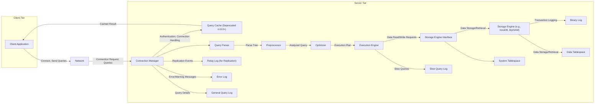

# Project Design Document: MySQL Database System for Threat Modeling

**Project Title:** MySQL Database System

**Project Repository:** [https://github.com/mysql/mysql](https://github.com/mysql/mysql)

**Document Version:** 1.1

**Date:** October 26, 2023

**Author:** AI Software Architect

## 1. Introduction

This document provides a detailed design overview of the MySQL database system, based on the publicly available source code repository. The primary purpose of this document is to serve as a foundation for subsequent threat modeling activities. It outlines the key components, architecture, data flow, and security features of MySQL to facilitate the identification of potential security vulnerabilities. This document focuses on the core database server (`mysqld`) and its directly interacting components.

## 2. System Architecture

### 2.1 High-Level Architecture

The MySQL system adheres to a client-server architecture. Client applications initiate connections to the MySQL server to execute queries and manage data. The server manages client connections, processes queries, handles data storage operations, and performs other database administration tasks.

### 2.2 Detailed Component Description

*   **Client Application:** Any software application (e.g., web application, desktop application, mobile app, command-line tool) that interacts with the MySQL database by sending SQL queries.
*   **Network:** The communication infrastructure (typically TCP/IP) over which clients establish connections and exchange data with the MySQL server.
*   **Connection Manager:**  The component responsible for accepting incoming client connection requests, handling the authentication process, managing connection resources (threads, memory), and enforcing connection limits.
*   **Query Cache (Deprecated in 8.0+):** (For versions prior to 8.0) A cache for storing the results of SELECT queries to improve performance by serving identical queries from the cache.
*   **Query Parser:** Analyzes incoming SQL queries, performs syntax validation, and constructs an internal representation of the query (parse tree).
*   **Preprocessor:** Performs semantic checks on the parsed query, such as verifying table and column existence and resolving aliases.
*   **Optimizer:** Analyzes the parsed query and generates an efficient execution plan by considering various factors like available indexes, table statistics, and join order.
*   **Execution Engine:** Executes the query plan generated by the optimizer, coordinating the interaction with the storage engine to retrieve or modify data.
*   **Storage Engine Interface:** An abstract layer that provides a consistent API for the execution engine to interact with different storage engines. This allows MySQL to support multiple storage engines with varying characteristics.
*   **Storage Engine (e.g., InnoDB, MyISAM):** The component responsible for the physical storage and retrieval of data on disk. Each engine implements its own methods for data organization, indexing, locking, and transaction management.
*   **Binary Log:** Records events that modify database data (e.g., INSERT, UPDATE, DELETE), as well as data definition language (DDL) statements. It's crucial for replication and point-in-time recovery.
*   **Relay Log (for Replication):** A log file on replica servers that stores events received from the master server's binary log. The replica server's SQL thread then executes these events.
*   **Error Log:** Records diagnostic information about the MySQL server, including errors, warnings, and startup/shutdown messages.
*   **General Query Log:** (If enabled) Logs all SQL statements received by the server. Useful for debugging but can generate a large volume of data.
*   **Slow Query Log:** (If enabled) Logs SQL statements that exceed a specified execution time. Helps identify performance bottlenecks.
*   **System Tablespace:** Contains metadata about the database system, such as table definitions, user privileges, stored procedures, and triggers.
*   **Data Tablespace:** Stores the actual data for user tables and indexes, managed by the active storage engine.

### 2.3 Data Flow

The typical data flow for processing a client query involves these steps:

1. A client application initiates a connection to the MySQL server over the network.
2. The **Connection Manager** accepts the connection, authenticates the client based on provided credentials, and establishes a session.
3. The client application sends an SQL query to the MySQL server.
4. The **Query Cache** (if enabled and applicable) checks if the exact query has been executed before and returns the cached result if found.
5. The **Query Parser** analyzes the SQL query for syntactic correctness and generates a parse tree.
6. The **Preprocessor** performs semantic analysis, resolving object names and checking permissions.
7. The **Optimizer** analyzes the parse tree and generates an optimal execution plan based on available indexes and data statistics.
8. The **Execution Engine** executes the plan, making requests to the **Storage Engine Interface**.
9. The chosen **Storage Engine** interacts with the **Data Tablespace** to retrieve or modify the requested data.
10. For data modification operations, the changes are logged in the **Binary Log**.
11. The results are sent back through the **Storage Engine Interface**, **Execution Engine**, **Connection Manager**, and **Network** to the client application.

For replication:

1. Changes made on the master server are recorded as events in the **Binary Log**.
2. The replica server's I/O thread connects to the master server and requests events from the master's **Binary Log**.
3. The master server sends the binary log events to the replica.
4. The replica server's I/O thread writes these received events to its local **Relay Log**.
5. The replica server's SQL thread reads the events from the **Relay Log** and executes them, applying the changes to the replica's **Data Tablespace**.

## 3. Key Components

### 3.1 MySQL Server (mysqld)

*   The core multithreaded server process that manages all database operations.
*   Responsible for handling client connections, query processing, security enforcement, and data access control.
*   Configuration is managed through server configuration files (e.g., `my.cnf`, `my.ini`) and command-line options.

### 3.2 Storage Engines

*   Pluggable components that handle data storage, retrieval, indexing, and transaction management.
*   Key storage engines include:
    *   **InnoDB:** The default storage engine in recent MySQL versions, offering ACID properties (Atomicity, Consistency, Isolation, Durability), row-level locking, and foreign key constraints.
    *   **MyISAM:** An older engine known for its speed in read-intensive workloads but lacks transaction support and row-level locking, using table-level locking instead.
    *   **Memory (Heap):** Stores data in memory, providing very fast access but data is lost upon server restart. Suitable for temporary tables.
    *   **CSV:** Stores data in plain text CSV files.
    *   **Archive:** Optimized for storing large amounts of historical data with compression.
*   Each engine has its own specific file format and internal mechanisms for data management and concurrency control.

### 3.3 Client Libraries and Connectors

*   Provide Application Programming Interfaces (APIs) for applications to connect to and interact with the MySQL server.
*   Available for a wide range of programming languages, including Python (e.g., `mysql-connector-python`), Java (e.g., JDBC driver), PHP (e.g., `mysqli`), C, C++, and others.
*   Handle connection establishment, secure communication (if configured), query execution, and result set retrieval.

### 3.4 Replication

*   A fundamental feature for data redundancy, high availability, read scaling, and backup strategies.
*   Operates by copying binary log events from a master server to one or more replica servers.
*   Different replication topologies exist, including master-slave and group replication.
*   Replication can be synchronous or asynchronous, impacting data consistency and performance.

### 3.5 Backup and Recovery

*   Essential for data protection and disaster recovery.
*   Methods include:
    *   **Logical Backups (e.g., `mysqldump`):** Generate SQL scripts containing the data and schema.
    *   **Physical Backups:** Copying the raw data files and log files.
    *   **Point-in-Time Recovery:** Using backups combined with binary logs to restore the database to a specific point in time.
*   Backup strategies should consider frequency, retention, and security of backup media.

### 3.6 Monitoring and Management Tools

*   Provide insights into the server's performance, health, and security.
*   Examples include:
    *   **MySQL Shell:** An interactive JavaScript and Python interface for managing MySQL.
    *   **mysqladmin:** A command-line utility for administering MySQL servers.
    *   **Performance Schema:** Provides detailed runtime information about server execution.
    *   **Information Schema:** Provides access to database metadata.
    *   Third-party monitoring tools (e.g., Prometheus, Grafana) that can integrate with MySQL.

## 4. Security Features

### 4.1 Authentication and Authorization

*   MySQL employs a robust privilege system to control access to database objects and operations.
*   Users are authenticated based on usernames, passwords, and optionally, client host information.
*   Authentication methods include native MySQL authentication plugins, Pluggable Authentication Modules (PAM), and external authentication services.
*   Authorization is managed through grants, which assign specific privileges (e.g., SELECT, INSERT, UPDATE, DELETE, CREATE, DROP) to users for specific database objects (databases, tables, columns, stored procedures).
*   Roles can be created to group privileges and simplify user management.

### 4.2 Encryption

*   Provides encryption for data in transit using Transport Layer Security (TLS/SSL) for client connections, protecting data confidentiality and integrity during network transmission.
*   Supports encryption at rest for data files and redo logs using features like Transparent Data Encryption (TDE), protecting sensitive data stored on disk.
*   Encryption functions are available within SQL for encrypting and decrypting data within the database.

### 4.3 Auditing

*   Offers mechanisms for tracking and logging database activity for security monitoring, compliance, and forensic analysis.
*   The audit log records events such as connection attempts, successful and failed logins, executed queries, and administrative actions.
*   Audit logging can be configured to log specific types of events and can be directed to different destinations (e.g., files, syslog).

### 4.4 Access Control

*   Fine-grained access control mechanisms allow administrators to precisely control user permissions at various levels (server, database, table, column).
*   Host-based access control restricts connections based on the client's IP address or hostname.
*   Mechanisms to limit resource usage by users (e.g., maximum connections, maximum queries per hour) help prevent denial-of-service attacks.
*   Secure password management practices, including password complexity requirements and password expiration policies, enhance security.

## 5. Deployment Considerations

*   MySQL can be deployed on a wide range of operating systems, including various Linux distributions, Windows Server, and macOS.
*   Common deployment architectures include:
    *   **Standalone Server:** A single instance of MySQL serving client requests.
    *   **Master-Slave Replication:** One master server accepting writes and one or more replica servers for read scaling and redundancy.
    *   **Group Replication:** A more advanced form of replication providing distributed consistency and fault tolerance.
    *   **MySQL NDB Cluster:** A shared-nothing clustered database system for high availability and scalability.
*   Deployment involves careful configuration of network settings, storage paths, security parameters, and resource allocation.

## 6. Technology Stack

*   **Programming Languages:** Primarily written in C and C++.
*   **Networking:** Uses TCP/IP for client-server communication.
*   **Operating Systems:** Compatible with various operating systems, including Linux, Windows, macOS, Solaris, and others.
*   **Storage Formats:** Depends on the active storage engine (e.g., `.ibd` files for InnoDB data and indexes, `.myd` and `.myi` files for MyISAM data and indexes).

## 7. Assumptions

*   This design document primarily focuses on the community edition of MySQL. Enterprise features may offer additional security capabilities.
*   The network infrastructure is assumed to be a potential attack vector and should be secured appropriately.
*   Client applications interacting with MySQL are assumed to have varying levels of security and may introduce vulnerabilities.
*   The underlying operating system and hardware infrastructure are assumed to have their own potential vulnerabilities that need to be addressed separately.

## 8. Out of Scope

*   Detailed analysis of specific client applications and their security implementations.
*   In-depth security assessment of the underlying operating system and hardware.
*   Third-party plugins, extensions, and management tools not part of the core MySQL distribution.
*   Detailed internal implementation specifics of individual storage engines beyond their general security characteristics.
*   Specific cloud provider managed MySQL services (e.g., AWS RDS for MySQL, Azure Database for MySQL), although the core concepts remain relevant.

## 9. Threat Modeling Focus Areas

Based on the architecture, components, and data flow described, the following areas should be prioritized during threat modeling to identify potential security vulnerabilities:

*   **Authentication and Authorization Vulnerabilities:**
    *   Bypass authentication mechanisms to gain unauthorized access.
    *   Exploit weaknesses in privilege management to escalate privileges.
    *   Brute-force attacks against user accounts.
    *   Credential stuffing attacks.
*   **SQL Injection Attacks:**
    *   Exploit vulnerabilities in application code to inject malicious SQL queries.
    *   Bypass input validation and sanitization.
    *   Gain unauthorized access to data or execute arbitrary commands.
*   **Denial of Service (DoS) Attacks:**
    *   Overwhelm the server with excessive connection requests.
    *   Exploit resource exhaustion vulnerabilities.
    *   Abuse slow query processing to tie up server resources.
*   **Data Exfiltration and Data Breaches:**
    *   Gain unauthorized access to sensitive data.
    *   Exploit vulnerabilities to bypass access controls.
    *   Exfiltrate data through compromised accounts or insecure configurations.
*   **Privilege Escalation within the Database:**
    *   Exploit vulnerabilities in stored procedures, functions, or triggers to gain higher privileges.
    *   Abuse insecure default configurations.
*   **Replication Security Vulnerabilities:**
    *   Compromise the replication process to inject malicious data.
    *   Man-in-the-middle attacks on replication traffic.
    *   Unauthorized access to binary logs.
*   **Backup and Recovery Security Weaknesses:**
    *   Unauthorized access to backup files.
    *   Compromise backup integrity.
    *   Lack of encryption for backups.
*   **Storage Engine Specific Vulnerabilities:**
    *   Security flaws within the implementation of specific storage engines (e.g., buffer overflows, race conditions).
*   **Network Security Vulnerabilities:**
    *   Man-in-the-middle attacks on client-server communication.
    *   Exploiting unencrypted connections.
    *   Unauthorized access to the MySQL server through network vulnerabilities.
*   **Logging and Auditing Deficiencies:**
    *   Insufficient logging to detect and respond to security incidents.
    *   Insecure storage or management of audit logs.
    *   Tampering with audit logs to hide malicious activity.
