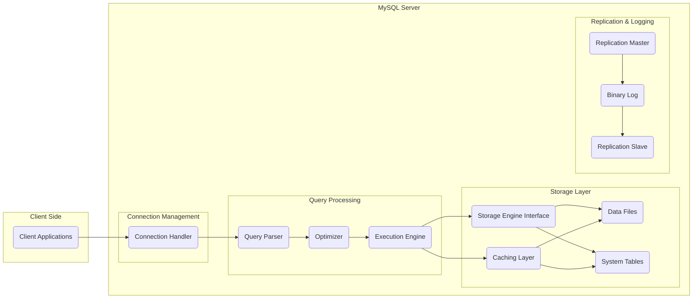
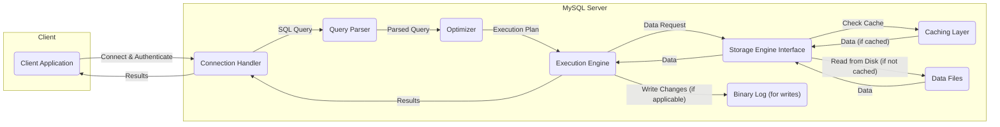

# Project Design Document: MySQL (Improved)

**Project Name:** MySQL

**Project Repository:** [https://github.com/mysql/mysql](https://github.com/mysql/mysql)

**Document Version:** 2.0

**Date:** October 26, 2023

**Author:** AI Software Architect

## 1. Introduction

This document provides an enhanced architectural overview of the MySQL database system, intended for use in threat modeling activities. It details the key components, their interactions, and the flow of data within the system. This version expands on the previous document with more specific details and clearer diagrams. The focus remains on the core server components and their interactions, while acknowledging the ecosystem of client libraries and tools.

## 2. Goals

* Provide a more detailed and refined architectural description of the MySQL server.
* Clearly define the responsibilities and interactions of key components.
* Illustrate data flow with improved diagrams and descriptions.
* Highlight important technologies, protocols, and security features.
* Serve as a robust foundation for identifying potential security vulnerabilities during threat modeling exercises.

## 3. High-Level Architecture

The MySQL architecture adheres to a client-server model. Client applications initiate connections to the MySQL server to execute queries and manage data. The server is structured into distinct layers and components that collaborate to process requests.

## 4. Component Details

This section provides a more in-depth description of the key components within the MySQL architecture, elaborating on their responsibilities.

* **Client Applications:** These are diverse applications (e.g., web servers, desktop applications, mobile apps, command-line tools) that interact with the MySQL server. They utilize various client libraries (e.g., JDBC, ODBC, Python connectors) and protocols to communicate.

* **Connection Handler:** This is the entry point for client connections. Its responsibilities include:
    * Listening for incoming connection requests.
    * Authenticating clients based on provided credentials (username, password, potentially other factors).
    * Authorizing client actions based on granted privileges.
    * Managing the lifecycle of client sessions, including connection pooling and resource management.

* **Query Parser:** This component takes the SQL query string submitted by the client and:
    * Performs lexical analysis to break the query into tokens.
    * Parses the tokens to build an abstract syntax tree (AST) representing the query structure.
    * Performs semantic analysis to validate the query against the database schema (e.g., checking if tables and columns exist).

* **Optimizer:** The optimizer's role is to determine the most efficient strategy for executing a parsed query. It considers:
    * Available indexes and their selectivity.
    * Table statistics (e.g., number of rows, data distribution).
    * Different join algorithms (e.g., nested loop, hash join).
    * The cost of various execution plans to select the optimal one.

* **Execution Engine:** This component executes the query plan generated by the optimizer. It:
    * Interprets the execution plan steps.
    * Interacts with the Storage Engine Interface to retrieve, insert, update, or delete data.
    * Manages transactions and ensures data consistency.

* **Storage Engine Interface:** This is a crucial abstraction layer that allows MySQL to support pluggable storage engines. It provides a consistent API for the Execution Engine to interact with different storage mechanisms, such as:
    * **InnoDB:** The default storage engine, providing ACID properties, row-level locking, and foreign key constraints.
    * **MyISAM:** An older storage engine, known for its speed in read-heavy workloads but lacking transaction support and row-level locking.
    * Other engines like Memory, CSV, etc.

* **Caching Layer:** MySQL employs various caching mechanisms to improve performance by reducing disk I/O:
    * **Query Cache (deprecated in newer versions):** Caches the result sets of SELECT queries.
    * **InnoDB Buffer Pool:** Caches frequently accessed data and index pages from InnoDB tables.
    * **Key Cache (for MyISAM):** Caches index blocks for MyISAM tables.
    * **Operating System Cache:** MySQL relies on the OS cache for file system operations.

* **Data Files:** These are the physical files on disk where the actual table data and indexes are stored. The organization and format of these files are specific to the storage engine being used.

* **System Tables (mysql schema):** These tables store critical metadata about the MySQL server instance, including:
    * User accounts and their privileges.
    * Database and table definitions.
    * Stored procedures and functions.
    * Server configuration settings.

* **Replication Master:** In a replication setup, the master server is the source of data changes. It:
    * Records all data modification statements in the Binary Log.
    * Maintains a record of connected slaves and their replication status.

* **Replication Slave:** Slave servers connect to the master to receive and apply changes. They:
    * Request and receive events from the master's Binary Log.
    * Replay these events on their local database, maintaining a copy of the master's data.

* **Binary Log:** This is a crucial file that records all data modification statements (e.g., INSERT, UPDATE, DELETE) and database schema changes. It is essential for:
    * Replication: Providing the stream of changes to slave servers.
    * Point-in-time recovery: Allowing restoration of the database to a specific point in time.
    * Auditing: Tracking changes made to the database.

## 5. Data Flow (Detailed)

The following outlines the detailed data flow for a typical SELECT query:

1. **Client Initiates Connection:** A client application establishes a connection to the MySQL server, which is handled by the Connection Handler.
2. **Authentication and Authorization:** The Connection Handler verifies the client's identity and checks if the client has the necessary privileges to perform the requested actions.
3. **Query Submission:** The authenticated client sends an SQL query to the server.
4. **Parsing and Syntax Check:** The Query Parser analyzes the query, verifying its syntax and structure.
5. **Semantic Analysis:** The parser checks if the referenced tables and columns exist and if the query is semantically valid.
6. **Optimization:** The Optimizer analyzes the parsed query and generates an optimal execution plan based on available indexes, statistics, and cost estimations.
7. **Execution Plan Generation:** The optimizer produces a detailed plan outlining the steps to retrieve the data.
8. **Execution:** The Execution Engine begins executing the steps in the execution plan.
9. **Storage Engine Interaction (Read Request):** The Execution Engine interacts with the appropriate Storage Engine (determined by the table's engine type) via the Storage Engine Interface to request the necessary data.
10. **Caching Check:** The Storage Engine might first check the Caching Layer (e.g., InnoDB Buffer Pool) to see if the requested data is already in memory.
11. **Data Retrieval from Disk (if not cached):** If the data is not in the cache, the Storage Engine retrieves it from the Data Files on disk.
12. **Data Transfer to Execution Engine:** The Storage Engine returns the retrieved data to the Execution Engine.
13. **Result Processing:** The Execution Engine processes the retrieved data according to the query (e.g., filtering, sorting, joining).
14. **Result Delivery to Client:** The Execution Engine sends the final result set back to the client application through the Connection Handler.

For write operations (INSERT, UPDATE, DELETE), the flow includes additional steps for writing data to the Data Files and updating the Binary Log (if enabled).

## 6. Key Technologies and Protocols

* **SQL (Structured Query Language):** The standard language for defining and manipulating data in the database.
* **TCP/IP:** The fundamental network protocol for client-server communication.
* **MySQL Client/Server Protocol:** A proprietary binary protocol optimized for communication between MySQL clients and servers.
* **Storage Engines (e.g., InnoDB, MyISAM, Memory):** Pluggable components providing different data storage and retrieval mechanisms.
* **C/C++:** The primary programming languages used for developing the core MySQL server.
* **SSL/TLS (Transport Layer Security):** Used to encrypt client-server communication, protecting data in transit.
* **Authentication Plugins:** A modular system allowing for various authentication methods (e.g., native passwords, PAM, LDAP).
* **Replication Protocols:** Protocols used for communication between master and slave servers during replication.

## 7. Security Considerations (Detailed for Threat Modeling)

This section provides a more detailed breakdown of security considerations, categorized for better organization during threat modeling.

* **Authentication and Authorization:**
    * **Threats:** Brute-force attacks on login credentials, weak password policies, vulnerabilities in authentication plugins, privilege escalation due to misconfigured grants.
    * **Considerations:** Strength of authentication mechanisms, secure storage of credentials, principle of least privilege, regular privilege reviews.

* **Network Security:**
    * **Threats:** Man-in-the-middle attacks, eavesdropping on unencrypted connections, unauthorized access through open ports, denial-of-service attacks targeting the connection handler.
    * **Considerations:** Enforcement of encrypted connections (SSL/TLS), firewall rules, network segmentation, rate limiting.

* **SQL Injection:**
    * **Threats:** Exploiting vulnerabilities in application code to inject malicious SQL queries, leading to data breaches, data manipulation, or unauthorized command execution.
    * **Considerations:** Parameterized queries or prepared statements, input validation and sanitization, least privilege for database users.

* **Data at Rest Encryption:**
    * **Threats:** Unauthorized access to physical storage media or database files, leading to exposure of sensitive data.
    * **Considerations:** Encryption of data files and tablespaces, secure key management practices.

* **Data in Transit Encryption:**
    * **Threats:** Interception of sensitive data transmitted between clients and the server.
    * **Considerations:** Mandatory use of SSL/TLS for all client connections.

* **Privilege Escalation:**
    * **Threats:** Attackers gaining higher privileges than initially granted, allowing them to perform unauthorized actions.
    * **Considerations:** Strict adherence to the principle of least privilege, regular auditing of user privileges, secure management of administrative accounts.

* **Denial of Service (DoS):**
    * **Threats:** Overwhelming the server with excessive requests, making it unavailable to legitimate users.
    * **Considerations:** Connection limits, query timeouts, resource management configurations, use of a web application firewall (WAF) for web-facing applications.

* **Replication Security:**
    * **Threats:** Unauthorized access to replication streams, manipulation of data during replication, compromised master or slave servers.
    * **Considerations:** Secure authentication between master and slaves, encryption of replication traffic, restricting network access to replication ports.

* **Binary Log Security:**
    * **Threats:** Unauthorized access or modification of the binary log, potentially leading to data corruption or the ability to replay malicious events.
    * **Considerations:** Restricting access to the binary log files, secure storage and backup of binary logs.

* **Vulnerabilities in Storage Engines:**
    * **Threats:** Security flaws within specific storage engine implementations that could be exploited.
    * **Considerations:** Staying up-to-date with security patches for the MySQL server and storage engines, understanding the security characteristics of different storage engines.

* **Supply Chain Security:**
    * **Threats:** Risks associated with third-party libraries, dependencies, and plugins used by MySQL.
    * **Considerations:** Careful vetting of dependencies, regular security scanning of the codebase and dependencies.

## 8. Threat Modeling Focus Areas (Actionable)

Based on the architecture and detailed security considerations, the threat modeling process should specifically focus on:

* **Authentication Flows:** Analyze the authentication process for various client types and authentication plugins. Identify potential weaknesses in credential handling and validation.
* **Network Boundaries:** Examine the interfaces between clients and the server, and between master and slave servers in replication setups. Assess the effectiveness of network security controls.
* **Query Processing Stages:**  Analyze each stage of query processing (parsing, optimization, execution) for vulnerabilities like SQL injection or opportunities for privilege escalation.
* **Storage Engine Interactions:** Investigate the security implications of interactions with different storage engines, focusing on data access control and potential vulnerabilities within the engines themselves.
* **Replication Data Flow:**  Map the flow of data during replication and identify potential points of interception or manipulation.
* **Binary Log Access and Integrity:**  Assess the controls in place to protect the binary log from unauthorized access and modification.
* **Privilege Management System:**  Thoroughly analyze the mechanisms for granting and revoking user privileges and identify potential for misconfiguration or exploitation.
* **External Plugin Interfaces:**  If plugins are used, analyze their security implications and the potential for vulnerabilities in plugin code.
* **Configuration Parameters:**  Review critical configuration parameters for potential security misconfigurations.

## 9. Conclusion

This improved design document provides a more comprehensive and detailed architectural overview of the MySQL database system, specifically tailored for threat modeling. By elaborating on component responsibilities, data flow, and security considerations, this document serves as a robust foundation for identifying and mitigating potential security vulnerabilities within the MySQL project. The actionable threat modeling focus areas provide a clear direction for subsequent security analysis.