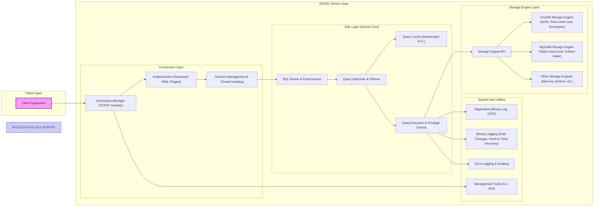

# Project Design Document: MySQL Database System for Threat Modeling

**Version:** 1.1
**Date:** 2023-10-27
**Author:** Gemini (AI Expert in Software, Cloud, and Cybersecurity Architecture)

## 1. Introduction

This document provides an enhanced and more detailed design overview of the MySQL database system, specifically tailored for threat modeling and security analysis. Building upon the previous version, this iteration further elaborates on key components, architecture, data flow, and technologies involved in MySQL, with a stronger emphasis on security aspects relevant for threat identification. This document serves as a robust foundation for subsequent threat modeling activities to identify potential vulnerabilities and security risks within the MySQL ecosystem. This design is based on the open-source MySQL project available at [https://github.com/mysql/mysql](https://github.com/mysql/mysql).

## 2. Project Overview

MySQL remains a cornerstone open-source Relational Database Management System (RDBMS), renowned for its performance, reliability, and user-friendliness. Its versatility makes it suitable for diverse applications, ranging from lightweight websites to complex enterprise systems, all relying on it for structured data storage and management. Key features, crucial for understanding its security posture, include:

*   **Relational Database Model:**  Organizes data into structured tables with rows and columns, enforcing relationships and data integrity through relational principles.
*   **Standard SQL Support:** Adheres to the Structured Query Language (SQL) standard for all database operations, including data definition (DDL), data manipulation (DML), and data control (DCL).
*   **Client-Server Architecture:** Operates on a client-server model, centralizing data management on the server and allowing multiple clients to connect and interact. This architecture dictates network-based security considerations.
*   **Pluggable Storage Engines:** Offers a modular storage engine architecture, enabling selection of engines like InnoDB (default, transactional, ACID-compliant) and MyISAM (older, faster for reads, table-locking), each with distinct performance and security characteristics.
*   **ACID Transactions:**  Supports Atomicity, Consistency, Isolation, and Durability (ACID) transactions, primarily with InnoDB, ensuring data integrity even in failure scenarios. Transaction management is critical for data consistency and preventing data corruption vulnerabilities.
*   **Robust Replication:** Provides various replication topologies (e.g., master-slave, group replication) for high availability, read scalability, and disaster recovery. Replication security is paramount to prevent unauthorized data access or modification across servers.
*   **Comprehensive Security Features:** Integrates a range of security mechanisms including authentication (multiple methods), authorization (privilege system), encryption (data in transit and at rest), auditing (logging of activities), and security-focused configuration options.

## 3. System Architecture

MySQL's architecture is structured in layers, following a client-server paradigm.  Understanding these layers is crucial for pinpointing potential threat vectors.

### 3.1. High-Level Architecture Diagram (Mermaid)



### 3.2. Component Description

#### 3.2.1. Client Layer

*   **Client Application:**  Encompasses any software application that interacts with the MySQL server. This could be web applications, custom scripts, administration tools, or third-party software.  Security threats can originate from vulnerabilities in these client applications themselves, or through compromised client environments.

#### 3.2.2. MySQL Server Layer

*   **Connection Layer:**  This layer is the entry point for all client interactions and a critical area for security.
    *   **Connection Manager (TCP/IP, Sockets):** Listens for and manages incoming client connections over various network protocols (TCP/IP for remote access, Unix sockets for local connections, named pipes on Windows).  Misconfigurations or vulnerabilities in the connection manager can lead to unauthorized access or denial of service.
    *   **Authentication (Password, PAM, Plugins):** Verifies client identities before granting access. MySQL supports multiple authentication methods:
        *   **Password-based Authentication:** Traditional username/password authentication, susceptible to brute-force attacks and weak password usage.
        *   **Pluggable Authentication Modules (PAM):** Integrates with OS-level authentication mechanisms for centralized user management.
        *   **Authentication Plugins:** Allows for custom authentication methods, including LDAP, Kerberos, and external authentication services.  Improperly configured or vulnerable authentication mechanisms are a primary attack vector.
    *   **Session Management & Thread Handling:** Manages client sessions, including session variables, character sets, and connection state. Each connection is typically handled by a dedicated thread. Session hijacking or thread exhaustion are potential threats.

*   **SQL Layer (Server Core):** The heart of the MySQL server, responsible for processing SQL queries.
    *   **SQL Parser & Preprocessor:** Parses incoming SQL queries, validates syntax, and performs preprocessing steps. Vulnerabilities in the parser can lead to SQL injection or denial of service.
    *   **Query Optimizer & Planner:** Analyzes parsed queries and determines the most efficient execution plan.  While primarily for performance, optimizer bugs could potentially be exploited.
    *   **Query Cache (Deprecated 8.0+):**  (Largely removed in modern versions) Cached results of SELECT queries.  While intended for performance, vulnerabilities in cache management could exist.
    *   **Query Executor & Privilege Checks:** Executes the optimized query plan and critically, enforces privilege checks before accessing or modifying data.  Bypassing privilege checks is a major security concern.  SQL injection often aims to circumvent these checks.

*   **Storage Engine Layer:**  Manages the physical storage and retrieval of data.
    *   **Storage Engine API:**  Provides a standardized interface for the SQL Layer to interact with different storage engines. This abstraction is important for modularity but also for understanding how security features are implemented at the storage level.
    *   **InnoDB Storage Engine (ACID, Row-Level Lock, Encryption):** The default and recommended engine. Key security features include:
        *   **ACID Transactions:** Ensures data consistency and integrity.
        *   **Row-Level Locking:** Improves concurrency and reduces locking contention, indirectly contributing to availability.
        *   **Encryption at Rest (Data-at-Rest Encryption):**  Encrypts data files on disk, protecting against unauthorized physical access to storage.
    *   **MyISAM Storage Engine (Table-Level Lock, Fulltext Index):**  Older engine, less feature-rich in terms of security and concurrency compared to InnoDB. Table-level locking can be a performance bottleneck and potentially a denial-of-service vector under heavy load.
    *   **Other Storage Engines (Memory, Archive, etc.):**  Specialized engines with varying security implications. For example, Memory engine data is volatile and lost on server restart.

*   **System and Utilities:**  Supporting components for server operation and management.
    *   **Replication (Binary Log, GTID):**  Enables data replication for high availability and scalability. Security considerations include:
        *   **Replication Channel Encryption:** Encrypting data transmitted between master and replica servers.
        *   **Replication User Authentication:** Securing access to replication channels.
        *   **Binary Log Security:** Protecting binary logs from unauthorized access as they contain sensitive data changes.
    *   **Binary Logging (Data Changes, Point-in-Time Recovery):** Records all data modifications. Essential for replication and recovery, but also a potential source of sensitive information if not secured.
    *   **Error Logging & Auditing:** Logs server errors, warnings, and can be configured for security auditing (e.g., connection attempts, query activity).  Audit logs are crucial for security monitoring and incident response.
    *   **Management Tools (CLI, GUI):** Command-line tools (e.g., `mysql`, `mysqladmin`) and graphical interfaces for administration.  Security risks include:
        *   **Tool Vulnerabilities:**  Bugs in management tools themselves.
        *   **Credential Exposure:**  Storing credentials insecurely in scripts or configuration files used by tools.
        *   **Privilege Escalation:**  Misuse of administrative privileges granted through these tools.

## 4. Data Flow

Understanding the data flow is essential for tracing potential attack paths and identifying where security controls should be implemented.

1.  **Client Connection Request:** Client initiates a connection to the MySQL server.
2.  **Connection Establishment & Authentication:** Connection Manager accepts the connection, and the Authentication module verifies client credentials.
3.  **SQL Query Submission:** Authenticated client sends an SQL query.
4.  **Query Parsing & Preprocessing:** SQL Parser analyzes the query for syntax and performs preprocessing.
5.  **Query Optimization & Planning:** Query Optimizer determines the execution plan.
6.  **Privilege Check:** Query Executor verifies if the user has sufficient privileges to execute the query and access the requested data. **This is a critical security checkpoint.**
7.  **Query Execution:** Query Executor interacts with the Storage Engine API to execute the query plan.
8.  **Storage Engine Data Access:** Storage Engine (e.g., InnoDB) retrieves or modifies data from storage, enforcing data integrity and potentially encryption at rest.
9.  **Result Retrieval:** Storage Engine returns results to the Query Executor.
10. **Result Delivery to Client:** Query Executor sends results back to the client through the Connection Manager.
11. **Logging (Binary Log, Audit Log):** Relevant operations, especially data modifications and security-related events, are logged.
12. **Session Maintenance:** Session state is maintained for subsequent interactions.

### 4.1. Data Flow Diagram (Mermaid)

```mermaid
graph LR
    A["Client Application"] --> B["Connection Manager"];
    B --> C["Authentication"];
    C --> D["SQL Parser"];
    D --> E["Query Optimizer"];
    E --> F["Query Executor"];
    F --> G["Privilege Check"];
    G --> H["Storage Engine API"];
    H --> I["InnoDB/MyISAM"];
    I --> H;
    H --> G;
    G --> F;
    F --> B;
    B --> A;
    F --> J["Logging"];

    style A fill:#f9f,stroke:#333,stroke-width:2px
    style B,C,D,E,F,G,H,I,J fill:#ccf,stroke:#333,stroke-width:1px
    style G fill:#fbb,stroke:#333,stroke-width:1px,stroke-dasharray: 5 5  <!-- Highlight Privilege Check -->
```

**Note:** In the Data Flow Diagram, "Privilege Check" is highlighted to emphasize its critical role in security.

## 5. Technology Stack

MySQL's technology stack influences its security characteristics and potential vulnerabilities.

*   **Core Languages:** C, C++ (Performance and system-level access)
*   **SQL Standard:**  (Industry-standard query language, but also source of injection vulnerabilities if not handled properly)
*   **Networking Libraries:** TCP/IP stack, socket libraries (Network communication security)
*   **Security Libraries:** SSL/TLS libraries (e.g., OpenSSL, yaSSL), PAM libraries (Authentication and encryption)
*   **Storage Management & File System Interfaces:** OS-level file I/O, buffer management, indexing algorithms (Storage engine security and performance)
*   **Concurrency & Threading Libraries:** Thread management, locking mechanisms (Concurrency control and potential race conditions)
*   **Operating System Dependencies:** Relies on OS kernel for system calls, process management, memory management (OS-level security vulnerabilities can impact MySQL)

## 6. Deployment Environment

The deployment environment significantly shapes the security perimeter and available security controls.

*   **On-Premise Servers (Physical/Virtual):**  Organization responsible for all aspects of security, including physical security, network security, OS hardening, and MySQL configuration.
*   **Cloud Environments (IaaS - EC2, Azure VMs, GCE):** Shared responsibility model. Cloud provider manages infrastructure security, while the user is responsible for OS hardening, MySQL configuration, and application security.
*   **Cloud PaaS/DBaaS (RDS, Azure MySQL, Cloud SQL):** Cloud provider manages most infrastructure and database security aspects, including patching, backups, and some configuration. User responsible for access control, application security, and data security within the database.
*   **Containers (Docker, Kubernetes):** Container security becomes a factor, including image security, container runtime security, and orchestration platform security. Network policies and access control within the container environment are crucial.

## 7. Security Considerations (Detailed)

This section expands on the high-level security considerations, providing more specific examples and relating them to the architecture components.

*   **Authentication & Authorization:**
    *   **Threats:** Brute-force attacks, weak passwords, credential theft, privilege escalation, unauthorized access to sensitive data.
    *   **Mitigations:** Strong password policies, multi-factor authentication (MFA) where possible, principle of least privilege, regular password rotation, secure storage of credentials, using PAM or external authentication, robust privilege management using roles and grants.
    *   **Relevant Components:** Connection Manager, Authentication, Query Executor, Privilege Check.

*   **SQL Injection:**
    *   **Threats:** Data breaches, data modification, data deletion, denial of service, potential command execution on the server.
    *   **Mitigations:** Parameterized queries or prepared statements, input validation and sanitization, least privilege database user accounts, web application firewalls (WAFs).
    *   **Relevant Components:** Client Application, SQL Parser, Query Executor.

*   **Data Encryption (At Rest & In Transit):**
    *   **Threats:** Data breaches if storage media is compromised, eavesdropping on network traffic.
    *   **Mitigations:** InnoDB Data-at-Rest Encryption, SSL/TLS for client connections and replication, file system encryption, VPNs for network segmentation.
    *   **Relevant Components:** InnoDB Storage Engine, Connection Manager, Replication.

*   **Network Security:**
    *   **Threats:** Unauthorized access, network sniffing, man-in-the-middle attacks, denial of service.
    *   **Mitigations:** Firewalls, network segmentation, access control lists (ACLs), intrusion detection/prevention systems (IDS/IPS), disabling unnecessary network services, using non-default ports (though security by obscurity is weak).
    *   **Relevant Components:** Connection Manager, Replication.

*   **Vulnerability Management & Patching:**
    *   **Threats:** Exploitation of known vulnerabilities in MySQL software.
    *   **Mitigations:** Regular patching and updates, vulnerability scanning, subscribing to security advisories, using a vulnerability management system.
    *   **Relevant Components:** All MySQL Server Layer components, Management Tools.

*   **Access Control & Auditing:**
    *   **Threats:** Insider threats, unauthorized actions, difficulty in tracking security incidents.
    *   **Mitigations:** Granular access control policies, role-based access control (RBAC), enabling audit logging, regular review of audit logs, security information and event management (SIEM) integration.
    *   **Relevant Components:** Authentication, Privilege Check, Query Executor, Audit Logging.

*   **Denial of Service (DoS):**
    *   **Threats:** Server unavailability, service disruption.
    *   **Mitigations:** Connection limits, query timeouts, resource limits, rate limiting, web application firewalls (WAFs), load balancing, DDoS mitigation services.
    *   **Relevant Components:** Connection Manager, Query Executor.

*   **Secure Configuration:**
    *   **Threats:** Weak security posture due to default or insecure settings.
    *   **Mitigations:** Following security hardening guidelines, disabling unnecessary features, setting strong passwords for administrative accounts, limiting privileges, regularly reviewing configuration settings.
    *   **Relevant Components:** All MySQL Server Layer components, Management Tools.

*   **Backup & Recovery Security:**
    *   **Threats:** Data loss, unauthorized access to backups, compromised backups used for malicious purposes.
    *   **Mitigations:** Secure backup storage, encryption of backups, access control for backups, regular testing of recovery procedures.
    *   **Relevant Components:** Binary Logging, Management Tools, Storage Engine.

*   **Replication Security:**
    *   **Threats:** Data breaches through compromised replication channels, data manipulation on replica servers, unauthorized access to binary logs.
    *   **Mitigations:** Encrypt replication channels (SSL/TLS), authenticate replication users, secure binary logs, network segmentation for replication traffic.
    *   **Relevant Components:** Replication, Binary Logging, Connection Manager.

## 8. Conclusion

This enhanced design document provides a more in-depth and security-focused overview of the MySQL database system. By detailing the architecture, data flow, technology stack, deployment environments, and expanding on security considerations, it aims to be a more effective tool for threat modeling. This document should enable security professionals to conduct a more comprehensive analysis of potential threats and vulnerabilities within MySQL deployments and to develop targeted and effective security mitigation strategies. The detailed component descriptions and data flow diagrams, along with the expanded security considerations, are intended to facilitate a more granular and actionable threat modeling process. This document will serve as a valuable resource for securing MySQL deployments across various environments.