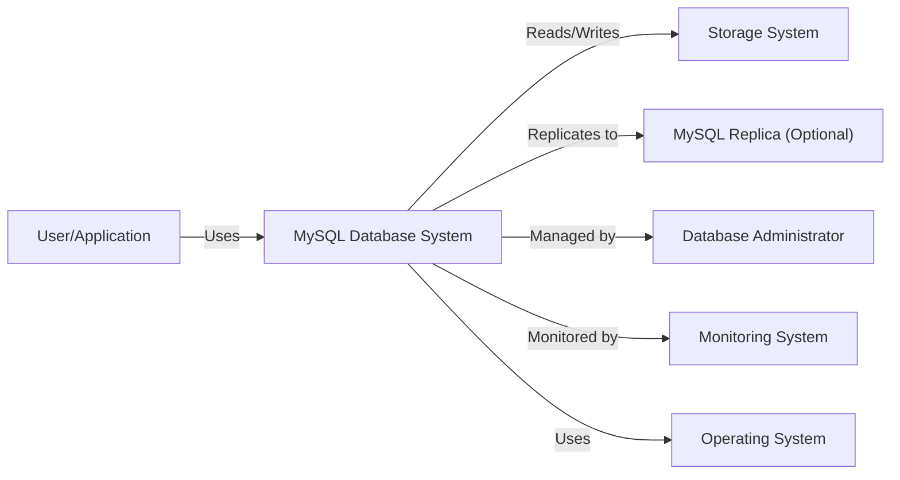
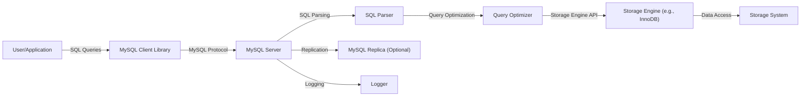
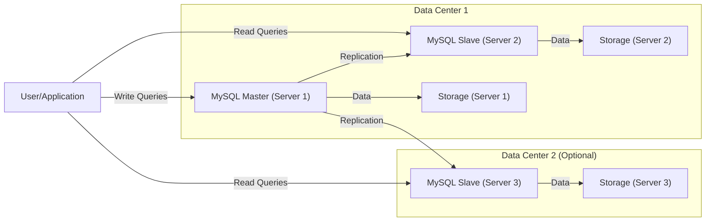
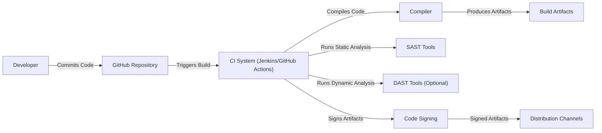

Okay, let's create a design document for the MySQL project, keeping in mind its purpose and potential security considerations.

# BUSINESS POSTURE

MySQL is a widely used, open-source relational database management system (RDBMS).  Its primary business goals revolve around:

*   Reliability:  Providing a stable and dependable database system for a wide range of applications.
*   Performance:  Offering fast and efficient data storage and retrieval.
*   Scalability:  Supporting databases of varying sizes, from small projects to large enterprise deployments.
*   Ease of Use:  Providing a relatively straightforward interface and management tools.
*   Open Source:  Maintaining a vibrant community and fostering contributions.
*   Compatibility: Adhering to SQL standards and supporting various operating systems and programming languages.
*   Cost-Effectiveness: Offering a free, community edition, and commercial editions with additional features and support.

Business priorities are centered on maintaining its position as a leading open-source RDBMS, attracting and retaining users, and ensuring its continued development and relevance in the face of competition from other database systems (both SQL and NoSQL).

Most important business risks that need to be addressed:

*   Data Breaches: Unauthorized access to sensitive data stored in MySQL databases. This is a paramount concern for any database system.
*   Data Corruption: Loss or corruption of data due to software bugs, hardware failures, or malicious attacks.
*   Denial of Service (DoS): Attacks that render the database server unavailable to legitimate users.
*   Reputation Damage: Security vulnerabilities or data breaches can severely damage MySQL's reputation and erode user trust.
*   Competition: Failure to keep up with evolving database technologies and user needs could lead to a decline in market share.
*   Supply Chain Attacks: Compromise of the MySQL build process or distribution channels, leading to the insertion of malicious code.

# SECURITY POSTURE

MySQL has a long history and, as such, incorporates numerous security controls. It also likely has some accepted risks, given its open-source nature and wide deployment.

Existing Security Controls:

*   security control: Authentication: MySQL implements a robust user authentication system with user accounts, passwords, and pluggable authentication modules (PAM, native MySQL authentication, etc.). Described in the MySQL documentation and implemented in the server's authentication handling code.
*   security control: Authorization:  A granular privilege system controls access to databases, tables, and specific operations (SELECT, INSERT, UPDATE, DELETE, etc.).  This is defined in the MySQL grant tables and enforced by the server.
*   security control: Network Security: Support for encrypted connections using TLS/SSL to protect data in transit. Configurable through server settings and client connection parameters.
*   security control: Access Control:  Host-based access control to restrict connections from specific IP addresses or networks. Configurable in the MySQL grant tables.
*   security control: Auditing:  MySQL Enterprise Edition includes an audit plugin to log database activity for security monitoring and forensics.
*   security control: Security Updates:  Regular releases and patches to address security vulnerabilities.
*   security control: Secure Configuration Defaults:  Efforts to provide secure default configurations, although users often need to customize these for their specific environments.
*   security control: Input Validation:  Internal checks within the SQL parser and query execution engine to prevent SQL injection and other code injection vulnerabilities. Implemented within the server's core code.
*   security control: Password Storage: Uses hashing algorithms to store passwords securely.

Accepted Risks:

*   accepted risk: Default Configurations:  While efforts are made to provide secure defaults, some configurations might still require user intervention for optimal security.
*   accepted risk: User Misconfiguration:  The flexibility of MySQL's configuration means that users can inadvertently introduce security vulnerabilities.
*   accepted risk: Third-Party Libraries:  MySQL relies on some third-party libraries, which could potentially introduce vulnerabilities.
*   accepted risk: Legacy Features:  Some older features might have inherent security limitations, but are maintained for backward compatibility.
*   accepted risk: Zero-Day Vulnerabilities:  Like all software, MySQL is susceptible to unknown vulnerabilities that could be exploited before patches are available.

Recommended Security Controls:

*   security control: Enhanced Input Validation:  Continuous improvement of input validation mechanisms to mitigate evolving SQL injection and other injection attack vectors.
*   security control: Data at Rest Encryption:  While TLS/SSL protects data in transit, encrypting data at rest (on disk) would provide an additional layer of security. MySQL Enterprise Edition offers Transparent Data Encryption (TDE).
*   security control: Web Application Firewall (WAF) Integration:  While not part of MySQL itself, recommending and documenting integration with WAFs can help protect against application-level attacks.
*   security control: Regular Security Audits:  Independent security audits to identify potential vulnerabilities.
*   security control: Improved Supply Chain Security:  Strengthening the build and distribution process to prevent tampering and ensure the integrity of MySQL binaries.
*   security control: Two-Factor Authentication (2FA):  Implementing 2FA for database user accounts would significantly enhance authentication security.

Security Requirements:

*   Authentication:
    *   Strong password policies (length, complexity, expiration).
    *   Support for multi-factor authentication.
    *   Secure storage of authentication credentials (hashing, salting).
    *   Protection against brute-force attacks.

*   Authorization:
    *   Principle of least privilege: Users should only have the minimum necessary permissions.
    *   Granular access control:  Fine-grained control over database objects and operations.
    *   Role-based access control (RBAC).

*   Input Validation:
    *   Strict validation of all user-supplied input to prevent SQL injection.
    *   Parameterized queries/prepared statements.
    *   Output encoding to prevent cross-site scripting (XSS) if data is displayed in web applications.

*   Cryptography:
    *   Use of strong, industry-standard cryptographic algorithms for encryption (TLS/SSL, data at rest encryption).
    *   Secure key management practices.
    *   Regular review and updates of cryptographic libraries.

# DESIGN

## C4 CONTEXT

C4 Context Element List:

*   Element:
    *   Name: User/Application
    *   Type: User/External System
    *   Description:  Represents any user or application that interacts with the MySQL database.
    *   Responsibilities:  Sends queries to the database, receives results, manages data.
    *   Security controls:  Authentication to MySQL, secure coding practices to prevent SQL injection.

*   Element:
    *   Name: MySQL Database System
    *   Type: System
    *   Description:  The core MySQL RDBMS, including the server, client libraries, and utilities.
    *   Responsibilities:  Processing queries, managing data storage, enforcing security policies.
    *   Security controls:  Authentication, authorization, access control, encryption, auditing.

*   Element:
    *   Name: Storage System
    *   Type: External System
    *   Description:  The underlying storage mechanism (e.g., hard drives, SSDs, network storage).
    *   Responsibilities:  Storing the actual database files.
    *   Security controls:  Disk encryption, access controls on the storage system itself.

*   Element:
    *   Name: MySQL Replica (Optional)
    *   Type: System
    *   Description:  A replica server used for read scaling, high availability, or backups.
    *   Responsibilities:  Receiving replicated data from the primary MySQL server.
    *   Security controls:  Same as the primary MySQL server, plus secure replication configuration.

*   Element:
    *   Name: Database Administrator
    *   Type: User
    *   Description:  A person responsible for managing and maintaining the MySQL database.
    *   Responsibilities:  User management, configuration, backups, performance tuning, security hardening.
    *   Security controls:  Strong authentication, limited access privileges, adherence to security best practices.

*   Element:
    *   Name: Monitoring System
    *   Type: External System
    *   Description:  A system used to monitor the performance and health of the MySQL database.
    *   Responsibilities:  Collecting metrics, generating alerts.
    *   Security controls:  Secure communication with the MySQL server, access controls on the monitoring system itself.

*   Element:
    *   Name: Operating System
    *   Type: External System
    *   Description: The underlying operating system on which MySQL runs (e.g., Linux, Windows).
    *   Responsibilities: Provides the foundation for MySQL, including process management, memory management, and file system access.
    *   Security controls: OS-level security hardening, firewalls, intrusion detection systems.

## C4 CONTAINER

C4 Container Element List:

*   Element:
    *   Name: User/Application
    *   Type: User/External System
    *   Description:  Represents any user or application that interacts with the MySQL database.
    *   Responsibilities:  Sends queries to the database, receives results, manages data.
    *   Security controls:  Authentication to MySQL, secure coding practices to prevent SQL injection.

*   Element:
    *   Name: MySQL Client Library
    *   Type: Container
    *   Description:  Provides an interface for applications to connect to and interact with the MySQL server.
    *   Responsibilities:  Establishing connections, sending queries, receiving results.
    *   Security controls:  TLS/SSL encryption, secure connection parameters.

*   Element:
    *   Name: MySQL Server
    *   Type: Container
    *   Description:  The core process that handles client connections, query processing, and data management.
    *   Responsibilities:  Managing connections, parsing queries, optimizing queries, interacting with the storage engine.
    *   Security controls:  Authentication, authorization, access control, auditing.

*   Element:
    *   Name: SQL Parser
    *   Type: Container
    *   Description:  Parses incoming SQL queries into an internal representation.
    *   Responsibilities:  Syntax checking, semantic analysis.
    *   Security controls:  Input validation to prevent SQL injection.

*   Element:
    *   Name: Query Optimizer
    *   Type: Container
    *   Description:  Optimizes the execution plan for SQL queries.
    *   Responsibilities:  Choosing the most efficient way to access and process data.
    *   Security controls:  None directly, but indirectly contributes to performance and DoS prevention.

*   Element:
    *   Name: Storage Engine (e.g., InnoDB)
    *   Type: Container
    *   Description:  Handles the actual storage and retrieval of data.  MySQL supports multiple storage engines.
    *   Responsibilities:  Data storage, indexing, transaction management.
    *   Security controls:  Data at rest encryption (if supported by the storage engine), transaction isolation levels.

*   Element:
    *   Name: Storage System
    *   Type: External System
    *   Description:  The underlying storage mechanism (e.g., hard drives, SSDs, network storage).
    *   Responsibilities:  Storing the actual database files.
    *   Security controls:  Disk encryption, access controls on the storage system itself.

*   Element:
    *   Name: MySQL Replica (Optional)
    *   Type: System
    *   Description:  A replica server used for read scaling, high availability, or backups.
    *   Responsibilities:  Receiving replicated data from the primary MySQL server.
    *   Security controls:  Same as the primary MySQL server, plus secure replication configuration.

*   Element:
    *   Name: Logger
    *   Type: Container
    *   Description: Logs various events, including errors, warnings, and general query information.
    *   Responsibilities: Provides a record of database activity for debugging, auditing, and performance analysis.
    *   Security controls: Access controls to prevent unauthorized access to log files.

## DEPLOYMENT

MySQL can be deployed in various ways:

1.  **Single Server:**  The simplest deployment, with one MySQL server instance running on a single machine.
2.  **Master-Slave Replication:**  One master server handles writes, and one or more slave servers replicate data from the master for read scaling and high availability.
3.  **Master-Master Replication:**  Multiple master servers can accept writes, with data replicated between them.  This requires careful configuration to avoid conflicts.
4.  **MySQL Cluster (NDB Cluster):**  A distributed, multi-master setup for high availability and scalability, using the NDB storage engine.
5.  **Cloud-Based Deployments:**  Using managed database services like Amazon RDS for MySQL, Azure Database for MySQL, or Google Cloud SQL for MySQL.

We'll describe the **Master-Slave Replication** deployment in detail, as it's a common and relatively straightforward setup.

Deployment Element List:

*   Element:
    *   Name: MySQL Master (Server 1)
    *   Type: Node
    *   Description:  The primary MySQL server that accepts write operations.
    *   Responsibilities:  Handling write queries, replicating data to slaves.
    *   Security controls:  Authentication, authorization, access control, encryption, auditing, firewall rules.

*   Element:
    *   Name: MySQL Slave (Server 2)
    *   Type: Node
    *   Description:  A replica server that receives data from the master.
    *   Responsibilities:  Handling read queries, replicating data from the master.
    *   Security controls:  Authentication, authorization, access control, encryption, auditing, firewall rules.

*   Element:
    *   Name: MySQL Slave (Server 3)
    *   Type: Node
    *   Description:  Another replica server, potentially in a different data center for disaster recovery.
    *   Responsibilities: Handling read queries, replicating data from master.
    *   Security controls: Authentication, authorization, access control, encryption, auditing, firewall rules.

*   Element:
    *   Name: Storage (Server 1)
    *   Type: Node
    *   Description:  The storage system for the master server.
    *   Responsibilities:  Storing the master database files.
    *   Security controls:  Disk encryption, access controls.

*   Element:
    *   Name: Storage (Server 2)
    *   Type: Node
    *   Description:  The storage system for the first slave server.
    *   Responsibilities:  Storing the replicated database files.
    *   Security controls:  Disk encryption, access controls.

*   Element:
    *   Name: Storage (Server 3)
    *   Type: Node
    *   Description: The storage system for the second slave server.
    *   Responsibilities: Storing the replicated database files.
    *   Security controls: Disk encryption, access controls.

*   Element:
    *   Name: User/Application
    *   Type: User/External System
    *   Description: Represents any user or application that interacts with the MySQL database.
    *   Responsibilities: Sends queries to the database, receives results, manages data.
    *   Security controls: Authentication to MySQL, secure coding practices to prevent SQL injection.

## BUILD

MySQL's build process is complex, involving numerous tools and steps.  Here's a simplified overview, focusing on security aspects:

1.  **Source Code:**  The MySQL source code is hosted on GitHub.
2.  **Build Environment:**  Developers use a variety of build environments (Linux, macOS, Windows) and tools (CMake, compilers, linkers).
3.  **Automated Build System:**  MySQL uses a continuous integration (CI) system (likely Jenkins or GitHub Actions, though the specific details aren't publicly documented in the repository root) to automatically build and test the software on various platforms.
4.  **Static Analysis:**  The CI system likely incorporates static analysis tools (SAST) to identify potential security vulnerabilities in the code.
5.  **Dynamic Analysis:**  Dynamic analysis tools (DAST) might be used to test the running software for vulnerabilities.
6.  **Artifact Generation:**  The build process produces various artifacts, including executable files, libraries, and installation packages.
7.  **Code Signing:**  Release builds are likely digitally signed to ensure their authenticity and integrity.
8.  **Distribution:**  The artifacts are distributed through various channels, including the MySQL website, package managers, and cloud providers.

Build Process Security Controls:

*   security control: Source Code Management:  Using a secure repository (GitHub) with access controls and version history.
*   security control: Build Automation:  Automating the build process to ensure consistency and repeatability.
*   security control: Static Analysis:  Using SAST tools to identify potential vulnerabilities early in the development lifecycle.
*   security control: Dynamic Analysis:  Using DAST tools to test the running software for vulnerabilities.
*   security control: Code Signing:  Digitally signing release builds to ensure their authenticity and integrity.
*   security control: Dependency Management:  Carefully managing dependencies on third-party libraries to minimize the risk of introducing vulnerabilities.
*   security control: Secure Build Environment:  Ensuring that the build environment itself is secure and protected from tampering.

# RISK ASSESSMENT

Critical Business Processes:

*   Data Storage and Retrieval:  The core function of MySQL is to store and retrieve data reliably and efficiently.
*   Online Transactions:  Many applications rely on MySQL for processing online transactions, making availability and data integrity crucial.
*   Business Intelligence:  MySQL databases are often used for storing and analyzing business data to support decision-making.

Data Sensitivity:

The data stored in MySQL databases can vary widely in sensitivity, from publicly available information to highly confidential data, including:

*   Personally Identifiable Information (PII):  Names, addresses, email addresses, phone numbers, social security numbers, etc.
*   Financial Data:  Credit card numbers, bank account details, transaction history.
*   Health Information:  Medical records, patient data.
*   Intellectual Property:  Trade secrets, source code, proprietary data.
*   Authentication Credentials:  Usernames and passwords (which should be securely hashed).

The sensitivity of the data dictates the level of security controls required to protect it.

# QUESTIONS & ASSUMPTIONS

Questions:

*   What specific CI/CD system is used for MySQL builds (Jenkins, GitHub Actions, other)?
*   What specific SAST and DAST tools are used in the build process?
*   What are the detailed procedures for handling security vulnerabilities reported by external researchers?
*   What are the specific key management practices for data at rest encryption (in MySQL Enterprise Edition)?
*   What are the specific criteria for accepting or rejecting contributions to the MySQL codebase?
*   Are there any plans to implement two-factor authentication (2FA) for database user accounts?

Assumptions:

*   BUSINESS POSTURE: MySQL aims to maintain a balance between security, performance, and ease of use.
*   BUSINESS POSTURE: Security is a high priority, but not at the expense of significant performance degradation or usability limitations.
*   SECURITY POSTURE: MySQL relies on a combination of built-in security features and best practices implemented by users and administrators.
*   SECURITY POSTURE: The MySQL development team follows secure coding practices and addresses reported vulnerabilities promptly.
*   DESIGN: The deployment model will vary depending on the specific needs of the user.
*   DESIGN: Users are responsible for securing the operating system and network environment in which MySQL is deployed.
*   DESIGN: The build process includes measures to prevent the introduction of malicious code.
*   DESIGN: MySQL development team is using some kind of automated build system.