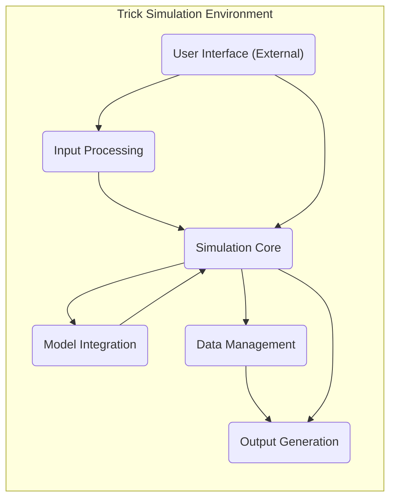
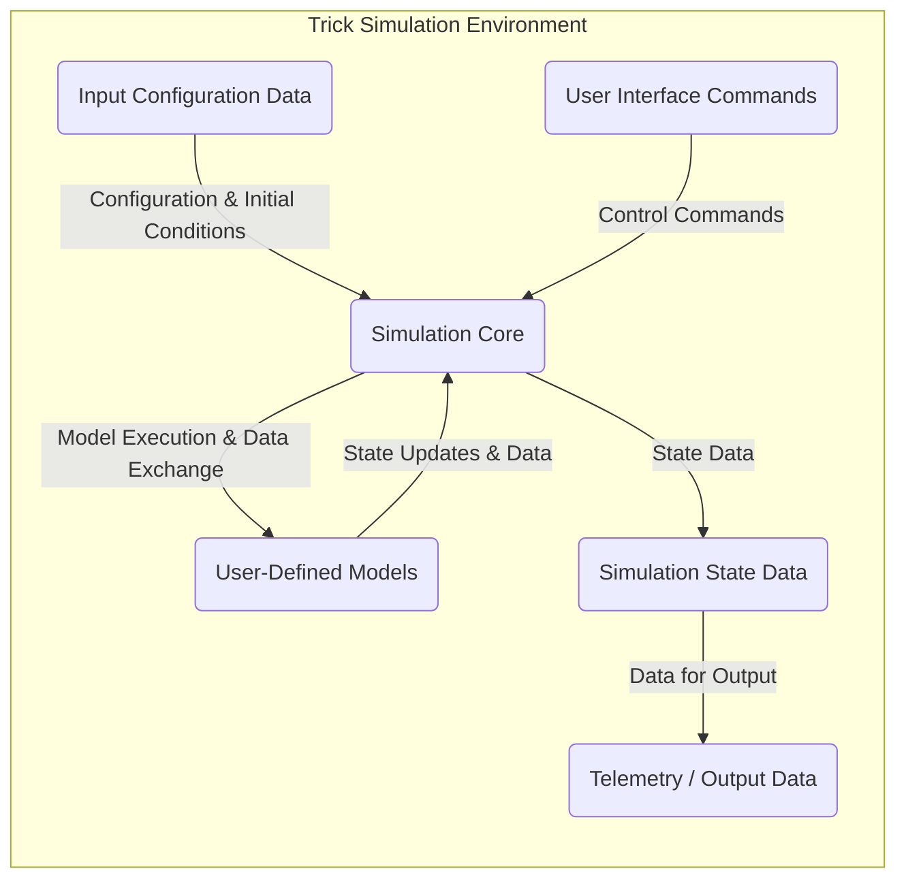

# Project Design Document: NASA Trick Simulation Environment

**Version:** 1.1
**Date:** October 26, 2023
**Prepared By:** Gemini AI Assistant

## 1. Introduction

This document provides a detailed design overview of the NASA Trick simulation environment, as represented by the codebase available at [https://github.com/nasa/trick](https://github.com/nasa/trick). This document aims to provide a clear understanding of the system's architecture, components, and data flow, which will serve as the foundation for subsequent threat modeling activities. This revision incorporates markdown tables for improved readability and ensures all Mermaid diagram nodes are correctly quoted.

## 2. Goals

*   Provide a comprehensive architectural overview of the Trick simulation environment.
*   Identify key components and their responsibilities.
*   Describe the data flow within the system.
*   Outline the deployment architecture.
*   Highlight initial security considerations based on the design.
*   Utilize markdown tables for structured information.

## 3. System Overview

Trick is a general-purpose simulation development framework used for building simulations of spacecraft, aircraft, and other complex systems. It provides a set of core functionalities and a flexible architecture that allows users to define and integrate custom models and interfaces.

The core of Trick can be conceptually divided into the following high-level components:

*   **Input Processing:** Handles the ingestion of simulation configuration data, initial conditions, and potentially real-time inputs.
*   **Simulation Core:** The central engine that manages the simulation execution, including time management, scheduling of events, and communication between models.
*   **Model Integration:**  The framework for incorporating user-defined models representing the physical systems being simulated.
*   **Data Management:**  Mechanisms for storing, accessing, and manipulating simulation data.
*   **Output Generation:**  Processes for generating simulation outputs, including telemetry, reports, and visualizations.
*   **User Interface (Optional/External):**  Tools and interfaces for interacting with the simulation, such as starting, stopping, and monitoring the simulation.

## 4. Component Details

This section provides a more detailed description of the key components within the Trick simulation environment.

### 4.1. Input Processing

*   **Description:** This component is responsible for reading and parsing input data required to configure and initialize the simulation.
*   **Responsibilities:**
    *   Reading configuration files (e.g., specifying simulation parameters, model configurations, environment settings).
    *   Parsing input data formats (e.g., text files like YAML or JSON, potentially binary formats like HDF5).
    *   Validating input data against expected schemas or constraints (e.g., checking data types, ranges, and dependencies).
    *   Setting initial conditions for the simulation state variables.
    *   Potentially handling real-time inputs from external sources (e.g., sensor data, operator commands).
*   **Key Elements (Based on Code Structure):**
    *   Input file parsers (likely custom implementations or using libraries like `libconfig`, `rapidjson`).
    *   Configuration management modules for storing and accessing parsed data.
    *   Error handling mechanisms for reporting and managing invalid input.

### 4.2. Simulation Core

*   **Description:** The heart of the Trick framework, responsible for managing the simulation execution and coordinating the activities of other components.
*   **Responsibilities:**
    *   Time management (advancing the simulation clock, handling different time scales).
    *   Event scheduling and execution (e.g., periodic updates, event-driven actions).
    *   Inter-process communication (if applicable, for distributed simulations using MPI or similar).
    *   Synchronization of different simulation components and models.
    *   Managing the overall simulation loop (initialization, execution, termination).
*   **Key Elements (Based on Code Structure):**
    *   Scheduler (for managing events and their execution order, potentially using priority queues).
    *   Time management routines (handling integration steps, time warping).
    *   Communication mechanisms (e.g., shared memory segments, message passing interfaces).
    *   Control logic for starting, pausing, resuming, and stopping the simulation.

### 4.3. Model Integration

*   **Description:** This component provides the framework and interfaces for users to integrate their custom models into the simulation environment.
*   **Responsibilities:**
    *   Defining interfaces (APIs) for models to interact with the simulation core (e.g., registering state variables, scheduling events).
    *   Loading and initializing user-defined models (potentially dynamically linked libraries).
    *   Providing mechanisms for models to exchange data (e.g., through shared data structures or message passing).
    *   Supporting different modeling paradigms (e.g., discrete-event, continuous-time, hybrid).
*   **Key Elements (Based on Code Structure):**
    *   Model class definitions and base classes with virtual methods for simulation steps.
    *   APIs for models to access simulation time, data management services, and other core functionalities.
    *   Mechanisms for registering and managing models within the simulation environment.

### 4.4. Data Management

*   **Description:** This component handles the storage, retrieval, and manipulation of simulation data.
*   **Responsibilities:**
    *   Storing simulation state variables (current values of simulated system properties).
    *   Providing efficient access to simulation data for models and other components (e.g., using pointers or references).
    *   Potentially supporting data logging and archiving to persistent storage (e.g., files, databases).
    *   Managing data types and structures (e.g., using data dictionaries or reflection mechanisms).
*   **Key Elements (Based on Code Structure):**
    *   Data dictionaries or similar structures for managing simulation variables and their attributes.
    *   APIs for accessing and modifying data (e.g., `getVariable()`, `setVariable()`).
    *   Potentially interfaces to external data storage systems (e.g., using file I/O or database connectors).

### 4.5. Output Generation

*   **Description:** This component is responsible for generating various forms of output from the simulation.
*   **Responsibilities:**
    *   Generating telemetry data (e.g., time series of simulation variables for analysis and visualization).
    *   Creating reports and summaries of simulation results (e.g., statistics, event logs).
    *   Supporting data visualization (e.g., plotting graphs, creating animations, potentially using external tools).
    *   Formatting output data in various formats (e.g., CSV, plain text, potentially binary formats).
    *   Potentially streaming output data to external systems in real-time.
*   **Key Elements (Based on Code Structure):**
    *   Telemetry output modules with configurable output rates and variable selection.
    *   Report generation tools or libraries for creating structured reports.
    *   Interfaces to visualization libraries or tools (e.g., using file output or network protocols).
    *   Output formatting routines for different data formats.

### 4.6. User Interface (Optional/External)

*   **Description:** While the core Trick framework might be command-line driven, external user interfaces can be built to interact with the simulation.
*   **Responsibilities:**
    *   Providing a graphical interface for configuring and controlling the simulation (e.g., setting parameters, starting/stopping).
    *   Visualizing simulation data in real-time or post-simulation (e.g., plots, dashboards).
    *   Allowing users to interact with the running simulation (e.g., injecting faults, modifying parameters).
*   **Key Elements (Based on Code Structure - likely external):**
    *   GUI libraries (e.g., Qt, GTK, web-based frameworks).
    *   Communication protocols for interacting with the simulation core (e.g., sockets, shared memory, remote procedure calls).
    *   Data visualization components (e.g., charting libraries).

## 5. Data Flow

The following diagram illustrates the general flow of data within the Trick simulation environment:

**Detailed Data Flow Description:**

1. **Input Configuration Data:** Simulation parameters, model configurations, and initial conditions are read by the "Input Processing" component and passed to the "Simulation Core." This data defines how the simulation will run.
2. **User Interface Commands:** External user interfaces can send commands to the "Simulation Core" to control the simulation lifecycle and parameters (e.g., start, stop, pause, modify parameters, request specific data).
3. **Model Execution & Data Exchange:** The "Simulation Core" schedules and executes the "User-Defined Models." Models exchange data with the core (e.g., reading state variables, scheduling events) and potentially with each other (e.g., through shared memory or message passing).
4. **State Updates & Data:** Models update the "Simulation State Data" based on their calculations and interactions, reflecting the evolving state of the simulated system.
5. **State Data:** The "Simulation Core" manages and provides access to the "Simulation State Data," acting as a central repository for the current state of the simulation.
6. **Data for Output:** The "Output Generation" component retrieves data from the "Simulation State Data" to generate telemetry, reports, and other outputs for analysis and monitoring.
7. **Telemetry / Output Data:** Simulation results are generated and can be stored in files, displayed to the user interface, or streamed to external systems for further processing or visualization.

## 6. Deployment Architecture

The deployment architecture of Trick can vary depending on the specific use case and the complexity of the simulation.

| Scenario             | Description                                                                                                | Key Considerations                                                                                             |
| -------------------- | ---------------------------------------------------------------------------------------------------------- | ------------------------------------------------------------------------------------------------------------- |
| **Standalone**       | Trick is compiled and run as a single process on a local machine.                                          | Simplicity, ease of setup for development and smaller simulations. Resource limitations of a single machine. |
| **Distributed**      | Components or models of the simulation are distributed across multiple machines.                             | Scalability for complex simulations, requires inter-process communication setup (e.g., MPI). Network latency. |
| **Cloud-Based**      | Trick is deployed on cloud infrastructure, leveraging virtual machines, containers, or serverless functions. | Scalability, elasticity, cost optimization. Requires cloud deployment expertise and security considerations. |
| **Embedded System** | Parts of Trick might be deployed on embedded hardware for real-time simulation or hardware-in-the-loop testing. | Real-time constraints, resource limitations of embedded devices, hardware interfaces.                         |

**Key Considerations for Deployment:**

*   **Operating System Compatibility:** Trick is primarily developed for Linux-based systems, but may have some support for other platforms.
*   **Dependencies:**  The system relies on various libraries and tools (e.g., compilers like GCC, communication libraries like MPI, data handling libraries).
*   **Resource Requirements:**  The computational power (CPU, memory), storage, and network bandwidth required depend heavily on the complexity and scale of the simulation.

## 7. Security Considerations (Initial)

Based on the design, here are some initial security considerations for threat modeling, categorized for clarity:

| Category             | Consideration                                                                                                                               | Potential Threats                                                                                                                                                              |
| -------------------- | ----------------------------------------------------------------------------------------------------------------------------------------- | ----------------------------------------------------------------------------------------------------------------------------------------------------------------------------- |
| **Input Validation** | Robustly validate all input data (configuration files, user inputs, real-time data) against expected formats, types, and ranges.          | Buffer overflows, format string bugs, injection attacks (e.g., command injection if processing external commands), denial-of-service through malformed input.              |
| **Model Security**   | User-defined models execute within the simulation environment. Ensure proper sandboxing or isolation to prevent malicious models from harming the system. | Arbitrary code execution, access to sensitive system resources, data exfiltration, denial-of-service by resource exhaustion.                                          |
| **Data Integrity**   | Protect the integrity of simulation state data and output data. Implement mechanisms to detect and prevent unauthorized modification.      | Tampering with simulation results, injecting false data, compromising the accuracy and reliability of the simulation.                                                        |
| **Communication Security** | Secure inter-process communication channels (if distributed) using encryption and authentication.                                         | Eavesdropping, man-in-the-middle attacks, data tampering during transmission.                                                                                             |
| **Access Control**   | Implement authentication and authorization mechanisms for any user interfaces or external access points to the simulation.                 | Unauthorized access to the simulation, modification of simulation parameters, exfiltration of sensitive data.                                                              |
| **Dependency Management** | Regularly audit and update third-party libraries and dependencies to address known vulnerabilities.                                       | Exploitation of vulnerabilities in outdated libraries, supply chain attacks.                                                                                                |
| **Output Security**  | Protect sensitive simulation data in the output from unauthorized access. Implement access controls or encryption for output files.        | Disclosure of confidential information, misuse of sensitive simulation results.                                                                                             |
| **Code Injection**   | If the system allows dynamic loading or execution of code, implement strict controls and validation to prevent code injection vulnerabilities. | Execution of arbitrary code with the privileges of the simulation process, potentially leading to full system compromise.                                                |

## 8. Future Considerations

*   Further breakdown of individual components into sub-modules for more granular analysis during threat modeling.
*   Detailed examination of specific communication protocols and data formats used within the system for potential vulnerabilities.
*   Analysis of error handling and logging mechanisms for information disclosure or denial-of-service potential.
*   Investigation of any external interfaces or APIs provided by Trick for potential integration security risks.
*   Consideration of specific security standards or best practices relevant to the application domain of the simulations.

This document provides a more detailed and structured understanding of the NASA Trick simulation environment's architecture, incorporating markdown tables for improved readability. This information will be crucial for conducting a thorough threat model to identify potential security vulnerabilities and design appropriate mitigations.
