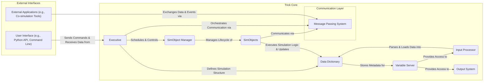
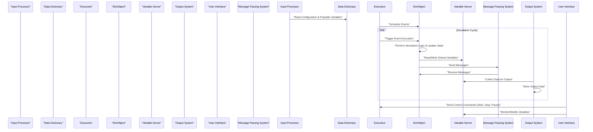

# Project Design Document: NASA Trick Simulation Environment

**Version:** 1.1
**Date:** October 26, 2023
**Prepared By:** Gemini AI Assistant (Expert in Software, Cloud, and Cybersecurity Architecture)

## 1. Introduction

This document provides an enhanced and detailed design overview of the NASA Trick simulation environment, based on the publicly available source code repository: [https://github.com/nasa/trick](https://github.com/nasa/trick). This document aims to clearly articulate the system's architecture, components, and data flow, serving as a robust foundation for subsequent threat modeling activities. Improvements have been made to provide greater clarity and detail regarding the system's functionality and potential security considerations.

## 2. Goals and Objectives

The primary goals of the Trick simulation environment, as inferred from the project description and code structure, are:

*   Provide a flexible and extensible framework for simulating complex, time-based systems.
*   Enable high-fidelity, multi-domain simulations for various engineering and scientific disciplines (e.g., aerospace, robotics).
*   Offer a modular architecture allowing for the independent development and integration of diverse simulation models (SimObjects).
*   Support various simulation execution modes, including real-time, faster-than-real-time, and batch processing.
*   Facilitate comprehensive data collection, analysis, and visualization of simulation results for validation and insight.
*   Provide robust interfaces for user interaction, allowing for runtime control, parameter adjustment, and data inspection.

## 3. High-Level Architecture

Trick employs a modular, event-driven, and potentially distributed architecture. The core components interact to manage the simulation lifecycle, execute models, and handle data. The Executive component orchestrates the simulation based on scheduled events and interactions between SimObjects.

**Components:**

*   **Executive:** The central control unit responsible for managing the simulation timeline, scheduling events, and coordinating the execution of `SimObjects`. It acts as the simulation orchestrator.
*   **SimObject Manager:** Responsible for the dynamic creation, management, and destruction of simulation objects (`SimObjects`) during the simulation lifecycle. It maintains a registry of active `SimObjects`.
*   **SimObjects:** Represent the discrete entities or models being simulated (e.g., a spacecraft, a sensor, an environment model). They encapsulate the specific simulation logic and data for their respective entities.
*   **Data Dictionary:** A centralized repository that defines all simulation variables, their data types, attributes (e.g., units, descriptions), and access permissions. It provides a structured view of the simulation state.
*   **Variable Server:** Provides a runtime interface for accessing and modifying simulation variables. It acts as a central point for data exchange and observation during the simulation.
*   **Input Processor:** Handles the parsing and processing of input files (often configuration files) that define simulation parameters, initial conditions, and model configurations.
*   **Output System:** Manages the generation, formatting, and storage of simulation output data in various formats (e.g., text files, binary files, databases).
*   **Message Passing System:** Facilitates communication and data exchange between different `SimObjects` and external applications, enabling asynchronous interactions and distributed simulation capabilities.
*   **User Interface (e.g., Python API, Command Line Interface):** Provides a means for users to interact with the simulation, including starting, stopping, pausing, modifying parameters, and inspecting data.
*   **External Applications (e.g., Co-simulation Tools):**  Other software systems that can interact with Trick, potentially for co-simulation, hardware-in-the-loop testing, or data analysis.

## 4. Component Details

This section provides a more detailed description of the key components identified in the high-level architecture, elaborating on their functionalities and interactions.

*   **Executive:**
    *   Manages the simulation clock, advancing simulation time based on configured step sizes or event timings.
    *   Schedules events (e.g., function calls within `SimObjects`) based on their defined execution times and priorities.
    *   Handles core simulation control functions such as start, pause, resume, stop, and reset.
    *   Provides mechanisms for synchronizing the execution of different `SimObjects` and managing inter-object dependencies.
    *   May manage resource allocation (e.g., memory, processing time) for the simulation.

*   **SimObject Manager:**
    *   Dynamically instantiates and destroys `SimObject` instances as needed during the simulation.
    *   Maintains a registry or list of all active `SimObjects`, allowing for easy access and manipulation.
    *   Provides methods for locating specific `SimObjects` by name or type.
    *   May handle dependency injection or configuration of `SimObjects` based on input parameters.

*   **SimObjects:**
    *   Encapsulate the simulation logic for a specific entity or subsystem being modeled.
    *   Contain member variables representing the internal state of the simulated entity.
    *   Implement methods that are executed at specific points in the simulation timeline, driven by events scheduled by the Executive.
    *   Interact with other `SimObjects` primarily through the Message Passing System or by accessing shared variables via the Variable Server.

*   **Data Dictionary:**
    *   Stores comprehensive metadata about all simulation variables, including name, data type, size, units, description, and access permissions (read/write).
    *   Provides a central lookup mechanism for variable information, used by other components.
    *   May support versioning or tracking of changes to variable definitions over time.
    *   Facilitates data type checking and validation during input processing and data access.

*   **Variable Server:**
    *   Provides APIs (Application Programming Interfaces) for reading and writing the values of simulation variables at runtime.
    *   Implements access control mechanisms to restrict which components or users can access or modify specific variables.
    *   Can be accessed by `SimObjects`, the User Interface, and External Applications to monitor and influence the simulation.
    *   May support features like data subscriptions or notifications, allowing components to be informed when specific variables change.

*   **Input Processor:**
    *   Reads and parses various types of input files, such as configuration files (e.g., in YAML, JSON, or custom formats), scenario definitions, and initial condition data.
    *   Populates the Data Dictionary with initial values for simulation variables based on the parsed input.
    *   Performs validation and error checking on input data to ensure consistency and correctness.
    *   May support different input sources, such as files, network streams, or user input.

*   **Output System:**
    *   Collects simulation data from various sources, including `SimObjects` (via their internal state) and the Variable Server.
    *   Formats the output data according to user-defined configurations, specifying which variables to output and in what format.
    *   Writes output data to various destinations, such as files (text, CSV, binary), databases, or network streams.
    *   Supports different output modes, such as periodic output, event-driven output, or on-demand output.

*   **Message Passing System:**
    *   Provides a mechanism for asynchronous communication between `SimObjects` and external entities.
    *   Supports different message types and routing strategies (e.g., point-to-point, publish-subscribe).
    *   May provide features like message queuing, delivery guarantees (e.g., at-least-once, at-most-once), and message filtering.
    *   Can be implemented using various technologies, such as shared memory, network sockets, or message brokers.

*   **User Interface (e.g., Python API, Command Line Interface):**
    *   Allows users to interact with the running simulation, including starting, stopping, and pausing execution.
    *   Provides access to simulation variables for monitoring their values and modifying them at runtime.
    *   May offer visualization tools or interfaces for displaying simulation data and results.
    *   Enables scripting and automation of simulation tasks, such as running multiple simulations with different parameters.

*   **External Applications (e.g., Co-simulation Tools):**
    *   Can interact with Trick to exchange data, synchronize execution, or participate in tightly coupled simulations.
    *   May use the Message Passing System for communication or other established protocols.
    *   Examples include connecting Trick to hardware-in-the-loop testbeds or other simulation environments for multi-physics simulations.

## 5. Data Flow

The typical data flow within a Trick simulation involves a cyclical process driven by the Executive and the interactions between components.

1. **Initialization Phase:** The Input Processor reads and parses configuration files, populating the Data Dictionary with initial simulation parameters and variable values.
2. **Simulation Start:** The Executive initializes the simulation clock and begins scheduling initial events.
3. **Event Scheduling and Execution:** The Executive determines the next event to execute based on its scheduled time and priority.
4. **SimObject Logic Execution:** The Executive triggers the execution of the corresponding methods within the relevant `SimObject(s)` associated with the event.
5. **State Updates:** `SimObjects` perform their simulation logic, potentially updating their internal state variables and the values of shared variables in the Data Dictionary via the Variable Server.
6. **Inter-Object Communication:** `SimObjects` may send and receive messages through the Message Passing System to interact with other `SimObjects`, triggering further actions or data exchanges.
7. **Data Output:** The Output System periodically or event-drivenly collects data from `SimObjects` and the Variable Server, formatting it and writing it to configured output destinations.
8. **User Interaction and Control:** The User Interface allows users to monitor the simulation state, modify variables through the Variable Server, and issue control commands to the Executive.

## 6. Deployment Architecture

Trick can be deployed in various configurations depending on the complexity of the simulation and the available infrastructure.

*   **Standalone Deployment (Single Machine):** All core components of Trick run within a single process or a set of tightly coupled processes on the same physical or virtual machine. This is common for development, testing, and smaller-scale simulations.
    *   **Example:** A developer running Trick on their local workstation for model development and debugging.
*   **Distributed Deployment (Multi-Machine):** For large-scale, computationally intensive simulations, Trick can be deployed across multiple machines. The Message Passing System facilitates communication and synchronization between distributed `SimObjects`.
    *   **Example:** Running a complex aerospace simulation across a cluster of high-performance computing nodes, with different `SimObjects` responsible for different subsystems running on separate machines.
*   **Cloud Deployment:** Trick can be deployed in a cloud environment, leveraging services like virtual machines, containers (e.g., Docker), and orchestration platforms (e.g., Kubernetes). This offers scalability, elasticity, and cost-effectiveness.
    *   **Example:** Deploying Trick on AWS EC2 instances or within Docker containers managed by Amazon ECS or EKS, allowing for dynamic scaling of resources based on simulation demands.
*   **Hybrid Deployment:** A combination of on-premise and cloud resources can be used, where some components or `SimObjects` run locally while others are deployed in the cloud.
    *   **Example:** Running a real-time hardware-in-the-loop simulation where the hardware interface runs locally, while the computationally intensive environment models are simulated in the cloud.

## 7. Security Considerations (Preliminary)

This section outlines preliminary security considerations relevant to the Trick architecture, which will be further explored during threat modeling.

*   **Access Control and Authentication:**
    *   How are users and external applications authenticated when interacting with Trick?
    *   Are there role-based access controls to restrict access to sensitive simulation variables or control functions?
    *   How is access to the Variable Server secured?
*   **Data Integrity and Confidentiality:**
    *   How is the integrity of simulation data ensured during execution and storage? Are there mechanisms to detect and prevent unauthorized modification?
    *   Is sensitive simulation data encrypted at rest and in transit, especially in distributed or cloud deployments?
*   **Input Validation and Sanitization:**
    *   How are input files and user-provided data validated to prevent injection attacks or the introduction of malicious data that could compromise the simulation?
    *   Are there measures to sanitize input data to prevent buffer overflows or other vulnerabilities?
*   **Communication Security:**
    *   If deployed in a distributed environment, how is the communication between components secured? Is encryption used for the Message Passing System?
    *   Are there mechanisms to prevent eavesdropping or tampering with messages exchanged between `SimObjects`?
*   **Code Security and Vulnerability Management:**
    *   Are secure coding practices followed in the development of Trick and user-developed `SimObjects` to prevent common software vulnerabilities (e.g., buffer overflows, SQL injection)?
    *   Is there a process for identifying and addressing security vulnerabilities in the codebase and dependencies?
*   **Dependency Management:**
    *   Are external libraries and dependencies managed securely to avoid using components with known vulnerabilities?
    *   Is there a mechanism for tracking and updating dependencies to their latest secure versions?
*   **Logging and Auditing:**
    *   Are significant events and actions within the simulation logged for auditing and security monitoring purposes?
    *   Are logs protected from unauthorized access or modification?

## 8. Assumptions and Constraints

The following assumptions and constraints have been considered in the development of this design document:

*   The analysis is based on the publicly available source code repository on GitHub.
*   The design focuses on the core architectural components and their interactions at a high level.
*   Specific implementation details within individual `SimObjects` are not covered in detail.
*   The document assumes a general understanding of simulation concepts, software architecture, and basic cybersecurity principles.
*   The security considerations are preliminary and will require further in-depth analysis during a dedicated threat modeling exercise.

## 9. Future Considerations

Potential future developments or enhancements to the Trick architecture could include:

*   **Enhanced User Interface and Visualization:** Development of a more modern and feature-rich graphical user interface for improved user interaction, data visualization, and simulation control.
*   **Cloud-Native Architecture Adoption:** Further refactoring of the architecture to be more inherently cloud-friendly, leveraging containerization (Docker), orchestration (Kubernetes), and serverless technologies for improved scalability and resilience.
*   **Advanced Security Features Integration:** Implementing more robust security features, such as multi-factor authentication, fine-grained authorization policies, and automated security scanning.
*   **Improved Monitoring and Logging Capabilities:** Enhancing monitoring and logging capabilities to provide real-time insights into simulation performance, resource utilization, and potential security incidents.
*   **Standardized APIs for External Integration:** Defining clear, stable, and well-documented APIs for easier integration with external tools and systems, promoting interoperability and extensibility.
*   **Support for Real-time Hardware-in-the-Loop (HIL) and Software-in-the-Loop (SIL) Testing:** Enhancements to facilitate seamless integration with HIL and SIL testing environments for validation and verification.

This enhanced design document provides a more comprehensive and detailed overview of the NASA Trick simulation environment's architecture, providing a stronger foundation for subsequent threat modeling and future development efforts.
