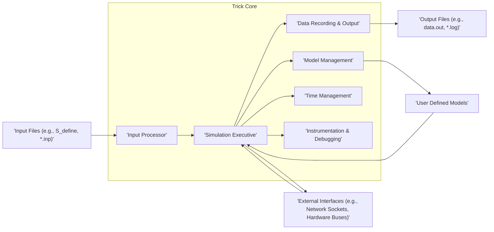
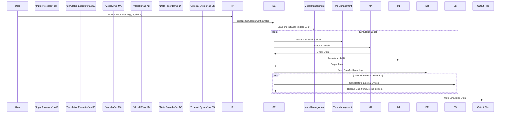

# Project Design Document: NASA Trick Simulation Environment

**Project Name:** Trick Simulation Environment

**Project Repository:** [https://github.com/nasa/trick](https://github.com/nasa/trick)

**Version:** 1.1

**Date:** October 26, 2023

**Prepared By:** AI Software Architecture Expert

## 1. Introduction

This document provides a detailed design overview of the NASA Trick simulation environment. It aims to capture the key architectural components, data flows, and interactions within the system, with a specific focus on aspects relevant to security and potential vulnerabilities. This document will serve as a foundational artifact for subsequent threat modeling activities to identify potential security risks and inform mitigation strategies.

## 2. Goals

*   Provide a comprehensive and detailed architectural description of the Trick simulation environment.
*   Clearly identify key components, their specific functionalities, and their interdependencies.
*   Illustrate the flow of data and control within the system, highlighting critical data pathways.
*   Establish a clear and unambiguous understanding of the system's structure and behavior as a basis for effective threat modeling.
*   Explicitly identify potential security concerns and attack surfaces within each component.

## 3. High-Level Architecture

The Trick simulation environment is a sophisticated framework designed for building and executing simulations of complex dynamic systems, with a strong emphasis on aerospace applications. It offers a core set of services and allows users to integrate custom models and external interfaces.

**Key High-Level Components:**

*   **Input Processor:**  The entry point for simulation configuration. It's responsible for parsing various input sources to define the simulation setup, including model parameters, initial conditions, and simulation control directives. Examples of input files include `S_define` for overall simulation setup and `.inp` files for specific model configurations.
*   **Simulation Executive:** The central control unit of the simulation. It orchestrates the simulation loop, manages the scheduling and execution of individual models, and facilitates data exchange between them. It also handles simulation control commands like start, pause, and stop.
*   **Data Recording & Output:** This component manages the collection, formatting, and output of simulation data generated by the models and the core framework. Output can be directed to various destinations, including files in different formats (e.g., ASCII, binary, CSV) and potentially external systems via network streams. Examples of output files include `data.out` for numerical data and `.log` files for event logging.
*   **Model Management:**  Provides the functionality to load, initialize, and manage the lifecycle of simulation models. This includes dynamically loading model code (often as shared libraries), initializing model states, and handling model dependencies.
*   **Time Management:**  Responsible for controlling the progression of simulation time. This includes setting the simulation time step, managing synchronization between models operating at different rates, and potentially handling real-time synchronization for hardware-in-the-loop simulations.
*   **Instrumentation & Debugging:** Offers tools and functionalities for monitoring the simulation state, debugging model behavior, and collecting performance metrics. This can include features like variable watchpoints, breakpoints, logging, and graphical visualization tools.
*   **User Defined Models:** The core of the simulation's domain-specific logic. These are typically implemented in C/C++ and represent the physical systems being simulated (e.g., spacecraft dynamics, sensor models). They interact with the Trick framework through defined interfaces.
*   **Input Files:**  Configuration files that define the simulation environment, the specific models to be used, their initial conditions, and various simulation parameters. These files are typically text-based and follow specific formats.
*   **Output Files:** Files generated by the simulation containing recorded data, event logs, and other relevant information about the simulation run. The format and content of these files are configurable.
*   **External Interfaces:** Mechanisms that allow the Trick simulation to interact with external systems or environments. This can include network sockets for communication with other software or hardware buses for interfacing with physical hardware.

## 4. Component Details

This section provides a more granular description of the key components, focusing on their functionality, inputs, outputs, technologies, and security relevance.

### 4.1. Input Processor

*   **Functionality:**
    *   Reads and parses various input file formats (e.g., custom text formats, potentially XML or JSON).
    *   Interprets command-line arguments and user commands to configure the simulation.
    *   Performs validation checks on input data to ensure correctness and adherence to defined schemas.
    *   Initializes simulation parameters, model states, and data structures based on the parsed input.
*   **Inputs:**
    *   Input files (e.g., `S_define`, model-specific `.inp` files, environment configuration files).
    *   Command-line arguments passed when launching the simulation.
    *   Potentially input from standard input or configuration servers.
*   **Outputs:**
    *   Internal representation of the simulation configuration (in memory data structures).
    *   Initialized values for simulation parameters and model states.
    *   Error messages and warnings if invalid input is detected.
*   **Key Technologies:** C/C++, custom parsing logic, potentially libraries like Flex/Bison or RapidJSON/TinyXML.
*   **Security Relevance:**
    *   **Vulnerability to Injection Attacks:** Insufficient input validation can lead to vulnerabilities like buffer overflows or command injection if malicious data is crafted in input files or command-line arguments.
    *   **Denial of Service:** Processing extremely large or malformed input files could consume excessive resources, leading to a denial of service.
    *   **Information Disclosure:** Error messages might inadvertently reveal sensitive information about the system's internal workings or file paths.

### 4.2. Simulation Executive

*   **Functionality:**
    *   Manages the overall simulation lifecycle, from initialization to termination.
    *   Implements the main simulation loop, controlling the order and timing of model execution.
    *   Facilitates data exchange between simulation models, often through shared memory or message passing mechanisms.
    *   Handles simulation control commands (e.g., pause, resume, step, stop) issued by users or external systems.
    *   Triggers data recording and output operations at specified intervals or events.
*   **Inputs:**
    *   Initialized simulation state from the Input Processor.
    *   Data outputs from individual simulation models.
    *   Control commands from user interfaces or external control systems.
    *   Timing signals from the Time Management component.
*   **Outputs:**
    *   Updated simulation state, reflecting the changes after each simulation step.
    *   Data to be recorded and output by the Data Recording & Output component.
    *   Control signals to other components, such as triggering model execution.
*   **Key Technologies:** C/C++, threading and process management libraries (e.g., pthreads), inter-process communication mechanisms (e.g., shared memory, message queues).
*   **Security Relevance:**
    *   **Control Flow Manipulation:** Vulnerabilities in the executive could allow attackers to alter the simulation flow, leading to incorrect results or unexpected behavior.
    *   **Resource Exhaustion:** Improper resource management within the executive could be exploited to cause denial of service.
    *   **Privilege Escalation:** If the executive runs with elevated privileges, vulnerabilities could be exploited to gain unauthorized access to the system.

### 4.3. Data Recording & Output

*   **Functionality:**
    *   Subscribes to and collects simulation data from various sources within the framework.
    *   Formats the collected data according to specified output formats (e.g., ASCII, binary, CSV, custom formats).
    *   Writes the formatted data to output files on local or network file systems.
    *   Potentially streams data to external systems or visualization tools via network protocols (e.g., TCP/IP, UDP).
*   **Inputs:**
    *   Simulation data from models and the Simulation Executive.
    *   Configuration parameters specifying which data to record, the output format, and the destination.
*   **Outputs:**
    *   Output files containing recorded simulation data (e.g., `data.out`, `.csv` files).
    *   Data streams sent to external systems over the network.
*   **Key Technologies:** C/C++, file I/O libraries, networking libraries (e.g., sockets), data serialization libraries.
*   **Security Relevance:**
    *   **Data Exposure:** Output files containing sensitive simulation data could be accessed by unauthorized users if file permissions are not properly configured.
    *   **Data Integrity:**  Vulnerabilities in the data formatting or writing process could lead to corrupted or manipulated output data.
    *   **Man-in-the-Middle Attacks:** If data is streamed over the network without encryption, it could be intercepted and read or modified by attackers.

### 4.4. Model Management

*   **Functionality:**
    *   Dynamically loads and unloads simulation models (typically as shared libraries or dynamically linked objects).
    *   Manages the initialization and destruction of model instances.
    *   Provides mechanisms for models to register their inputs, outputs, and execution rates with the framework.
    *   Handles dependencies between different simulation models.
*   **Inputs:**
    *   Model files (e.g., `.so` or `.dll` files) located in specified directories.
    *   Model configuration data that might be provided in separate files or embedded within the model code.
*   **Outputs:**
    *   Initialized model instances ready for execution.
    *   Information about the loaded models and their dependencies.
*   **Key Technologies:** C/C++, dynamic linking mechanisms (e.g., `dlopen`, `LoadLibrary`).
*   **Security Relevance:**
    *   **Malicious Model Injection:** Loading untrusted or malicious model files could allow attackers to execute arbitrary code within the simulation environment, potentially compromising the entire system.
    *   **Code Tampering:** If model files are not properly protected, attackers could modify them to alter the simulation behavior or introduce vulnerabilities.

### 4.5. Time Management

*   **Functionality:**
    *   Maintains the current simulation time.
    *   Advances simulation time based on the configured time step or external triggers.
    *   Provides synchronization mechanisms for models operating at different rates or requiring coordinated execution.
    *   May interface with real-time clocks for hardware-in-the-loop simulations.
*   **Inputs:**
    *   Configuration parameters for the simulation time step and duration.
    *   Potentially real-time clock signals from the operating system or external hardware.
*   **Outputs:**
    *   The current simulation time, accessible to other components.
    *   Synchronization signals or events to trigger model execution.
*   **Key Technologies:** C/C++, system time functions, potentially real-time operating system (RTOS) features.
*   **Security Relevance:**
    *   **Timing Attacks:** While less direct, manipulation of the time management component could potentially be used to orchestrate timing attacks on other parts of the system or external interfaces.
    *   **Denial of Service:**  Incorrectly configured or maliciously manipulated time parameters could lead to the simulation stalling or running indefinitely.

### 4.6. Instrumentation & Debugging

*   **Functionality:**
    *   Provides tools for monitoring the values of simulation variables in real-time.
    *   Allows users to set breakpoints and step through the simulation execution for debugging purposes.
    *   Offers logging and tracing capabilities to record events and data flow within the simulation.
    *   May include graphical user interfaces for visualization and analysis of simulation data.
*   **Inputs:**
    *   User commands to set watchpoints, breakpoints, or control the debugger.
    *   Configuration parameters for logging levels and output destinations.
*   **Outputs:**
    *   Debug information displayed to the user (e.g., variable values, call stacks).
    *   Log files containing event records and debugging messages.
    *   Performance metrics and profiling data.
*   **Key Technologies:** C/C++, debugging libraries (e.g., GDB integration), logging frameworks, potentially GUI libraries.
*   **Security Relevance:**
    *   **Information Disclosure:** Debugging interfaces might expose sensitive information about the simulation's internal state or algorithms to unauthorized users.
    *   **Code Injection:** In some cases, debugging interfaces could be exploited to inject malicious code or alter the simulation's execution flow.
    *   **Denial of Service:**  Excessive logging or debugging operations could consume significant resources, leading to a denial of service.

### 4.7. User Defined Models

*   **Functionality:**
    *   Implement the core simulation logic, representing the behavior of the system being modeled.
    *   Interact with the Trick framework to receive input data, update their internal state, and produce output data.
    *   Can be developed by users with varying levels of security awareness.
*   **Inputs:**
    *   Simulation data from other models or the Simulation Executive.
    *   Configuration parameters specific to the model.
*   **Outputs:**
    *   Simulation data to other models or for recording.
*   **Key Technologies:** C/C++.
*   **Security Relevance:**
    *   **Buffer Overflows and Other Memory Errors:** Models written in C/C++ are susceptible to common memory safety vulnerabilities like buffer overflows, which could be exploited to execute arbitrary code.
    *   **Logic Errors and Backdoors:**  Poorly written or intentionally malicious models could introduce logic errors or backdoors that compromise the simulation's integrity or security.
    *   **Information Leakage:** Models might inadvertently expose sensitive information through their outputs or interactions with other components.

### 4.8. External Interfaces

*   **Functionality:**
    *   Enables communication and data exchange between the Trick simulation and external systems.
    *   Can involve network protocols (e.g., TCP/IP, UDP, custom protocols) for communication with other software or hardware.
    *   Can include hardware interfaces (e.g., serial ports, data acquisition boards) for interacting with physical devices.
*   **Inputs:**
    *   Data received from external systems over network connections or hardware interfaces.
*   **Outputs:**
    *   Data sent to external systems over network connections or hardware interfaces.
*   **Key Technologies:** C/C++, networking libraries (e.g., sockets), hardware interface libraries, specific communication protocols.
*   **Security Relevance:**
    *   **Network Vulnerabilities:**  Standard network security threats like eavesdropping, man-in-the-middle attacks, and denial of service are relevant when using network interfaces.
    *   **Authentication and Authorization:**  Proper authentication and authorization mechanisms are crucial to ensure that only authorized external systems can interact with the simulation.
    *   **Data Integrity and Confidentiality:** Data exchanged with external systems should be protected using encryption and integrity checks.
    *   **Hardware Interface Exploitation:** Vulnerabilities in hardware interface drivers or protocols could be exploited to gain unauthorized access to the system or connected hardware.

## 5. Data Flow

The following diagram illustrates a typical data flow within the Trick simulation environment during a simulation run, highlighting potential security implications.

**Key Data Flows and Security Implications:**

*   **Configuration Data Flow (User -> Input Processor -> Simulation Executive):**  This flow is vulnerable to injection attacks if input validation is insufficient in the Input Processor.
*   **Model Data Exchange (Simulation Executive <-> Models):**  Data exchanged between models could be tampered with if memory protection is inadequate or if models have vulnerabilities.
*   **Output Data Flow (Simulation Executive -> Data Recorder -> Output Files/External System):**  Sensitive data in output files needs proper access controls. Network streams require encryption to prevent eavesdropping.
*   **External Communication Flow (Simulation Executive <-> External System):** This flow is highly susceptible to various network-based attacks if security measures like authentication, authorization, and encryption are not implemented.

## 6. Deployment Model

The Trick simulation environment is typically deployed on:

*   **Operating Systems:** Primarily Linux-based systems (e.g., CentOS, Ubuntu), often in server environments or high-performance computing clusters.
*   **Hardware:**  Can range from individual workstations for development and testing to powerful multi-core servers or distributed computing environments for complex simulations.
*   **Networking:**  May involve local network configurations for distributed simulations or connections to wider networks for external interfaces. Security considerations for network configurations (firewalls, intrusion detection) are important.
*   **Dependencies:** Requires a C/C++ compiler (e.g., GCC), standard C/C++ libraries, and potentially other libraries for specific functionalities (e.g., MPI for parallel execution, networking libraries, hardware interface drivers). Securely managing these dependencies is crucial.

## 7. Security Considerations (Detailed)

This section expands on the preliminary security considerations, mapping potential threats to specific components and data flows.

*   **Input Processor:**
    *   **Threats:** Injection attacks (command injection, buffer overflows), denial of service (resource exhaustion), information disclosure (error messages).
    *   **Mitigations:** Implement robust input validation and sanitization, use secure parsing libraries, limit input size, sanitize error messages.
*   **Simulation Executive:**
    *   **Threats:** Control flow manipulation, resource exhaustion, privilege escalation.
    *   **Mitigations:** Secure coding practices, proper resource management (memory limits, thread limits), principle of least privilege.
*   **Data Recording & Output:**
    *   **Threats:** Data exposure, data integrity compromise, man-in-the-middle attacks.
    *   **Mitigations:** Implement appropriate file permissions, encrypt sensitive output files, use secure network protocols (TLS/SSL) for data streaming.
*   **Model Management:**
    *   **Threats:** Malicious model injection, code tampering.
    *   **Mitigations:** Implement model validation and signing mechanisms, restrict model loading paths, use sandboxing techniques for model execution.
*   **Time Management:**
    *   **Threats:** Timing attacks, denial of service.
    *   **Mitigations:** Secure access to time configuration parameters, monitor for unexpected time changes.
*   **Instrumentation & Debugging:**
    *   **Threats:** Information disclosure, code injection, denial of service.
    *   **Mitigations:** Restrict access to debugging interfaces, disable debugging features in production environments, sanitize logging output.
*   **User Defined Models:**
    *   **Threats:** Buffer overflows, logic errors, backdoors, information leakage.
    *   **Mitigations:** Secure coding guidelines for model developers, code reviews, static and dynamic analysis tools, sandboxing.
*   **External Interfaces:**
    *   **Threats:** Eavesdropping, man-in-the-middle attacks, unauthorized access, data breaches.
    *   **Mitigations:** Implement strong authentication and authorization mechanisms, use encryption (TLS/SSL, VPNs), implement firewalls and intrusion detection systems, regularly audit external interface configurations.

## 8. Future Considerations

*   **Web-based Interface:**  Developing a web-based interface for configuration and monitoring would introduce web application security concerns (e.g., cross-site scripting, SQL injection). Secure development practices and regular security assessments would be necessary.
*   **Cloud Deployment:**  Deploying Trick in a cloud environment would require adherence to cloud security best practices, including secure configuration of cloud resources, identity and access management, and data encryption at rest and in transit.
*   **Enhanced Security Features:**  Integrating more advanced security features like mandatory access control, security information and event management (SIEM) integration, and regular penetration testing could further enhance the security posture.

This improved design document provides a more detailed and security-focused overview of the NASA Trick simulation environment. It serves as a solid foundation for conducting a comprehensive threat model and developing effective security strategies.